# C4: Class Design - Plugin-Ready Architecture

> **Functional Programming Class Architecture with Plugin Patterns**  
> **Part of**: [Phase 1 Design](phase.1.md)  
> **Based on**: [C3: Component Design](component.phase.1.md)  
> **Architecture**: Language-independent functional + plugin design patterns

## Design Objectives

This document translates the **plugin-ready component architecture** from [component.phase.1.md](component.phase.1.md) into **functional programming class design** with plugin extension patterns suitable for implementation in any functional or hybrid language.

### **Primary Goals**
1. **Plugin Interface Contracts**: Clean plugin extension interfaces for Phase 2-4
2. **Functional Class Design**: Immutable data structures with pure function operations
3. **Adapter Pattern Implementation**: Tool and context enhancement through adapters
4. **Event Sourcing Classes**: Immutable event streams for session management
5. **Composition Patterns**: Functional composition for plugin chains

### **Design Principles**
- **Plugin-First**: Every class designed with plugin extension points
- **Immutable by Default**: All data structures are immutable with transformation functions
- **Pure Function Operations**: Side-effect-free methods with predictable behavior
- **Interface-Driven**: Focus on contracts and plugin composition patterns
- **Functional Composition**: Complex operations built from simple function composition

## Plugin Architecture Class Overview

The class design follows the plugin-ready architecture with functional programming patterns:

```mermaid
classDiagram
    %% Core Plugin System Classes
    class PluginRegistry {
        +plugins: ImmutableMap[PluginId, Plugin]
        +register(plugin: Plugin): PluginRegistry
        +discover(criteria: DiscoveryCriteria): Plugin[]
        +compose(plugins: Plugin[]): CompositePlugin
        +validate(plugin: Plugin): ValidationResult
    }
    
    class CompositionEngine {
        +composePluginChain(plugins: Plugin[]): PluginChain
        +composeAdapters(adapters: Adapter[]): CompositeAdapter
        +executeChain(chain: PluginChain, request: MCPRequest): MCPResponse
        +optimizeComposition(chain: PluginChain): OptimizedChain
    }
    
    %% Plugin Interface Classes
    class Plugin {
        <<interface>>
        +name: String
        +version: String
        +process(request: MCPRequest): Optional[Enhancement]
    }
    
    class ContextAdapter {
        <<interface>>
        +adapt(context: Context): Context
    }
    
    class ToolAdapter {
        <<interface>>
        +enhance(tool: Tool): Tool
    }
    
    class EventHandler {
        <<interface>>
        +handle(event: SessionEvent): Optional[SessionEvent]
    }
    
    %% Functional Context Classes
    class FunctionalContextEngine {
        +contextSources: ImmutableList[ContextSource]
        +adapters: ImmutableList[ContextAdapter]
        +assemble(query: Query, session: Session): Context
        +enhance(adapters: ContextAdapter[], context: Context): Context
        +optimize(constraints: TokenConstraints, context: Context): Context
    }
    
    class Context {
        +conversationHistory: ImmutableList[Interaction]
        +workspaceState: WorkspaceSnapshot
        +assemblyMetadata: ContextMetadata
        +compose(other: Context): Context
        +transform(transformer: ContextTransformer): Context
        +getTokenCount(): Integer
    }
    
    %% Functional Tool Classes
    class FunctionalToolRegistry {
        +tools: ImmutableMap[ToolId, Tool]
        +adapters: ImmutableList[ToolAdapter]
        +register(tool: Tool): ToolRegistry
        +enhance(adapters: ToolAdapter[], tool: Tool): Tool
        +execute(tool: Tool, request: ToolRequest): ToolResult
    }
    
    class Tool {
        +id: ToolId
        +metadata: ToolMetadata
        +executor: Function&lt;ToolRequest, ToolResult&gt;
        +enhance(adapter: ToolAdapter): Tool
        +compose(other: Tool): ComposeTool
    }
    
    %% Event Sourcing Classes
    class EventSourcedSession {
        +events: ImmutableList[SessionEvent]
        +state: SessionState
        +appendEvent(event: SessionEvent): EventSourcedSession
        +reconstructState(): SessionState
        +replay(eventHandlers: EventHandler[]): EventSourcedSession
    }
    
    class SessionEvent {
        +eventId: EventId
        +timestamp: Timestamp
        +eventType: EventType
        +payload: EventPayload
        +enhance(handler: EventHandler): SessionEvent
    }
    
    %% Plugin Extension Points (Future Phases)
    class RAGContextAdapter {
        <<Phase 2 Extension>>
        +semanticSearch: SemanticSearchEngine
        +adapt(context: Context): Context
    }
    
    class AgentCoordinator {
        <<Phase 3 Extension>>
        +agentRegistry: AgentRegistry
        +process(request: MCPRequest): Optional[Enhancement]
    }
    
    class AutonomyController {
        <<Phase 4 Extension>>
        +goalManager: GoalManager
        +process(request: MCPRequest): Optional[Enhancement]
    }
    
    %% Relationships
    PluginRegistry --> Plugin
    PluginRegistry --> CompositionEngine
    CompositionEngine --> ContextAdapter
    CompositionEngine --> ToolAdapter
    CompositionEngine --> EventHandler
    
    FunctionalContextEngine --> Context
    FunctionalContextEngine --> ContextAdapter
    FunctionalToolRegistry --> Tool
    FunctionalToolRegistry --> ToolAdapter
    EventSourcedSession --> SessionEvent
    SessionEvent --> EventHandler
    
    %% Plugin Extensions (Future)
    RAGContextAdapter ..|> ContextAdapter
    AgentCoordinator ..|> Plugin
    AutonomyController ..|> Plugin
    
    %% Styling
    class PluginRegistry {
        <<Core Plugin System>>
    }
    class CompositionEngine {
        <<Core Plugin System>>
    }
    class FunctionalContextEngine {
        <<Functional Processing>>
    }
    class FunctionalToolRegistry {
        <<Functional Processing>>
    }
    class EventSourcedSession {
        <<Event Sourcing>>
    }
```



## Core Plugin System Classes

### PluginRegistry Class

**Responsibility**: Central plugin management with functional composition patterns

**Immutable Class Structure**:
```
PluginRegistry Class Specification:
  Internal State (Immutable):
    - plugins: ImmutableMap<PluginId, Plugin>
    - dependencies: ImmutableMap<PluginId, DependencyList>
    - interfaces: ImmutableMap<InterfaceType, PluginList>
  
  Operations:
    - register(plugin: Plugin) → PluginRegistry
    - unregister(pluginId: PluginId) → PluginRegistry
    - discover(criteria: DiscoveryCriteria) → Plugin[]
    - validate(plugin: Plugin) → ValidationResult
    - getPlugin(id: PluginId) → Optional<Plugin>
    - getByInterface(interfaceType: InterfaceType) → Plugin[]
    - getDependencies(pluginId: PluginId) → DependencyList
```

**Functional Implementation Patterns**:
```
Plugin Registration Pattern:
  register(plugin, registry) = validate(plugin) → resolveDependencies(plugin, registry) → updateRegistry(registry, plugin)

Plugin Discovery Pattern:
  discover(criteria, registry) = filter(matchesCriteria(criteria), getAllPlugins(registry))
```

### CompositionEngine Class

**Responsibility**: Functional composition of plugin chains and adapters

**Immutable Class Structure**:
```
CompositionEngine Class Specification:
  Internal State (Immutable):
    - optimizationRules: ImmutableList<OptimizationRule>
    - compositionCache: ImmutableMap<ChainSignature, ComposedChain>
  
  Operations:
    - compose(plugins: Plugin[]) → CompositePlugin
    - executeChain(plugins: Plugin[], request: MCPRequest) → MCPResponse
    - optimizeChain(plugins: Plugin[]) → Plugin[]
    - validateComposition(composition: PluginComposition) → ValidationResult
    - analyzePerformance(composition: PluginComposition) → PerformanceMetrics
    - cacheComposition(signature: ChainSignature, chain: ComposedChain) → CompositionEngine
```

**Functional Composition Patterns**:
```
Plugin Chain Composition Pattern:
  composePluginChain(plugins) = fold(composePlugin, emptyChain, plugins)
  composePlugin(chain, plugin) = chain.append(validate(plugin))

Adapter Composition Pattern:
  composeAdapters(adapters) = fold(safeApplyAdapter, input, adapters)
  safeApplyAdapter(accumulator, adapter) = tryApply(adapter, accumulator) ?? accumulator
```

## Plugin Interface Classes

### Plugin Interface

**Core Plugin Contract**:
```
Plugin Class Specification:
  Immutable Properties:
    - name: String (read-only)
    - version: String (read-only)
    - interfaces: PluginInterfaceList (read-only)
    - dependencies: DependencyList (read-only)
  
  Operations:
    - process(request: MCPRequest) → Optional<Enhancement>
    - initialize(config: PluginConfig) → InitializationResult
    - validate() → ValidationResult
    - getCapabilities() → Set<Capability>
    - getMetadata() → PluginMetadata
```

**Plugin Implementation Pattern**:
```
Plugin Error Isolation Pattern:
  implementPlugin(logic) = Plugin {
    process: request → safeExecute(logic.process(request)) ?? Optional.empty()
    validate: logic.validate
    getMetadata: logic.getMetadata
  }
```

### ContextAdapter Interface

**Context Enhancement Contract**:
```
ContextAdapter Class Specification:
  Immutable Properties:
    - adapterId: AdapterId (read-only)
    - priority: AdapterPriority (read-only)
    - applicableContextTypes: ContextTypeList (read-only)
  
  Operations:
    - adapt(context: Context) → Context
    - canAdapt(contextType: ContextType) → Boolean
    - getEnhancementMetadata() → EnhancementMetadata
    - estimatePerformanceImpact() → PerformanceEstimate
```

**Functional Adapter Pattern**:
```
Context Adapter Pattern:
  createContextAdapter(logic) = ContextAdapter {
    adapt: context → if logic.canAdapt(context.type) then logic.enhance(context) else context
    canAdapt: logic.applicabilityCheck
    getEnhancementMetadata: logic.getMetadata
  }
```

### ToolAdapter Interface

**Tool Enhancement Contract**:
```
ToolAdapter Class Specification:
  Immutable Properties:
    - adapterId: AdapterId (read-only)
    - supportedTools: ToolTypeList (read-only)
    - enhancementCapabilities: CapabilityList (read-only)
  
  Operations:
    - enhance(tool: Tool) → Tool
    - canEnhance(toolType: ToolType) → Boolean
    - getEnhancementDescription() → EnhancementDescription
    - estimateEnhancementImpact() → ImpactEstimate
```

**Functional Tool Enhancement Pattern**:
```
Tool Enhancement Composition:
  enhanceTool(adapters, tool) = fold(applyAdapter, tool, adapters)
  applyAdapter(currentTool, adapter) = if adapter.canEnhance(currentTool.type) then adapter.enhance(currentTool) else currentTool

Tool Execution Pattern:
  executeTool(tool, request) = validateAndEnhanceResult(enhancedTool.executor(request))
  enhancedTool = applyApplicableAdapters(tool)
```

## Functional Context Classes

### FunctionalContextEngine Class

**Responsibility**: Immutable context assembly with plugin-extensible adapters

**Immutable Class Structure**:
```
FunctionalContextEngine Class Specification:
  Internal State (Immutable):
    - contextSources: ImmutableList<ContextSource>
    - adapters: ImmutableList<ContextAdapter>
    - optimizer: ContextOptimizer
    - cache: ImmutableMap<ContextKey, Context>
  
  Operations:
    - assemble(query: Query, session: Session) → Context
    - enhance(adapters: ContextAdapter[], context: Context) → Context
    - optimize(context: Context, constraints: PerformanceConstraints) → Context
    - compose(contexts: Context[]) → Context
    - withCache(key: ContextKey, context: Context) → FunctionalContextEngine
    - invalidateCache(pattern: CachePattern) → FunctionalContextEngine
```

**Functional Assembly Pattern**:
```
Context Assembly Pattern:
  assembleContext(query, session, sources) = 
    baseContext ← gatherContextData(sources)
    queryContext ← analyzeQuery(query)
    sessionContext ← extractSessionContext(session)
    composeContexts([baseContext, queryContext, sessionContext])

Context Enhancement Pipeline:
  enhanceContext(adapters, context) = fold(applyAdapter, context, adapters)
  applyAdapter(currentContext, adapter) = adapter.adapt(currentContext)
```

### Context Class

**Responsibility**: Immutable context data with functional transformations

**Immutable Class Structure**:
```
Context Class Specification:
  Immutable Properties:
    - conversationHistory: ImmutableList<Interaction> (read-only)
    - workspaceState: WorkspaceSnapshot (read-only)
    - assemblyMetadata: ContextMetadata (read-only)
    - tokenCount: Number (read-only)
    - relevanceScore: Number (read-only)
  
  Operations:
    - compose(other: Context) → Context
    - transform(transformer: ContextTransformer) → Context
    - optimize(constraints: TokenConstraints) → Context
    - enhance(enhancement: ContextEnhancement) → Context
    - getTokenCount() → Number
    - getSummary() → ContextSummary
    - getRelevanceScore(query: Query) → Number
    - extractMetadata() → ContextMetadata
```

**Immutable Transformation Pattern**:
```
Context Composition Pattern:
  composeContexts(contexts) = Context.create({
    conversationHistory: concatenate(map(getConversationHistory, contexts))
    workspaceState: combineWorkspaceStates(map(getWorkspaceState, contexts))
    assemblyMetadata: mergeMetadata(map(getAssemblyMetadata, contexts))
    tokenCount: sum(map(getTokenCount, contexts))
  })

Context Transformation Pattern:
  transformContext(transformer, context) = context.update({
    conversationHistory: transformer.transformHistory(context.conversationHistory)
    workspaceState: transformer.transformWorkspace(context.workspaceState)
    assemblyMetadata: transformer.updateMetadata(context.assemblyMetadata)
  })
```

## Functional Tool Classes

### FunctionalToolRegistry Class

**Responsibility**: Immutable tool registry with adapter pattern for enhancement

**Immutable Class Structure**:
```
FunctionalToolRegistry Class Specification:
  Internal State (Immutable):
    - tools: ImmutableMap<ToolId, Tool>
    - adapters: ImmutableList<ToolAdapter>
    - executionEngine: ToolExecutionEngine
    - enhancementCache: ImmutableMap<ToolSignature, EnhancedTool>
  
  Operations:
    - register(tool: Tool) → ToolRegistry
    - enhance(adapters: ToolAdapter[], tool: Tool) → Tool
    - execute(tool: Tool, parameters: ToolParameters) → ToolResult
    - chain(tools: Tool[], context: ExecutionContext) → ChainResult
    - getTool(id: ToolId) → Optional<Tool>
    - discoverTools(criteria: ToolCriteria) → Tool[]
    - getAdapters(toolType: ToolType) → ToolAdapter[]
```

**Functional Tool Enhancement Pattern**:
```
Tool Enhancement Composition:
  enhanceTool(adapters, tool) = fold(applyAdapter, tool, adapters)
  applyAdapter(currentTool, adapter) = if adapter.canEnhance(currentTool.type) then adapter.enhance(currentTool) else currentTool

Tool Execution Pattern:
  executeTool(tool, request) = validateAndEnhanceResult(enhancedTool.executor(request))
  enhancedTool = applyApplicableAdapters(tool)
```

### Tool Class

**Responsibility**: Immutable tool definition with enhancement capabilities

**Immutable Class Structure**:
```
Tool Class Specification:
  Immutable Properties:
    - id: ToolId (read-only)
    - metadata: ToolMetadata (read-only)
    - executor: Function<ToolRequest, ToolResult> (read-only)
    - enhancements: ImmutableList<ToolEnhancement> (read-only)
    - securityConstraints: SecurityConstraints (read-only)
  
  Operations:
    - enhance(adapter: ToolAdapter) → Tool
    - compose(other: Tool) → CompositeTool
    - withConstraints(constraints: SecurityConstraints) → Tool
    - withMetadata(metadata: ToolMetadata) → Tool
    - canExecute(request: ToolRequest) → Boolean
    - getCapabilities() → ToolCapabilities
    - estimateExecutionTime(request: ToolRequest) → TimeEstimate
```

**Immutable Tool Enhancement Pattern**:
```
Tool Enhancement Pattern:
  enhanceTool(adapter, tool) = tool.update({
    executor: enhanceExecutor(adapter, tool.executor)
    enhancements: tool.enhancements.append(adapter.getEnhancement())
    metadata: updateMetadata(adapter, tool.metadata)
  })

Enhanced Execution Pattern:
  enhanceExecutor(adapter, originalExecutor) = request → adapter.postprocessResult(originalExecutor(adapter.preprocessRequest(request)))
```

## Event Sourcing Classes

### EventSourcedSession Class

**Responsibility**: Immutable session state with event sourcing and plugin-extensible event handling

**Immutable Class Structure**:
```
EventSourcedSession Class Specification:
  Immutable Properties:
    - sessionId: SessionId (read-only)
    - events: ImmutableList<SessionEvent> (read-only)
    - state: SessionState (read-only)
    - eventHandlers: ImmutableList<EventHandler> (read-only)
    - lastEventId: EventId (read-only)
  
  Operations:
    - appendEvent(event: SessionEvent) → EventSourcedSession
    - replayEvents(handlers: EventHandler[]) → EventSourcedSession
    - reconstructState() → EventSourcedSession
    - handle(event: SessionEvent) → Optional<SessionEvent>
    - dispatch(event: SessionEvent) → EventResult
    - persist(session: Session) → SessionState
    - getCurrentState() → SessionState
    - getEventHistory() → ImmutableList<SessionEvent>
    - getEventsSince(eventId: EventId) → ImmutableList<SessionEvent>
```

**Event Sourcing Pattern**:
```
Event Appending Pattern:
  appendEvent(event, session) = session.update({
    events: session.events.append(enhanceEvent(session.eventHandlers, event))
    state: applyEvent(session.state, event)
    lastEventId: event.eventId
  })

State Reconstruction Pattern:
  reconstructState(events) = fold(applyEvent, initialState, events)

Event Enhancement Pattern:
  enhanceEvent(handlers, event) = fold(processEventHandler, event, handlers)
  processEventHandler(currentEvent, handler) = handler.handle(currentEvent) ?? currentEvent
```

### SessionEvent Class

**Responsibility**: Immutable event data with plugin-extensible enhancement

**Immutable Class Structure**:
```
SessionEvent Class Specification:
  Immutable Properties:
    - eventId: EventId (read-only)
    - timestamp: Timestamp (read-only)
    - eventType: EventType (read-only)
    - payload: EventPayload (read-only)
    - metadata: EventMetadata (read-only)
    - enhancements: ImmutableList<EventEnhancement> (read-only)
  
  Operations:
    - enhance(handler: EventHandler) → SessionEvent
    - withMetadata(metadata: EventMetadata) → SessionEvent
    - withEnhancement(enhancement: EventEnhancement) → SessionEvent
    - getPayload() → EventPayload
    - getTimestamp() → Timestamp
    - getEnhancements() → ImmutableList<EventEnhancement>
    - isType(eventType: EventType) → Boolean
```

**Immutable Event Enhancement Pattern**:
```
Event Handler Pattern:
  enhanceEvent(handler, event) = handler.handle(event) ?? event

Event Metadata Enhancement Pattern:
  enrichEventMetadata(enhancer, event) = event.update({
    metadata: enhancer.enrich(event.metadata)
    enhancements: event.enhancements.append(enhancer.getEnhancement())
  })
```

## Plugin Extension Points (Future Phases)

### RAGContextAdapter Class (Phase 2)

**Semantic Context Enhancement**:
```
RAGContextAdapter Class Specification:
  Internal State (Immutable):
    - semanticSearch: SemanticSearchEngine
    - vectorDatabase: VectorDatabase
    - embeddingModel: EmbeddingModel
  
  Operations:
    - adapt(context: Context) → Context
    - gatherSemanticContext(context: Context) → SemanticContext
    - findRelevantDocuments(query: Query) → DocumentList
    - enhanceWithSemantics(context: Context, documents: DocumentList) → Context
```

### AgentCoordinator Class (Phase 3)

**Multi-Agent Coordination**:
```
AgentCoordinator Class Specification:
  Internal State (Immutable):
    - agentRegistry: AgentRegistry
    - taskDistributor: TaskDistributor
    - coordinationEngine: CoordinationEngine
  
  Operations:
    - process(request: MCPRequest) → Optional<Enhancement>
    - analyzeTaskComplexity(request: MCPRequest) → TaskAnalysis
    - createAgentCoordinationPlan(analysis: TaskAnalysis) → AgentPlan
    - coordinateAgents(plan: AgentPlan) → CoordinationResult
```

### AutonomyController Class (Phase 4)

**Autonomous Goal Management**:
```
AutonomyController Class Specification:
  Internal State (Immutable):
    - goalManager: GoalManager
    - performanceAnalyzer: PerformanceAnalyzer
    - selfImprovementEngine: SelfImprovementEngine
  
  Operations:
    - process(request: MCPRequest) → Optional<Enhancement>
    - analyzeCurrentPerformance(request: MCPRequest) → PerformanceMetrics
    - identifyImprovements(metrics: PerformanceMetrics) → ImprovementOpportunities
    - createImprovementPlan(opportunities: ImprovementOpportunities) → ImprovementPlan
    - implementSelfImprovement(plan: ImprovementPlan) → ImplementationResult
```

## Performance Characteristics

### Plugin-Aware Performance Targets
- **Plugin Registration**: < 10ms per plugin with interface validation
- **Function Composition**: < 5ms for plugin chain composition
- **Immutable Operations**: < 1ms for data structure transformations
- **Event Processing**: < 5ms for event handler chains
- **Context Enhancement**: < 20ms for plugin-enhanced context assembly

### Functional Programming Benefits
- **Memory Efficiency**: Structural sharing reduces memory footprint by 60-80%
- **Parallelization**: Pure functions enable safe concurrent execution
- **Predictability**: Immutable state eliminates race conditions
- **Error Isolation**: Plugin failures contained within functional boundaries
- **Testing**: Pure functions are easily testable in isolation

### Plugin Extension Impact
- **Phase 2 RAG**: +50ms typical for semantic context enhancement
- **Phase 3 sAgents**: +30ms typical for agent coordination overhead
- **Phase 4 Autonomy**: +100ms typical for autonomous analysis
- **Combined Phases**: +200ms maximum for full plugin chain execution

**Plugin Interface Specification**:
```
Plugin Class Definition:
  Immutable Properties:
    - plugin_id: PluginId (read-only)
    - name: String (read-only)
    - version: String (read-only)
    - capabilities: Set<Capability> (read-only)
  
  Operations:
    - process(request: MCPRequest) → Optional<Enhancement>
    - initialize(config: PluginConfig) → InitializationResult
    - validate() → ValidationResult
```

**ContextAdapter Class Specification**:
```
ContextAdapter Class Definition:
  Immutable Properties:
    - adapter_id: AdapterId (read-only)
    - name: String (read-only)
    - priority: Integer (read-only)
    - target_phases: Set<Phase> (read-only)
  
  Operations:
    - adapt_context(context: Context) → Context
    - supports_context(context: Context) → Boolean
    - get_enhancement_metadata() → EnhancementMetadata
```

**ToolAdapter Class Specification**:
```
ToolAdapter Class Definition:
  Immutable Properties:
    - adapter_id: AdapterId (read-only)
    - name: String (read-only)
    - supported_tools: Set<ToolType> (read-only)
    - enhancement_type: EnhancementType (read-only)
  
  Operations:
    - enhance_tool(tool: Tool) → Tool
    - supports_tool(tool: Tool) → Boolean
    - get_enhancement_info() → EnhancementInfo
```