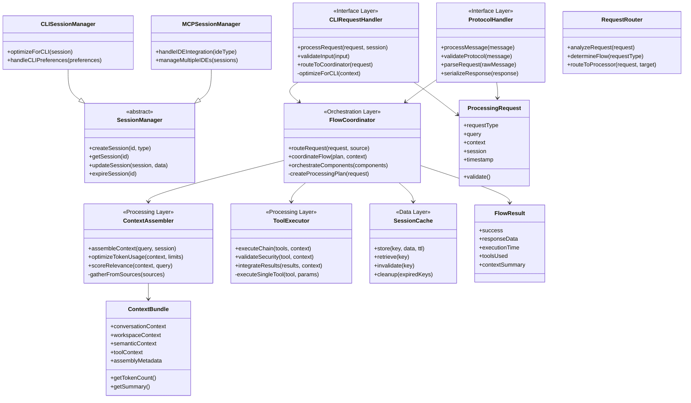

# C4: Class Design - Phase 1 Architecture

> Language-Independent Class Architecture Design  
> Part of: [Phase 1 Design](phase.1.md)  
> Based on: [C3: Component Design](component.phase.1.md)  
> Date: December 19, 2024

## Design Objectives

This document translates the **component architecture** from [component.phase.1.md](component.phase.1.md) into **language-independent class design** suitable for implementation in any object-oriented language.

### **Primary Goals**
1. **Define Class Responsibilities**: Clear separation of concerns and single responsibility principle
2. **Establish Relationships**: Class hierarchies, composition, and dependency patterns
3. **Specify Interfaces**: Abstract contracts independent of implementation language
4. **Enable Implementation**: Provide sufficient architectural detail for any language choice
5. **Maintain Component Integrity**: Preserve all architectural decisions from component design

### **Design Principles**
- **Language Agnostic**: No implementation-specific details
- **Interface-Driven**: Focus on contracts and responsibilities
- **Relationship-Focused**: Clear dependency and composition patterns
- **Testability**: Design supports unit testing and mocking
- **Extensibility**: Architecture supports future enhancements

## Class Architecture Overview

The class design follows the same container structure as the component design, organized by architectural layers:

## Interface Layer Architecture

> **Component Reference**: [CLI Interface Container Components](component.phase.1.md#cli-interface-container-components) and [MCP Protocol Container Components](component.phase.1.md#mcp-protocol-container-components)

### Request Handler Classes

#### CLIRequestHandler
**Responsibility**: Handle CLI application requests with session management and context optimization

**Class Attributes**:
- `currentSession`: Active CLI session reference
- `contextOptimizer`: CLI-specific context adaptation logic
- `responseFormatter`: CLI output formatting logic

**Key Operations**:
- `processRequest(request, session)`: Main request processing workflow
- `validateInput(input)`: Input validation with CLI-specific rules
- `routeToCoordinator(request)`: Forward validated requests to flow coordination
- `optimizeForCLI(context)`: Adapt context for command-line consumption

**Error Handling Responsibilities**:
- Input validation failures
- Session management errors
- Context optimization failures
- Flow coordination errors

**Performance Requirements**:
- Request processing: < 50ms
- Input validation: < 10ms
- Session operations: < 15ms

#### ProtocolHandler
**Responsibility**: Handle MCP protocol communication for IDE integrations

**Class Attributes**:
- `protocolValidator`: MCP specification compliance checker
- `messageParser`: Protocol message parsing logic
- `responseSerializer`: MCP response formatting logic

**Key Operations**:
- `processMessage(message)`: Main MCP message processing
- `validateProtocol(message)`: MCP specification compliance validation
- `parseRequest(rawMessage)`: Parse incoming protocol messages
- `serializeResponse(response)`: Format responses per MCP specification

**Protocol Support**:
- VS Code Copilot Chat integration
- Cursor AI Chat integration
- JSON-RPC message handling
- Error response formatting

### Session Management Architecture

#### Abstract SessionManager
**Responsibility**: Define common session lifecycle operations

**Abstract Operations**:
- `createSession(id, type)`: Session initialization
- `getSession(id)`: Session retrieval
- `updateSession(session, data)`: Session state updates
- `expireSession(id)`: Session cleanup

**Session Lifecycle**:
1. Creation with validation
2. Active state management
3. Periodic updates
4. Expiration and cleanup

#### CLISessionManager (extends SessionManager)
**Responsibility**: CLI-specific session management with preferences and optimization

**Specialized Operations**:
- `optimizeForCLI(session)`: CLI-specific session configuration
- `handleCLIPreferences(preferences)`: User preference management
- `trackCLIInteractions(interactions)`: Interaction history management

**CLI-Specific Features**:
- Command-line preference handling
- Terminal-friendly context formatting
- CLI interaction pattern learning

#### MCPSessionManager (extends SessionManager)
**Responsibility**: IDE session management supporting multiple IDE types

**Specialized Operations**:
- `handleIDEIntegration(ideType)`: IDE-specific configuration
- `manageMultipleIDEs(sessions)`: Cross-IDE session coordination
- `trackToolUsage(toolHistory)`: Tool execution history

**Multi-IDE Support**:
- VS Code session handling
- Cursor session handling
- Cross-IDE state coordination
- IDE-specific optimizations

## Orchestration Layer Architecture

> **Component Reference**: [Flow Coordinator Container Components](component.phase.1.md#flow-coordinator-container-components)

### FlowCoordinator
**Responsibility**: Central orchestration hub coordinating all request processing flows

**Class Attributes**:
- `contextEngine`: Context assembly coordination
- `toolExecutor`: Tool execution coordination
- `sessionCache`: Session state coordination
- `activeFlows`: Currently processing request tracking

**Key Operations**:
- `routeRequest(request, source)`: Determine processing flow based on request type
- `coordinateFlow(plan, context)`: Execute coordinated processing sequence
- `orchestrateComponents(components)`: Manage component interactions
- `createProcessingPlan(request)`: Analyze request and create execution plan

**Flow Types**:
- **CLI Flow**: Context assembly → LLM inference → response formatting
- **MCP Flow**: Tool analysis → tool execution → result integration → response

**Coordination Patterns**:
- Sequential processing with dependency management
- Parallel processing where appropriate
- Error isolation and recovery
- Performance monitoring and optimization

### RequestRouter
**Responsibility**: Analyze requests and determine appropriate processing flows

**Key Operations**:
- `analyzeRequest(request)`: Request type and complexity analysis
- `determineFlow(requestType)`: Processing flow selection
- `routeToProcessor(request, target)`: Route to appropriate processor

**Routing Logic**:
- Request type classification (CLI vs MCP)
- Complexity assessment
- Resource requirement analysis
- Processing priority assignment

## Processing Layer Architecture

> **Component Reference**: [Context Engine Container Components](component.phase.1.md#context-engine-container-components) and [Tool Executor Container Components](component.phase.1.md#tool-executor-container-components)

### ContextAssembler
**Responsibility**: Intelligent context assembly from multiple sources

**Class Attributes**:
- `conversationManager`: Conversation history management
- `workspaceAnalyzer`: Workspace context analysis
- `semanticSearchEngine`: Document and code search
- `contextOptimizer`: Token usage optimization

**Key Operations**:
- `assembleContext(query, session)`: Multi-source context gathering
- `optimizeTokenUsage(context, limits)`: Token budget management
- `scoreRelevance(context, query)`: Context relevance assessment
- `gatherFromSources(sources)`: Parallel source data gathering

**Context Sources**:
- Conversation history
- Workspace files and structure
- Git repository state
- External documentation
- Tool execution results

**Optimization Strategies**:
- Relevance-based prioritization
- Token count optimization
- Context window management
- Performance-aware assembly

### ToolExecutor
**Responsibility**: Secure tool execution with chain coordination

**Class Attributes**:
- `toolRegistry`: Available tool catalog
- `securitySandbox`: Execution security validation
- `resultIntegrator`: Tool result processing
- `chainCoordinator`: Multi-tool sequence management

**Key Operations**:
- `executeChain(tools, context)`: Sequential tool execution with context passing
- `validateSecurity(tool, context)`: Security policy enforcement
- `integrateResults(results, context)`: Result integration into context
- `executeSingleTool(tool, params)`: Individual tool execution

**Security Features**:
- Tool execution sandboxing
- Permission validation
- Resource usage limits
- Access control enforcement

**Chain Coordination**:
- Dependency-aware execution order
- Context passing between tools
- Error handling and recovery
- Partial result preservation

## Data Architecture

### Core Data Structures

#### ContextBundle
**Responsibility**: Comprehensive context data aggregation

**Class Attributes**:
- `conversationContext`: Dialogue history and patterns
- `workspaceContext`: File system and project structure
- `semanticContext`: Search results and related documents
- `toolContext`: Tool execution history and results
- `assemblyMetadata`: Context assembly information

**Key Operations**:
- `getTokenCount()`: Total token usage calculation
- `getSummary()`: Human-readable context summary
- `validateCompleteness()`: Context completeness check
- `optimizeSize(maxTokens)`: Context size optimization

#### ProcessingRequest
**Responsibility**: Unified request representation across all interfaces

**Class Attributes**:
- `requestType`: CLI or MCP classification
- `query`: User query or goal
- `context`: Assembled context bundle
- `session`: Session information
- `timestamp`: Request timestamp

**Key Operations**:
- `validate()`: Request validation
- `getComplexity()`: Complexity assessment
- `getResourceRequirements()`: Resource need analysis

#### FlowResult
**Responsibility**: Comprehensive processing result representation

**Class Attributes**:
- `success`: Processing success indicator
- `responseData`: Result data
- `executionTime`: Performance metrics
- `toolsUsed`: Tool execution summary
- `contextSummary`: Context usage summary

**Key Operations**:
- `isSuccessful()`: Success status check
- `getPerformanceMetrics()`: Performance data extraction
- `getErrorDetails()`: Error information retrieval

## Architectural Patterns

### Design Patterns Applied

#### Strategy Pattern
- **Context Optimization**: Different strategies for CLI vs MCP context formatting
- **Session Management**: Different strategies for CLI vs IDE session handling
- **Tool Execution**: Different strategies based on tool type and security requirements

#### Factory Pattern
- **Session Creation**: Factory for creating appropriate session types (CLI, VS Code, Cursor)
- **Request Processing**: Factory for creating request processors based on type
- **Context Assembly**: Factory for creating context assemblers based on requirements

#### Observer Pattern
- **Performance Monitoring**: Components observe execution metrics
- **Session State**: Components observe session state changes
- **Error Handling**: Components observe error conditions for recovery

#### Command Pattern
- **Tool Execution**: Tools as command objects with execute() operation
- **Request Processing**: Requests as command objects with processing logic
- **Flow Coordination**: Processing steps as command sequences

### Dependency Management

#### Dependency Injection
- All major components receive dependencies through constructor injection
- Interface-based dependencies for testability and flexibility
- Configuration-driven dependency resolution

#### Inversion of Control
- Abstract interfaces define component contracts
- Concrete implementations depend on abstractions
- Configuration manages component wiring

## Quality Attributes

### Performance Architecture
- **Response Time**: Sub-second response for typical operations
- **Throughput**: Multiple concurrent session handling
- **Resource Usage**: Efficient memory and CPU utilization
- **Scalability**: Linear performance scaling with load

### Security Architecture
- **Input Validation**: All inputs validated at interface boundaries
- **Access Control**: Role-based access to tools and data
- **Sandboxing**: Isolated execution environments for tools
- **Audit Trail**: Complete operation logging for security review

### Reliability Architecture
- **Error Isolation**: Component failures don't cascade
- **Recovery Mechanisms**: Graceful degradation and recovery
- **State Consistency**: Reliable state management across failures
- **Monitoring**: Comprehensive health and performance monitoring

### Maintainability Architecture
- **Separation of Concerns**: Clear component responsibilities
- **Interface Contracts**: Well-defined component boundaries
- **Testability**: Architecture supports comprehensive testing
- **Extensibility**: New components and features easily added

## Implementation Guidance

### Development Phases

#### Phase 2.1: Foundation (Week 1-2)
1. **Core Data Structures**: ContextBundle, ProcessingRequest, FlowResult
2. **Abstract Interfaces**: SessionManager, RequestHandler base classes
3. **Basic Implementations**: CLI and MCP session managers
4. **Configuration Framework**: Settings and dependency injection setup

#### Phase 2.2: Processing Layer (Week 3-4)
1. **Flow Coordination**: FlowCoordinator with basic routing
2. **Context Assembly**: ContextAssembler with multi-source gathering
3. **Tool Execution**: ToolExecutor with security validation
4. **Request Processing**: Complete CLI and MCP request handlers

#### Phase 2.3: Advanced Features (Week 5-6)
1. **Optimization**: Performance monitoring and optimization
2. **Security**: Advanced sandboxing and security policies
3. **Error Handling**: Comprehensive error management and recovery
4. **Monitoring**: Metrics collection and analysis

### Technology Selection Guidance

#### Language Considerations
- **Object-Oriented**: Architecture requires strong OOP support
- **Async Support**: Non-blocking I/O for performance
- **Type System**: Strong typing beneficial for interface contracts
- **Ecosystem**: Rich ecosystem for web services, databases, AI integration

#### Suitable Languages
- **Python**: Rich AI/ML ecosystem, excellent for rapid development
- **Java/Kotlin**: Strong typing, enterprise integration capabilities
- **TypeScript**: Full-stack development, excellent async support
- **C#**: Strong typing, excellent async support, rich ecosystem
- **Go**: Performance, simple concurrency, good for services
- **Rust**: Performance, memory safety, growing AI ecosystem

#### Framework Considerations
- **Web Framework**: For MCP protocol handling (REST/JSON-RPC)
- **Async Framework**: For concurrent request processing
- **DI Container**: For dependency injection and configuration
- **Testing Framework**: For comprehensive test coverage
- **Monitoring Framework**: For performance and health monitoring

## Component Traceability

This class design maintains complete traceability to the component architecture:

| Component (component.phase.1.md) | Class Design Element | Architecture Preserved |
|----------------------------------|---------------------|----------------------|
| CLI Request Handler | CLIRequestHandler class | ✅ All operations and responsibilities |
| Protocol Handler | ProtocolHandler class | ✅ MCP protocol compliance and processing |
| Flow Coordinator | FlowCoordinator class | ✅ Orchestration and routing logic |
| Context Assembler | ContextAssembler class | ✅ Multi-source context assembly |
| Tool Executor | ToolExecutor class | ✅ Security and chain execution |
| Session Managers | SessionManager hierarchy | ✅ Session lifecycle and specialization |

**Design Integrity**: Every class maintains the architectural decisions, responsibilities, and relationships defined in the component design while remaining language-independent.

---

**Architecture Complete**: This class design provides language-independent architectural specifications that can be implemented in any suitable object-oriented programming language while preserving all architectural decisions and design principles. 