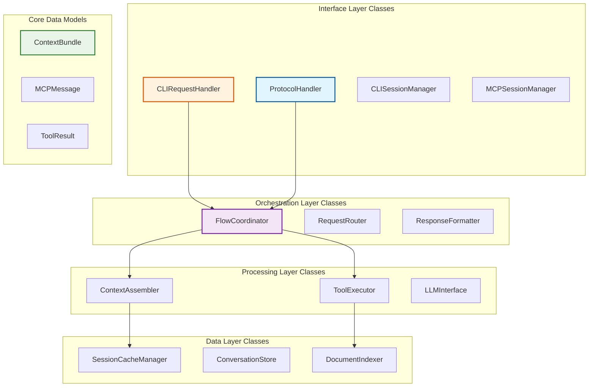

# C4: Class Design - Phase 1 Implementation

> Code-Level Design for MCP Server Implementation  
> Part of: [Phase 1 Design](phase.1.md)  
> Based on: [C3: Component Design](component.phase.1.md)  
> Date: December 19, 2024

## Design Objectives

This document translates the **component architecture** from [component.phase.1.md](component.phase.1.md) into **concrete class definitions** ready for Python implementation.

### **Primary Goals**
1. **Bridge Architecture to Code**: Convert architectural components into implementable Python classes
2. **Maintain Component Integrity**: Preserve all interface contracts and behavioral specifications from component design
3. **Enable Phase 2 Implementation**: Provide complete class specifications for immediate development start
4. **Ensure Design Consistency**: Maintain direct traceability to component architecture

### **Component Mapping Strategy**
Each **Component** from `component.phase.1.md` maps to:
- **Handler Classes**: Core processing logic
- **Data Models**: Request/response structures
- **Configuration Classes**: Component settings
- **Interface Protocols**: Abstract base classes

## Class Architecture Overview

The class design follows the same container structure as the component design:



## Interface Layer Classes

> **Component Reference**: [CLI Interface Container Components](component.phase.1.md#cli-interface-container-components) and [MCP Protocol Container Components](component.phase.1.md#mcp-protocol-container-components)

### CLI Request Handler

**Component Mapping**: `CLI Request Handler Component` → `CLIRequestHandler`

```python
from abc import ABC, abstractmethod
from dataclasses import dataclass
from typing import Dict, Optional, List
from enum import Enum
import asyncio

class CLIRequestHandler:
    """
    Implements: CLI Request Handler Component from component.phase.1.md
    
    Handles CLI request processing with session management and context optimization.
    Maps to interface contract: processCliRequest, validateCliInput, extractSessionInfo
    """
    
    def __init__(
        self,
        session_manager: 'CLISessionManager',
        context_optimizer: 'CLIContextOptimizer',
        flow_coordinator: 'FlowCoordinator'
    ):
        self.session_manager = session_manager
        self.context_optimizer = context_optimizer
        self.flow_coordinator = flow_coordinator
        self.active_requests: Dict[str, 'CLIRequest'] = {}
        
    async def process_cli_request(
        self, 
        query: str, 
        session_id: str, 
        context: 'ContextBundle'
    ) -> 'CLIResponse':
        """
        Core method implementing processCliRequest from component design.
        
        Maps to: CLI Request Handler.processCliRequest(query, sessionId, context)
        Performance: < 50ms for CLI request handling (per component spec)
        """
        # Validate CLI input format and constraints
        validation_result = await self._validate_cli_input(query, session_id, context)
        if not validation_result.is_valid:
            return CLIResponse.error(CLIError.INVALID_INPUT, validation_result.errors)
        
        # Get or create CLI session
        session = await self.session_manager.get_or_create_session(session_id)
        if not session.is_valid:
            return CLIResponse.error(CLIError.SESSION_ERROR, session.error_message)
        
        # Optimize context for CLI usage patterns
        optimized_context = await self.context_optimizer.optimize_for_cli(
            context, session.preferences
        )
        
        # Create processing request for flow coordinator
        processing_request = ProcessingRequest(
            query=query,
            context=optimized_context,
            session=session,
            request_type=RequestType.CLI
        )
        
        # Route to flow coordinator for orchestrated processing
        flow_result = await self.flow_coordinator.route_cli_request(processing_request)
        if not flow_result.success:
            return CLIResponse.error(CLIError.PROCESSING_FAILED, flow_result.error_message)
        
        # Handle successful flow result
        cli_response = await self._handle_flow_response(flow_result, session)
        
        # Update session with interaction
        await self.session_manager.update_session(session, query, cli_response)
        
        return CLIResponse.success(cli_response)
    
    async def _validate_cli_input(
        self, 
        query: str, 
        session_id: str, 
        context: 'ContextBundle'
    ) -> 'ValidationResult':
        """Maps to: validateCliInput interface contract"""
        errors = []
        
        if not query or len(query.strip()) == 0:
            errors.append("Query cannot be empty")
        if len(query) > 10000:  # CLI input constraint
            errors.append("Query exceeds maximum length")
        if not session_id:
            errors.append("Session ID is required")
            
        return ValidationResult(is_valid=len(errors) == 0, errors=errors)
    
    async def _handle_flow_response(
        self, 
        flow_result: 'FlowResult', 
        session: 'CLISession'
    ) -> 'CLIResponseData':
        """Maps to: handleFlowResponse interface contract"""
        return CLIResponseData(
            response_text=flow_result.response_text,
            context_used=flow_result.context_summary,
            tools_executed=flow_result.tools_executed,
            session_id=session.session_id,
            timestamp=flow_result.timestamp
        )

class CLISessionManager:
    """
    Implements: CLI Session Manager Component from component.phase.1.md
    
    Manages CLI session lifecycle and state persistence.
    Maps to behavioral specs: session lifecycle, preference management
    """
    
    def __init__(self, session_cache: 'SessionCacheManager'):
        self.session_cache = session_cache
        self.active_sessions: Dict[str, 'CLISession'] = {}
        self.session_timeout = 3600  # 1 hour default
        
    async def get_or_create_session(self, session_id: str) -> 'CLISession':
        """
        Performance: < 15ms for session management (per component spec)
        """
        if session_id in self.active_sessions:
            session = self.active_sessions[session_id]
            if not session.is_expired():
                return session
        
        # Try to restore from cache
        cached_session = await self.session_cache.get_session(session_id)
        if cached_session:
            session = CLISession.from_cache(cached_session)
        else:
            session = CLISession.create_new(session_id)
            
        self.active_sessions[session_id] = session
        return session
    
    async def update_session(
        self, 
        session: 'CLISession', 
        query: str, 
        response: 'CLIResponse'
    ) -> None:
        """Update session with interaction history"""
        session.add_interaction(query, response)
        await self.session_cache.save_session(session)

class CLIContextOptimizer:
    """
    Implements: CLI Context Optimizer Component from component.phase.1.md
    
    Optimizes context presentation for CLI consumption.
    Maps to interface contract: optimizeForCli, adaptContextFormat
    """
    
    def __init__(self):
        self.max_cli_context_tokens = 4000  # CLI-specific constraint
        
    async def optimize_for_cli(
        self, 
        context: 'ContextBundle', 
        preferences: 'UserPreferences'
    ) -> 'OptimizedContext':
        """
        Maps to: optimizeForCli interface contract
        
        CLI-specific optimizations:
        - Plain text formatting
        - Hierarchical context presentation
        - Terminal-friendly output structure
        """
        # Adapt context format for CLI
        adapted_context = await self._adapt_context_format(context, CliFormat.PLAIN_TEXT)
        
        # Prioritize CLI relevance
        prioritized_context = await self._prioritize_cli_relevance(adapted_context, preferences)
        
        # Enforce CLI constraints
        constrained_context = await self._enforce_cli_constraints(
            prioritized_context, 
            CliConstraints(max_tokens=self.max_cli_context_tokens)
        )
        
        return OptimizedContext(
            context=constrained_context,
            optimization_metadata=OptimizationMetadata(
                original_token_count=context.token_count,
                optimized_token_count=constrained_context.token_count,
                optimization_techniques=["cli_format", "relevance_priority", "constraint_enforcement"]
            )
        )
    
    async def _adapt_context_format(
        self, 
        context: 'ContextBundle', 
        cli_format: 'CliFormat'
    ) -> 'AdaptedContext':
        """Maps to: adaptContextFormat interface contract"""
        if cli_format == CliFormat.PLAIN_TEXT:
            return AdaptedContext(
                workspace_summary=self._format_workspace_for_cli(context.workspace_context),
                conversation_summary=self._format_conversation_for_cli(context.conversation_history),
                file_summaries=self._format_files_for_cli(context.relevant_files)
            )
        return context
```

### MCP Protocol Handler

**Component Mapping**: `Protocol Handler Component` → `ProtocolHandler`

```python
class ProtocolHandler:
    """
    Implements: Protocol Handler Component from component.phase.1.md
    
    Handles MCP protocol message processing for IDE integrations.
    Maps to interface contract: processRequest, validateMessage, parseRequest
    """
    
    def __init__(
        self,
        protocol_validator: 'ProtocolValidator',
        session_manager: 'MCPSessionManager',
        request_router: 'RequestRouter',
        response_formatter: 'ResponseFormatter',
        error_handler: 'ErrorHandler'
    ):
        self.protocol_validator = protocol_validator
        self.session_manager = session_manager
        self.request_router = request_router
        self.response_formatter = response_formatter
        self.error_handler = error_handler
        
    async def process_request(self, mcp_request: 'MCPRequest') -> 'MCPResponse':
        """
        Core method implementing processRequest from component design.
        
        Maps to: Protocol Handler.processRequest(mcpRequest)
        Handles: VS Code, Cursor AI Chat integrations
        """
        try:
            # Validate MCP protocol compliance
            validation_result = await self.protocol_validator.validate_mcp_request(mcp_request)
            if not validation_result.is_valid:
                return await self.error_handler.create_protocol_error(
                    MCPErrorCode.PROTOCOL_VIOLATION, 
                    validation_result.errors
                )
            
            # Extract and validate session information
            session_info = await self._extract_session_info(mcp_request)
            if not session_info.is_valid:
                return await self.error_handler.create_session_error(session_info.error)
            
            # Get or create MCP session for IDE
            session = await self.session_manager.get_or_create_session(
                session_info.session_id,
                session_info.ide_type
            )
            
            # Route request for processing
            routing_result = await self.request_router.route_mcp_request(
                mcp_request, session
            )
            if not routing_result.success:
                return await self.error_handler.create_routing_error(routing_result.error)
            
            # Format response according to MCP protocol
            mcp_response = await self.response_formatter.format_mcp_response(
                routing_result.flow_result,
                mcp_request.id,
                session
            )
            
            return mcp_response
            
        except Exception as e:
            return await self.error_handler.create_internal_error(str(e))
    
    async def _extract_session_info(self, mcp_request: 'MCPRequest') -> 'SessionInfo':
        """Maps to: extractSessionInfo interface contract"""
        return SessionInfo(
            session_id=mcp_request.session_id,
            ide_type=IDEType.from_user_agent(mcp_request.headers.get('user-agent', '')),
            request_id=mcp_request.id
        )

class MCPSessionManager:
    """
    Implements: MCP Session Manager Component from component.phase.1.md
    
    Manages IDE sessions for VS Code and Cursor integrations.
    Maps to behavioral specs: IDE session lifecycle, multi-IDE support
    """
    
    def __init__(self, session_cache: 'SessionCacheManager'):
        self.session_cache = session_cache
        self.active_sessions: Dict[str, 'MCPSession'] = {}
        self.ide_specific_configs = {
            IDEType.VSCODE: VSCodeSessionConfig(),
            IDEType.CURSOR: CursorSessionConfig()
        }
        
    async def get_or_create_session(
        self, 
        session_id: str, 
        ide_type: 'IDEType'
    ) -> 'MCPSession':
        """
        Multi-IDE session management with IDE-specific configurations
        """
        session_key = f"{ide_type.value}:{session_id}"
        
        if session_key in self.active_sessions:
            return self.active_sessions[session_key]
        
        # Try to restore from cache
        cached_session = await self.session_cache.get_session(session_key)
        if cached_session:
            session = MCPSession.from_cache(cached_session, ide_type)
        else:
            session = MCPSession.create_new(
                session_id, 
                ide_type, 
                self.ide_specific_configs[ide_type]
            )
            
        self.active_sessions[session_key] = session
        return session
```

## Orchestration Layer Classes

> **Component Reference**: [Flow Coordinator Container Components](component.phase.1.md#flow-coordinator-container-components)

### Flow Coordinator

**Component Mapping**: `Flow Coordinator Component` → `FlowCoordinator`

```python
class FlowCoordinator:
    """
    Implements: Flow Coordinator Component from component.phase.1.md
    
    Central orchestration hub for request processing across all interfaces.
    Maps to interface contract: coordinateFlow, routeRequest, optimizeExecution
    """
    
    def __init__(
        self,
        context_engine: 'ContextEngine',
        tool_executor: 'ToolExecutor',
        llm_interface: 'LLMInterface',
        session_cache: 'SessionCacheManager'
    ):
        self.context_engine = context_engine
        self.tool_executor = tool_executor
        self.llm_interface = llm_interface
        self.session_cache = session_cache
        self.active_flows: Dict[str, 'ActiveFlow'] = {}
        
    async def route_cli_request(self, processing_request: 'ProcessingRequest') -> 'FlowResult':
        """
        Route CLI requests through optimized processing flow.
        
        Maps to: CLI-specific flow from component design
        Performance: Context assembly + LLM inference + response formatting
        """
        flow_id = self._generate_flow_id()
        
        try:
            # Create processing plan for CLI request
            processing_plan = ProcessingPlan(
                request_type=RequestType.CLI,
                context_assembly_required=True,
                tool_execution_required=False,  # CLI focuses on context-enhanced responses
                llm_inference_required=True,
                session_context=processing_request.session
            )
            
            # Execute coordinated flow
            flow_result = await self._coordinate_flow(processing_plan, processing_request.context)
            
            return flow_result
            
        except Exception as e:
            return FlowResult.error(f"CLI flow coordination failed: {str(e)}")
    
    async def route_mcp_request(
        self, 
        mcp_request: 'MCPRequest', 
        session: 'MCPSession'
    ) -> 'RoutingResult':
        """
        Route MCP requests through tool-focused processing flow.
        
        Maps to: MCP-specific flow from component design
        Focus: Tool execution and workspace interaction
        """
        flow_id = self._generate_flow_id()
        
        try:
            # Analyze MCP request for tool requirements
            tool_analysis = await self._analyze_tool_requirements(mcp_request)
            
            # Create processing plan for MCP request
            processing_plan = ProcessingPlan(
                request_type=RequestType.MCP,
                context_assembly_required=tool_analysis.context_needed,
                tool_execution_required=tool_analysis.tools_needed,
                llm_inference_required=False,  # MCP uses external LLM (VS Code's)
                session_context=session,
                tool_sequence=tool_analysis.tool_sequence
            )
            
            # Execute coordinated flow
            flow_result = await self._coordinate_flow(processing_plan, mcp_request.context)
            
            return RoutingResult.success(flow_result)
            
        except Exception as e:
            return RoutingResult.error(f"MCP routing failed: {str(e)}")
    
    async def _coordinate_flow(
        self, 
        processing_plan: 'ProcessingPlan', 
        context: 'ContextBundle'
    ) -> 'FlowResult':
        """
        Core flow coordination implementing coordinateFlow from component design.
        
        Maps to: Flow Coordinator.coordinateFlow(processingPlan, context)
        Performance: Optimized execution order and parallel processing where possible
        """
        flow_start_time = time.time()
        
        # Phase 1: Context Assembly (if required)
        if processing_plan.context_assembly_required:
            enhanced_context = await self.context_engine.assemble_context(
                context, 
                processing_plan.session_context.session_id,
                max_tokens=processing_plan.context_constraints.max_tokens
            )
        else:
            enhanced_context = context
        
        # Phase 2: Tool Execution (if required)
        tool_results = None
        if processing_plan.tool_execution_required:
            tool_results = await self.tool_executor.execute_tool_chain(
                processing_plan.tool_sequence,
                enhanced_context
            )
            # Integrate tool results into context
            enhanced_context = await self._integrate_tool_results(enhanced_context, tool_results)
        
        # Phase 3: LLM Inference (if required)
        llm_response = None
        if processing_plan.llm_inference_required:
            llm_response = await self.llm_interface.generate_response(
                enhanced_context,
                processing_plan.session_context.preferences
            )
        
        # Compile flow result
        flow_result = FlowResult(
            success=True,
            response_text=llm_response.text if llm_response else None,
            context_summary=enhanced_context.summary,
            tools_executed=tool_results.executed_tools if tool_results else [],
            execution_time=time.time() - flow_start_time,
            timestamp=datetime.utcnow()
        )
        
        # Update session cache with flow results
        await self.session_cache.cache_flow_result(
            processing_plan.session_context.session_id,
            flow_result
        )
        
        return flow_result
```

## Processing Layer Classes

> **Component Reference**: [Context Engine Container Components](component.phase.1.md#context-engine-container-components) and [Tool Executor Container Components](component.phase.1.md#tool-executor-container-components)

### Context Assembler

**Component Mapping**: `Context Assembler Component` → `ContextAssembler`

```python
class ContextAssembler:
    """
    Implements: Context Assembler Component from component.phase.1.md
    
    Assembles comprehensive context from multiple sources for enhanced LLM interactions.
    Maps to interface contract: assembleContext, optimizeContextSize, scoreRelevance
    """
    
    def __init__(
        self,
        conversation_manager: 'ConversationManager',
        workspace_analyzer: 'WorkspaceAnalyzer',
        context_optimizer: 'ContextOptimizer',
        document_index: 'DocumentIndexer'
    ):
        self.conversation_manager = conversation_manager
        self.workspace_analyzer = workspace_analyzer
        self.context_optimizer = context_optimizer
        self.document_index = document_index
        
    async def assemble_context(
        self, 
        query: str, 
        session_id: str, 
        max_tokens: int = 8000
    ) -> 'ContextBundle':
        """
        Core context assembly implementing assembleContext from component design.
        Maps to: Context Assembler.assembleContext(query, sessionId, maxTokens)
        Performance: < 200ms for context assembly (per component spec)
        """
        assembly_start_time = time.time()
        
        # Gather context from multiple sources in parallel
        context_tasks = [
            self._gather_conversation_context(session_id),
            self._gather_workspace_context(query),
            self._gather_semantic_context(query),
            self._gather_tool_context(query)
        ]
        
        conversation_ctx, workspace_ctx, semantic_ctx, tool_ctx = await asyncio.gather(
            *context_tasks
        )
        
        # Create initial context bundle
        raw_context = ContextBundle(
            conversation_context=conversation_ctx,
            workspace_context=workspace_ctx,
            semantic_context=semantic_ctx,
            tool_context=tool_ctx,
            query=query,
            session_id=session_id,
            timestamp=datetime.utcnow()
        )
        
        # Optimize context size and relevance
        optimized_context = await self.context_optimizer.optimize_context(
            raw_context, 
            max_tokens,
            optimization_strategy=OptimizationStrategy.RELEVANCE_FIRST
        )
        
        # Add assembly metadata
        optimized_context.assembly_metadata = AssemblyMetadata(
            assembly_time=time.time() - assembly_start_time,
            sources_used=['conversation', 'workspace', 'semantic', 'tool'],
            optimization_applied=True,
            token_reduction_ratio=raw_context.token_count / optimized_context.token_count
        )
        
        return optimized_context
    
    async def _gather_conversation_context(self, session_id: str) -> 'ConversationContext':
        """Gather relevant conversation history"""
        return await self.conversation_manager.get_relevant_history(
            session_id, 
            max_turns=10,
            relevance_threshold=0.7
        )
    
    async def _gather_workspace_context(self, query: str) -> 'WorkspaceContext':
        """Gather relevant workspace information"""
        return await self.workspace_analyzer.analyze_workspace_relevance(
            query,
            include_git_status=True,
            include_recent_changes=True,
            max_files=20
        )
```

### Tool Executor

**Component Mapping**: `Tool Executor Component` → `ToolExecutor`

```python
class ToolExecutor:
    """
    Implements: Tool Executor Component from component.phase.1.md
    
    Executes MCP tools with security sandboxing and result integration.
    Maps to interface contract: executeToolChain, validateToolSecurity, integrateResults
    """
    
    def __init__(
        self,
        tool_registry: 'ToolRegistry',
        security_sandbox: 'SecuritySandbox',
        result_integrator: 'ResultIntegrator'
    ):
        self.tool_registry = tool_registry
        self.security_sandbox = security_sandbox
        self.result_integrator = result_integrator
        self.max_tool_execution_time = 30.0  # seconds
        
    async def execute_tool_chain(
        self, 
        tool_sequence: List['ToolCall'], 
        shared_context: 'ContextBundle'
    ) -> 'ChainResult':
        """
        Execute sequence of tools with context passing and result integration.
        
        Maps to: Tool Executor.executeToolChain(toolSequence, sharedContext)
        Performance: Parallel execution where possible, < 30s total
        """
        execution_start_time = time.time()
        chain_results = []
        current_context = shared_context
        
        try:
            for tool_call in tool_sequence:
                # Validate tool security before execution
                security_check = await self.security_sandbox.validate_tool_execution(
                    tool_call, current_context
                )
                if not security_check.is_safe:
                    return ChainResult.error(
                        f"Security violation in tool {tool_call.tool_name}: {security_check.violation_reason}"
                    )
                
                # Execute tool in secure environment
                tool_result = await self._execute_single_tool(tool_call, current_context)
                if not tool_result.success:
                    return ChainResult.error(
                        f"Tool execution failed: {tool_call.tool_name} - {tool_result.error_message}"
                    )
                
                chain_results.append(tool_result)
                
                # Integrate tool result into context for next tool
                current_context = await self.result_integrator.integrate_tool_result(
                    current_context, tool_result
                )
                
                # Check execution time limit
                if time.time() - execution_start_time > self.max_tool_execution_time:
                    return ChainResult.error("Tool chain execution timeout")
            
            # Compile final chain result
            return ChainResult(
                success=True,
                tool_results=chain_results,
                final_context=current_context,
                execution_time=time.time() - execution_start_time,
                tools_executed=[result.tool_name for result in chain_results]
            )
            
        except Exception as e:
            return ChainResult.error(f"Tool chain execution error: {str(e)}")
    
    async def _execute_single_tool(
        self, 
        tool_call: 'ToolCall', 
        context: 'ContextBundle'
    ) -> 'ToolResult':
        """Execute individual tool with timeout and error handling"""
        tool = await self.tool_registry.get_tool(tool_call.tool_name)
        if not tool:
            return ToolResult.error(f"Tool not found: {tool_call.tool_name}")
        
        try:
            # Execute tool with timeout
            result = await asyncio.wait_for(
                tool.execute(tool_call.parameters, context),
                timeout=self.max_tool_execution_time
            )
            return result
            
        except asyncio.TimeoutError:
            return ToolResult.error(f"Tool execution timeout: {tool_call.tool_name}")
        except Exception as e:
            return ToolResult.error(f"Tool execution error: {str(e)}")
```

## Core Data Models

> **Component Reference**: Data structures used across all components

### Request/Response Models

```python
@dataclass
class ContextBundle:
    """
    Core context data structure used across all components.
    
    Referenced by: All context-handling components
    Usage: Context assembly, optimization, and LLM interface
    """
    conversation_context: 'ConversationContext'
    workspace_context: 'WorkspaceContext'
    semantic_context: 'SemanticContext'
    tool_context: 'ToolContext'
    query: str
    session_id: str
    timestamp: datetime
    token_count: int = 0
    assembly_metadata: Optional['AssemblyMetadata'] = None
    
    def summary(self) -> str:
        """Generate human-readable context summary"""
        return f"Context: {self.token_count} tokens, {len(self.conversation_context.turns)} turns, {len(self.workspace_context.files)} files"

@dataclass
class CLIRequest:
    """CLI-specific request structure"""
    query: str
    session_id: str
    context: ContextBundle
    timestamp: datetime
    request_id: str = field(default_factory=lambda: str(uuid.uuid4()))

@dataclass
class CLIResponse:
    """CLI-specific response structure"""
    success: bool
    response_data: Optional['CLIResponseData'] = None
    error: Optional['CLIError'] = None
    request_id: str = ""
    timestamp: datetime = field(default_factory=datetime.utcnow)
    
    @classmethod
    def success(cls, data: 'CLIResponseData') -> 'CLIResponse':
        return cls(success=True, response_data=data)
    
    @classmethod
    def error(cls, error_type: 'CLIError', message: str) -> 'CLIResponse':
        return cls(success=False, error=CLIError(error_type, message))

@dataclass
class MCPRequest:
    """MCP protocol request structure"""
    id: str
    method: str
    params: Dict[str, Any]
    session_id: str
    headers: Dict[str, str]
    context: ContextBundle
    timestamp: datetime = field(default_factory=datetime.utcnow)

@dataclass
class MCPResponse:
    """MCP protocol response structure"""
    id: str
    result: Optional[Dict[str, Any]] = None
    error: Optional['MCPError'] = None
    timestamp: datetime = field(default_factory=datetime.utcnow)
```

### Session Models

```python
@dataclass
class CLISession:
    """CLI session state management"""
    session_id: str
    created_at: datetime
    last_activity: datetime
    preferences: 'UserPreferences'
    interaction_history: List['CLIInteraction']
    context_cache: Dict[str, Any]
    is_active: bool = True
    
    def is_expired(self, timeout_seconds: int = 3600) -> bool:
        """Check if session has expired"""
        return (datetime.utcnow() - self.last_activity).total_seconds() > timeout_seconds
    
    def add_interaction(self, query: str, response: 'CLIResponse') -> None:
        """Add interaction to session history"""
        interaction = CLIInteraction(
            query=query,
            response=response,
            timestamp=datetime.utcnow()
        )
        self.interaction_history.append(interaction)
        self.last_activity = datetime.utcnow()
    
    @classmethod
    def create_new(cls, session_id: str) -> 'CLISession':
        """Create new CLI session with defaults"""
        return cls(
            session_id=session_id,
            created_at=datetime.utcnow(),
            last_activity=datetime.utcnow(),
            preferences=UserPreferences.default(),
            interaction_history=[],
            context_cache={}
        )

@dataclass
class MCPSession:
    """MCP session state for IDE integrations"""
    session_id: str
    ide_type: 'IDEType'
    created_at: datetime
    last_activity: datetime
    ide_config: 'IDESessionConfig'
    tool_history: List['ToolExecution']
    context_cache: Dict[str, Any]
    is_active: bool = True
    
    @classmethod
    def create_new(
        cls, 
        session_id: str, 
        ide_type: 'IDEType', 
        ide_config: 'IDESessionConfig'
    ) -> 'MCPSession':
        """Create new MCP session for specific IDE"""
        return cls(
            session_id=session_id,
            ide_type=ide_type,
            created_at=datetime.utcnow(),
            last_activity=datetime.utcnow(),
            ide_config=ide_config,
            tool_history=[],
            context_cache={}
        )
```

### Configuration Models

```python
@dataclass
class MCPServerConfig:
    """Main server configuration"""
    host: str = "localhost"
    port: int = 8000
    max_sessions: int = 100
    session_timeout: int = 3600
    max_context_tokens: int = 8000
    max_tool_execution_time: float = 30.0
    enable_debug_logging: bool = False
    
    # Component-specific configs
    cli_config: 'CLIConfig' = field(default_factory=lambda: CLIConfig())
    mcp_config: 'MCPConfig' = field(default_factory=lambda: MCPConfig())
    context_config: 'ContextConfig' = field(default_factory=lambda: ContextConfig())
    tool_config: 'ToolConfig' = field(default_factory=lambda: ToolConfig())

@dataclass
class CLIConfig:
    """CLI-specific configuration"""
    max_query_length: int = 10000
    response_format: str = "plain_text"
    enable_color_output: bool = True
    context_optimization: bool = True

@dataclass
class MCPConfig:
    """MCP protocol configuration"""
    supported_ides: List[str] = field(default_factory=lambda: ["vscode", "cursor"])
    protocol_version: str = "1.0"
    enable_tool_validation: bool = True
    max_concurrent_requests: int = 10

@dataclass
class UserPreferences:
    """User preference settings"""
    response_style: str = "detailed"  # "concise", "detailed", "technical"
    context_depth: str = "medium"     # "shallow", "medium", "deep"
    enable_tool_suggestions: bool = True
    preferred_file_types: List[str] = field(default_factory=list)
    
    @classmethod
    def default(cls) -> 'UserPreferences':
        return cls()
```

## Enums and Constants

```python
class RequestType(Enum):
    """Request type classification"""
    CLI = "cli"
    MCP = "mcp"

class IDEType(Enum):
    """Supported IDE types"""
    VSCODE = "vscode"
    CURSOR = "cursor"
    
    @classmethod
    def from_user_agent(cls, user_agent: str) -> 'IDEType':
        """Determine IDE type from user agent string"""
        if "vscode" in user_agent.lower():
            return cls.VSCODE
        elif "cursor" in user_agent.lower():
            return cls.CURSOR
        else:
            return cls.VSCODE  # Default fallback

class CLIError(Enum):
    """CLI-specific error types"""
    INVALID_INPUT = "invalid_input"
    SESSION_ERROR = "session_error"
    PROCESSING_FAILED = "processing_failed"
    CONTEXT_OPTIMIZATION_FAILED = "context_optimization_failed"

class MCPErrorCode(Enum):
    """MCP protocol error codes"""
    PROTOCOL_VIOLATION = -32600
    METHOD_NOT_FOUND = -32601
    INVALID_PARAMS = -32602
    INTERNAL_ERROR = -32603
    TOOL_EXECUTION_ERROR = -32000
```

## Implementation Priority

### Phase 2.1: Core Foundation (Week 1-2)
1. **Data Models**: `ContextBundle`, `CLIRequest/Response`, `MCPRequest/Response`
2. **Configuration**: `MCPServerConfig`, `CLIConfig`, `MCPConfig`
3. **Basic Handlers**: `CLIRequestHandler`, `ProtocolHandler` (skeleton)
4. **Session Management**: `CLISessionManager`, `MCPSessionManager`

### Phase 2.2: Processing Layer (Week 3-4)
1. **Flow Coordination**: `FlowCoordinator` with basic routing
2. **Context Assembly**: `ContextAssembler` with multi-source gathering
3. **Tool Execution**: `ToolExecutor` with security validation
4. **Response Formatting**: CLI and MCP response handlers

### Phase 2.3: Advanced Features (Week 5-6)
1. **Context Optimization**: Advanced relevance scoring and token management
2. **Performance Monitoring**: Execution time tracking and optimization
3. **Error Handling**: Comprehensive error management and recovery
4. **Security**: Tool sandboxing and validation

## Component Traceability

This class design maintains complete traceability to the component architecture:

| Component (component.phase.1.md) | Class Implementation | Interface Contract Preserved |
|----------------------------------|---------------------|----------------------------|
| CLI Request Handler | `CLIRequestHandler` | ✅ processCliRequest, validateCliInput |
| Protocol Handler | `ProtocolHandler` | ✅ processRequest, validateMessage |
| Flow Coordinator | `FlowCoordinator` | ✅ coordinateFlow, routeRequest |
| Context Assembler | `ContextAssembler` | ✅ assembleContext, optimizeContextSize |
| Tool Executor | `ToolExecutor` | ✅ executeToolChain, validateToolSecurity |
| Session Managers | `CLISessionManager`, `MCPSessionManager` | ✅ Session lifecycle management |

**Design Consistency**: Every class maps directly to a component specification, preserving all interface contracts and behavioral requirements defined in the component design.

---

**Implementation Ready**: This class design provides concrete, implementable Python classes that fulfill all architectural requirements while maintaining clean separation of concerns and testability. 