# C3: Component Diagrams - Phase 1 Design

> Detailed Component Design  
> Part of: [Phase 1 Design](phase.1.md)  
> Previous: [C2: Container Diagram](container.phase.1.md)  
> Date: June 17, 2025

## Interface Layer Components

### CLI Interface Container Components

```mermaid
graph TB
    %% CLI Interface Container
    subgraph CLIContainer["📱 CLI Interface Container"]
        CLIRequestHandler[📱 CLI Request Handler<br/>Request Processing]
        CLIResponseFormatter[📄 CLI Response Formatter<br/>Response Processing]
        CLISessionManager[👤 CLI Session Manager<br/>Session Lifecycle]
        LocalLLMOptimizer[⚡ Local LLM Optimizer<br/>Parameter Optimization]
        CLIContextOptimizer[🎯 CLI Context Optimizer<br/>Context Adaptation]
    end
    
    %% External Systems
    CLIApp[💻 CLI Application<br/>Command Line Interface]
    FlowCoordinator[⚡ Flow Coordinator Container<br/>Request Orchestration]
    LocalLLM[🧠 Local LLM Service<br/>Ollama/Inference Engine]
    SessionState[⚡ Session State Container<br/>Active Cache]
    
    %% External Connections
    CLIApp <==>|"Direct API calls"| CLIRequestHandler
    CLIRequestHandler <==>|"Route CLI requests"| FlowCoordinator
    CLIResponseFormatter <==>|"Optimized responses"| CLIApp
    LocalLLMOptimizer <==>|"Inference requests"| LocalLLM
    CLISessionManager <==>|"Session data"| SessionState
    
    %% Internal Component Flow
    CLIRequestHandler -->|"Parsed requests"| CLIContextOptimizer
    CLIContextOptimizer -->|"Optimized context"| CLIRequestHandler
    CLISessionManager -->|"Session context"| CLIRequestHandler
    CLIRequestHandler -->|"LLM parameters"| LocalLLMOptimizer
    FlowCoordinator -->|"Flow results"| CLIResponseFormatter
    CLIResponseFormatter -->|"CLI formatting"| CLIRequestHandler
    
    %% Styling
    style CLIRequestHandler fill:#fff3e0,stroke:#e65100,stroke-width:2px
    style CLIResponseFormatter fill:#fff3e0,stroke:#e65100,stroke-width:2px
    style CLISessionManager fill:#fff3e0,stroke:#e65100,stroke-width:2px
    style LocalLLMOptimizer fill:#fff3e0,stroke:#e65100,stroke-width:2px
    style CLIContextOptimizer fill:#fff3e0,stroke:#e65100,stroke-width:2px
    
    style CLIApp fill:#e8f5e8,stroke:#1b5e20,stroke-width:2px
    style FlowCoordinator fill:#e8f5e8,stroke:#2e7d32,stroke-width:2px
    style LocalLLM fill:#f3e5f5,stroke:#4a148c,stroke-width:3px
    style SessionState fill:#f3e5f5,stroke:#4a148c,stroke-width:2px
```



#### CLI Request Handler Component

**Interface Contract**:
```
CLIRequestHandler Operations:
    processCliRequest(query: String, sessionId: SessionId, context: ContextBundle) -> CliResponse | CliError
    validateCliInput(input: CliInput) -> ValidationResult | ValidationError
    extractSessionInfo(request: CliRequest) -> SessionInfo | ExtractionError
    routeToFlowCoordinator(request: ProcessedRequest, session: SessionInfo) -> RoutingResult | RoutingError
    handleFlowResponse(flowResult: FlowResult, session: SessionInfo) -> CliResponse | ProcessingError
```

**Complex Logic - CLI Request Processing**:
```
function processCliRequest(query, sessionId, context) -> CliResponse | CliError:
  // Validate CLI input format and constraints
  validation = validate_cli_input(query, sessionId, context)
  if validation.failed:
    return CliError.INVALID_INPUT(validation.errors)
  
  // Get or create CLI session
  session = cli_session_manager.get_or_create_session(sessionId)
  if session.invalid:
    return CliError.SESSION_ERROR(session.error)
  
  // Optimize context for CLI usage patterns
  optimized_context = cli_context_optimizer.optimize_for_cli(context, session.preferences)
  
  // Create processing request for flow coordinator
  processing_request = create_processing_request(query, optimized_context, session)
  
  // Route to flow coordinator for orchestrated processing
  flow_result = flow_coordinator.route_cli_request(processing_request)
  if flow_result.failed:
    return CliError.PROCESSING_FAILED(flow_result.error)
  
  // Handle successful flow result
  cli_response = handle_flow_response(flow_result, session)
  
  // Update session with interaction
  cli_session_manager.update_session(session, query, cli_response)
  
  return CliResponse.SUCCESS(cli_response)
```

**Error Conditions**:
- `INVALID_INPUT`: CLI input doesn't meet format or constraint requirements
- `SESSION_ERROR`: CLI session creation or validation failed
- `CONTEXT_OPTIMIZATION_FAILED`: Cannot optimize context for CLI usage
- `PROCESSING_FAILED`: Flow coordinator unable to process CLI request

**Performance Requirements**:
- Request processing: < 50ms for CLI request handling
- Input validation: < 10ms per input validation
- Session operations: < 15ms for session management
- Flow coordination: < 20ms for routing to flow coordinator

#### CLI Context Optimizer Component

**Interface Contract**:
```
CLIContextOptimizer Operations:
    optimizeForCli(context: ContextBundle, preferences: UserPreferences) -> OptimizedContext | OptimizationError
    adaptContextFormat(context: ContextBundle, cliFormat: CliFormat) -> AdaptedContext
    prioritizeCliRelevance(context: ContextBundle, query: String) -> PrioritizedContext
    enforceCliConstraints(context: ContextBundle, constraints: CliConstraints) -> ConstrainedContext
```

**Behavioral Specifications**:
- **CLI-Specific Optimization**: Adapt context presentation for command-line consumption
- **Format Adaptation**: Convert context to CLI-friendly formats (plain text, structured output)
- **Relevance Prioritization**: Prioritize context elements most relevant to CLI interactions
- **Constraint Enforcement**: Ensure context meets CLI-specific constraints (length, formatting)

### MCP Protocol Container Components

```mermaid
graph TB
    %% MCP Protocol Container
    subgraph MCPContainer["📡 MCP Protocol Container"]
        ProtocolHandler[📡 Protocol Handler<br/>Message Processing]
        MCPSessionManager[👤 MCP Session Manager<br/>IDE Sessions (VS Code & Cursor)]
        RequestRouter[🎯 Request Router<br/>Message Routing]
        ResponseFormatter[📄 Response Formatter<br/>MCP Responses]
        ErrorHandler[⚠️ Error Handler<br/>Error Management]
        ProtocolValidator[🔐 Protocol Validator<br/>MCP Compliance]
    end
    
    %% External Systems
    VSCode[🔧 VS Code + Extensions<br/>IDE Environment]
    Cursor[🖱️ Cursor + AI Chat<br/>IDE Environment]
    FlowCoordinator[⚡ Flow Coordinator Container<br/>Request Orchestration]
    SessionState[⚡ Session State Container<br/>Active Cache]
    
    %% External Connections
    VSCode <==>|"MCP Protocol (JSON-RPC)"| ProtocolHandler
    Cursor <==>|"MCP Protocol (JSON-RPC)"| ProtocolHandler
    RequestRouter <==>|"Route MCP requests"| FlowCoordinator
    MCPSessionManager <==>|"Session state"| SessionState
    
    %% Internal Component Flow
    ProtocolHandler -->|"Parsed requests"| ProtocolValidator
    ProtocolValidator -->|"Valid requests"| RequestRouter
    ProtocolHandler -->|"Session validation"| MCPSessionManager
    RequestRouter -->|"Routing decisions"| FlowCoordinator
    FlowCoordinator -->|"Response data"| ResponseFormatter
    ResponseFormatter -->|"MCP responses"| ProtocolHandler
    ErrorHandler -->|"Error responses"| ResponseFormatter
    
    %% Styling
    style ProtocolHandler fill:#e1f5fe,stroke:#01579b,stroke-width:2px
    style MCPSessionManager fill:#e1f5fe,stroke:#01579b,stroke-width:2px
    style RequestRouter fill:#e1f5fe,stroke:#01579b,stroke-width:2px
    style ResponseFormatter fill:#e1f5fe,stroke:#01579b,stroke-width:2px
    style ErrorHandler fill:#e1f5fe,stroke:#01579b,stroke-width:2px
    style ProtocolValidator fill:#e1f5fe,stroke:#01579b,stroke-width:2px
    
    style VSCode fill:#007acc,stroke:#ffffff,stroke-width:2px
    style Cursor fill:#000000,stroke:#ffffff,stroke-width:2px
    style FlowCoordinator fill:#e8f5e8,stroke:#2e7d32,stroke-width:2px
    style SessionState fill:#f3e5f5,stroke:#4a148c,stroke-width:2px
```

#### Protocol Handler Component

**Interface Contract**:
```
ProtocolHandler Operations:
    processRequest(mcpRequest: MCPRequest) -> MCPResponse | MCPError
    validateMessage(message: MCPMessage) -> ValidationResult | ValidationError
    parseRequest(rawMessage: Bytes) -> ParsedRequest | ParseError
    serializeResponse(response: ResponseData) -> MCPMessage | SerializationError
    handleTransport(connection: Connection) -> TransportSession | TransportError
```

**Complex Logic - MCP Request Processing**:
```
function processRequest(mcpRequest) -> MCPResponse | MCPError:
  // Validate MCP protocol compliance
  validation = protocol_validator.validate_mcp_request(mcpRequest)
  if validation.failed:
    return MCPError.PROTOCOL_VIOLATION(validation.errors)
  
  // Extract and validate session information
  session_info = extract_session_info(mcpRequest)
  session = mcp_session_manager.validate_session(session_info.sessionId)
  if session.invalid:
    return MCPError.INVALID_SESSION(session.error)
  
  // Route request through request router
  routing_decision = request_router.route_request(mcpRequest, session)
  if routing_decision.failed:
    return MCPError.ROUTING_FAILED(routing_decision.error)
  
  // Send to flow coordinator for processing
  flow_result = flow_coordinator.route_mcp_request(routing_decision, session)
  if flow_result.failed:
    return MCPError.PROCESSING_FAILED(flow_result.error)
  
  // Format response according to MCP specification
  mcp_response = response_formatter.format_mcp_response(flow_result.data, flow_result.errors)
  
  return MCPResponse.SUCCESS(mcp_response)
```

## Core Processing Layer Components

### Flow Coordinator Container Components

```mermaid
graph TB
    %% Flow Coordinator Container
    subgraph FlowContainer["⚡ Flow Coordinator Container"]
        RequestRouter[🎯 Request Router<br/>Request Analysis]
        FlowOrchestrator[⚙️ Flow Orchestrator<br/>Execution Coordination]
        SessionStateCoordinator[🔄 Session State Coordinator<br/>State Management]
        ErrorIsolationManager[⚠️ Error Isolation Manager<br/>Error Handling]
        ContainerProxy[🔗 Container Proxy<br/>Container Communication]
        ProcessingPlanBuilder[📋 Processing Plan Builder<br/>Plan Generation]
    end
    
    %% External Containers
    CLIInterface[📱 CLI Interface Container<br/>Command Line Processing]
    MCPProtocol[📡 MCP Protocol Container<br/>IDE Communication (VS Code & Cursor)]
    ContextEngine[🔍 Context Engine Container<br/>Intelligent Context Assembly]
    ToolExecutor[🛠️ Tool Executor Container<br/>Workspace Operations]
    LLMInterface[🎯 LLM Interface Container<br/>Model Communication]
    SessionState[⚡ Session State Container<br/>Active Cache]
    
    %% Request Routing from Interfaces
    CLIInterface <==>|"CLI requests"| RequestRouter
    MCPProtocol <==>|"MCP requests"| RequestRouter
    
    %% Flow Orchestration
    RequestRouter -->|"Processing plans"| ProcessingPlanBuilder
    ProcessingPlanBuilder -->|"Execution plans"| FlowOrchestrator
    FlowOrchestrator -->|"Container operations"| ContainerProxy
    
    %% Container Coordination
    ContainerProxy <==>|"Context requests"| ContextEngine
    ContainerProxy <==>|"Tool execution"| ToolExecutor
    ContainerProxy <==>|"LLM inference"| LLMInterface
    
    %% Session and Error Management
    SessionStateCoordinator <==>|"Session coordination"| SessionState
    ErrorIsolationManager -->|"Error handling"| FlowOrchestrator
    FlowOrchestrator -->|"State updates"| SessionStateCoordinator
    
    %% Styling
    style RequestRouter fill:#e8f5e8,stroke:#2e7d32,stroke-width:2px
    style FlowOrchestrator fill:#e8f5e8,stroke:#2e7d32,stroke-width:2px
    style SessionStateCoordinator fill:#e8f5e8,stroke:#2e7d32,stroke-width:2px
    style ErrorIsolationManager fill:#e8f5e8,stroke:#2e7d32,stroke-width:2px
    style ContainerProxy fill:#e8f5e8,stroke:#2e7d32,stroke-width:2px
    style ProcessingPlanBuilder fill:#e8f5e8,stroke:#2e7d32,stroke-width:2px
    
    style CLIInterface fill:#fff3e0,stroke:#e65100,stroke-width:2px
    style MCPProtocol fill:#e1f5fe,stroke:#01579b,stroke-width:2px
    style ContextEngine fill:#fff3e0,stroke:#e65100,stroke-width:2px
    style ToolExecutor fill:#fff8e1,stroke:#ff6f00,stroke-width:2px
    style LLMInterface fill:#f3e5f5,stroke:#4a148c,stroke-width:2px
    style SessionState fill:#f3e5f5,stroke:#4a148c,stroke-width:2px
```

#### Request Router Component

**Interface Contract**:
```
RequestRouter Operations:
    routeRequest(source: RequestSource, requestType: RequestType, payload: RequestPayload) -> ProcessingPlan | RoutingError
    analyzeRequestRequirements(requestType: RequestType, payload: RequestPayload) -> RequirementAnalysis
    buildProcessingPlan(requirements: RequirementAnalysis) -> ProcessingPlan | PlanError
    validateProcessingPlan(plan: ProcessingPlan, requirements: RequirementAnalysis) -> ValidationResult
    optimizeRouting(patterns: RequestPatterns) -> RoutingOptimization
```

**Complex Logic - Request Routing**:
```
function routeRequest(source, requestType, payload) -> ProcessingPlan | RoutingError:
  // Analyze request requirements
  requirements = analyze_request_requirements(requestType, payload)
  if requirements.invalid:
    return RoutingError.INVALID_REQUIREMENTS(requirements.errors)
  
  // Build processing plan based on requirements
  plan = processing_plan_builder.build_plan(requirements, source)
  if plan.failed:
    return RoutingError.PLAN_GENERATION_FAILED(plan.error)
  
  // Validate plan feasibility with current system state
  validation = validate_processing_plan(plan, requirements)
  if validation.failed:
    return RoutingError.INVALID_PLAN(validation.errors)
  
  // Optimize plan based on historical patterns
  optimized_plan = optimize_routing(plan, get_request_patterns())
  
  return ProcessingPlan.SUCCESS(optimized_plan)
```

#### Flow Orchestrator Component

**Interface Contract**:
```
FlowOrchestrator Operations:
    coordinateFlow(processingPlan: ProcessingPlan, context: FlowContext) -> FlowResult | FlowError
    executeProcessingStep(step: ProcessingStep, flowContext: FlowContext) -> StepResult | StepError
    handlePartialFailure(completedSteps: StepResult[], failedStep: StepError, context: FlowContext) -> PartialResult
    finalizeFlowExecution(stepResults: StepResult[], flowContext: FlowContext) -> FinalResult
    manageFlowState(flowId: FlowId, state: FlowState) -> StateResult
```

**Complex Logic - Flow Coordination**:
```
function coordinateFlow(processingPlan, context) -> FlowResult | FlowError:
  // Initialize flow execution context
  flow_context = initialize_flow_context(context, processingPlan)
  flow_results = []
  
  try:
    // Execute processing steps in sequence
    for step in processingPlan.steps:
      // Update session state for current step
      session_state_coordinator.update_flow_state(flow_context.sessionId, step)
      
      // Execute step through container proxy
      step_result = container_proxy.execute_step(step, flow_context)
      
      if step_result.failed:
        // Handle partial failure with error isolation
        return error_isolation_manager.handle_partial_failure(
          flow_results, 
          step_result.error, 
          flow_context
        )
      
      // Update flow context with step results
      flow_context = merge_step_result(flow_context, step_result)
      flow_results.append(step_result)
      
      // Check for early termination conditions
      if should_terminate_flow(step_result, processingPlan):
        break
    
    // Finalize flow execution
    final_result = finalize_flow_execution(flow_results, flow_context)
    
    // Update session state with final results
    session_state_coordinator.finalize_flow_state(
      flow_context.sessionId, 
      final_result
    )
    
    return FlowResult.SUCCESS(final_result)
    
  catch ContainerError as e:
    // Isolate container errors to prevent cascade failures
    return error_isolation_manager.isolate_container_error(e, flow_context)
```

### Context Engine Container Components


#### Context Assembler Component

**Interface Contract**:
```
ContextAssembler Operations:
    assembleContext(query: String, sessionId: SessionId, maxTokens: TokenLimit) -> ContextBundle | ContextError
    prioritizeSources(sources: ContextSources, relevance: RelevanceScores) -> PrioritizedSources
    validateContext(context: ContextBundle) -> ValidationResult | ValidationError
    integrateToolResults(toolResults: ToolResults, context: ContextBundle) -> EnhancedContext | IntegrationError
    optimizeAssembly(patterns: UsagePatterns) -> AssemblyOptimization
```

**Complex Logic - Context Assembly**:
```
function assembleContext(query, sessionId, maxTokens) -> ContextBundle | ContextError:
  // Initialize context assembly with token budget
  context_bundle = ContextBundle.new()
  token_budget = TokenBudget.new(maxTokens)
  
  // Define context sources with priorities (aligned with container design)
  sources = [
    {source: conversation_manager, priority: HIGH, weight: 0.4},
    {source: workspace_analyzer, priority: MEDIUM, weight: 0.3},
    {source: document_index_search, priority: MEDIUM, weight: 0.2},
    {source: external_knowledge, priority: LOW, weight: 0.1}
  ]
  
  // Gather context from each source with budget allocation
  for source_config in sources:
    try:
      // Allocate token budget for this source
      source_tokens = token_budget.allocate(source_config.weight)
      
      // Gather context from source
      source_context = source_config.source.gather_context(
        query, 
        sessionId, 
        source_tokens
      )
      
      // Score relevance using relevance scorer
      relevance_score = relevance_scorer.score_context_relevance(source_context, query)
      
      if relevance_score > RELEVANCE_THRESHOLD:
        context_bundle.add(source_context, relevance_score)
        token_budget.consume(source_context.token_count)
      
    catch SourceError as e:
      // Continue with other sources if one fails
      memory_manager.log_source_error(source_config.source, e)
      continue
  
  // Optimize final context within token limits
  if context_bundle.token_count > maxTokens:
    context_bundle = context_optimizer.optimize_context_window(context_bundle, maxTokens)
  
  // Validate context quality
  quality_score = evaluate_context_quality(context_bundle, query)
  if quality_score < QUALITY_THRESHOLD:
    return ContextError.LOW_QUALITY_CONTEXT(quality_score)
  
  // Store context metadata in session state
  session_state.store_context_metadata(sessionId, context_bundle.metadata)
  
  return ContextBundle.SUCCESS(context_bundle)
```

### Tool Executor Container Components (Enhanced with Chain Coordination)

```mermaid
graph TB
    subgraph "Tool Executor Container"
        ToolRegistry[📋 Tool Registry<br/>Tool Management]
        ChainCoordinator[🔗 Chain Coordinator<br/>Sequential Execution]
        ExecutionEngine[⚙️ Execution Engine<br/>Execution Control]
        ContextPasser[🔄 Context Passer<br/>Context Sharing]
        ResultIntegrator[📊 Result Integrator<br/>Result Processing]
        SecuritySandbox[🔒 Security Sandbox<br/>Security Isolation]
        ChainErrorHandler[⚠️ Chain Error Handler<br/>Chain Error Management]
    end
    
    subgraph "Specialized Tools"
        FileTools[📁 File Tools<br/>File Operations]
        GitTools[🔄 Git Tools<br/>Version Control]
        APITools[🌐 API Tools<br/>External Integration]
        CodeTools[💻 Code Tools<br/>Code Analysis]
    end
    
    subgraph "External Systems"
        FlowCoordinator[⚡ Flow Coordinator]
        ContextEngine[🔍 Context Engine]
        DocumentIndex[📚 Document Index]
        FileSystem[💾 File System]
        Git[🔄 Git Repository]
        ExternalAPIs[🌐 External APIs]
    end
    
    %% Flow coordinator integration
    FlowCoordinator <==>|"Tool execution requests"| ChainCoordinator
    
    %% Chain coordination flow
    ChainCoordinator -->|"Chain planning"| ContextPasser
    ChainCoordinator -->|"Tool metadata"| ToolRegistry
    ChainCoordinator -->|"Execute sequence"| ExecutionEngine
    ExecutionEngine -->|"Sandboxed execution"| SecuritySandbox
    ExecutionEngine -->|"Raw results"| ResultIntegrator
    ResultIntegrator -->|"Integrated results"| ContextEngine
    ChainErrorHandler -->|"Error recovery"| ChainCoordinator
    
    %% Context passing between tools
    ContextPasser -->|"Shared context"| ExecutionEngine
    ExecutionEngine -->|"Updated context"| ContextPasser
    
    %% Tool execution through sandbox
    SecuritySandbox -->|"File operations"| FileTools
    SecuritySandbox -->|"Git operations"| GitTools
    SecuritySandbox -->|"API calls"| APITools
    SecuritySandbox -->|"Code analysis"| CodeTools
    
    %% External system access
    FileTools <==>|"File I/O"| FileSystem
    GitTools <==>|"Git commands"| Git
    APITools <==>|"HTTP requests"| ExternalAPIs
    CodeTools <==>|"Code parsing"| FileSystem
    
    %% Background indexing
    ResultIntegrator -.->|"Background indexing"| DocumentIndex
    
    %% Styling
    classDef core fill:#fff8e1,stroke:#ff6f00,stroke-width:2px
    classDef tools fill:#e8f5e8,stroke:#2e7d32,stroke-width:2px
    classDef external fill:#f5f5f5,stroke:#757575,stroke-width:1px
    
    class ToolRegistry,ChainCoordinator,ExecutionEngine,ContextPasser,ResultIntegrator,SecuritySandbox,ChainErrorHandler core
    class FileTools,GitTools,APITools,CodeTools tools
    class FlowCoordinator,ContextEngine,DocumentIndex,FileSystem,Git,ExternalAPIs external
```



#### Chain Coordinator Component

**Interface Contract**:
```
ChainCoordinator Operations:
    executeToolChain(toolSequence: ToolSequence, sharedContext: ChainContext) -> ChainResult | ChainError
    planChainExecution(toolSequence: ToolSequence, context: ChainContext) -> ExecutionPlan | PlanError
    coordinateContextPassing(toolResults: ToolResults, chainContext: ChainContext) -> UpdatedContext
    handleChainFailure(failedTool: ToolSpec, partialResults: ToolResults, context: ChainContext) -> RecoveryResult
    validateChainSafety(toolSequence: ToolSequence, context: ChainContext) -> SafetyResult
```

**Complex Logic - Tool Chain Execution**:
```
function executeToolChain(toolSequence, sharedContext) -> ChainResult | ChainError:
  // Initialize chain execution context
  chain_context = context_passer.initialize_chain_context(sharedContext)
  executed_tools = []
  chain_results = []
  
  // Plan chain execution with dependency analysis
  execution_plan = plan_chain_execution(toolSequence, chain_context)
  if execution_plan.failed:
    return ChainError.PLANNING_FAILED(execution_plan.error)
  
  // Execute tools in planned sequence
  for tool_spec in execution_plan.tool_sequence:
    try:
      // Validate tool safety within current context
      safety_check = validate_tool_safety(tool_spec, chain_context)
      if safety_check.failed:
        return ChainError.UNSAFE_TOOL(tool_spec.name, safety_check.reasons)
      
      // Prepare tool execution environment with current context
      execution_env = security_sandbox.prepare_tool_environment(tool_spec, chain_context)
      
      // Execute tool in isolated environment
      tool_result = execution_engine.execute_tool_isolated(
        tool_spec.name, 
        tool_spec.parameters, 
        execution_env
      )
      
      if tool_result.failed:
        // Handle tool failure with partial results
        return chain_error_handler.handle_tool_failure(
          tool_spec.name, 
          tool_result.error, 
          executed_tools,
          chain_results,
          chain_context
        )
      
      // Update chain context with tool result
      chain_context = context_passer.integrate_tool_result(chain_context, tool_result)
      executed_tools.append(tool_spec)
      chain_results.append(tool_result)
      
      // Check for chain termination conditions
      if should_terminate_chain(tool_result, execution_plan):
        break
        
      // Apply rate limiting between tools
      apply_tool_rate_limiting(tool_spec, chain_context)
      
    catch ToolExecutionError as e:
      // Isolate tool errors to prevent chain corruption
      return chain_error_handler.isolate_tool_error(tool_spec.name, e, chain_context)
  
  // Finalize chain execution and integrate results
  final_context = context_passer.finalize_chain_context(chain_context, chain_results)
  integrated_results = result_integrator.integrate_chain_results(chain_results, final_context)
  
  // Background indexing of tool results
  result_integrator.async_index_tool_results(chain_results, final_context)
  
  return ChainResult.SUCCESS(final_context, integrated_results)
```

#### Result Integrator Component

**Interface Contract**:
```
ResultIntegrator Operations:
    integrateResults(toolResults: ToolResults, conversationContext: ConversationContext) -> IntegratedContext | IntegrationError
    determineIntegrationStrategy(toolResult: ToolResult, context: ConversationContext) -> IntegrationStrategy
    validateContextIntegrity(integratedContext: IntegratedContext) -> IntegrityResult
    indexToolResults(toolResults: ToolResults, context: IndexingContext) -> IndexResult
    optimizeIntegration(integrationPatterns: IntegrationPatterns) -> IntegrationOptimization
```

**Complex Logic - Tool Result Integration**:
```
function integrateResults(toolResults, conversationContext) -> IntegratedContext | IntegrationError:
  // Initialize integration context
  integrated_context = ConversationContext.clone(conversationContext)
  integration_log = []
  
  // Process each tool result for integration
  for tool_result in toolResults:
    try:
      // Extract relevant information from tool result
      relevant_data = extract_relevant_data(tool_result, conversationContext)
      
      // Determine integration strategy based on result type and context
      integration_strategy = determine_integration_strategy(
        tool_result.type, 
        relevant_data, 
        integrated_context
      )
      
      // Apply integration strategy
      switch integration_strategy:
        case APPEND_TO_CONTEXT:
          integrated_context = append_context_data(integrated_context, relevant_data)
        case MERGE_WITH_EXISTING:
          integrated_context = merge_context_data(integrated_context, relevant_data)
        case REPLACE_CONTEXT_SECTION:
          integrated_context = replace_context_section(integrated_context, relevant_data)
        case CREATE_NEW_CONTEXT_LAYER:
          integrated_context = add_context_layer(integrated_context, relevant_data)
        case REFERENCE_EXTERNAL:
          integrated_context = add_external_reference(integrated_context, relevant_data)
      
      // Validate integration didn't corrupt context
      integrity_check = validate_context_integrity(integrated_context)
      if integrity_check.failed:
        return IntegrationError.CONTEXT_CORRUPTION(integrity_check.errors)
      
      integration_log.append({tool: tool_result.id, strategy: integration_strategy})
      
    catch IntegrationError as e:
      // Continue with other results if one fails
      log_integration_error(tool_result.id, e)
      continue
  
  // Background indexing of integrated results
  async_index_integrated_results(integration_log, integrated_context)
  
  return IntegratedContext.SUCCESS(integrated_context)
```

### Session State Container Components

```mermaid
graph TB
    subgraph "Session State Container"
        SessionCacheManager[⚡ Session Cache Manager<br/>Cache Operations]
        FlowStateTracker[🔄 Flow State Tracker<br/>Flow Coordination]
        PerformanceDataCollector[📊 Performance Data Collector<br/>Metrics Collection]
        CacheCoherenceManager[🔄 Cache Coherence Manager<br/>Consistency Control]
        SessionExpirationManager[⏰ Session Expiration Manager<br/>Lifecycle Management]
    end
    
    subgraph "External Containers"
        FlowCoordinator[⚡ Flow Coordinator]
        CLIInterface[📱 CLI Interface]
        MCPProtocol[📡 MCP Protocol]
        ContextEngine[🔍 Context Engine]
        LLMInterface[🎯 LLM Interface]
    end
    
    %% Flow coordination
    FlowCoordinator <==>|"Flow state coordination"| FlowStateTracker
    FlowStateTracker -->|"State updates"| SessionCacheManager
    
    %% Session management
    CLIInterface <==>|"CLI session data"| SessionCacheManager
    MCPProtocol <==>|"MCP session data"| SessionCacheManager
    ContextEngine <==>|"Context metadata"| SessionCacheManager
    
    %% Performance monitoring
    LLMInterface -->|"Performance metrics"| PerformanceDataCollector
    PerformanceDataCollector -->|"Metrics storage"| SessionCacheManager
    
    %% Cache management
    SessionCacheManager -->|"Coherence checks"| CacheCoherenceManager
    SessionExpirationManager -->|"Expiration policies"| SessionCacheManager
    
    %% Styling
    classDef session fill:#f3e5f5,stroke:#4a148c,stroke-width:2px
    classDef external fill:#f5f5f5,stroke:#757575,stroke-width:1px
    
    class SessionCacheManager,FlowStateTracker,PerformanceDataCollector,CacheCoherenceManager,SessionExpirationManager session
    class FlowCoordinator,CLIInterface,MCPProtocol,ContextEngine,LLMInterface external
```



#### Session Cache Manager Component

**Interface Contract**:
```
SessionCacheManager Operations:
    cacheSessionData(sessionId: SessionId, data: SessionData, ttl: TimeToLive) -> CacheResult | CacheError
    retrieveSessionData(sessionId: SessionId, keys: DataKeys) -> SessionData | RetrievalError
    updateCache(sessionId: SessionId, updates: CacheUpdates) -> UpdateResult | UpdateError
    invalidateCache(sessionId: SessionId, pattern: InvalidationPattern) -> InvalidationResult
    coordinateWithFlowState(sessionId: SessionId, flowContext: FlowContext) -> CoordinationResult
    enforceCoherence(sessionId: SessionId) -> CoherenceResult
```

**Behavioral Specifications**:
- **High-Performance Caching**: Sub-millisecond access to frequently used session data
- **Flow State Coordination**: Coordinate with Flow State Tracker for consistent flow management
- **Cache Coherence**: Ensure cache consistency across multiple container access patterns
- **Automatic Expiration**: Time-based invalidation with configurable TTL policies
- **Memory Optimization**: Intelligent eviction policies based on access patterns and session priority

## Storage Layer Components (Refined Boundaries)

### Conversation Store Components

```mermaid
graph TB
    subgraph "Conversation Store Container"
        ConversationPersister[💾 Conversation Persister<br/>Storage Operations]
        HistoryIndexer[📇 History Indexer<br/>Query Optimization]
        PatternAnalyzer[🔍 Pattern Analyzer<br/>Learning System]
        UserPreferenceManager[👤 User Preference Manager<br/>Preference Storage]
        ConversationValidator[✓ Conversation Validator<br/>Data Integrity]
    end
    
    subgraph "External Containers"
        ContextEngine[🔍 Context Engine]
        MemoryManager[🧠 Memory Manager]
    end
    
    %% Storage operations (conversations only)
    ContextEngine <==>|"Store/retrieve conversations"| ConversationPersister
    ContextEngine <==>|"Query conversation history"| HistoryIndexer
    MemoryManager <==>|"Interaction patterns"| PatternAnalyzer
    MemoryManager <==>|"User preferences"| UserPreferenceManager
    
    %% Internal data flows
    ConversationPersister -->|"Data validation"| ConversationValidator
    ConversationPersister -->|"Indexing updates"| HistoryIndexer
    HistoryIndexer -->|"Pattern data"| PatternAnalyzer
    
    %% Styling
    classDef storage fill:#f3e5f5,stroke:#4a148c,stroke-width:2px
    classDef external fill:#f5f5f5,stroke:#757575,stroke-width:1px
    
    class ConversationPersister,HistoryIndexer,PatternAnalyzer,UserPreferenceManager,ConversationValidator storage
    class ContextEngine,MemoryManager external
```



**Storage Boundary Enforcement**:
- **Includes**: Conversation logs, user preferences, interaction success patterns, session metadata
- **Excludes**: Document content, embeddings, temporary session state, file system data

### Document Index Components

```mermaid
graph TB
    subgraph "Document Index Container"
        DocumentIndexer[📚 Document Indexer<br/>Embedding Generation]
        SemanticSearchEngine[🔍 Semantic Search Engine<br/>Vector Search]
        EmbeddingManager[🎯 Embedding Manager<br/>Vector Management]
        KnowledgeGraphBuilder[🕸️ Knowledge Graph Builder<br/>Relationship Mapping]
        IndexOptimizer[⚡ Index Optimizer<br/>Performance Tuning]
        ToolResultIndexer[🛠️ Tool Result Indexer<br/>Background Indexing]
    end
    
    subgraph "External Containers"
        ContextEngine[🔍 Context Engine]
        WorkspaceAnalyzer[📁 Workspace Analyzer]
        ToolExecutor[🛠️ Tool Executor]
    end
    
    %% Document search operations (documents only)
    ContextEngine <==>|"Semantic search queries"| SemanticSearchEngine
    WorkspaceAnalyzer <==>|"Document indexing"| DocumentIndexer
    ToolExecutor -.->|"Background tool indexing"| ToolResultIndexer
    
    %% Internal indexing flows
    DocumentIndexer -->|"Generate embeddings"| EmbeddingManager
    EmbeddingManager -->|"Vector storage"| SemanticSearchEngine
    DocumentIndexer -->|"Build relationships"| KnowledgeGraphBuilder
    ToolResultIndexer -->|"Tool result embeddings"| EmbeddingManager
    IndexOptimizer -->|"Performance tuning"| SemanticSearchEngine
    
    %% Styling
    classDef index fill:#e8f5e8,stroke:#2e7d32,stroke-width:2px
    classDef external fill:#f5f5f5,stroke:#757575,stroke-width:1px
    
    class DocumentIndexer,SemanticSearchEngine,EmbeddingManager,KnowledgeGraphBuilder,IndexOptimizer,ToolResultIndexer index
    class ContextEngine,WorkspaceAnalyzer,ToolExecutor external
```



**Storage Boundary Enforcement**:
- **Includes**: Document embeddings, semantic indexes, file metadata, tool result indexes, knowledge graphs
- **Excludes**: Conversation history, user preferences, active session state

## Inter-Container Component Communication

### Request Flow Patterns

**CLI Request Flow (Objective 1)**:
```
CLI App → CLI Request Handler → Request Router → Flow Orchestrator → Context Assembler → LLM Interface
                                                     ↓
                               Chain Coordinator ← Context Assembler (if tools needed)
```

**VS Code Request Flow (Objective 2)**:
```
VS Code → Protocol Handler → Request Router → Flow Orchestrator → Context Assembler → Chain Coordinator → Tools
                                           ↓                        ↓                    ↓
                          Session State ← Session State Coordinator ← Flow State Tracker ← Tool Results
```

### Component Synchronization Points

**Context Window Optimization Trigger**:
- Triggered by Context Optimizer when assembled context exceeds token limits
- Coordinated by Flow Orchestrator to ensure consistent optimization across requests

**Tool Chain Execution Coordination**:
- Flow Orchestrator initiates chain execution through Chain Coordinator
- Context Passer manages context sharing between tools in sequence
- Result Integrator processes final tool results for context integration

**Session State Synchronization**:
- Session State Coordinator triggers cache updates after successful request processing
- Flow State Tracker maintains flow coordination state across container interactions
- Cache Coherence Manager ensures consistency without blocking request processing

**Error Isolation and Recovery**:
- Error Isolation Manager prevents container errors from cascading to other containers
- Chain Error Handler manages tool chain failures with partial result preservation
- Session state rollback on critical failures to maintain consistency

---

**Previous**: [C2: Container Diagram](container.phase.1.md)  
**Next**: [Logical Flow Analysis](flow.phase.1.md)
