# C3: Component Design - Plugin-Ready Architecture

> **Functional Component Design with Plugin Extension Points**  
> **Part of**: [Phase 1 Design](phase.1.md)  
> **Previous**: [C2: Container Design](container.phase.1.md)  
> **Architecture**: Functional programming patterns + Plugin composition

## Plugin Registry System Components

### Core Plugin Registry Components

```mermaid
graph TB
    %% Core Plugin Registry System
    subgraph PluginRegistryContainer["🔌 Plugin Registry Container"]
        direction TB
        PluginManager[🔌 Plugin Manager<br/>Lifecycle Management]
        InterfaceValidator[🔍 Interface Validator<br/>Contract Validation]
        DependencyResolver[🔗 Dependency Resolver<br/>Plugin Dependencies]
        CompositionEngine[⚡ Composition Engine<br/>Functional Composition]
        PluginMetadataStore[📋 Plugin Metadata Store<br/>Plugin Information]
    end
    
    %% Plugin Interface Components
    subgraph PluginInterfaces["🔗 Plugin Interface Components"]
        direction TB
        PluginInterface[🔌 Plugin Interface<br/>Core Plugin Contract]
        ContextAdapter[📚 Context Adapter<br/>Context Enhancement]
        ToolAdapter[🛠️ Tool Adapter<br/>Tool Enhancement]
        EventHandler[📝 Event Handler<br/>Event Processing]
        RequestProcessor[⚡ Request Processor<br/>Request Enhancement]
        ResponseEnhancer[📋 Response Enhancer<br/>Response Enhancement]
    end
    
    %% Future Plugin Extensions
    subgraph FuturePlugins["🔌 Future Plugin Extensions"]
        direction LR
        RAGContextAdapter[📚 RAG Context Adapter<br/>Phase 2 Extension]
        AgentCoordinator[🤖 Agent Coordinator<br/>Phase 3 Extension]
        AutonomyController[🧠 Autonomy Controller<br/>Phase 4 Extension]
    end
    
    %% External Systems
    PluginOrchestrator[⚡ Plugin Orchestrator Container<br/>Execution Coordination]
    FunctionalContextEngine[🔍 Functional Context Engine<br/>Context Assembly]
    FunctionalToolRegistry[🛠️ Functional Tool Registry<br/>Tool Management]
    
    %% Plugin Management Flow
    PluginManager -->|"Interface validation"| InterfaceValidator
    InterfaceValidator -->|"Valid plugins"| DependencyResolver
    DependencyResolver -->|"Resolved dependencies"| CompositionEngine
    CompositionEngine -->|"Plugin chains"| PluginOrchestrator
    PluginManager -->|"Store metadata"| PluginMetadataStore
    
    %% Plugin Interface Registration
    PluginInterface -->|"Register"| PluginManager
    ContextAdapter -->|"Register"| PluginManager
    ToolAdapter -->|"Register"| PluginManager
    EventHandler -->|"Register"| PluginManager
    RequestProcessor -->|"Register"| PluginManager
    ResponseEnhancer -->|"Register"| PluginManager
    
    %% Future Plugin Registration (Dashed for Future)
    RAGContextAdapter -.->|"Phase 2 Registration"| PluginManager
    AgentCoordinator -.->|"Phase 3 Registration"| PluginManager
    AutonomyController -.->|"Phase 4 Registration"| PluginManager
    
    %% Plugin Application Points
    CompositionEngine -->|"Context adapters"| FunctionalContextEngine
    CompositionEngine -->|"Tool adapters"| FunctionalToolRegistry
    
    %% Styling
    style PluginManager fill:#e8f5e8,stroke:#2e7d32,stroke-width:2px
    style InterfaceValidator fill:#e8f5e8,stroke:#2e7d32,stroke-width:2px
    style DependencyResolver fill:#e8f5e8,stroke:#2e7d32,stroke-width:2px
    style CompositionEngine fill:#e8f5e8,stroke:#2e7d32,stroke-width:2px
    style PluginMetadataStore fill:#e8f5e8,stroke:#2e7d32,stroke-width:2px
    
    style PluginInterface fill:#fff3e0,stroke:#e65100,stroke-width:2px
    style ContextAdapter fill:#fff3e0,stroke:#e65100,stroke-width:2px
    style ToolAdapter fill:#fff3e0,stroke:#e65100,stroke-width:2px
    style EventHandler fill:#fff3e0,stroke:#e65100,stroke-width:2px
    style RequestProcessor fill:#fff3e0,stroke:#e65100,stroke-width:2px
    style ResponseEnhancer fill:#fff3e0,stroke:#e65100,stroke-width:2px
    
    style RAGContextAdapter fill:#f3e5f5,stroke:#4a148c,stroke-width:2px,stroke-dasharray: 5 5
    style AgentCoordinator fill:#f3e5f5,stroke:#4a148c,stroke-width:2px,stroke-dasharray: 5 5
    style AutonomyController fill:#f3e5f5,stroke:#4a148c,stroke-width:2px,stroke-dasharray: 5 5
```



#### Plugin Manager Component

**Interface Contract**:
```
PluginManager Operations:
  - register(plugin: Plugin) → PluginRegistry
  - unregister(pluginId: PluginId) → PluginRegistry
  - discover(criteria: DiscoveryCriteria) → Plugin[]
  - getPluginMetadata(pluginId: PluginId) → PluginMetadata
  - validate(plugin: Plugin) → ValidationResult
```

**Functional Implementation Pattern**:
```
Plugin Registration Pattern:
  registerPlugin(plugin, registry) = 
    validation ← validatePluginInterface(plugin)
    dependencies ← resolveDependencies(plugin, registry) 
    addPlugin(plugin, registry)

Plugin Discovery Pattern:
  discoverPlugins(criteria, registry) = 
    filter(matchesCriteria(criteria), getAllPlugins(registry))
```

#### Composition Engine Component

**Interface Contract**:
```
CompositionEngine Operations:
  - compose(plugins: Plugin[]) → CompositePlugin
  - executeChain(plugins: Plugin[], request: MCPRequest) → MCPResponse
  - optimizeChain(plugins: Plugin[]) → Plugin[]
```

**Functional Composition Patterns**:
```
Plugin Chain Composition:
  composePluginChain(plugins) = 
    fold(composePlugin, emptyChain, plugins)

Context Adapter Composition:
  composeContextAdapters(adapters, context) = 
    fold(applyAdapter, context, adapters)
  applyAdapter(currentContext, adapter) = adapter.adapt(currentContext)

Tool Adapter Composition:
  composeToolAdapters(adapters, tool) = 
    fold(applyEnhancement, tool, adapters)
  applyEnhancement(currentTool, adapter) = adapter.enhance(currentTool)
```

## Functional Context Engine Components

### Context Assembly Components with Plugin Extension Points

```mermaid
graph TB
    %% Functional Context Engine Container
    subgraph ContextEngineContainer["🔍 Functional Context Engine Container"]
        direction TB
        ContextAssembler[📚 Context Assembler<br/>Immutable Assembly]
        ContextOptimizer[⚡ Context Optimizer<br/>Token Optimization]
        ContextComposer[🔗 Context Composer<br/>Functional Composition]
        ContextCache[💾 Context Cache<br/>Immutable Caching]
        PluginAdapterChain[🔌 Plugin Adapter Chain<br/>Context Enhancement]
    end
    
    %% Context Sources
    subgraph ContextSources["📋 Context Sources"]
        direction TB
        ConversationHistory[💬 Conversation History<br/>Past Interactions]
        WorkspaceAnalyzer[🗂️ Workspace Analyzer<br/>Project Structure]
        FileContextProvider[📄 File Context Provider<br/>File Content Analysis]
        GitContextProvider[🔄 Git Context Provider<br/>Version Control State]
        SystemContextProvider[⚙️ System Context Provider<br/>Environment Info]
    end
    
    %% Plugin Adapter Types
    subgraph ContextAdapterTypes["🔌 Context Adapter Types"]
        direction TB
        BaseContextAdapter[📚 Base Context Adapter<br/>Core Enhancement]
        RAGContextAdapter[📚 RAG Context Adapter<br/>Phase 2: Semantic]
        AgentContextAdapter[🤖 Agent Context Adapter<br/>Phase 3: Agent State]
        AutonomyContextAdapter[🧠 Autonomy Context Adapter<br/>Phase 4: Goals]
    end
    
    %% External Connections
    PluginRegistry[🔌 Plugin Registry<br/>Adapter Registration]
    EventStore[📝 Event Store<br/>Context Events]
    
    %% Context Assembly Flow
    ContextAssembler -->|"Gather from sources"| ConversationHistory
    ContextAssembler -->|"Gather from sources"| WorkspaceAnalyzer
    ContextAssembler -->|"Gather from sources"| FileContextProvider
    ContextAssembler -->|"Gather from sources"| GitContextProvider
    ContextAssembler -->|"Gather from sources"| SystemContextProvider
    
    %% Plugin Enhancement Flow
    ContextAssembler -->|"Base context"| PluginAdapterChain
    PluginRegistry -->|"Registered adapters"| PluginAdapterChain
    PluginAdapterChain -->|"Enhanced context"| ContextComposer
    ContextComposer -->|"Optimizable context"| ContextOptimizer
    ContextOptimizer -->|"Optimized context"| ContextCache
    
    %% Adapter Chain Application
    BaseContextAdapter -->|"Core enhancement"| PluginAdapterChain
    RAGContextAdapter -.->|"Phase 2 enhancement"| PluginAdapterChain
    AgentContextAdapter -.->|"Phase 3 enhancement"| PluginAdapterChain
    AutonomyContextAdapter -.->|"Phase 4 enhancement"| PluginAdapterChain
    
    %% Event Recording
    ContextAssembler -->|"Assembly events"| EventStore
    ContextOptimizer -->|"Optimization events"| EventStore
    
    %% Styling
    style ContextAssembler fill:#fff3e0,stroke:#e65100,stroke-width:2px
    style ContextOptimizer fill:#fff3e0,stroke:#e65100,stroke-width:2px
    style ContextComposer fill:#fff3e0,stroke:#e65100,stroke-width:2px
    style ContextCache fill:#fff3e0,stroke:#e65100,stroke-width:2px
    style PluginAdapterChain fill:#e8f5e8,stroke:#2e7d32,stroke-width:2px
    
    style ConversationHistory fill:#f3e5f5,stroke:#4a148c,stroke-width:2px
    style WorkspaceAnalyzer fill:#f3e5f5,stroke:#4a148c,stroke-width:2px
    style FileContextProvider fill:#f3e5f5,stroke:#4a148c,stroke-width:2px
    style GitContextProvider fill:#f3e5f5,stroke:#4a148c,stroke-width:2px
    style SystemContextProvider fill:#f3e5f5,stroke:#4a148c,stroke-width:2px
    
    style BaseContextAdapter fill:#fff3e0,stroke:#e65100,stroke-width:2px
    style RAGContextAdapter fill:#f3e5f5,stroke:#4a148c,stroke-width:2px,stroke-dasharray: 5 5
    style AgentContextAdapter fill:#f3e5f5,stroke:#4a148c,stroke-width:2px,stroke-dasharray: 5 5
    style AutonomyContextAdapter fill:#f3e5f5,stroke:#4a148c,stroke-width:2px,stroke-dasharray: 5 5
```



#### Context Assembler Component

**Interface Contract**:
```
ContextAssembler Operations:
  - assemble(query: Query, session: Session) → Context
  - enhance(adapters: ContextAdapter[], context: Context) → Context
  - optimize(context: Context, constraints: PerformanceConstraints) → Context
  - recordAssemblyEvent(assembly: ContextAssembly) → AssemblyEvent
```
```

**Functional Assembly Pattern**:
```
Context Assembly Pattern:
  assembleContext(query, session, sources) = 
    baseContext ← gatherContextData(sources)
    queryContext ← analyzeQuery(query)
    sessionContext ← extractSessionContext(session)
    composeContexts([baseContext, queryContext, sessionContext])

Context Adapter Chain Pattern:
  applyAdapterChain(adapters, context) = 
    fold(applyAdapter, context, adapters)
  applyAdapter(currentContext, adapter) = adapter.adapt(currentContext)
```

#### Plugin Adapter Chain Component

**Interface Contract**:
```
PluginAdapterChain Operations:
  - buildChain(adapters: ContextAdapter[]) → AdapterChain
  - executeChain(chain: AdapterChain, context: Context) → Context
  - optimizeChain(chain: AdapterChain) → OptimizedChain
  - cacheChainResult(chain: AdapterChain, result: Context) → CacheEntry
```

**Chain Composition Patterns**:
```
Adapter Chain Construction:
  buildAdapterChain(adapters) = 
    validateAdapters(adapters) → composeAdapters(adapters)

Chain Execution with Error Isolation:
  executeAdapterChain(chain, context) = 
    result ← safelyExecuteChain(chain, context)
    validateContextIntegrity(result)
    result
```

## Functional Tool Registry Components

### Tool Enhancement Components with Adapter Pattern

```mermaid
graph TB
    %% Functional Tool Registry Container
    subgraph ToolRegistryContainer["🛠️ Functional Tool Registry Container"]
        direction TB
        ToolManager[🛠️ Tool Manager<br/>Immutable Tool Registry]
        ToolAdapterRegistry[🔌 Tool Adapter Registry<br/>Enhancement Adapters]
        ToolExecutionEngine[⚡ Tool Execution Engine<br/>Secure Execution]
        ToolChainComposer[🔗 Tool Chain Composer<br/>Sequential Execution]
        ToolResultProcessor[📋 Tool Result Processor<br/>Result Integration]
    end
    
    %% Core Tools (Phase 1)
    subgraph CoreTools["🛠️ Core Tools (Phase 1)"]
        direction TB
        FileTools[📄 File Tools<br/>Read/Write/List]
        GitTools[🔄 Git Tools<br/>Status/Log/Diff]
        SystemTools[⚙️ System Tools<br/>Execute/Info/Path]
        HTTPTools[🌐 HTTP Tools<br/>Request/Response]
        ConfigTools[⚚ Config Tools<br/>Environment/Settings]
    end
    
    %% Tool Adapter Types
    subgraph ToolAdapterTypes["🔌 Tool Adapter Types"]
        direction TB
        BaseToolAdapter[🛠️ Base Tool Adapter<br/>Core Enhancement]
        SemanticToolAdapter[📚 Semantic Tool Adapter<br/>Phase 2: Vector Search]
        AgentToolAdapter[🤖 Agent Tool Adapter<br/>Phase 3: Agent Context]
        AutonomyToolAdapter[🧠 Autonomy Tool Adapter<br/>Phase 4: Goal Awareness]
    end
    
    %% External Systems
    FileSystem[💾 File System<br/>Workspace]
    Git[🔄 Git Repository<br/>Version Control]
    SystemAPIs[⚙️ System APIs<br/>Environment]
    ExternalAPIs[🌐 External APIs<br/>Web Services]
    PluginRegistry[🔌 Plugin Registry<br/>Adapter Source]
    
    %% Tool Management Flow
    ToolManager -->|"Register tools"| FileTools
    ToolManager -->|"Register tools"| GitTools
    ToolManager -->|"Register tools"| SystemTools
    ToolManager -->|"Register tools"| HTTPTools
    ToolManager -->|"Register tools"| ConfigTools
    
    %% Adapter Registration Flow
    PluginRegistry -->|"Tool adapters"| ToolAdapterRegistry
    BaseToolAdapter -->|"Register"| ToolAdapterRegistry
    SemanticToolAdapter -.->|"Phase 2 registration"| ToolAdapterRegistry
    AgentToolAdapter -.->|"Phase 3 registration"| ToolAdapterRegistry
    AutonomyToolAdapter -.->|"Phase 4 registration"| ToolAdapterRegistry
    
    %% Tool Enhancement Flow
    ToolManager -->|"Base tools"| ToolAdapterRegistry
    ToolAdapterRegistry -->|"Enhanced tools"| ToolExecutionEngine
    ToolExecutionEngine -->|"Execute tools"| ToolChainComposer
    ToolChainComposer -->|"Chain results"| ToolResultProcessor
    
    %% External Execution
    ToolExecutionEngine -->|"File operations"| FileSystem
    ToolExecutionEngine -->|"Git operations"| Git
    ToolExecutionEngine -->|"System calls"| SystemAPIs
    ToolExecutionEngine -->|"HTTP requests"| ExternalAPIs
    
    %% Styling
    style ToolManager fill:#fff8e1,stroke:#ff6f00,stroke-width:2px
    style ToolAdapterRegistry fill:#e8f5e8,stroke:#2e7d32,stroke-width:2px
    style ToolExecutionEngine fill:#fff8e1,stroke:#ff6f00,stroke-width:2px
    style ToolChainComposer fill:#fff8e1,stroke:#ff6f00,stroke-width:2px
    style ToolResultProcessor fill:#fff8e1,stroke:#ff6f00,stroke-width:2px
    
    style FileTools fill:#fff3e0,stroke:#e65100,stroke-width:2px
    style GitTools fill:#fff3e0,stroke:#e65100,stroke-width:2px
    style SystemTools fill:#fff3e0,stroke:#e65100,stroke-width:2px
    style HTTPTools fill:#fff3e0,stroke:#e65100,stroke-width:2px
    style ConfigTools fill:#fff3e0,stroke:#e65100,stroke-width:2px
    
    style BaseToolAdapter fill:#fff3e0,stroke:#e65100,stroke-width:2px
    style SemanticToolAdapter fill:#f3e5f5,stroke:#4a148c,stroke-width:2px,stroke-dasharray: 5 5
    style AgentToolAdapter fill:#f3e5f5,stroke:#4a148c,stroke-width:2px,stroke-dasharray: 5 5
    style AutonomyToolAdapter fill:#f3e5f5,stroke:#4a148c,stroke-width:2px,stroke-dasharray: 5 5
```



#### Tool Manager Component

**Interface Contract**:
```
ToolManager Operations:
  - register(tool: Tool) → ToolRegistry
  - enhance(adapters: ToolAdapter[], tool: Tool) → Tool
  - execute(tool: Tool, parameters: ToolParameters) → ToolResult
  - discoverTools(criteria: ToolCriteria) → Tool[]
```

**Functional Tool Enhancement Pattern**:
```
Tool Enhancement Pattern:
  enhanceTool(adapters, tool) = 
    fold(applyEnhancement, tool, adapters)
  applyEnhancement(currentTool, adapter) = adapter.enhance(currentTool)

Tool Registration Pattern:
  registerTool(tool, registry) = 
    addTool(tool, validateToolInterface(tool, registry))
```

#### Tool Adapter Registry Component

**Interface Contract**:
```
ToolAdapterRegistry Operations:
  - registerAdapter(adapter: ToolAdapter) → RegistrationResult
  - discoverAdapters(tool: Tool) → ToolAdapter[]
  - composeAdapters(adapters: ToolAdapter[]) → CompositeAdapter
  - applyAdapters(adapters: ToolAdapter[], tool: Tool) → EnhancedTool
```

**Adapter Composition Pattern**:
```
Tool Adapter Composition:
  composeToolAdapters(adapters, tool) = 
    fold(applyAdapter, tool, adapters)
  applyAdapter(currentTool, adapter) = adapter.enhance(currentTool)

Adapter Discovery Pattern:
  discoverAdapters(tool, registry) = 
    filter(canEnhance(tool), getAllAdapters(registry))
```

## Event-Sourced Session Components

### Session Management with Plugin-Extensible Event Handling

```mermaid
graph TB
    %% Event-Sourced Session Container
    subgraph SessionContainer["👤 Event-Sourced Session Container"]
        direction TB
        SessionManager[👤 Session Manager<br/>Session Lifecycle]
        EventDispatcher[📝 Event Dispatcher<br/>Event Processing]
        StateReconstructor[🔄 State Reconstructor<br/>State from Events]
        SessionCache[💾 Session Cache<br/>Active Session Data]
        PluginEventHandlers[🔌 Plugin Event Handlers<br/>Plugin Event Processing]
    end
    
    %% Event Types
    subgraph EventTypes["📝 Event Types"]
        direction TB
        SessionEvents[👤 Session Events<br/>Lifecycle Events]
        InteractionEvents[💬 Interaction Events<br/>Query/Response Events]
        ContextEvents[📚 Context Events<br/>Context Assembly Events]
        ToolEvents[🛠️ Tool Events<br/>Tool Execution Events]
        PluginEvents[🔌 Plugin Events<br/>Plugin-Generated Events]
    end
    
    %% Plugin Event Handler Types
    subgraph PluginEventHandlerTypes["🔌 Plugin Event Handler Types"]
        direction TB
        BaseEventHandler[📝 Base Event Handler<br/>Core Event Processing]
        RAGEventHandler[📚 RAG Event Handler<br/>Phase 2: Context Events]
        AgentEventHandler[🤖 Agent Event Handler<br/>Phase 3: Agent Events]
        AutonomyEventHandler[🧠 Autonomy Event Handler<br/>Phase 4: Goal Events]
    end
    
    %% External Systems
    EventStore[📝 Event Store<br/>Immutable Event Storage]
    PluginRegistry[🔌 Plugin Registry<br/>Handler Registration]
    
    %% Session Management Flow
    SessionManager -->|"Create/manage sessions"| SessionCache
    SessionManager -->|"Dispatch events"| EventDispatcher
    EventDispatcher -->|"Process events"| PluginEventHandlers
    PluginEventHandlers -->|"Enhanced events"| EventStore
    StateReconstructor -->|"Read events"| EventStore
    StateReconstructor -->|"Reconstructed state"| SessionCache
    
    %% Event Type Processing
    SessionEvents -->|"Session lifecycle"| EventDispatcher
    InteractionEvents -->|"User interactions"| EventDispatcher
    ContextEvents -->|"Context operations"| EventDispatcher
    ToolEvents -->|"Tool executions"| EventDispatcher
    PluginEvents -->|"Plugin operations"| EventDispatcher
    
    %% Plugin Handler Registration
    PluginRegistry -->|"Event handlers"| PluginEventHandlers
    BaseEventHandler -->|"Register"| PluginEventHandlers
    RAGEventHandler -.->|"Phase 2 registration"| PluginEventHandlers
    AgentEventHandler -.->|"Phase 3 registration"| PluginEventHandlers
    AutonomyEventHandler -.->|"Phase 4 registration"| PluginEventHandlers
    
    %% Styling
    style SessionManager fill:#f3e5f5,stroke:#4a148c,stroke-width:2px
    style EventDispatcher fill:#f3e5f5,stroke:#4a148c,stroke-width:2px
    style StateReconstructor fill:#f3e5f5,stroke:#4a148c,stroke-width:2px
    style SessionCache fill:#f3e5f5,stroke:#4a148c,stroke-width:2px
    style PluginEventHandlers fill:#e8f5e8,stroke:#2e7d32,stroke-width:2px
    
    style SessionEvents fill:#fff3e0,stroke:#e65100,stroke-width:2px
    style InteractionEvents fill:#fff3e0,stroke:#e65100,stroke-width:2px
    style ContextEvents fill:#fff3e0,stroke:#e65100,stroke-width:2px
    style ToolEvents fill:#fff3e0,stroke:#e65100,stroke-width:2px
    style PluginEvents fill:#fff3e0,stroke:#e65100,stroke-width:2px
    
    style BaseEventHandler fill:#fff3e0,stroke:#e65100,stroke-width:2px
    style RAGEventHandler fill:#f3e5f5,stroke:#4a148c,stroke-width:2px,stroke-dasharray: 5 5
    style AgentEventHandler fill:#f3e5f5,stroke:#4a148c,stroke-width:2px,stroke-dasharray: 5 5
    style AutonomyEventHandler fill:#f3e5f5,stroke:#4a148c,stroke-width:2px,stroke-dasharray: 5 5
```



#### Event Dispatcher Component

**Interface Contract**:
```
EventDispatcher Operations:
  - dispatchEvent(event: SessionEvent) → EventResult
  - registerHandler(handler: EventHandler) → RegistrationResult
  - processEventChain(handlers: EventHandler[], event: SessionEvent) → ProcessedEvent
  - optimizeEventFlow(events: SessionEvent[]) → OptimizedFlow
```

**Functional Event Processing Pattern**:
```
Event Handler Chain Processing:
  processEventWithHandlers(handlers, event) = 
    fold(processEvent, event, handlers)
  processEvent(currentEvent, handler) = 
    handler.handle(currentEvent) ?? currentEvent

Event Enhancement Pattern:
  enhanceEvent(handlers, event) = 
    processEventWithHandlers(getApplicableHandlers(handlers, event), event)
```

#### State Reconstructor Component

**Interface Contract**:
```
StateReconstructor Operations:
  - reconstructState(events: SessionEvent[]) → SessionState
  - projectSessionData(events: SessionEvent[]) → ProjectionData
  - optimizeStateReconstruction(events: SessionEvent[]) → OptimizedEvents
  - cacheProjection(projection: ProjectionData) → CacheEntry
```

**Functional State Reconstruction Pattern**:
```
State Reconstruction Pattern:
  reconstructState(events) = 
    fold(applyEvent, initialState, events)

Event Application with Validation:
  applyEvent(state, event) = 
    if validateEvent(event, state) = Valid 
      then enhanceState(state, event)
      else state  # Preserve state integrity
```

## Performance Characteristics

### Plugin-Aware Performance Targets
- **Plugin Registration**: < 10ms per plugin with interface validation
- **Adapter Chain Execution**: < 5ms per adapter in composition
- **Context Enhancement**: < 20ms for plugin-enhanced context assembly
- **Tool Enhancement**: < 15ms for plugin-enhanced tool execution
- **Event Processing**: < 5ms for plugin event handler chains

### Functional Programming Benefits
- **Memory Efficiency**: Structural sharing in immutable data structures
- **Parallelization**: Pure functions enable safe concurrent execution
- **Predictability**: Immutable state eliminates race conditions
- **Error Isolation**: Plugin failures contained within composition boundaries

### Plugin Extension Impact
- **Phase 2 RAG**: +50ms typical for semantic context enhancement
- **Phase 3 sAgents**: +30ms typical for agent coordination
- **Phase 4 Autonomy**: +100ms typical for autonomous analysis
- **Combined Phases**: +200ms maximum for full plugin chain execution

---

**Previous**: [C2: Container Diagram](container.phase.1.md)  
**Next**: [Logical Flow Analysis](flow.phase.1.md)
