# C2: Container Design - Plugin-Ready Architecture

> **Plugin-Extensible Container Architecture**  
> **Part of**: [Phase 1 Design](phase.1.md)  
> **Previous**: [C1: Context Design](context.phase.1.md)  
> **Architecture**: Functional programming + Plugin composition patterns

## Plugin-Ready System Container Diagram

```mermaid
graph TB
    %% External Systems
    Developer[👤 Developer]
    CLIApp[💻 CLI Application<br/>Local LLM Client]
    VSCode[🔧 VS Code + Extensions<br/>IDE Environment]
    Cursor[🖱️ Cursor + AI Chat<br/>IDE Environment]
    LocalLLM[🧠 Local LLM Service<br/>Ollama/Inference Engine]
    FileSystem[💾 File System<br/>Project Workspace]
    Git[🔄 Git Repository<br/>Version Control]
    ExternalAPIs[🌐 External APIs<br/>Documentation & Services]
    
    %% Interface Layer - Plugin-Enhanced
    subgraph InterfaceLayer["🔌 Plugin-Enhanced Interface Layer"]
        direction TB
        CLIInterface[📱 CLI Interface Container<br/>Functional Request Processing]
        MCPProtocol[📡 MCP Protocol Container<br/>Plugin-Enhanced IDE Communication]
    end
    
    %% Core Plugin System
    subgraph PluginCore["🔌 Core Plugin System"]
        direction TB
        PluginRegistry[🔌 Plugin Registry Container<br/>Functional Plugin Composition]
        PluginOrchestrator[⚡ Plugin Orchestrator Container<br/>Plugin Chain Coordination]
    end
    
    %% Functional Processing Layer
    subgraph FunctionalLayer["⚙️ Functional Processing Layer"]
        direction TB
        FunctionalContextEngine[🔍 Functional Context Engine<br/>Immutable Context Assembly]
        FunctionalToolRegistry[🛠️ Functional Tool Registry<br/>Adapter Pattern Tools]
        EventSourcedSessions[👤 Event-Sourced Sessions<br/>Immutable State Management]
        LLMInterface[🎯 LLM Interface Container<br/>Plugin-Enhanced Model Communication]
    end
    
    %% Plugin Extension Points (Future Phases)
    subgraph PluginExtensions["🔌 Plugin Extension Points"]
        direction LR
        RAGPlugins[📚 Phase 2: RAG Plugins<br/>Semantic Enhancement]
        sAgentPlugins[🤖 Phase 3: sAgent Plugins<br/>Agent Coordination]
        AutonomyPlugins[🧠 Phase 4: Autonomy Plugins<br/>Self-Improvement]
    end
    
    %% Storage Layer
    subgraph StorageLayer["💾 Immutable Storage Layer"]
        direction LR
        EventStore[(📝 Event Store<br/>Immutable Event Streams)]
        ContextCache[(📚 Context Cache<br/>Functional Context Storage)]
        PluginStore[(🔌 Plugin Store<br/>Plugin Configurations)]
    end
    
    %% External Connections - Direct API Mode
    Developer -->|"CLI commands & queries"| CLIApp
    CLIApp <==>|"HTTP/REST API"| CLIInterface
    CLIInterface <==>|"Plugin-enhanced requests"| PluginOrchestrator
    
    %% External Connections - MCP Protocol Mode
    Developer -->|"Natural language goals"| VSCode
    Developer -->|"Natural language goals"| Cursor
    VSCode <==>|"MCP Protocol (JSON-RPC)"| MCPProtocol
    Cursor <==>|"MCP Protocol (JSON-RPC)"| MCPProtocol
    MCPProtocol <==>|"Plugin-enhanced MCP"| PluginOrchestrator
    
    %% Plugin System Flow
    PluginOrchestrator <==>|"Plugin registration & discovery"| PluginRegistry
    PluginOrchestrator <==>|"Functional context assembly"| FunctionalContextEngine
    PluginOrchestrator <==>|"Tool adapter chains"| FunctionalToolRegistry
    PluginOrchestrator <==>|"Event handling"| EventSourcedSessions
    PluginOrchestrator <==>|"Enhanced LLM integration"| LLMInterface
    
    %% Plugin Extensions (Future)
    PluginRegistry -.->|"Phase 2 registration"| RAGPlugins
    PluginRegistry -.->|"Phase 3 registration"| sAgentPlugins
    PluginRegistry -.->|"Phase 4 registration"| AutonomyPlugins
    
    %% External System Integration
    LLMInterface <==>|"Context-enhanced prompts"| LocalLLM
    FunctionalToolRegistry <==>|"Immutable file operations"| FileSystem
    FunctionalToolRegistry <==>|"Git operations"| Git
    FunctionalToolRegistry <==>|"API calls"| ExternalAPIs
    
    %% Storage Interactions
    EventSourcedSessions <==>|"Event streams"| EventStore
    FunctionalContextEngine <==>|"Context caching"| ContextCache
    PluginRegistry <==>|"Plugin metadata"| PluginStore
    
    %% Background Operations (Functional)
    FunctionalToolRegistry -.->|"Tool usage events"| EventStore
    FunctionalContextEngine -.->|"Context assembly events"| EventStore
    
    %% Styling
    style Developer fill:#f9f9f9,stroke:#333,stroke-width:2px
    style CLIApp fill:#e8f5e8,stroke:#1b5e20,stroke-width:2px
    style VSCode fill:#007acc,stroke:#ffffff,stroke-width:2px
    style Cursor fill:#000000,stroke:#ffffff,stroke-width:2px
    style LocalLLM fill:#f3e5f5,stroke:#4a148c,stroke-width:3px
    
    style CLIInterface fill:#fff3e0,stroke:#e65100,stroke-width:2px
    style MCPProtocol fill:#e1f5fe,stroke:#01579b,stroke-width:2px
    style PluginRegistry fill:#e8f5e8,stroke:#2e7d32,stroke-width:3px
    style PluginOrchestrator fill:#e8f5e8,stroke:#2e7d32,stroke-width:3px
    style FunctionalContextEngine fill:#fff3e0,stroke:#e65100,stroke-width:2px
    style FunctionalToolRegistry fill:#fff8e1,stroke:#ff6f00,stroke-width:2px
    style EventSourcedSessions fill:#f3e5f5,stroke:#4a148c,stroke-width:2px
    style LLMInterface fill:#f3e5f5,stroke:#4a148c,stroke-width:2px
    
    style PluginExtensions fill:#f3e5f5,stroke:#4a148c,stroke-width:2px,stroke-dasharray: 5 5
    style EventStore fill:#f3e5f5,stroke:#4a148c,stroke-width:2px
    style ContextCache fill:#e8f5e8,stroke:#2e7d32,stroke-width:2px
    style PluginStore fill:#e8f5e8,stroke:#2e7d32,stroke-width:2px
```



## Container Responsibilities with Plugin Architecture

### Plugin-Enhanced Interface Layer

**CLI Interface Container**
- **Primary Function**: Handle CLI application requests with plugin-enhanced processing
- **Key Capabilities**: HTTP/REST API server, functional request processing, plugin-aware response formatting
- **Plugin Integration**: Automatic plugin discovery and chain application for CLI requests
- **Functional Patterns**: Immutable request/response objects with pure transformation functions

**MCP Protocol Container**
- **Primary Function**: Handle MCP protocol communication with plugin enhancement points
- **Key Capabilities**: JSON-RPC over stdio/HTTP, protocol validation, plugin-enhanced tool discovery
- **Plugin Integration**: Plugin adapters can enhance MCP responses without protocol modification
- **Multi-IDE Support**: Unified protocol handling for VS Code, Cursor, and future IDE integrations

### Core Plugin System

**Plugin Registry Container**
- **Primary Function**: Central plugin management with functional composition patterns
- **Key Capabilities**: Plugin lifecycle management, interface validation, dependency resolution
- **Plugin Composition**: Functional composition of plugin chains for request processing
- **Extension Points**: Clean interfaces for Phase 2-4 plugin registration

```
PluginRegistry Operations:
  - register(plugin: Plugin) → PluginRegistry
  - unregister(pluginId: PluginId) → PluginRegistry
  - discover(criteria: DiscoveryCriteria) → Plugin[]
  - validate(plugin: Plugin) → ValidationResult
```

**Plugin Orchestrator Container**
- **Primary Function**: Coordinate plugin execution and functional composition
- **Key Capabilities**: Plugin chain execution, error isolation, performance monitoring
- **Functional Coordination**: Pure function composition of plugin operations
- **State Management**: Immutable plugin execution state with event sourcing

```
PluginOrchestrator Operations:
  - compose(plugins: Plugin[]) → CompositePlugin
  - executeChain(plugins: Plugin[], request: MCPRequest) → MCPResponse
  - optimizeChain(plugins: Plugin[]) → Plugin[]
  - isolateErrors(pluginResult: PluginResult) → SafeResult  
  - trackPerformance(execution: PluginExecution) → PerformanceMetrics
```

### Functional Processing Layer

**Functional Context Engine Container**
- **Primary Function**: Immutable context assembly with plugin-extensible adapters
- **Key Capabilities**: Functional context composition, plugin adapter chains, token optimization
- **Context Adapters**: Plugin-extensible context enhancement through adapter pattern
- **Immutable Operations**: All context operations preserve immutability with structural sharing

```
FunctionalContextEngine Operations:
  - assemble(query: Query, session: Session) → Context
  - enhance(adapters: ContextAdapter[], context: Context) → Context
  - optimize(context: Context, constraints: PerformanceConstraints) → Context
  - compose(contexts: Context[]) → Context
```

**Functional Tool Registry Container** 
- **Primary Function**: Immutable tool registry with adapter pattern for enhancement
- **Key Capabilities**: Tool registration, adapter chain application, secure execution
- **Tool Adapters**: Plugin-extensible tool enhancement without modifying core tools
- **Functional Execution**: Pure function execution with immutable tool definitions

```
FunctionalToolRegistry Operations:
  - register(tool: Tool) → ToolRegistry
  - enhance(adapters: ToolAdapter[], tool: Tool) → Tool
  - execute(tool: Tool, parameters: ToolParameters) → ToolResult
  - chain(tools: Tool[], context: ExecutionContext) → ToolResult
```

**Event-Sourced Sessions Container**
- **Primary Function**: Immutable session management with plugin-extensible event handling
- **Key Capabilities**: Event sourcing, immutable state reconstruction, plugin event handlers
- **Event Handling**: Plugin-extensible event processing with functional composition
- **Session Continuity**: Conversation state preserved across plugin enhancements

```
EventSourcedSessions Operations:
  - createSession(id: SessionId) → Session
  - appendEvent(session: Session, event: SessionEvent) → Session
  - reconstructState(events: SessionEvent[]) → SessionState
  - handle(event: SessionEvent) → Optional<SessionEvent>
  - dispatch(event: SessionEvent) → EventResult
  - persist(session: Session) → SessionState
```

**LLM Interface Container**
- **Purpose**: Plugin-enhanced local LLM communication with functional patterns
- **Key Capabilities**: Context-enhanced prompts, plugin-aware model selection, response optimization
- **Plugin Integration**: Context adapters can enhance prompts, response enhancers can process outputs
- **Functional Design**: Pure function composition for prompt assembly and response processing

### Plugin Extension Points (Future Phases)

#### Phase 2: RAG Plugin Extensions
**RAG Plugins Container** (Future):
- Context adapters for semantic enhancement
- Tool adapters for vector-based intelligence  
- Knowledge base management plugins
- Document processing enhancement plugins

#### Phase 3: sAgent Plugin Extensions
**sAgent Plugins Container** (Future):
- Agent coordination plugins for task distribution
- Specialized agent plugins (Code, Doc, Test, Analysis)
- Agent workflow orchestration plugins
- Inter-agent communication plugins

#### Phase 4: Autonomy Plugin Extensions
**Autonomy Plugins Container** (Future):
- Self-improvement system plugins
- Dynamic agent creation plugins
- Autonomous goal setting plugins
- Adaptive learning system plugins

### Immutable Storage Layer

#### Event Store Container
**Primary Purpose**: Immutable event storage with plugin-aware event handling

**Key Responsibilities**:
- **Event Persistence**: Append-only event streams with immutable events
- **Event Replay**: Session state reconstruction from event streams
- **Plugin Events**: Plugin-generated events stored alongside core events
- **Event Querying**: Functional query interface for event analysis

**Interface Contract**:
  ```
EventStore Operations:
  - appendEvent(stream: StreamId, event: Event) → EventStream
  - readEvents(stream: StreamId, from?: EventId) → Event[]
  - queryEvents(predicate: EventPredicate) → Event[]
  - replayEvents(stream: StreamId, handler: EventHandler) → SessionState
```

#### Context Cache Container
**Primary Purpose**: High-performance caching of functional context assemblies

**Key Responsibilities**:
- **Context Caching**: Immutable context objects with structural sharing
- **Cache Invalidation**: Event-driven cache invalidation based on workspace changes
- **Plugin-Aware Caching**: Cache keys include plugin adapter chains for proper invalidation
- **Performance Optimization**: Sub-millisecond context retrieval for frequent patterns

#### Plugin Store Container
**Primary Purpose**: Plugin configuration and metadata storage

**Key Responsibilities**:
- **Plugin Metadata**: Plugin registration information and capabilities
- **Configuration Storage**: Plugin-specific configuration with validation
- **Dependency Tracking**: Plugin dependency graphs and resolution
- **Version Management**: Plugin version compatibility and update tracking

## Inter-Container Communication Patterns

### Functional Request Flow Pattern
```
Request Flow with Plugin Enhancement:
CLI/MCP Request 
→ Plugin Orchestrator 
→ Plugin Registry (discover applicable plugins)
→ Functional Context Engine (assemble + enhance context)
→ Functional Tool Registry (execute + enhance tools)
→ Event-Sourced Sessions (record + handle events)
→ Plugin Orchestrator (compose results)
→ CLI/MCP Response
```

### Plugin Composition Pattern
```
Plugin Chain Composition:
  processRequest(plugins, request) = 
    fold(applyPlugin, initialResponse(request), plugins)

Context Enhancement Pipeline:
  enhanceContext(adapters, context) = 
    fold(applyAdapter, context, adapters)
  applyAdapter(currentContext, adapter) = adapter.enhance(currentContext)

Tool Adapter Application:
  enhanceTools(adapters, tools) = 
    map(enhanceTool, tools)
  enhanceTool(tool) = fold(applyAdapter, tool, adapters)
```

### Event Sourcing Pattern
```
// Immutable event handling with plugin extensions
EventHandler Operations:
  - handle(event: SessionEvent) → Optional<SessionEvent>

// Plugin event processing
function processEventWithPlugins(
  handlers: EventHandler[], 
  event: SessionEvent
): SessionEvent {
  return handlers.reduce(
    (currentEvent, handler) => handler.handle(currentEvent) || currentEvent,
    event
  )
}
```

## Performance Characteristics

### Plugin-Aware Performance Targets
- **Plugin Registration**: < 10ms per plugin registration
- **Plugin Discovery**: < 5ms for applicable plugin identification
- **Plugin Chain Execution**: < 10ms overhead per plugin in chain
- **Context Enhancement**: < 50ms for plugin-enhanced context assembly
- **Tool Adapter Application**: < 20ms for plugin-enhanced tool execution

### Functional Programming Benefits
- **Memory Efficiency**: Structural sharing reduces memory footprint
- **Parallelization**: Pure functions enable safe parallel execution
- **Predictability**: Immutable data eliminates race conditions
- **Testing**: Pure functions are easily testable in isolation

### Plugin Isolation
- **Error Isolation**: Plugin failures don't affect core functionality
- **Resource Isolation**: Plugin memory and CPU usage monitored and limited
- **Security Isolation**: Plugin execution sandboxed with permission controls
- **Performance Isolation**: Plugin performance monitoring and throttling

## Container Deployment Patterns

### Development Mode
- All containers in single process for development efficiency
- Plugin hot-reloading for rapid development iteration  
- Enhanced debugging with plugin execution tracing
- Local storage for all persistence layers

### Production Mode
- Container separation for scalability and reliability
- Plugin validation and signing for security
- Distributed storage with replication and backup
- Monitoring and alerting for all plugin operations

### Plugin Development Mode
- Plugin SDK with container abstractions
- Plugin testing framework with mock containers
- Plugin performance profiling and optimization tools
- Plugin compatibility validation across container versions

- **Complex Logic - Multi-IDE MCP Request Processing**:
  ```
  function processRequest(mcpRequest, ideType) -> MCPResponse | MCPError:
    // Validate MCP protocol compliance
    validation = validate_mcp_request(mcpRequest, ideType)
    if validation.failed:
      return MCPError.PROTOCOL_VIOLATION(validation.errors)
    
    // Extract session and routing information with IDE context
    session = extract_session_info(mcpRequest, ideType)
    ide_context = create_ide_context(ideType, session)
    routing = determine_routing(mcpRequest.type, mcpRequest.payload, ide_context)
    
    // Route to flow coordinator with IDE context
    flow_result = flow_coordinator.route_mcp_request(routing, session, ide_context)
    
    if flow_result.failed:
      return MCPError.PROCESSING_FAILED(flow_result.error)
    
    // Format according to MCP specification with IDE-specific formatting
    mcp_response = format_mcp_response(flow_result.data, flow_result.errors, ideType)
    
    return MCPResponse.SUCCESS(mcp_response)
  ```

- **Error Conditions**:
  - `PROTOCOL_VIOLATION`: Request doesn't conform to MCP specification for specified IDE
  - `INVALID_SESSION`: IDE session not found or expired (VS Code or Cursor)
  - `UNSUPPORTED_IDE`: IDE type not supported by current implementation
  - `ROUTING_FAILED`: Cannot determine appropriate handler for request
  - `PROCESSING_FAILED`: Flow coordinator unable to process request

- **Behavioral Properties**:
  - **Multi-IDE Support**: Unified protocol handling for VS Code and Cursor environments
  - **IDE-Specific Formatting**: Response formatting adapted to each IDE's requirements
  - **Cross-IDE Session Management**: Session continuity across different IDE environments
  - **Protocol Compliance**: Strict adherence to MCP specification for interoperability
  - **Error Isolation**: Protocol errors do not propagate to other system components
- **Performance Requirements**:
  - Protocol processing: < 10ms per request (both IDEs)
  - Session lookup: < 5ms per operation
  - Concurrent sessions: Support 100+ active sessions across both IDEs
  - Memory usage: < 75MB for protocol layer operations (increased for multi-IDE support)
- **Quality Attributes**:
  - **Reliability**: 99.9% successful request processing across both IDE environments
  - **Consistency**: Deterministic response formatting for each IDE type
  - **Scalability**: Linear performance scaling with concurrent requests across IDEs
  - **Security**: Input validation and sanitization for all MCP messages from both IDEs

- **Chain Coordination Properties**:
-  - **Sequential Execution**: Tools execute in dependency order with context passing
-  - **Shared Context**: Unified context object accumulates results through chain
-  - **Error Recovery**: Partial chain execution with graceful failure handling
-  - **Result Integration**: Each tool's output enhances context for subsequent tools
- **Performance Requirements**:
-  - Single tool execution: < 2 seconds per tool call
-  - Tool chain execution: < 10 seconds for typical 5-tool chains
-  - Result integration: < 100ms processing overhead per tool
-  - Concurrent execution: Support 10+ simultaneous tool operations
- **Quality Attributes**:
-  - **Security**: Complete isolation preventing unauthorized system access
-  - **Reliability**: 99%+ successful tool execution for valid calls
-  - **Chain Consistency**: Tool chains produce deterministic results for identical inputs
-  - **Extensibility**: New tools added without system modification

### LLM Interface
- **Purpose**: Manage communication with local LLM and inference optimization
- **Interface Requirements**:
-  - `processInference(contextPrompt: ContextPrompt, parameters: InferenceParameters) -> LLMResponse | InferenceError`
-  - `manageModel(modelId: ModelId, operation: ModelOperation) -> ModelState | ModelError`
-  - `optimizeParameters(context: ContextBundle, requirements: InferenceRequirements) -> OptimizedParameters | OptimizationError`
-  - `monitorPerformance(metrics: PerformanceMetrics) -> PerformanceData`
-  - `validateResponse(response: LLMResponse, context: ContextBundle) -> ValidationResult | ValidationError`

- **Error Conditions**:
-  - `MODEL_UNAVAILABLE`: Requested LLM model cannot be loaded or accessed
-  - `INFERENCE_TIMEOUT`: LLM inference exceeded maximum allowed time
-  - `PARAMETER_OPTIMIZATION_FAILED`: Cannot optimize parameters for given context
-  - `RESPONSE_VALIDATION_FAILED`: LLM response doesn't meet quality criteria

- **Behavioral Properties**:
-  - **Model Abstraction**: Uniform interface regardless of underlying model
-  - **Performance Optimization**: Dynamic parameter adjustment for optimal results
-  - **Resource Management**: Efficient use of GPU/CPU resources across requests
-  - **Quality Assurance**: Response validation and quality scoring
- **Performance Requirements**:
-  - Inference latency: < 2 seconds for typical queries
-  - Model switching: < 30 seconds for model changes
-  - GPU utilization: > 80% efficiency when GPU available
-  - Memory management: Dynamic allocation based on model requirements
- **Quality Attributes**:
-  - **Consistency**: Reproducible results for identical context and parameters
-  - **Availability**: 99.9% uptime for inference services
-  - **Scalability**: Support multiple concurrent inference requests
-  - **Adaptability**: Performance optimization based on usage patterns

### Conversation Store (Refined Scope)
- **Purpose**: Persistent storage for conversation history and interaction patterns only
- **Interface Requirements**:
-  - `storeConversation(sessionId: SessionId, interaction: Interaction, metadata: InteractionMetadata) -> StoreResult | StoreError`
-  - `retrieveHistory(sessionId: SessionId, filters: HistoryFilters, limit: Integer) -> ConversationHistory | RetrievalError`
-  - `storeUserPreferences(userId: UserId, preferences: UserPreferences) -> StoreResult | StoreError`
-  - `queryPatterns(userId: UserId, patternType: PatternType, timeframe: TimeRange) -> PatternData | QueryError`
-  - `maintainIntegrity(backupSchedule: BackupSchedule, retentionPolicy: RetentionPolicy) -> MaintenanceStatus`

- **Error Conditions**:
-  - `STORAGE_FULL`: Insufficient storage space for conversation data
-  - `CORRUPTION_DETECTED`: Data integrity violation detected
-  - `BACKUP_FAILED`: Scheduled backup operation failed
-  - `RETENTION_POLICY_VIOLATION`: Data retention policy cannot be enforced

- **Storage Boundary**: 
-  - **Includes**: Conversation logs, user preferences, interaction success patterns, session metadata
-  - **Excludes**: Document content, embeddings, temporary session state, file system data
- **Performance Requirements**:
-  - Write operations: < 50ms per conversation storage
-  - Read operations: < 100ms for history retrieval
-  - Storage capacity: Support 1M+ conversations with efficient indexing
-  - Backup operations: Daily automated backups with < 5 minute recovery time
- **Quality Attributes**:
-  - **Durability**: Zero data loss with proper replication and backup
-  - **Consistency**: All reads reflect most recent committed writes
-  - **Availability**: 99.9% uptime with automated failover
-  - **Scalability**: Linear performance scaling with data volume

### Document Index (RAG-Powered with ChromaDB)
- **Purpose**: RAG-powered semantic search and document understanding using ChromaDB vector database
- **RAG Framework Integration**:
-  - **LlamaIndex**: Document processing, chunking, and indexing pipeline
-  - **sentence-transformers**: Vector embedding generation using 'all-MiniLM-L6-v2' model
-  - **ChromaDB**: Vector storage and similarity-based retrieval
- **Interface Requirements**:
-  - `indexDocument(content: DocumentContent, metadata: DocumentMetadata) -> DocumentId | IndexError`
-  - `semanticSearch(query: SearchQuery, filters: SearchFilters, limit: Integer) -> RankedResults | SearchError`
-  - `generateEmbedding(text: String, model: EmbeddingModel) -> EmbeddingVector | EmbeddingError`
-  - `vectorSearch(queryEmbedding: EmbeddingVector, topK: Integer, threshold: Float) -> DocumentList | SearchError`
-  - `updateEmbeddings(documentId: DocumentId, newContent: DocumentContent) -> UpdateResult | UpdateError`
-  - `queryKnowledgeGraph(entities: EntityList, relationships: RelationshipList) -> GraphResult | GraphError`
-  - `indexToolResults(toolOutput: ToolOutput, context: IndexingContext) -> IndexResult | IndexError`
-  - `optimizeIndex(parameters: OptimizationParameters) -> OptimizationResult`

- **Error Conditions**:
-  - `EMBEDDING_GENERATION_FAILED`: sentence-transformers cannot generate embeddings for content
-  - `VECTOR_SEARCH_FAILED`: ChromaDB vector search operation failed
**CLI Interface**
- **Primary Function**: Handle CLI application requests and local LLM integration for Objective 1
- **Key Capabilities**: Direct API communication, local LLM optimization, CLI-specific context formatting
- **Interaction Points**: Direct interface with CLI applications, coordinates with local LLM service
- **Objective Alignment**: Dedicated container for Objective 1 (Context-Enhanced Local LLM Application)

**MCP Protocol Layer**
- **Primary Function**: Handle MCP protocol communication for IDE integrations (Objective 2)
- **Key Capabilities**: MCP message validation, protocol compliance, multi-IDE session management
- **Interaction Points**: Direct interface with IDE extensions (VS Code Copilot, Cursor AI Chat)
- **Objective Alignment**: Dedicated container for Objective 2 (IDE Agent Applications Through Tool Ecosystem)
- **Multi-IDE Support**: Unified protocol handling for both VS Code and Cursor environments

### Core Processing Containers

**Flow Coordinator**
- **Primary Function**: Orchestrate request processing and coordinate container interactions
- **Key Capabilities**: Request routing, flow synchronization, session state coordination, error propagation
- **Interaction Points**: Central coordination hub for all container interactions
- **Coordination Responsibilities**:
  - Route requests from interface layers to appropriate processing containers
  - Coordinate tool chain execution sequences
  - Manage session state updates across containers
  - Handle error isolation and recovery

**Context Engine** 
- **Primary Function**: RAG-powered intelligent context assembly and conversation management
- **Key Capabilities**: LlamaIndex RAG pipeline, vector embeddings (sentence-transformers), ChromaDB search, relevance scoring, token optimization, pattern learning
- **RAG Integration**: 
  - **Document Retrieval**: LlamaIndex framework for structured document processing
  - **Vector Embeddings**: sentence-transformers for semantic understanding  
  - **Vector Search**: ChromaDB for similarity-based document retrieval
- **Interaction Points**: Orchestrates RAG retrieval, conversation history, and workspace analysis
- **Storage Boundaries**: 
  - **Reads**: Conversation Store (history), Document Index (ChromaDB vector search)
  - **Writes**: Conversation Store (new interactions), Session State (context metadata), Document Index (embeddings)

**Tool Executor**
- **Primary Function**: Secure tool execution with chain coordination capabilities
- **Key Capabilities**: Tool registry, sandboxed execution, chain sequencing, result integration
- **Interaction Points**: Direct workspace modification and external service integration
- **Chain Coordination**:
  - **Sequential Execution**: Tools execute in dependency order with shared context
  - **Result Passing**: Output from one tool becomes input context for subsequent tools
  - **Error Handling**: Chain termination with partial results on tool failure
  - **Context Sharing**: Unified context object passed through tool chain

**LLM Interface**
- **Purpose**: Local LLM communication and inference optimization for CLI interactions
- **Interface Requirements**:
  - `connectLocalLLM(endpoint, configuration) -> connection`: Establish connection to local Ollama instance
  - `submitInference(prompt, parameters, session) -> inferenceJob`: Submit context-enhanced prompt for processing
  - `optimizeParameters(context, queryType, performance) -> parameters`: Dynamic parameter optimization
  - `monitorInference(jobId) -> status`: Real-time monitoring of inference progress
  - `retrieveResponse(jobId) -> response`: Retrieve completed inference results
  - `manageResources(resourceLimits) -> allocation`: Manage computational resource allocation
- **Behavioral Properties**:
  - **Local Optimization**: Parameter tuning specifically for local LLM performance characteristics
  - **Context Awareness**: Inference parameters adjusted based on context complexity and query type
  - **Resource Management**: Intelligent allocation of CPU/GPU resources for optimal performance
  - **Quality Control**: Response quality monitoring with automatic parameter adjustment
- **Performance Requirements**:
  - Local LLM connection: < 100ms for connection establishment
  - Inference submission: < 50ms for prompt processing and submission
  - Resource optimization: < 200ms for parameter optimization cycles
  - Response retrieval: < 20ms for completed inference result retrieval
- **Quality Attributes**:
  - **Efficiency**: Optimal use of local computational resources
  - **Consistency**: Reproducible inference results for identical inputs
  - **Adaptability**: Parameter optimization based on performance feedback
  - **Reliability**: Robust handling of local LLM service interruptions

### Storage Layer Containers

#### Session State Container
**Primary Purpose**: High-performance caching and coordination of active session data.

**Key Responsibilities**:
- **Session Caching**: Sub-millisecond access to frequently used session data
- **Flow State Tracking**: Coordinate flow execution state across containers
- **Performance Data Collection**: Gather metrics for system optimization
- **Cache Coherence**: Ensure consistency across multiple container access
- **Session Expiration**: Time-based invalidation with configurable policies

**Interface Contract**:
```
SessionState Operations:
  - cacheSessionData(sessionId: SessionId, data: SessionData, ttl: TimeToLive) → CacheResult
  - retrieveSessionData(sessionId: SessionId, keys: DataKeys) → SessionData | RetrievalError
  - trackFlowState(sessionId: SessionId, flowContext: FlowContext) → TrackingResult
  - collectPerformanceData(sessionId: SessionId, metrics: PerformanceMetrics) → CollectionResult
```
```

**Inclusion/Exclusion Boundaries**:
- **Includes**: Active session cache, flow coordination state, performance metrics, temporary context metadata
- **Excludes**: Persistent conversation history, document content, long-term user preferences

## Inter-Container Communication Patterns

### Request Flow Patterns

#### CLI Request Flow (Objective 1)

```mermaid
sequenceDiagram
    participant CLI as 📱 CLI Interface
    participant FC as ⚡ Flow Coordinator
    participant CE as 🔍 Context Engine
    participant LLM as 🎯 LLM Interface
    participant SS as ⚡ Session State
    
    CLI->>FC: Route CLI request with session
    FC->>CE: Request context assembly
    CE->>SS: Retrieve session context
    SS-->>CE: Session data
    CE-->>FC: Assembled context
    FC->>LLM: Generate response with context
    LLM-->>FC: LLM response
    FC->>SS: Update session state
    FC-->>CLI: Flow result
    CLI-->>CLI: Format CLI response
```


#### VS Code Request Flow (Objective 2)

```mermaid
sequenceDiagram
    participant MCP as 📡 MCP Protocol
    participant FC as ⚡ Flow Coordinator
    participant CE as 🔍 Context Engine
    participant TE as 🛠️ Tool Executor
    participant SS as ⚡ Session State
    
    MCP->>FC: Route MCP request with tools
    FC->>CE: Request context assembly
    CE-->>FC: Workspace context
    FC->>TE: Execute tool chain
    TE->>TE: Tool sequence execution
    TE-->>FC: Tool results
    FC->>CE: Integrate tool results
    CE-->>FC: Enhanced context
    FC->>SS: Update flow state
    FC-->>MCP: Tool execution results
```


### Error Isolation Strategy

#### Container-Level Error Handling

```mermaid
graph LR
    Error[❌ Container Error] --> Isolation[🔒 Error Isolation Manager]
    Isolation --> Assessment{Error Assessment}
    Assessment -->|Recoverable| Recovery[🔄 Error Recovery]
    Assessment -->|Critical| Rollback[⏪ Session Rollback]
    Recovery --> Continue[✅ Continue Processing]
    Rollback --> SafeState[🛡️ Safe State]
```


**Error Isolation Principles**:
- **Container Boundaries**: Errors isolated within container boundaries
- **Graceful Degradation**: Partial functionality maintained during failures
- **State Rollback**: Session state restored to last known good state
- **Error Propagation**: Controlled error propagation with context preservation

### Performance Optimization Patterns

#### Context Window Optimization

```mermaid
graph TB
    Request[📝 Context Request] --> Budget[💰 Token Budget Allocation]
    Budget --> Sources[📚 Multi-Source Gathering]
    Sources --> Scoring[🎯 Relevance Scoring]
    Scoring --> Selection[✂️ Content Selection]
    Selection --> Optimization[⚡ Token Optimization]
    Optimization --> Validation[✅ Quality Validation]
    Validation --> Context[📋 Final Context]
```


**Optimization Strategies**:
- **Token Budget Management**: Intelligent allocation across context sources
- **Relevance-Based Selection**: Semantic scoring for content prioritization
- **Incremental Assembly**: Build context incrementally with quality gates
- **Adaptive Learning**: Optimize based on interaction success patterns

## Container Specifications

### CLI Interface
- **Purpose**: Handle CLI application requests and local LLM integration
- **Interface Requirements**:
  - `processCliRequest(query: String, sessionId: SessionId, context: ContextBundle) -> CliResponse | CliError`
  - `formatCliResponse(llmResponse: LLMResponse, metadata: ResponseMetadata) -> CliOutput`
  - `manageCliSession(sessionId: SessionId, operation: SessionOperation) -> SessionState | SessionError`
  - `optimizeForCli(context: ContextBundle, preferences: UserPreferences) -> OptimizedContext`

- **Complex Logic - CLI Request Processing**:
  ```
  function processCliRequest(query, sessionId, context) -> CliResponse | CliError:
    // Validate and prepare session
    session = get_or_create_cli_session(sessionId)
    if session.invalid:
      return CliError.INVALID_SESSION
    
    // Optimize context for CLI usage
    optimized_context = optimize_for_cli(context, session.preferences)
    
    // Route to flow coordinator
    flow_result = flow_coordinator.route_cli_request(query, optimized_context, session)
    
    if flow_result.failed:
      return CliError.PROCESSING_FAILED(flow_result.error)
    
    // Format for CLI consumption
    cli_output = format_cli_response(flow_result.response, session.formatting)
    
    // Update session state
    update_cli_session(session, query, cli_output)
    
    return CliResponse.SUCCESS(cli_output)
  ```

- **Error Conditions**:
  - `INVALID_SESSION`: SessionId not found or expired
  - `CONTEXT_OPTIMIZATION_FAILED`: Cannot optimize context for CLI usage
  - `PROCESSING_FAILED`: Flow coordinator unable to process request
  - `FORMATTING_ERROR`: Response cannot be formatted for CLI output

- **Behavioral Properties**:
  - **Direct Integration**: Streamlined communication with CLI applications
  - **Local LLM Optimization**: Parameter tuning specific to local inference characteristics
  - **CLI-Specific Formatting**: Response formatting optimized for command-line consumption
  - **Session Isolation**: CLI sessions isolated from VS Code sessions
- **Performance Requirements**:
  - Request processing: < 50ms for CLI request handling
  - Local LLM communication: < 100ms for inference submission
  - Session management: < 10ms for session operations
  - Memory usage: < 25MB for CLI interface operations
- **Quality Attributes**:
  - **Responsiveness**: Sub-second response times for typical CLI interactions
  - **Reliability**: 99.9% successful request processing for valid CLI requests
  - **Efficiency**: Minimal overhead between CLI application and local LLM
  - **Consistency**: Deterministic response formatting for CLI consumption

### MCP Protocol Layer
- **Purpose**: Handle MCP protocol communication and multi-IDE session management
- **Interface Requirements**:
  - `processRequest(mcpRequest: MCPRequest, ideType: IDEType) -> MCPResponse | MCPError`
  - `manageSession(sessionId: SessionId, ideType: IDEType, operation: SessionOperation) -> SessionState | SessionError`
  - `routeRequest(requestType: RequestType, payload: RequestPayload, ideContext: IDEContext) -> RoutingDecision`
  - `formatResponse(data: ResponseData, errors: ErrorList, ideType: IDEType) -> MCPResponse`

- **Complex Logic - Multi-IDE MCP Request Processing**:
  ```
  function processRequest(mcpRequest, ideType) -> MCPResponse | MCPError:
    // Validate MCP protocol compliance
    validation = validate_mcp_request(mcpRequest, ideType)
    if validation.failed:
      return MCPError.PROTOCOL_VIOLATION(validation.errors)
    
    // Extract session and routing information with IDE context
    session = extract_session_info(mcpRequest, ideType)
    ide_context = create_ide_context(ideType, session)
    routing = determine_routing(mcpRequest.type, mcpRequest.payload, ide_context)
    
    // Route to flow coordinator with IDE context
    flow_result = flow_coordinator.route_mcp_request(routing, session, ide_context)
    
    if flow_result.failed:
      return MCPError.PROCESSING_FAILED(flow_result.error)
    
    // Format according to MCP specification with IDE-specific formatting
    mcp_response = format_mcp_response(flow_result.data, flow_result.errors, ideType)
    
    return MCPResponse.SUCCESS(mcp_response)
  ```

- **Error Conditions**:
  - `PROTOCOL_VIOLATION`: Request doesn't conform to MCP specification for specified IDE
  - `INVALID_SESSION`: IDE session not found or expired (VS Code or Cursor)
  - `UNSUPPORTED_IDE`: IDE type not supported by current implementation
  - `ROUTING_FAILED`: Cannot determine appropriate handler for request
  - `PROCESSING_FAILED`: Flow coordinator unable to process request

- **Behavioral Properties**:
  - **Multi-IDE Support**: Unified protocol handling for VS Code and Cursor environments
  - **IDE-Specific Formatting**: Response formatting adapted to each IDE's requirements
  - **Cross-IDE Session Management**: Session continuity across different IDE environments
  - **Protocol Compliance**: Strict adherence to MCP specification for interoperability
  - **Error Isolation**: Protocol errors do not propagate to other system components
- **Performance Requirements**:
  - Protocol processing: < 10ms per request (both IDEs)
  - Session lookup: < 5ms per operation
  - Concurrent sessions: Support 100+ active sessions across both IDEs
  - Memory usage: < 75MB for protocol layer operations (increased for multi-IDE support)
- **Quality Attributes**:
  - **Reliability**: 99.9% successful request processing across both IDE environments
  - **Consistency**: Deterministic response formatting for each IDE type
  - **Scalability**: Linear performance scaling with concurrent requests across IDEs
  - **Security**: Input validation and sanitization for all MCP messages from both IDEs

### Flow Coordinator
- **Purpose**: Orchestrate request processing and coordinate container interactions
- **Interface Requirements**:
  - `routeRequest(source: RequestSource, requestType: RequestType, payload: RequestPayload) -> ProcessingPlan | RoutingError`
  - `coordinateFlow(processingPlan: ProcessingPlan, context: FlowContext) -> FlowResult | FlowError`
  - `manageSessionState(sessionId: SessionId, updates: StateUpdates) -> SessionState | StateError`
  - `handleFlowErrors(error: FlowError, flowContext: FlowContext) -> ErrorResponse`
  - `synchronizeContainers(containerStates: ContainerStateMap) -> SyncResult | SyncError`

- **Complex Logic - Flow Coordination**:
  ```
  function coordinateFlow(processingPlan, context) -> FlowResult | FlowError:
    // Initialize flow execution context
    flow_context = initialize_flow_context(context, processingPlan)
    flow_results = []
    
    // Execute processing steps in sequence
    for step in processingPlan.steps:
      try:
        // Route to appropriate container
        container_result = route_to_container(step.container, step.operation, flow_context)
        
        if container_result.failed:
          // Handle partial failure
          return handle_partial_failure(flow_results, container_result.error, flow_context)
        
        // Update flow context with results
        flow_context = merge_step_result(flow_context, container_result)
        flow_results.append(container_result)
        
        // Check for flow termination conditions
        if should_terminate_flow(container_result, processingPlan):
          break
          
      catch ContainerError as e:
        // Isolate container errors
        return FlowError.CONTAINER_FAILURE(step.container, e, flow_results)
    
    // Finalize flow execution
    final_result = finalize_flow_execution(flow_results, flow_context)
    
    // Update session state asynchronously
    async_update_session_state(context.sessionId, final_result.session_updates)
    
    return FlowResult.SUCCESS(final_result)
  ```

- **Complex Logic - Request Routing**:
  ```
  function routeRequest(source, requestType, payload) -> ProcessingPlan | RoutingError:
    // Determine processing requirements
    requirements = analyze_request_requirements(requestType, payload)
    
    // Build processing plan based on request type
    plan = ProcessingPlan.new()
    
    if requirements.needs_context:
      plan.add_step(CONTEXT_ENGINE, "assemble_context", requirements.context_params)
    
    if requirements.needs_tools:
      if requirements.tool_chain:
        plan.add_step(TOOL_EXECUTOR, "execute_tool_chain", requirements.tool_params)
      else:
        plan.add_step(TOOL_EXECUTOR, "execute_tool", requirements.tool_params)
    
    if requirements.needs_llm and source == CLI_INTERFACE:
      plan.add_step(LLM_INTERFACE, "process_inference", requirements.llm_params)
    
    // Validate plan feasibility
    validation = validate_processing_plan(plan, requirements)
    if validation.failed:
      return RoutingError.INVALID_PLAN(validation.errors)
    
    return ProcessingPlan.SUCCESS(plan)
  ```

- **Error Conditions**:
  - `INVALID_PLAN`: Processing plan cannot be executed with current resources
  - `CONTAINER_FAILURE`: One or more containers failed during execution
  - `STATE_SYNC_FAILED`: Session state synchronization failed
  - `FLOW_TIMEOUT`: Flow execution exceeded maximum allowed time

- **Behavioral Properties**:
  - **Flow Orchestration**: Coordinates complex multi-container request processing
  - **State Synchronization**: Ensures consistent session state across all containers
  - **Error Isolation**: Prevents errors in one container from affecting others
  - **Request Routing**: Intelligent routing based on request type and current system state
- **Performance Requirements**:
  - Flow coordination: < 20ms per request routing and coordination
  - State synchronization: < 10ms for session state updates
  - Error handling: < 5ms for error isolation and propagation
  - Memory usage: < 100MB for active flow coordination
- **Quality Attributes**:
  - **Reliability**: 99.9% successful flow coordination without data loss
  - **Consistency**: All containers maintain synchronized view of session state
  - **Resilience**: Graceful handling of container failures with partial results
  - **Efficiency**: Minimal overhead for request coordination

### Context Engine
- **Purpose**: Assemble and manage context for LLM processing
- **Interface Requirements**:
  - `assembleContext(query: String, sessionId: SessionId, maxTokens: TokenLimit) -> ContextBundle | ContextError`
  - `persistInteraction(interaction: Interaction, metadata: InteractionMetadata) -> PersistResult | PersistError`
  - `retrieveRelevantHistory(query: String, sessionId: SessionId, limit: Integer) -> HistoryItems | RetrievalError`
  - `optimizeContextWindow(contextData: ContextData, tokenLimit: TokenLimit) -> OptimizedContext | OptimizationError`
  - `updateMemoryPatterns(interaction: Interaction, outcome: InteractionOutcome) -> PatternUpdate | PatternError`

- **Complex Logic - Context Assembly**:
  ```
  function assembleContext(query, sessionId, maxTokens) -> ContextBundle | ContextError:
    // Initialize context assembly
    context_bundle = ContextBundle.new()
    token_budget = TokenBudget.new(maxTokens)
    
    // Gather context from multiple sources with priority
    sources = [
      {source: "conversation_history", priority: HIGH, weight: 0.4},
      {source: "document_search", priority: MEDIUM, weight: 0.3},
      {source: "workspace_context", priority: MEDIUM, weight: 0.2},
      {source: "external_knowledge", priority: LOW, weight: 0.1}
    ]
    
    for source_config in sources:
      try:
        // Allocate token budget for this source
        source_tokens = token_budget.allocate(source_config.weight)
        
        // Gather context from source
        source_context = gather_from_source(
          source_config.source, 
          query, 
          sessionId, 
          source_tokens
        )
        
        // Score relevance and add to bundle
        relevance_score = score_context_relevance(source_context, query)
        if relevance_score > RELEVANCE_THRESHOLD:
          context_bundle.add(source_context, relevance_score)
          token_budget.consume(source_context.token_count)
        
      catch SourceError as e:
        // Continue with other sources if one fails
        log_source_error(source_config.source, e)
        continue
    
    // Optimize final context within token limits
    if context_bundle.token_count > maxTokens:
      context_bundle = optimize_context_window(context_bundle, maxTokens)
    
    // Validate context quality
    quality_score = evaluate_context_quality(context_bundle, query)
    if quality_score < QUALITY_THRESHOLD:
      return ContextError.LOW_QUALITY_CONTEXT(quality_score)
    
    return ContextBundle.SUCCESS(context_bundle)
  ```

- **Error Conditions**:
  - `LOW_QUALITY_CONTEXT`: Assembled context doesn't meet quality thresholds
  - `TOKEN_LIMIT_EXCEEDED`: Cannot fit relevant context within token constraints
  - `SOURCE_UNAVAILABLE`: Critical context sources are not accessible
  - `OPTIMIZATION_FAILED`: Context window optimization failed

- **Behavioral Properties**:
  - **Context Prioritization**: Consistent ranking of context sources by relevance and recency
  - **Token Management**: Intelligent truncation preserving maximum relevant information
  - **Learning Capability**: Adaptation based on successful context patterns
  - **Cross-Session Continuity**: Seamless context flow across different conversation sessions
- **Performance Requirements**:
  - Context assembly: < 500ms for typical workspace
  - History retrieval: < 200ms for session lookup
  - Memory usage: < 1GB for active context management
  - Throughput: Handle 50+ concurrent context requests
- **Quality Attributes**:
  - **Relevance**: 90%+ of assembled context rated as useful by outcome metrics
  - **Consistency**: Deterministic context assembly for identical inputs
  - **Completeness**: No critical context omitted within token limits
  - **Efficiency**: Minimal redundant information in assembled context

### Tool Executor (Enhanced with Chain Coordination)
- **Purpose**: Execute tools with chain coordination and result integration
- **Interface Requirements**:
  - `registerTool(toolDefinition: ToolDefinition) -> RegistrationResult | RegistrationError`
  - `executeTool(toolName: ToolName, parameters: ToolParameters, context: ExecutionContext) -> ToolResult | ToolError`
  - `executeToolChain(toolSequence: ToolSequence, sharedContext: ChainContext) -> ChainResult | ChainError`
  - `validateToolCall(toolName: ToolName, parameters: ToolParameters) -> ValidationResult | ValidationError`
  - `integrateResults(toolResults: ToolResults, conversationContext: ConversationContext) -> IntegratedContext | IntegrationError`
  - `trackUsagePatterns(toolName: ToolName, parameters: ToolParameters, success: Boolean) -> PatternData`

- **Complex Logic - Tool Chain Execution**:
  ```
  function executeToolChain(toolSequence, sharedContext) -> ChainResult | ChainError:
    // Initialize chain execution context
    chain_context = ChainContext.new(sharedContext)
    executed_tools = []
    chain_results = []
    
    // Execute tools in sequence with context passing
    for tool_spec in toolSequence:
      try:
        // Validate tool safety within current context
        validation = validate_tool_safety(tool_spec, chain_context)
        if validation.failed:
          return ChainError.UNSAFE_TOOL(tool_spec.name, validation.reasons)
        
        // Prepare tool execution environment
        execution_env = prepare_tool_environment(tool_spec, chain_context)
        
        // Execute tool in isolated environment
        tool_result = execute_tool_isolated(
          tool_spec.name, 
          tool_spec.parameters, 
          execution_env
        )
        
        if tool_result.failed:
          // Handle tool failure with partial results
          return ChainError.TOOL_EXECUTION_FAILED(
            tool_spec.name, 
            tool_result.error, 
            executed_tools,
            chain_results
          )
        
        // Integrate tool result into chain context
        chain_context = integrate_tool_result(chain_context, tool_result)
        executed_tools.append(tool_spec)
        chain_results.append(tool_result)
        
        // Check for chain termination conditions
        if should_terminate_chain(tool_result, toolSequence):
          break
          
        // Apply rate limiting between tools
        apply_tool_rate_limiting(tool_spec, chain_context)
        
      catch ToolExecutionError as e:
        // Isolate tool errors to prevent chain corruption
        return ChainError.EXECUTION_ISOLATION_FAILED(tool_spec.name, e)
    
    // Finalize chain execution
    final_context = finalize_chain_context(chain_context, chain_results)
    
    // Background indexing of tool results
    async_index_tool_results(chain_results, final_context)
    
    return ChainResult.SUCCESS(final_context, chain_results)
  ```

- **Complex Logic - Tool Result Integration**:
  ```
  function integrateResults(toolResults, conversationContext) -> IntegratedContext | IntegrationError:
    // Initialize integration context
    integrated_context = ConversationContext.clone(conversationContext)
    
    // Process each tool result for integration
    for tool_result in toolResults:
      try:
        // Extract relevant information from tool result
        relevant_data = extract_relevant_data(tool_result, conversationContext)
        
        // Determine integration strategy based on result type
        integration_strategy = determine_integration_strategy(
          tool_result.type, 
          relevant_data, 
          integrated_context
        )
        
        // Apply integration strategy
        switch integration_strategy:
          case APPEND_TO_CONTEXT:
            integrated_context = append_context_data(integrated_context, relevant_data)
          case MERGE_WITH_EXISTING:
            integrated_context = merge_context_data(integrated_context, relevant_data)
          case REPLACE_CONTEXT_SECTION:
            integrated_context = replace_context_section(integrated_context, relevant_data)
          case CREATE_NEW_CONTEXT_LAYER:
            integrated_context = add_context_layer(integrated_context, relevant_data)
        
        // Validate integration didn't corrupt context
        validation = validate_context_integrity(integrated_context)
        if validation.failed:
          return IntegrationError.CONTEXT_CORRUPTION(validation.errors)
          
      catch IntegrationError as e:
        // Continue with other results if one fails
        log_integration_error(tool_result.id, e)
        continue
    
    return IntegratedContext.SUCCESS(integrated_context)
  ```

- **Error Conditions**:
  - `UNSAFE_TOOL`: Tool execution would violate security constraints
  - `TOOL_EXECUTION_FAILED`: Individual tool failed during execution
  - `CHAIN_COORDINATION_FAILED`: Tool chain sequencing failed
  - `CONTEXT_CORRUPTION`: Tool result integration corrupted context integrity

- **Chain Coordination Properties**:
  - **Sequential Execution**: Tools execute in dependency order with context passing
  - **Shared Context**: Unified context object accumulates results through chain
  - **Error Recovery**: Partial chain execution with graceful failure handling
  - **Result Integration**: Each tool's output enhances context for subsequent tools
- **Performance Requirements**:
  - Single tool execution: < 2 seconds per tool call
  - Tool chain execution: < 10 seconds for typical 5-tool chains
  - Result integration: < 100ms processing overhead per tool
  - Concurrent execution: Support 10+ simultaneous tool operations
- **Quality Attributes**:
  - **Security**: Complete isolation preventing unauthorized system access
  - **Reliability**: 99%+ successful tool execution for valid calls
  - **Chain Consistency**: Tool chains produce deterministic results for identical inputs
  - **Extensibility**: New tools added without system modification

### LLM Interface
- **Purpose**: Manage communication with local LLM and inference optimization
- **Interface Requirements**:
  - `processInference(contextPrompt: ContextPrompt, parameters: InferenceParameters) -> LLMResponse | InferenceError`
  - `manageModel(modelId: ModelId, operation: ModelOperation) -> ModelState | ModelError`
  - `optimizeParameters(context: ContextBundle, requirements: InferenceRequirements) -> OptimizedParameters | OptimizationError`
  - `monitorPerformance(metrics: PerformanceMetrics) -> PerformanceData`
  - `validateResponse(response: LLMResponse, context: ContextBundle) -> ValidationResult | ValidationError`

- **Error Conditions**:
  - `MODEL_UNAVAILABLE`: Requested LLM model cannot be loaded or accessed
  - `INFERENCE_TIMEOUT`: LLM inference exceeded maximum allowed time
  - `PARAMETER_OPTIMIZATION_FAILED`: Cannot optimize parameters for given context
  - `RESPONSE_VALIDATION_FAILED`: LLM response doesn't meet quality criteria

- **Behavioral Properties**:
  - **Model Abstraction**: Uniform interface regardless of underlying model
  - **Performance Optimization**: Dynamic parameter adjustment for optimal results
  - **Resource Management**: Efficient use of GPU/CPU resources across requests
  - **Quality Assurance**: Response validation and quality scoring
- **Performance Requirements**:
  - Inference latency: < 2 seconds for typical queries
  - Model switching: < 30 seconds for model changes
  - GPU utilization: > 80% efficiency when GPU available
  - Memory management: Dynamic allocation based on model requirements
- **Quality Attributes**:
  - **Consistency**: Reproducible results for identical context and parameters
  - **Availability**: 99.9% uptime for inference services
  - **Scalability**: Support multiple concurrent inference requests
  - **Adaptability**: Performance optimization based on usage patterns

### Conversation Store (Refined Scope)
- **Purpose**: Persistent storage for conversation history and interaction patterns only
- **Interface Requirements**:
  - `storeConversation(sessionId: SessionId, interaction: Interaction, metadata: InteractionMetadata) -> StoreResult | StoreError`
  - `retrieveHistory(sessionId: SessionId, filters: HistoryFilters, limit: Integer) -> ConversationHistory | RetrievalError`
  - `storeUserPreferences(userId: UserId, preferences: UserPreferences) -> StoreResult | StoreError`
  - `queryPatterns(userId: UserId, patternType: PatternType, timeframe: TimeRange) -> PatternData | QueryError`
  - `maintainIntegrity(backupSchedule: BackupSchedule, retentionPolicy: RetentionPolicy) -> MaintenanceStatus`

- **Error Conditions**:
  - `STORAGE_FULL`: Insufficient storage space for conversation data
  - `CORRUPTION_DETECTED`: Data integrity violation detected
  - `BACKUP_FAILED`: Scheduled backup operation failed
  - `RETENTION_POLICY_VIOLATION`: Data retention policy cannot be enforced

- **Storage Boundary**: 
  - **Includes**: Conversation logs, user preferences, interaction success patterns, session metadata
  - **Excludes**: Document content, embeddings, temporary session state, file system data
- **Performance Requirements**:
  - Write operations: < 50ms per conversation storage
  - Read operations: < 100ms for history retrieval
  - Storage capacity: Support 1M+ conversations with efficient indexing
  - Backup operations: Daily automated backups with < 5 minute recovery time
- **Quality Attributes**:
  - **Durability**: Zero data loss with proper replication and backup
  - **Consistency**: All reads reflect most recent committed writes
  - **Availability**: 99.9% uptime with automated failover
  - **Scalability**: Linear performance scaling with data volume

### Document Index (RAG-Powered with ChromaDB)
- **Purpose**: RAG-powered semantic search and document understanding using ChromaDB vector database
- **RAG Framework Integration**:
  - **LlamaIndex**: Document processing, chunking, and indexing pipeline
  - **sentence-transformers**: Vector embedding generation using 'all-MiniLM-L6-v2' model
  - **ChromaDB**: Vector storage and similarity-based retrieval
- **Interface Requirements**:
  - `indexDocument(content: DocumentContent, metadata: DocumentMetadata) -> DocumentId | IndexError`
  - `semanticSearch(query: SearchQuery, filters: SearchFilters, limit: Integer) -> RankedResults | SearchError`
  - `generateEmbedding(text: String, model: EmbeddingModel) -> EmbeddingVector | EmbeddingError`
  - `vectorSearch(queryEmbedding: EmbeddingVector, topK: Integer, threshold: Float) -> DocumentList | SearchError`
  - `updateEmbeddings(documentId: DocumentId, newContent: DocumentContent) -> UpdateResult | UpdateError`
  - `queryKnowledgeGraph(entities: EntityList, relationships: RelationshipList) -> GraphResult | GraphError`
  - `indexToolResults(toolOutput: ToolOutput, context: IndexingContext) -> IndexResult | IndexError`
  - `optimizeIndex(parameters: OptimizationParameters) -> OptimizationResult`

- **Error Conditions**:
  - `EMBEDDING_GENERATION_FAILED`: sentence-transformers cannot generate embeddings for content
  - `VECTOR_SEARCH_FAILED`: ChromaDB vector search operation failed
  - `LLAMAINDEX_PROCESSING_FAILED`: LlamaIndex document processing pipeline failed
  - `INDEX_CORRUPTION`: ChromaDB index integrity compromised
  - `SEARCH_TIMEOUT`: Semantic search exceeded maximum allowed time
  - `OPTIMIZATION_FAILED`: Index optimization process failed

- **Storage Boundary**:
  - **Includes**: Vector embeddings (ChromaDB), semantic indexes, LlamaIndex document chunks, file metadata, tool result indexes, knowledge graphs
  - **Excludes**: Conversation history, user preferences, active session state
- **Performance Requirements**:
  - Search latency: < 500ms for queries across 1M+ documents
  - Indexing speed: < 10 seconds per document for typical content
  - Background indexing: < 1 second for tool result integration
  - Memory usage: Efficient embedding storage and retrieval
- **Quality Attributes**:
  - **Accuracy**: 95%+ relevance for semantic search results
  - **Completeness**: Comprehensive indexing of all available documents and tool results
  - **Freshness**: Index reflects current state of knowledge base
  - **Consistency**: Deterministic search results for identical queries

### Session State (Refined Scope)
- **Purpose**: Active session coordination and temporary state only
- **Interface Requirements**:
  - `cacheSessionData(sessionId: SessionId, data: SessionData, ttl: TimeToLive) -> CacheResult | CacheError`
  - `retrieveSessionData(sessionId: SessionId, keys: DataKeys) -> SessionData | RetrievalError`
  - `coordinateFlowState(sessionId: SessionId, flowContext: FlowContext) -> FlowState | FlowError`
  - `invalidateCache(sessionId: SessionId, pattern: InvalidationPattern) -> InvalidationResult`
  - `updateCache(sessionId: SessionId, updates: CacheUpdates) -> UpdateResult | UpdateError`
  - `monitorCachePerformance(metrics: CacheMetrics) -> PerformanceData`

- **Error Conditions**:
  - `CACHE_FULL`: Insufficient cache space for session data
  - `SESSION_EXPIRED`: Session data exceeded time-to-live limits
  - `COORDINATION_CONFLICT`: Flow state coordination conflict detected
  - `CACHE_CORRUPTION`: Cache data integrity compromised

- **Storage Boundary**:
  - **Includes**: Active session metadata, flow coordination state, temporary computation results, cache performance data
  - **Excludes**: Persistent conversation history, document content, long-term user preferences
- **Performance Requirements**:
  - Cache access: < 1ms for typical session data retrieval
  - Flow state coordination: < 5ms for flow state updates
  - Cache hit rate: > 90% for active session data
  - Memory efficiency: < 100MB cache footprint per active session
- **Quality Attributes**:
  - **Speed**: Orders of magnitude faster than persistent storage access
  - **Reliability**: Graceful degradation when cache is unavailable
  - **Efficiency**: Optimal memory usage with minimal overhead
  - **Coherence**: Cache always reflects most recent authoritative data

## Inter-Container Communication

### Request Flow Patterns

**CLI Request Flow (Objective 1)**:
```
CLI App → CLI Interface → Flow Coordinator → Context Engine → LLM Interface → Local LLM
                                         ↓
                       Tool Executor ← Context Engine (if tools needed)
```

**IDE Request Flow (Objective 2)**:

**VS Code Request Flow**:
```
VS Code → MCP Protocol → Flow Coordinator → Context Engine → Tool Executor → Workspace/APIs
                                        ↓                      ↓
                       Session State ← Flow Coordinator ← Tool Results
```

**Cursor Request Flow**:
```
Cursor → MCP Protocol → Flow Coordinator → Context Engine → Tool Executor → Workspace/APIs
                                       ↓                      ↓
                      Session State ← Flow Coordinator ← Tool Results
```

### Synchronous Communication
- **CLI Interface ↔ Flow Coordinator**: Direct request routing and response handling
- **MCP Protocol ↔ Flow Coordinator**: MCP request routing and protocol response formatting
- **Flow Coordinator ↔ Context Engine**: Context assembly requests and optimization
- **Context Engine ↔ LLM Interface**: Context-enhanced inference requests
- **Tool Executor ↔ External Systems**: Direct tool execution with immediate results

### Asynchronous Communication
- **Context Engine → Conversation Store**: Background conversation persistence
- **Tool Executor → Document Index**: Background indexing of tool results
- **Flow Coordinator → Session State**: Session state updates and coordination
- **LLM Interface → Session State**: Performance data collection

### Flow Coordination Points

**Context Window Optimization Trigger**:
- Triggered by Context Engine when assembled context exceeds token limits
- Coordinated by Flow Coordinator to ensure consistent optimization across requests

**Tool Chain Execution Coordination**:
- Flow Coordinator manages tool chain sequencing and context passing
- Tool Executor handles individual tool execution and result integration
- Context Engine receives integrated results for LLM processing

**Session State Synchronization**:
- Flow Coordinator triggers session state updates after successful request processing
- Session State container maintains consistency across CLI and VS Code sessions
- Background synchronization ensures data consistency without blocking request processing

**Error Propagation and Recovery**:
- Flow Coordinator isolates errors to prevent cascade failures
- Partial results preserved when possible for graceful degradation
- Session state rolled back on critical failures to maintain consistency

---

**Previous**: [C1: Context Diagram](context.phase.1.md)  
**Next**: [C3: Component Diagrams](component.phase.1.md)
