# C1: Context Diagram - Phase 1 Design

> System Context and External Relationships  
> Part of: [Phase 1 Design](phase.1.md)  
> Objectives: [Phase 1 Objectives](../objective/phase.1.md)  
> Date: June 17, 2025

## Executive Summary

The **MCP Server** serves as the central intelligence layer for enhancing developer productivity through two complementary AI-powered workflows. This system architecture addresses the critical gap between generic AI assistants and developer-specific needs by providing deep workspace awareness, context continuity, and intelligent tool orchestration.

### Strategic Value Proposition

1. **Context-Rich Local AI**: Transform local LLM interactions from generic Q&A to workspace-aware, conversation-threaded development assistance
2. **Agent-Like VS Code Enhancement**: Enable complex, multi-step development tasks through intelligent tool orchestration within familiar IDE environments
3. **Unified Intelligence Layer**: Provide consistent context management and learning across both interaction modalities

## System Context Diagrams

### Objective 1: Context-Enhanced Local LLM Application

**Vision**: CLI-based local LLM with workspace awareness and conversation continuity

```mermaid
graph TB
    User[👤 Developer] 
    CLIApp[💻 CLI LLM Application<br/>Command Line Interface]
    MCP[🔗 MCP Server<br/>Context Enhancement Engine]
    LocalLLM[🧠 Local LLM Service<br/>Ollama/Inference Engine]
    
    ContextSources[📚 Context Sources<br/>Files, Git, History, Knowledge]
    
    User -->|"CLI commands & queries"| CLIApp
    CLIApp -->|"Request with query"| MCP
    MCP -->|"Gather relevant context"| ContextSources
    ContextSources -->|"Assembled context"| MCP
    MCP -->|"Enhanced prompt + context"| LocalLLM
    LocalLLM -->|"Generated response"| MCP
    MCP -->|"Contextualized response"| CLIApp
    CLIApp -->|"Enhanced answers"| User
    
    %% Bidirectional context flow
    MCP -.->|"Store interaction history"| ContextSources
    MCP -.->|"Learn usage patterns"| ContextSources
    
    style MCP fill:#e1f5fe,stroke:#01579b,stroke-width:3px
    style LocalLLM fill:#f3e5f5,stroke:#4a148c,stroke-width:3px
    style ContextSources fill:#fff3e0,stroke:#e65100,stroke-width:2px
    style CLIApp fill:#e8f5e8,stroke:#1b5e20,stroke-width:2px
```



### Objective 2: IDE Agent Applications Through Tool Ecosystem

**Vision**: Multi-IDE agent applications with intelligent tool orchestration for complex development workflows

#### Sub-Objective 2A: VS Code Copilot Chat Integration

```mermaid
graph TB
    User[👤 Developer]
    VSCode[🔧 VS Code + Copilot Chat<br/>IDE Environment]
    CopilotLLM[🧠 Copilot LLM<br/>GitHub's LLM Service]
    MCP[🔗 MCP Server<br/>Tool & Context Provider]
    
    Tools[🛠️ MCP Tools<br/>File, Git, API, Code]
    Workspace[💻 Developer Workspace<br/>Files, Projects, Environment]
    
    User -->|"Natural language goals"| VSCode
    VSCode -->|"Get context & tools"| MCP
    MCP -->|"Available tools & context"| VSCode
    VSCode -->|"Enhanced prompt"| CopilotLLM
    CopilotLLM -->|"Tool calls & reasoning"| VSCode
    VSCode -->|"Execute tool calls"| MCP
    MCP -->|"Execute tools"| Tools
    Tools -->|"Modify & analyze"| Workspace
    Tools -->|"Results"| MCP
    MCP -->|"Tool results"| VSCode
    VSCode -->|"Continue conversation"| CopilotLLM
    CopilotLLM -->|"Final response"| VSCode
    VSCode -->|"Goal completion"| User
    
    style MCP fill:#e1f5fe,stroke:#01579b,stroke-width:3px
    style VSCode fill:#007acc,stroke:#ffffff,stroke-width:2px
    style CopilotLLM fill:#f3e5f5,stroke:#4a148c,stroke-width:3px
    style Tools fill:#fff8e1,stroke:#ff6f00,stroke-width:2px
```



#### Sub-Objective 2B: Cursor AI Chat Integration

```mermaid
graph TB
    User[👤 Developer]
    Cursor[🖱️ Cursor + AI Chat<br/>IDE Environment]
    CursorLLM[🧠 Cursor AI<br/>Cursor's LLM Service]
    MCP[🔗 MCP Server<br/>Tool & Context Provider]
    
    Tools[🛠️ MCP Tools<br/>File, Git, API, Code]
    Workspace[💻 Developer Workspace<br/>Files, Projects, Environment]
    
    User -->|"Natural language goals"| Cursor
    Cursor -->|"Get context & tools"| MCP
    MCP -->|"Available tools & context"| Cursor
    Cursor -->|"Enhanced prompt"| CursorLLM
    CursorLLM -->|"Tool calls & reasoning"| Cursor
    Cursor -->|"Execute tool calls"| MCP
    MCP -->|"Execute tools"| Tools
    Tools -->|"Modify & analyze"| Workspace
    Tools -->|"Results"| MCP
    MCP -->|"Tool results"| Cursor
    Cursor -->|"Continue conversation"| CursorLLM
    CursorLLM -->|"Final response"| Cursor
    Cursor -->|"Goal completion"| User
    
    style MCP fill:#e1f5fe,stroke:#01579b,stroke-width:3px
    style Cursor fill:#000000,stroke:#ffffff,stroke-width:2px
    style CursorLLM fill:#f3e5f5,stroke:#4a148c,stroke-width:3px
    style Tools fill:#fff8e1,stroke:#ff6f00,stroke-width:2px
```



## Key System Relationships

### CLI Application Context (Objective 1)
- **User ↔ CLI Application**: Direct command-line interaction providing workspace-aware responses
- **CLI App ↔ MCP Server**: MCP protocol for context-enhanced LLM communication
- **MCP Server ↔ Local LLM**: Context-enriched prompts with intelligent response processing
- **MCP Server ↔ Context Sources**: Multi-source context assembly with learning and persistence

### IDE Integration Context (Objective 2)

#### VS Code Integration (Sub-Objective 2A)
- **User ↔ VS Code**: Natural language interaction through Copilot Chat interface
- **VS Code ↔ MCP Server**: Context and tool requests via MCP protocol
- **VS Code ↔ Copilot LLM**: Enhanced prompts with MCP context and tool results
- **MCP Server ↔ Tools**: Tool execution orchestrated by MCP server
- **Tools ↔ Workspace**: Direct workspace modification and analysis

#### Cursor Integration (Sub-Objective 2B)
- **User ↔ Cursor**: Natural language interaction through AI Chat interface
- **Cursor ↔ MCP Server**: Context and tool requests via MCP protocol
- **Cursor ↔ Cursor AI**: Enhanced prompts with MCP context and tool results
- **MCP Server ↔ Tools**: Tool execution orchestrated by MCP server (shared with VS Code)
- **Tools ↔ Workspace**: Direct workspace modification and analysis (shared workspace)

## System Boundary Definition

### Core System Scope (Our Implementation)
**MCP Server**: The central intelligence and orchestration layer providing:
- **Context Assembly Engine**: Multi-source context gathering, filtering, and optimization
- **Tool Orchestration Framework**: Safe, sandboxed execution of development tools
- **Session Management**: Cross-application conversation continuity and state management
- **Learning and Adaptation**: Pattern recognition and performance optimization
- **Security and Sandboxing**: Access control and execution safety mechanisms

### External System Dependencies

**Required External Systems**:
- **Local LLM Service** (Objective 1): Ollama or compatible inference engine
- **VS Code + Copilot Extension** (Sub-Objective 2A): IDE environment with MCP support
- **Cursor + AI Chat** (Sub-Objective 2B): IDE environment with MCP support
- **Developer Workspace**: File system, git repositories, project structure (shared across all objectives)

**Optional External Integrations**:
- **Documentation APIs**: GitHub, Stack Overflow, language-specific docs
- **Code Analysis Services**: Linting, security scanning, dependency analysis
- **Development Tools**: CI/CD pipelines, testing frameworks, deployment platforms

## Key Concepts and Definitions

### Core System Concepts

#### MCP Server (Model Context Protocol Server)
**Definition**: Central intelligence layer implementing MCP specification for context enhancement and tool orchestration.

**Key Properties**:
- **Stateful**: Via Session Manager integration for persistent conversations
- **Extensible**: Through Tool Orchestrator plugins and Context Manager adapters  
- **Secure**: Using Tool Orchestrator sandboxing and access validation
- **Protocol-agnostic**: MCP abstraction supporting multiple clients

**Objective Alignment**:
- **Objective 1**: Context enhancement engine coordinating workspace awareness
- **Objective 2**: Tool orchestration hub managing workspace manipulation

#### Context Manager
**Definition**: Intelligent assembly and optimization of relevant context for LLM interactions.

**Key Properties**:
- **Token-aware**: LLM context window tracking with intelligent truncation
- **Adaptive**: Via Session Manager feedback loops and effectiveness metrics
- **Multi-modal**: Specialized adapters for files, git, conversations, APIs
- **Performance-optimized**: Multi-level caching and semantic indexing

**Objective Alignment**:
- **Objective 1**: Primary enabler for workspace context and conversation history
- **Objective 2**: Supporting workspace intelligence for tool selection

#### Tool Orchestrator  
**Definition**: Safe execution manager for development tools and workspace operations.

**Key Properties**:
- **Sandboxed**: Containerized execution with filesystem/network isolation
- **Transactional**: Workspace snapshots with atomic rollback
- **Extensible**: Standardized interfaces with dynamic plugin registration
- **Audit-compliant**: Comprehensive logging via Session Manager

**Objective Alignment**:
- **Objective 1**: Limited role for workspace analysis tools
- **Objective 2**: Primary enabler for multi-step development workflows

#### Session Manager
**Definition**: Conversation continuity and state management across interactions and applications.

**Key Properties**:
- **Persistent**: Database integration with conversation threading
- **Cross-application**: Unified session identifiers via MCP abstraction
- **Privacy-aware**: Configurable retention policies and encryption
- **Performance-optimized**: Lazy loading and incremental synchronization

**Objective Alignment**:
- **Objective 1**: Critical for conversation continuity across CLI sessions
- **Objective 2**: Supporting infrastructure for tool execution history

## Interaction Patterns

### Pattern 1: CLI Context Enhancement (Objective 1)
```
Query → Context Discovery → Multi-Source Assembly → LLM Enhancement → Response → Learning
```

**Component Flow**: MCP Server receives CLI query → Context Manager assembles workspace/conversation context → MCP Server enhances local LLM prompt → Session Manager stores patterns for learning

**Performance**: < 3 seconds end-to-end, > 85% context relevance

### Pattern 2: IDE Tool Orchestration (Objective 2)  
```
Goal → Decomposition → Tool Selection → Execution Planning → Sequential Execution → Validation
```

**VS Code Flow**: MCP Server receives VS Code goal → Tool Orchestrator decomposes and selects tools → Context Manager provides workspace intelligence → Tool Orchestrator executes in sequence → Session Manager records patterns

**Cursor Flow**: MCP Server receives Cursor goal → Tool Orchestrator decomposes and selects tools → Context Manager provides workspace intelligence → Tool Orchestrator executes in sequence → Session Manager records patterns

**Performance**: < 1 second planning, 90%+ task success rate (both IDEs)

### Cross-Pattern Synergies
- Context Manager maintains unified workspace model across all objectives (CLI, VS Code, Cursor)
- Session Manager provides conversation threading across CLI/VS Code/Cursor
- Tool execution results enhance context quality for future interactions across all environments
- Shared tool registry and execution patterns benefit all IDE integrations

---

**Next**: [C2: Container Diagram](container.phase.1.md)