# C1: System Context - Plugin-Extensible Architecture

> **Plugin-Extensible System Context with Functional Design**  
> **Design Framework**: C4 Model Level 1 (System Context)  
> **Architecture**: [Phase 1 Design Overview](phase.1.md) + Plugin Architecture + Functional Programming  
> **Next**: [C2: Container Design](container.phase.1.md)

## Objective Alignment

**Source**: [Phase 1 Objectives](../objective/phase.1.md) - Plugin-Ready MCP Server Foundation

**Objective Fulfillment**:
- ✅ **Objective 1**: Plugin-Ready MCP Protocol Foundation → System context demonstrates plugin extension interfaces  
- ✅ **Objective 2**: Functional Tool Registry → External system boundaries enable tool adapter integration
- ✅ **Objective 3**: Modular LLM Integration → Local LLM provider interface abstraction
- ✅ **Objective 4**: Event Sourcing Session Management → User and session boundaries support immutable patterns
- ✅ **Objective 5**: Composable Context Assembly → Plugin boundaries enable context adapter composition

## Plugin Architecture Context

**MCP Server Foundation** serves as a plugin-extensible universal tool integration platform, providing standardized access to development tools while establishing extension interfaces for future RAG, sAgent, and autonomous capabilities.

### Core System Context with Plugin Architecture

```mermaid
graph TB
    %% External Actors
    Developer[👤 Developer]
    
    %% Client Systems
    VSCode[🔧 VS Code + Copilot Chat<br/>IDE Integration]
    CursorAI[🖱️ Cursor AI Chat<br/>IDE Integration]
    CLITools[💻 CLI Tools<br/>Command Line Interface]
    APIClients[🔗 API Clients<br/>External Integrations]
    
    %% Core Plugin-Ready System
    subgraph MCPFoundation["🏗️ Plugin-Ready MCP Foundation"]
        direction TB
        MCPServer[📡 MCP Protocol Server<br/>Plugin-Enhanced Tool Platform]
        PluginRegistry[🔌 Plugin Registry<br/>Extension Management]
        FunctionalToolRegistry[🛠️ Functional Tool Registry<br/>15+ Essential Tools + Adapters]
        EventSourcedSessions[👤 Event-Sourced Sessions<br/>Immutable State Management]
        FunctionalContextEngine[📚 Functional Context Engine<br/>Plugin-Extensible Assembly]
    end
    
    %% Plugin Extension Points (Future Phases)
    subgraph PluginExtensions["🔌 Plugin Extension Points"]
        direction LR
        RAGPlugins[📚 Phase 2: RAG Plugins<br/>Semantic Enhancement]
        sAgentPlugins[🤖 Phase 3: sAgent Plugins<br/>Agent Coordination]
        AutonomyPlugins[🧠 Phase 4: Autonomy Plugins<br/>Self-Improvement]
    end
    
    %% External Services
    Ollama[🧠 Ollama Service<br/>Local LLM Infrastructure]
    Redis[🗄️ Redis Cache<br/>Session Storage]
    SQLite[💾 SQLite Database<br/>Persistence Layer]
    FileSystem[📁 File System<br/>Workspace Access]
    SystemAPIs[⚙️ System APIs<br/>Environment Access]
    
    %% Primary Interactions
    Developer -->|"Development workflow"| VSCode
    Developer -->|"Development workflow"| CursorAI
    Developer -->|"Direct commands"| CLITools
    
    VSCode <-->|"MCP Protocol (JSON-RPC)"| MCPServer
    CursorAI <-->|"MCP Protocol (JSON-RPC)"| MCPServer
    CLITools <-->|"HTTP/REST API"| MCPServer
    APIClients <-->|"HTTP/REST API"| MCPServer
    
    %% Plugin Architecture Interactions
    MCPServer <-->|"Plugin registration & discovery"| PluginRegistry
    PluginRegistry <-->|"Functional composition"| FunctionalToolRegistry
    PluginRegistry <-->|"Context adaptation"| FunctionalContextEngine
    EventSourcedSessions <-->|"Event handling"| PluginRegistry
    
    %% Plugin Extension Integration (Future)
    PluginRegistry -.->|"Phase 2 extensions"| RAGPlugins
    PluginRegistry -.->|"Phase 3 extensions"| sAgentPlugins
    PluginRegistry -.->|"Phase 4 extensions"| AutonomyPlugins
    
    %% Tool Integration
    FunctionalToolRegistry <-->|"File operations"| FileSystem
    FunctionalToolRegistry <-->|"System calls"| SystemAPIs
    FunctionalContextEngine <-->|"LLM inference"| Ollama
    EventSourcedSessions <-->|"Session events"| Redis
    MCPServer <-->|"Configuration & logs"| SQLite
    
    %% Styling
    style MCPFoundation fill:#e1f5fe,stroke:#01579b,stroke-width:3px
    style PluginExtensions fill:#f3e5f5,stroke:#4a148c,stroke-width:2px,stroke-dasharray: 5 5
    style MCPServer fill:#e1f5fe,stroke:#01579b,stroke-width:2px
    style PluginRegistry fill:#e8f5e8,stroke:#2e7d32,stroke-width:2px
    style FunctionalToolRegistry fill:#fff8e1,stroke:#ff6f00,stroke-width:2px
    style EventSourcedSessions fill:#f3e5f5,stroke:#4a148c,stroke-width:2px
    style FunctionalContextEngine fill:#fff3e0,stroke:#e65100,stroke-width:2px
    
    style VSCode fill:#007acc,stroke:#ffffff,stroke-width:2px
    style CursorAI fill:#000000,stroke:#ffffff,stroke-width:2px
    style Ollama fill:#f3e5f5,stroke:#4a148c,stroke-width:3px
    style Redis fill:#dc382d,stroke:#ffffff,stroke-width:2px
    style SQLite fill:#003b57,stroke:#ffffff,stroke-width:2px
```



## Plugin Architecture System Boundaries

### Core System (Phase 1 Implementation)
**Plugin-Ready MCP Foundation**: The plugin-extensible infrastructure we're building

**Phase 1 Responsibilities**:
- MCP protocol implementation with plugin integration points
- Plugin registry system with functional composition patterns
- Functional tool registry with adapter pattern for enhancement
- Event-sourced session management with plugin-extensible event handlers
- Functional context engine with plugin-extensible adapters
- Security, monitoring, and performance optimization with plugin awareness

**Plugin Extension Interfaces**:
```
Core Plugin Interfaces (Phase 1):
├── PluginInterface: MCPRequest → Optional<Enhancement>
├── ContextAdapter: Context → Context
├── ToolAdapter: Tool → Tool
├── EventHandler: SessionEvent → Optional<SessionEvent>
├── RequestProcessor: MCPRequest → MCPRequest
└── ResponseEnhancer: (MCPResponse, Context) → MCPResponse
```

### Plugin Extension Points (Future Phases)

#### Phase 2: RAG Plugin Extensions
**RAG Intelligence Plugins**: Semantic enhancement without core modification
- Context adapters for semantic enhancement
- Tool adapters for vector-based intelligence
- Knowledge base management plugins
- Document processing enhancement plugins

#### Phase 3: sAgent Plugin Extensions  
**Specialized Agent Plugins**: Multi-agent coordination without core modification
- Agent coordination plugins for task distribution
- Specialized agent plugins (Code, Doc, Test, Analysis)
- Agent workflow orchestration plugins
- Inter-agent communication plugins

#### Phase 4: Autonomy Plugin Extensions
**Autonomous System Plugins**: Self-improvement without core modification
- Self-improvement system plugins
- Dynamic agent creation plugins
- Autonomous goal setting plugins
- Adaptive learning system plugins

### External Systems

#### IDE Integration Clients
**VS Code + Copilot Chat**:
- Connects via MCP protocol for plugin-enhanced tool access
- Uses VS Code's built-in Copilot Chat interface
- Leverages plugin-enhanced tools for workspace awareness

**Cursor AI Chat**:
- Integrates MCP server for advanced plugin-enhanced capabilities
- Enhanced code analysis through plugin-extensible tools
- Workspace intelligence through plugin-enhanced context assembly

#### Infrastructure Services
**Ollama (Local LLM)**:
- Provides local language model inference
- Plugin-extensible LLM integration patterns
- Supports future plugin enhancements for model management

**Redis (Session Storage)**:
- Event-sourced session persistence with immutable events
- Plugin-extensible session state with event handlers
- High-performance caching for plugin-enhanced operations

**SQLite (Configuration & Logs)**:
- Plugin configuration management and registry
- Audit logging with plugin-aware operations
- Performance metrics collection across plugins

## Key Plugin-Aware Relationships

### 1. IDE ↔ Plugin-Enhanced MCP Server
**Protocol**: MCP over JSON-RPC with plugin enhancements
**Interaction Pattern**: Tool discovery → Plugin-enhanced execution → Results processing
**Extension Points**: Plugin adapters enhance tools and context without protocol changes

```
IDE Agent: "List files in current directory"
MCP Server: Execute file_list tool → Apply registered tool adapters → Return enhanced results
Plugin Example: Phase 2 RAG adapter adds semantic metadata to file listings
```

### 2. Plugin Registry ↔ Functional Context Engine
**Pattern**: Functional composition with plugin adapters
**Interaction**: Context assembly → Plugin adapter chain → Enhanced context
**Extension**: Phase 2-4 plugins register context adapters for enhancement

```
Context Assembly: Base workspace context
Plugin Enhancement: RAG adapter → Agent context adapter → Autonomy adapter
Result: Progressively enhanced context through functional composition
```

### 3. Functional Tool Registry ↔ Plugin Adapters
**Pattern**: Tool enhancement through adapter pattern
**Interaction**: Base tool → Plugin adapter chain → Enhanced tool
**Composition**: Functional composition of tool adapters

```
Base Tool: file_read(path: string) → content: string
Phase 2 Enhancement: semantic_file_read(path, query) → content + semantic_relevance
Phase 3 Enhancement: agent_file_read(path, agent_context) → content + agent_analysis
Phase 4 Enhancement: autonomous_file_read(path, goals) → content + autonomous_insights
```

### 4. Event-Sourced Sessions ↔ Plugin Event Handlers
**Pattern**: Event sourcing with plugin-extensible event handling
**Interaction**: Session events → Plugin event handlers → Enhanced events
**Persistence**: Immutable event streams with plugin enhancements

```
Session Event: user_query_submitted(query, timestamp)
Plugin Processing: RAG handler adds semantic context, Agent handler adds coordination
Result: Enhanced event with plugin contributions preserved immutably
```

## Plugin Security Context

### Trust Boundaries with Plugin Architecture
```
┌─────────────────────────────────────────────────────────────┐
│                    Trusted Core Zone                       │
│  ┌─────────────────┐    ┌─────────────────┐                │
│  │   MCP Server    │    │  Plugin Registry│                │
│  │   Core          │    │   (Validated)   │                │
│  └─────────────────┘    └─────────────────┘                │
└─────────────────────────────────────────────────────────────┘
              ↕ Plugin Interface Validation
┌─────────────────────────────────────────────────────────────┐
│                   Plugin Execution Zone                    │
│  ┌─────────────────┐    ┌─────────────────┐                │
│  │  Phase 2-4      │    │  External       │                │
│  │  Plugins        │    │  Resources      │                │
│  └─────────────────┘    └─────────────────┘                │
└─────────────────────────────────────────────────────────────┘
```

### Plugin Security Controls
- **Interface Validation**: All plugin interfaces validated against contracts
- **Plugin Sandboxing**: Plugin execution isolated with permission controls
- **Resource Limits**: Plugin-specific execution time and memory constraints
- **Audit Logging**: Complete plugin operation tracking for security analysis

## Functional Programming Context

### Immutable Data Structures
**Context Objects**: Immutable with transformation functions
**Session State**: Event-sourced immutable state reconstruction
**Tool Definitions**: Immutable with functional adapter enhancement
**Plugin Chain**: Immutable plugin composition with functional patterns

### Pure Function Composition
**Plugin Processing**: Pure functions with no side effects
**Context Assembly**: Functional composition of context sources
**Tool Enhancement**: Functional composition of tool adapters
**Event Handling**: Pure event transformation functions

## Performance Context with Plugin Architecture

### Response Time Requirements (with Plugin Overhead)
- **MCP Protocol**: < 50ms request processing (including plugin chain)
- **Plugin Chain**: < 10ms additional latency per plugin
- **Tool Execution**: < 2s typical (including plugin enhancements)
- **Context Assembly**: < 200ms (including plugin adapters)

### Plugin-Aware Scalability Design
- **Concurrent Sessions**: 50+ active sessions with plugin processing
- **Plugin Operations**: 100+ plugin executions/minute capacity
- **Memory Efficiency**: < 2GB base + plugin memory footprint
- **Plugin Isolation**: Resource isolation between plugin instances

## Integration Patterns with Plugin Architecture

### Plugin-Enhanced MCP Protocol Integration
```
Plugin-Aware Tool Registration Pattern:
  plugin_registry.register_plugin(SemanticFilePlugin())
  enhanced_tools ← tool_registry.get_enhanced_tools()  # Tools with plugin adapters

Plugin-Enhanced Request Processing:
  request ← MCPRequest(method="tool_call", tool="file_read", params={"path": "file.py"})
  enhanced_request ← plugin_registry.process_request(request)  # Plugin enhancements
  response ← mcp_server.handle_request(enhanced_request)
```

### Functional Plugin Composition
```
Plugin Chain Composition:
  processWithPlugins(plugins, request) = 
    fold(applyPlugin, initialResponse(request), plugins)

Context Enhancement Pipeline:
  enhanceContext(adapters, context) = 
    fold(applyAdapter, context, adapters)
  applyAdapter(currentContext, adapter) = adapter.adapt(currentContext)
```

## Future Extension Points

### Phase 2 Preparation (RAG Integration)
- **Document Processing**: Hooks for LlamaIndex integration
- **Vector Storage**: ChromaDB integration points
- **Semantic Search**: Enhanced context assembly with embeddings
- **Advanced Context**: Intelligent document retrieval

### Phase 3 Preparation (sAgent Development)
- **Agent Interfaces**: Specialized agent connectivity protocols
- **Multi-Agent Coordination**: Workflow orchestration capabilities  
- **Model Management**: Advanced model selection and optimization
- **Performance Monitoring**: Comprehensive agent performance analytics

## Design Consistency Matrix

### **Cross-Document Alignment** ✅

| Design Document | Relationship to System Context | Key Elements |
|-----------------|------------------------------|--------------|
| **[Phase 1 Overview](phase.1.md)** | Parent architecture document | Strategic principles, objective alignment |
| **[C2: Container Design](container.phase.1.md)** | Next design level | Plugin Registry, Context Engine, Tool Executor containers |
| **[C3: Component Design](component.phase.1.md)** | Implementation details | Plugin interface components, functional adapters |
| **[Flow Design](flow.phase.1.md)** | Interaction patterns | Plugin-enhanced request flows, context assembly patterns |

### **Plugin Architecture Boundaries** ✅

**External System Integration Points**:
- **VS Code/Cursor IDE Extensions** → MCP Protocol → Plugin Enhancement Chain
- **Local LLM (Ollama)** → Provider Interface → Context-Enhanced Processing  
- **File System/Git/APIs** → Tool Interface → Adapter Enhancement Framework
- **Developers** → Session Interface → Event-Sourced State Management

**Phase Extension Readiness**:
- **Phase 2 RAG**: Context adapter interfaces ready for semantic enhancement
- **Phase 3 sAgent**: Tool adapter interfaces ready for agent coordination
- **Phase 4 Autonomy**: Plugin interfaces ready for autonomous system integration

### **Functional Programming Integration** ✅

**Immutable Boundaries**:
- User interactions → Immutable session events → Event sourcing system
- Tool requests → Pure function execution → Immutable results
- Context assembly → Functional composition → Enhanced context

**Plugin Composition**:
- External requests → Plugin chain composition → Enhanced responses
- Base tools → Adapter function application → Enhanced capabilities
- Core context → Adapter pipeline → Enriched context

---

**Context Complete**: This foundation context supports immediate Phase 1 implementation while preparing architectural hooks for Phase 2 RAG integration and Phase 3 sAgent development.

**Implementation Readiness**: All plugin interfaces and extension points defined for immediate Phase 1 implementation and future phase enhancement.

**Design Traceability**: System context directly implements [Phase 1 Objectives](../objective/phase.1.md) through plugin-ready architecture boundaries.