# Logical Flow Analysis - Phase 1 Design

> Interaction Patterns and Flows  
> Part of: [Phase 1 Design](phase.1.md)  
> Previous: [C3: Component Diagrams](component.phase.1.md)  
> Date: June 17, 2025

## Objective 1: CLI Context-Enhanced Local LLM Flow

**Flow Pattern**: CLI Query → Workspace Analysis → Conversation Continuation → Enhanced Local LLM → Contextual Learning → Response Delivery

### Comprehensive CLI LLM Interaction Flow


### Detailed CLI Processing Steps

#### Phase 1: Session Context Establishment
1. **Session Initialization**: CLI application establishes MCP session with workspace binding
2. **Historical Context Loading**: Memory Manager retrieves relevant conversation history and user patterns
3. **Workspace Mapping**: Workspace Analyzer creates comprehensive project structure map
4. **Context Foundation**: Base context established for intelligent conversation continuation

#### Phase 2: Query Processing & Context Assembly
1. **Query Analysis**: Natural language query parsed and categorized for context requirements
2. **Multi-Source Context Gathering**:
   - **File Context**: Relevant source files, configurations, documentation
   - **Git Context**: Recent changes, branch state, commit history relevant to query
   - **Conversation Context**: Previous discussions, established patterns, user preferences
   - **Semantic Context**: Related concepts, similar problems, documentation patterns
3. **Context Prioritization**: Relevance scoring and token optimization for LLM context window
4. **Prompt Enhancement**: Context assembled into optimized prompt structure

#### Phase 3: Local LLM Enhanced Processing
1. **Prompt Optimization**: Context-rich prompt built with workspace intelligence
2. **Local LLM Inference**: Ollama processes prompt with full contextual awareness
3. **Response Generation**: LLM generates response informed by complete context picture
4. **Quality Validation**: Response checked for accuracy and relevance to context

#### Phase 4: Contextual Learning & Response Delivery
1. **Interaction Analysis**: Response effectiveness measured against query intent
2. **Pattern Learning**: Successful context patterns stored for future optimization
3. **Conversation Persistence**: Full interaction stored with metadata for continuation
4. **Enhanced Response Delivery**: Response delivered with context metadata and source references

#### Phase 5: Conversation Continuation Optimization
1. **State Preservation**: Complete conversation state maintained across queries
2. **Context Evolution**: Context understanding deepens with each interaction
3. **Preference Learning**: User patterns and preferences incorporated into future context assembly
4. **Performance Optimization**: Context assembly optimized based on successful interaction patterns

### CLI-Specific Architectural Enhancements

**Workspace Intelligence**:
- **Project Structure Awareness**: Deep understanding of codebase organization and dependencies
- **File Relationship Mapping**: Intelligent connection of related files and modules
- **Change Impact Analysis**: Understanding of how recent changes affect query context
- **Configuration Awareness**: Integration of project configuration and environment context

**Conversation Continuity**:
- **Multi-Session Memory**: Conversations persist across CLI sessions and workspace changes
- **Context Threads**: Related conversation threads linked for comprehensive understanding
- **Pattern Recognition**: Learning from successful context assembly patterns
- **Intent Preservation**: Understanding and maintaining conversation intent across interactions

**Performance Optimization for CLI**:
- **Response Latency**: Optimized for real-time CLI interaction (< 2s for typical query)
- **Context Caching**: Intelligent caching of workspace analysis and frequent context patterns
- **Incremental Learning**: Context understanding improves without requiring complete reanalysis
- **Resource Efficiency**: Minimal system resource usage for background context maintenance

## Objective 2: IDE Agent Applications Flow

**Flow Pattern**: IDE Goal → Context & Tools Assembly → Enhanced IDE LLM Prompt → Tool Execution → Result Integration → Goal Progress

### Sub-Objective 2A: VS Code Copilot Chat Flow

```mermaid
sequenceDiagram
    participant User as 👤 Developer
    participant VSCode as 🔧 VS Code + Copilot
    participant CopilotLLM as 🧠 Copilot LLM
    participant MCPProtocol as 📡 MCP Protocol
    participant FlowCoordinator as ⚡ Flow Coordinator
    participant ContextEngine as 🔍 Context Engine
    participant ToolExecutor as 🛠️ Tool Executor
    participant FileSystem as 💾 File System
    participant SessionState as ⚡ Session State
    
    User->>VSCode: "Natural language goal"
    VSCode->>MCPProtocol: "Request context & available tools"
    MCPProtocol->>FlowCoordinator: "Route MCP request"
    FlowCoordinator->>ContextEngine: "Assemble workspace context"
    ContextEngine->>SessionState: "Retrieve session data"
    SessionState-->>ContextEngine: "Active context"
    ContextEngine-->>FlowCoordinator: "Context + tool definitions"
    FlowCoordinator-->>MCPProtocol: "Available context & tools"
    MCPProtocol-->>VSCode: "Context + tool definitions"
    
    VSCode->>CopilotLLM: "Enhanced prompt with context & tools"
    CopilotLLM-->>VSCode: "Tool calls + reasoning"
    
    VSCode->>MCPProtocol: "Execute tool calls"
    MCPProtocol->>FlowCoordinator: "Tool execution request"
    FlowCoordinator->>ToolExecutor: "Execute tool chain"
    ToolExecutor->>FileSystem: "Modify/analyze workspace"
    FileSystem-->>ToolExecutor: "Results/changes"
    ToolExecutor-->>FlowCoordinator: "Tool execution results"
    FlowCoordinator->>SessionState: "Update flow state"
    FlowCoordinator-->>MCPProtocol: "Formatted tool results"
    MCPProtocol-->>VSCode: "Tool results"
    
    VSCode->>CopilotLLM: "Continue with tool results"
    CopilotLLM-->>VSCode: "Final response + next steps"
    VSCode->>User: "Goal progress + completion"
```



#### VS Code Key Steps
1. **Goal Specification**: Developer specifies high-level goal in VS Code Copilot Chat
2. **Context Assembly**: VS Code requests context and tool definitions from MCP server
3. **Enhanced Prompting**: VS Code sends enhanced prompt to Copilot LLM with context and available tools
4. **LLM Decision**: Copilot LLM (GitHub's service) decides which tools to use and generates parameters
5. **Tool Execution**: VS Code requests MCP server to execute the selected tools
6. **Result Integration**: Tool results are integrated and sent back to Copilot LLM for final response
7. **Iterative Progress**: Process repeats until goal is achieved or blocked

### Sub-Objective 2B: Cursor AI Chat Flow

```mermaid
sequenceDiagram
    participant User as 👤 Developer
    participant Cursor as 🖱️ Cursor + AI Chat
    participant CursorLLM as 🧠 Cursor AI
    participant MCPProtocol as 📡 MCP Protocol
    participant FlowCoordinator as ⚡ Flow Coordinator
    participant ContextEngine as 🔍 Context Engine
    participant ToolExecutor as 🛠️ Tool Executor
    participant FileSystem as 💾 File System
    participant SessionState as ⚡ Session State
    
    User->>Cursor: "Natural language goal"
    Cursor->>MCPProtocol: "Request context & available tools"
    MCPProtocol->>FlowCoordinator: "Route MCP request"
    FlowCoordinator->>ContextEngine: "Assemble workspace context"
    ContextEngine->>SessionState: "Retrieve session data"
    SessionState-->>ContextEngine: "Active context"
    ContextEngine-->>FlowCoordinator: "Context + tool definitions"
    FlowCoordinator-->>MCPProtocol: "Available context & tools"
    MCPProtocol-->>Cursor: "Context + tool definitions"
    
    Cursor->>CursorLLM: "Enhanced prompt with context & tools"
    CursorLLM-->>Cursor: "Tool calls + reasoning"
    
    Cursor->>MCPProtocol: "Execute tool calls"
    MCPProtocol->>FlowCoordinator: "Tool execution request"
    FlowCoordinator->>ToolExecutor: "Execute tool chain"
    ToolExecutor->>FileSystem: "Modify/analyze workspace"
    FileSystem-->>ToolExecutor: "Results/changes"
    ToolExecutor-->>FlowCoordinator: "Tool execution results"
    FlowCoordinator->>SessionState: "Update flow state"
    FlowCoordinator-->>MCPProtocol: "Formatted tool results"
    MCPProtocol-->>Cursor: "Tool results"
    
    Cursor->>CursorLLM: "Continue with tool results"
    CursorLLM-->>Cursor: "Final response + next steps"
    Cursor->>User: "Goal progress + completion"
```



#### Cursor Key Steps
1. **Goal Specification**: Developer specifies high-level goal in Cursor AI Chat
2. **Context Assembly**: Cursor requests context and tool definitions from MCP server
3. **Enhanced Prompting**: Cursor sends enhanced prompt to Cursor AI with context and available tools
4. **LLM Decision**: Cursor AI decides which tools to use and generates parameters
5. **Tool Execution**: Cursor requests MCP server to execute the selected tools
6. **Result Integration**: Tool results are integrated and sent back to Cursor AI for final response
7. **Iterative Progress**: Process repeats until goal is achieved or blocked

## CLI-Specific Interaction Patterns

### CLI Context Assembly Pattern

**Pattern**: Workspace Analysis → Conversation History → Session Context → Context Optimization → Enhanced Prompt


**Context Assembly Components**:
- **Workspace Analysis**: Real-time project structure analysis, file relationships, recent changes
- **Conversation History**: Multi-session conversation threading, pattern recognition, preference learning
- **Semantic Search**: Vector-based search across documentation, code comments, knowledge base
- **Context Optimization**: Token-aware context prioritization and compression for LLM context window

### CLI Learning Feedback Pattern

**Pattern**: Interaction → Effectiveness Analysis → Pattern Storage → Future Optimization


**Learning Components**:
- **Effectiveness Analysis**: Response quality measurement, context relevance scoring, user satisfaction inference
- **Pattern Extraction**: Identification of successful context assembly patterns and user interaction preferences
- **Knowledge Update**: Persistent storage of learned patterns and continuous model improvement
- **Future Optimization**: Application of learned patterns to improve future context assembly and response quality

### CLI Session Continuity Pattern

**Pattern**: Session State → Context Loading → Interaction Processing → State Persistence → Seamless Continuation


**Session Management Components**:
- **State Loading**: Rapid restoration of conversation context, workspace state, and user preferences
- **Active Session**: Real-time maintenance of conversation state and context evolution
- **State Persistence**: Continuous and graceful persistence of session state and learned patterns
- **Seamless Continuation**: Zero-friction resumption of conversations across CLI session restarts

## Key Architectural Differences & Design Implications

### Objective 1: CLI Context-Enhanced Local LLM

**Core Architecture Characteristics**:
- **Local LLM Dependency**: Requires Ollama or compatible local inference engine
- **Direct CLI Interface**: Command-line interaction with rich terminal-based output
- **Context-First Design**: Optimized for comprehensive workspace understanding and conversation continuity
- **Synchronous Processing**: Real-time response generation with intelligent context assembly
- **Standalone Operation**: Functions independently of IDE or external development tools

**Detailed Design Focus Areas**:

**Context Assembly Strategy**:
- **Deep Workspace Integration**: Complete project structure analysis and file relationship mapping
- **Conversation Thread Management**: Multi-session conversation continuity with intelligent context threading
- **Semantic Understanding**: Advanced semantic search across codebase and documentation
- **Historical Pattern Learning**: Learning from successful context assembly patterns for optimization

**Performance Profile**:
- **Response Latency**: Optimized for < 2 second typical query response time
- **Context Window Optimization**: Intelligent token management for maximum relevant context inclusion
- **Local Resource Management**: Efficient CPU and memory usage for local LLM inference
- **Background Context Maintenance**: Minimal overhead for continuous workspace analysis

### Objective 2: IDE Agent Applications via MCP Tools

**Core Architecture Characteristics**:
- **External LLM Services**: Uses IDE-specific LLM services (GitHub Copilot, Cursor AI)
- **Multi-IDE Integration**: Seamless integration through both VS Code and Cursor interfaces
- **Tool-First Design**: Optimized for workspace manipulation and automated task execution
- **Context Provider Role**: MCP server provides context and tools to enhance IDE LLM capabilities
- **IDE Dependency**: Requires either VS Code + Copilot Chat or Cursor + AI Chat for operation

#### VS Code Specific Characteristics
- **GitHub Copilot Integration**: Leverages GitHub's Copilot LLM service
- **VS Code Extension Ecosystem**: Integrates with VS Code's rich extension marketplace
- **Copilot Chat Interface**: Uses VS Code's Copilot Chat extension for interaction

#### Cursor Specific Characteristics  
- **Cursor AI Integration**: Leverages Cursor's native AI service
- **AI-First Development**: Optimized for Cursor's AI-centric development workflow
- **Native Chat Interface**: Uses Cursor's built-in AI chat system for interaction

## Shared Infrastructure Flows

### Session Management (Both Objectives)
```
Session Creation → Authentication → Context Loading → Active Session → Session Persistence
```

### Context Continuation (Primarily Objective 1)
```
Previous Context → Current Interaction → Context Update → Future Context Enhancement
```

### Tool Orchestration (Primarily Objective 2)
```
Goal Analysis → Tool Selection → Execution Planning → Tool Execution → Result Integration
```

## Cross-Objective Synergy

### Shared MCP Server Benefits
- **Unified Tool Registry**: Same tools available for CLI context enhancement and IDE automation (VS Code & Cursor)
- **Cross-Session Learning**: Patterns learned in CLI usage inform IDE tool orchestration across both environments
- **Consistent Context Management**: Same context assembly logic benefits all objectives (CLI, VS Code, Cursor)
- **Performance Optimization**: Shared performance monitoring and optimization across all use cases

### Integration Possibilities
- CLI sessions can inform IDE tool selection based on user patterns (both VS Code and Cursor)
- IDE tool execution results can enhance CLI context for future queries
- Shared workspace awareness across all interaction modalities (CLI, VS Code, Cursor)
- Unified conversation history spanning CLI, VS Code, and Cursor interactions
- Cross-IDE learning where patterns from VS Code usage can inform Cursor optimization and vice versa

---

**Previous**: [C3: Component Diagrams](component.phase.1.md)  
**Back to**: [Phase 1 Design](phase.1.md)
