# Logical Flow Analysis - Plugin-Ready Architecture

> **Plugin-Enhanced Interaction Patterns and Flows**  
> **Part of**: [Phase 1 Design](phase.1.md)  
> **Previous**: [C3: Component Design](component.phase.1.md)  
> **Architecture**: Functional programming + Plugin composition flows

## Plugin-Enhanced Request Processing Flow

**Flow Pattern**: Request → Plugin Discovery → Plugin Chain Composition → Enhanced Processing → Plugin-Enhanced Response

### Universal Plugin-Enhanced Flow

### Plugin Composition Patterns

#### Context Adapter Chain Flow

```mermaid
flowchart TD
    BaseContext[📚 Base Context<br/>Core Data] --> AdapterChain{🔌 Context Adapter Chain}
    
    AdapterChain --> Phase1Adapter[📚 Phase 1: Base Adapter<br/>Core Enhancement]
    Phase1Adapter --> Phase2Adapter[📚 Phase 2: RAG Adapter<br/>Semantic Enhancement]
    Phase2Adapter --> Phase3Adapter[🤖 Phase 3: Agent Adapter<br/>Agent Context]
    Phase3Adapter --> Phase4Adapter[🧠 Phase 4: Autonomy Adapter<br/>Goal Context]
    
    Phase1Adapter --> EnhancedContext1[📚 Enhanced Context V1]
    Phase2Adapter --> EnhancedContext2[📚 Enhanced Context V2<br/>+ Semantic Data]
    Phase3Adapter --> EnhancedContext3[📚 Enhanced Context V3<br/>+ Agent State]
    Phase4Adapter --> EnhancedContext4[📚 Enhanced Context V4<br/>+ Goal Awareness]
    
    %% Functional Composition Pattern
    BaseContext -.->|"Immutable"| EnhancedContext1
    EnhancedContext1 -.->|"Immutable"| EnhancedContext2
    EnhancedContext2 -.->|"Immutable"| EnhancedContext3
    EnhancedContext3 -.->|"Immutable"| EnhancedContext4
    
    %% Plugin Chain Composition
    EnhancedContext4 --> FinalContext[📚 Final Enhanced Context<br/>All Plugin Enhancements]
    
    style BaseContext fill:#fff3e0,stroke:#e65100,stroke-width:2px
    style Phase1Adapter fill:#e8f5e8,stroke:#2e7d32,stroke-width:2px
    style Phase2Adapter fill:#f3e5f5,stroke:#4a148c,stroke-width:2px,stroke-dasharray: 5 5
    style Phase3Adapter fill:#f3e5f5,stroke:#4a148c,stroke-width:2px,stroke-dasharray: 5 5
    style Phase4Adapter fill:#f3e5f5,stroke:#4a148c,stroke-width:2px,stroke-dasharray: 5 5
    style FinalContext fill:#e1f5fe,stroke:#01579b,stroke-width:3px
```

#### Tool Adapter Chain Flow

```mermaid
flowchart TD
    BaseTool[🛠️ Base Tool<br/>Core Functionality] --> ToolAdapterChain{🔌 Tool Adapter Chain}
    
    ToolAdapterChain --> BaseAdapter[🛠️ Base Tool Adapter<br/>Core Enhancement]
    BaseAdapter --> SemanticAdapter[📚 Semantic Tool Adapter<br/>Vector Enhancement]
    SemanticAdapter --> AgentAdapter[🤖 Agent Tool Adapter<br/>Agent Integration]
    AgentAdapter --> AutonomyAdapter[🧠 Autonomy Tool Adapter<br/>Goal Awareness]
    
    BaseAdapter --> EnhancedTool1[🛠️ Enhanced Tool V1]
    SemanticAdapter --> EnhancedTool2[🛠️ Enhanced Tool V2<br/>+ Semantic Search]
    AgentAdapter --> EnhancedTool3[🛠️ Enhanced Tool V3<br/>+ Agent Context]
    AutonomyAdapter --> EnhancedTool4[🛠️ Enhanced Tool V4<br/>+ Goal Alignment]
    
    %% Functional Enhancement Pattern
    BaseTool -.->|"Immutable"| EnhancedTool1
    EnhancedTool1 -.->|"Immutable"| EnhancedTool2
    EnhancedTool2 -.->|"Immutable"| EnhancedTool3
    EnhancedTool3 -.->|"Immutable"| EnhancedTool4
    
    %% Final Enhanced Tool
    EnhancedTool4 --> FinalTool[🛠️ Final Enhanced Tool<br/>All Plugin Enhancements]
    
    style BaseTool fill:#fff8e1,stroke:#ff6f00,stroke-width:2px
    style BaseAdapter fill:#e8f5e8,stroke:#2e7d32,stroke-width:2px
    style SemanticAdapter fill:#f3e5f5,stroke:#4a148c,stroke-width:2px,stroke-dasharray: 5 5
    style AgentAdapter fill:#f3e5f5,stroke:#4a148c,stroke-width:2px,stroke-dasharray: 5 5
    style AutonomyAdapter fill:#f3e5f5,stroke:#4a148c,stroke-width:2px,stroke-dasharray: 5 5
    style FinalTool fill:#e1f5fe,stroke:#01579b,stroke-width:3px
```

## CLI Application Flow (Plugin-Enhanced)

**Flow Pattern**: CLI Query → Plugin-Enhanced Context → Optional LLM Processing → Plugin-Enhanced Response

### Enhanced CLI Application Interaction Flow

```mermaid
sequenceDiagram
    participant User as 👤 Developer
    participant CLI as 💻 CLI Application
    participant CLIInterface as 📱 CLI Interface
    participant PluginOrchestrator as ⚡ Plugin Orchestrator
    participant FunctionalContext as 🔍 Functional Context Engine
    participant LLMInterface as 🎯 LLM Interface
    participant LocalLLM as 🧠 Local LLM
    participant EventSessions as 👤 Event Sessions
    
    Note over User, EventSessions: CLI Session with Plugin Enhancement
    
    User->>CLI: "Analyze error in main.py line 45"
    CLI->>CLIInterface: HTTP/REST API request
    CLIInterface->>PluginOrchestrator: Route CLI request
    
    Note over PluginOrchestrator, FunctionalContext: Plugin-Enhanced Context Assembly
    PluginOrchestrator->>FunctionalContext: Assemble context for query
    
    par Functional Context Assembly
        FunctionalContext->>FunctionalContext: Gather workspace context
        FunctionalContext->>FunctionalContext: Analyze project structure
        FunctionalContext->>FunctionalContext: Extract error context
    and Plugin Adapter Chain Application
        FunctionalContext->>PluginOrchestrator: Request context adapters
        PluginOrchestrator-->>FunctionalContext: Context adapter chain
        FunctionalContext->>FunctionalContext: Apply adapter chain (functional)
    end
    
    FunctionalContext-->>PluginOrchestrator: Enhanced context bundle
    
    Note over PluginOrchestrator, LocalLLM: LLM Processing (Optional)
    alt LLM Processing Required
        PluginOrchestrator->>LLMInterface: Process with enhanced context
        LLMInterface->>LLMInterface: Build optimized prompt
        LLMInterface->>LocalLLM: Context-enhanced inference
        LocalLLM-->>LLMInterface: Generated response
        LLMInterface-->>PluginOrchestrator: Processed response
    end
    
    Note over PluginOrchestrator, EventSessions: Event Recording & Learning
    PluginOrchestrator->>EventSessions: Record interaction
    EventSessions->>EventSessions: Apply event handlers (functional)
    EventSessions->>EventSessions: Store immutable events
    
    PluginOrchestrator-->>CLIInterface: Enhanced response
    CLIInterface-->>CLI: Formatted response
    CLI-->>User: "Enhanced analysis with context + sources"
    
    Note over User, EventSessions: Continuous Learning
    User->>CLI: "How can I fix this?"
    CLI->>CLIInterface: Follow-up request
    CLIInterface->>PluginOrchestrator: Continue conversation
    PluginOrchestrator->>EventSessions: Load conversation context
    EventSessions-->>PluginOrchestrator: Full session state (immutable)
    
    Note right of EventSessions: Context now includes:<br/>- Previous Q&A<br/>- Error analysis history<br/>- Plugin enhancements<br/>- User patterns
```

### CLI-Specific Plugin Enhancement Benefits

**Context Continuity**:
- **Immutable Session State**: Event sourcing preserves complete conversation history
- **Plugin-Enhanced Memory**: Context adapters can add semantic understanding to conversation state
- **Workspace Intelligence**: Tool adapters provide enhanced file and project analysis

**Performance Optimization**:
- **Functional Caching**: Immutable data structures enable efficient caching
- **Plugin Composition**: Only applicable plugins execute, reducing overhead
- **Incremental Enhancement**: Context builds incrementally without reprocessing

## IDE Integration Flow (Plugin-Enhanced MCP)

**Flow Pattern**: IDE Goal → MCP Protocol → Plugin-Enhanced Tools → Tool Execution → Enhanced Results

### Enhanced VS Code + Copilot Chat Flow

```mermaid
sequenceDiagram
    participant User as 👤 Developer
    participant VSCode as 🔧 VS Code + Copilot
    participant CopilotLLM as 🧠 Copilot LLM
    participant MCPProtocol as 📡 MCP Protocol
    participant PluginOrchestrator as ⚡ Plugin Orchestrator
    participant ToolRegistry as 🛠️ Tool Registry
    participant FileSystem as 💾 File System
    participant EventSessions as 👤 Event Sessions
    
    User->>VSCode: "Refactor this component for better performance"
    VSCode->>MCPProtocol: Request tools & context via MCP
    MCPProtocol->>PluginOrchestrator: Route MCP request
    
    Note over PluginOrchestrator, ToolRegistry: Plugin-Enhanced Tool Discovery
    PluginOrchestrator->>ToolRegistry: Get enhanced tools
    ToolRegistry->>ToolRegistry: Apply tool adapters (functional)
    ToolRegistry-->>PluginOrchestrator: Enhanced tool definitions
    
    PluginOrchestrator->>PluginOrchestrator: Apply context adapters
    PluginOrchestrator-->>MCPProtocol: Enhanced tools + context
    MCPProtocol-->>VSCode: Available tools with enhancements
    
    VSCode->>CopilotLLM: Enhanced prompt with plugin-enhanced tools
    CopilotLLM-->>VSCode: Tool calls + reasoning
    
    Note over VSCode, FileSystem: Plugin-Enhanced Tool Execution
    VSCode->>MCPProtocol: Execute selected tools
    MCPProtocol->>PluginOrchestrator: Tool execution request
    PluginOrchestrator->>ToolRegistry: Execute enhanced tool chain
    
    par Enhanced Tool Execution
        ToolRegistry->>FileSystem: Analyze component structure
        FileSystem-->>ToolRegistry: File analysis results
    and Plugin Enhancement
        ToolRegistry->>ToolRegistry: Apply performance analysis adapters
        ToolRegistry->>ToolRegistry: Apply refactoring adapters
    end
    
    ToolRegistry-->>PluginOrchestrator: Enhanced tool results
    PluginOrchestrator->>EventSessions: Record tool usage patterns
    PluginOrchestrator-->>MCPProtocol: Plugin-enhanced results
    MCPProtocol-->>VSCode: Tool execution results
    
    VSCode->>CopilotLLM: Continue with enhanced results
    CopilotLLM-->>VSCode: "Refactoring suggestions with performance insights"
    VSCode-->>User: Enhanced IDE experience with plugin intelligence
```

### IDE Plugin Enhancement Benefits

**Enhanced Tool Capabilities**:
- **Semantic Code Analysis**: Plugin adapters add semantic understanding to file operations
- **Context-Aware Tools**: Tools enhanced with workspace and project intelligence
- **Performance Insights**: Plugin adapters provide performance analysis for all tool operations

**Improved Developer Experience**:
- **Intelligent Tool Discovery**: Plugin registry provides capability-based tool matching
- **Enhanced Results**: Tool adapters enrich results with additional insights
- **Learning Integration**: Event sourcing enables continuous improvement of tool recommendations

## Event-Sourced Session Flow

**Flow Pattern**: Session Events → Plugin Event Handlers → Immutable Event Streams → State Reconstruction

### Plugin-Enhanced Event Processing Flow

```mermaid
sequenceDiagram
    participant Request as 📋 Request Source
    participant EventDispatcher as 📝 Event Dispatcher
    participant PluginRegistry as 🔌 Plugin Registry
    participant EventHandlers as 🔌 Event Handler Chain
    participant EventStore as 📝 Event Store
    participant StateReconstructor as 🔄 State Reconstructor
    participant SessionCache as 💾 Session Cache
    
    Note over Request, SessionCache: Immutable Event Processing with Plugin Enhancement
    
    Request->>EventDispatcher: Session event
    EventDispatcher->>PluginRegistry: Get applicable event handlers
    PluginRegistry-->>EventDispatcher: Event handler chain
    
    EventDispatcher->>EventHandlers: Process event with handlers
    
    Note over EventHandlers: Functional Event Handler Chain
    EventHandlers->>EventHandlers: Base event handler
    EventHandlers->>EventHandlers: Phase 2: RAG event handler (future)
    EventHandlers->>EventHandlers: Phase 3: Agent event handler (future)
    EventHandlers->>EventHandlers: Phase 4: Autonomy event handler (future)
    
    EventHandlers-->>EventDispatcher: Enhanced event (immutable)
    EventDispatcher->>EventStore: Append enhanced event
    EventStore-->>EventDispatcher: Event stored (immutable)
    
    Note over StateReconstructor, SessionCache: State Reconstruction
    StateReconstructor->>EventStore: Read event stream
    EventStore-->>StateReconstructor: Immutable event list
    StateReconstructor->>StateReconstructor: Fold events into state (functional)
    StateReconstructor-->>SessionCache: Reconstructed session state
    
    Note over EventStore, SessionCache: Event Sourcing Benefits
    Note right of EventStore: - Complete audit trail<br/>- Time-travel debugging<br/>- Plugin event isolation<br/>- Immutable consistency
```

### Event Sourcing Plugin Benefits

**Plugin Event Isolation**:
- **Error Containment**: Plugin event handler failures don't corrupt event streams
- **Independent Processing**: Each plugin processes events independently
- **Rollback Capability**: Plugin-enhanced events can be replayed without plugin contributions

**State Reconstruction**:
- **Functional Folding**: Pure functions for deterministic state reconstruction
- **Plugin Contributions**: Plugin event handlers contribute to session understanding
- **Performance Optimization**: Event caching enables fast state reconstruction

## Plugin Extension Flows (Future Phases)

### Phase 2: RAG Plugin Flow (Future)

```mermaid
flowchart TD
    Query[📋 User Query] --> RAGAdapter[📚 RAG Context Adapter]
    RAGAdapter --> VectorSearch[🔍 Vector Database Search]
    RAGAdapter --> DocumentRetrieval[📄 Document Retrieval]
    RAGAdapter --> SemanticAnalysis[🧠 Semantic Analysis]
    
    VectorSearch --> EnhancedContext[📚 Semantically Enhanced Context]
    DocumentRetrieval --> EnhancedContext
    SemanticAnalysis --> EnhancedContext
    
    EnhancedContext --> BaseFlow[📋 Continue Base Flow]
    
    style RAGAdapter fill:#f3e5f5,stroke:#4a148c,stroke-width:2px,stroke-dasharray: 5 5
    style EnhancedContext fill:#e1f5fe,stroke:#01579b,stroke-width:2px
```

### Phase 3: sAgent Plugin Flow (Future)

```mermaid
flowchart TD
    ComplexTask[📋 Complex Task] --> AgentCoordinator[🤖 Agent Coordinator Plugin]
    AgentCoordinator --> TaskAnalysis[🔍 Task Complexity Analysis]
    TaskAnalysis --> AgentSelection[🤖 Specialized Agent Selection]
    AgentSelection --> TaskDistribution[📋 Task Distribution]
    
    TaskDistribution --> CodeAgent[💻 Code Agent]
    TaskDistribution --> DocAgent[📄 Doc Agent]
    TaskDistribution --> TestAgent[🧪 Test Agent]
    
    CodeAgent --> AgentResults[📋 Coordinated Results]
    DocAgent --> AgentResults
    TestAgent --> AgentResults
    
    AgentResults --> BaseFlow[📋 Continue Base Flow]
    
    style AgentCoordinator fill:#f3e5f5,stroke:#4a148c,stroke-width:2px,stroke-dasharray: 5 5
    style AgentResults fill:#e1f5fe,stroke:#01579b,stroke-width:2px
```

### Phase 4: Autonomy Plugin Flow (Future)

```mermaid
flowchart TD
    SystemOperation[⚙️ System Operation] --> AutonomyController[🧠 Autonomy Controller Plugin]
    AutonomyController --> PerformanceAnalysis[📊 Performance Analysis]
    PerformanceAnalysis --> ImprovementIdentification[🔍 Improvement Opportunities]
    ImprovementIdentification --> GoalSetting[🎯 Autonomous Goal Setting]
    
    GoalSetting --> SelfImprovement[🔧 Self-Improvement Actions]
    SelfImprovement --> SystemOptimization[⚡ System Optimization]
    SystemOptimization --> LearningIntegration[🧠 Learning Integration]
    
    LearningIntegration --> BaseFlow[📋 Enhanced Base Flow]
    
    style AutonomyController fill:#f3e5f5,stroke:#4a148c,stroke-width:2px,stroke-dasharray: 5 5
    style BaseFlow fill:#e1f5fe,stroke:#01579b,stroke-width:2px
```

## Performance Flow Characteristics

### Plugin-Aware Performance Patterns

**Sequential Plugin Processing**:
- **Plugin Discovery**: < 5ms for applicable plugin identification
- **Chain Composition**: < 10ms for functional plugin composition
- **Chain Execution**: < 5ms per plugin in sequence
- **Result Integration**: < 15ms for plugin result composition

**Parallel Plugin Processing** (where applicable):
- **Context Adapters**: Parallel application where dependencies allow
- **Tool Adapters**: Independent tool enhancements in parallel
- **Event Handlers**: Parallel event processing with result merging

### Functional Programming Flow Benefits

**Immutable Data Flow**:
- **No Side Effects**: Pure functions eliminate flow corruption
- **Predictable Behavior**: Same inputs always produce same outputs
- **Easy Testing**: Flow components testable in isolation
- **Parallel Processing**: Safe concurrent execution of flow stages

**Plugin Composition Flow**:
- **Error Isolation**: Plugin failures contained within composition boundaries
- **Incremental Enhancement**: Plugins add value without breaking existing flows
- **Performance Monitoring**: Clear performance attribution per plugin
- **Flow Optimization**: Plugin chains can be optimized based on usage patterns

---

**Previous**: [C3: Component Design](component.phase.1.md)  
**Back to**: [Phase 1 Design](phase.1.md)
