# MCP Server - Phase 1 Design

> Context-Enhanced Local LLM with MCP Tool Integration  
> Version: Phase 1.0  
> Date: June 17, 2025  
> Input: [Phase 1 Objectives](../objective/phase.1.md)  
> Framework: C4 Model Architecture

## Design Overview

**Objective**: Transform Phase 1 objectives into logical system structure and flow  
**Method**: C4 framework (Context → Container → Component → Code)  
**Focus**: Logical architecture that fulfills context continuation and tool integration requirements

## Design Documents

### C4 Model Documentation

1. **[C1: Context Diagram](context.phase.1.md)** - System context and external relationships
   - Core System Context
   - Objective 1: CLI Context-Enhanced Local LLM Application
   - Objective 2: VS Code Agent-Like Behavior via MCP Tools
   - System Boundary Definition
   - Interaction Patterns

2. **[C2: Container Diagram](container.phase.1.md)** - High-level system architecture
   - MCP Server Internal Architecture
   - Container Responsibilities
   - Container Specifications
   - Inter-Container Communication

3. **[C3: Component Diagrams](component.phase.1.md)** - Detailed component design
   - MCP Protocol Layer Components
   - Context Engine Components
   - Tool Executor Components
   - LLM Interface Components

4. **[Logical Flow Analysis](flow.phase.1.md)** - Interaction patterns and flows
   - Objective 1: CLI Context-Enhanced Local LLM Flow
   - Objective 2: VS Code Agent-Like Behavior Flow
   - CLI-Specific Interaction Patterns
   - Component Interaction Patterns

## Design Process

The design follows the C4 model hierarchy:

```
C1 (Context) → C2 (Container) → C3 (Component) → C4 (Code)
```

**Current Status**: C1-C3 complete with comprehensive specifications  
**Next Phase**: Implementation planning and technology mapping

## Architecture Summary

### Two Primary Objectives

**Objective 1**: CLI-based local LLM with intelligent context continuation and workspace awareness  
**Objective 2**: VS Code Copilot Chat with MCP tool orchestration (uses VS Code's LLM)

### Unified MCP Server

A single MCP server implementation supports both objectives through:
- **Shared Context Intelligence**: Advanced context assembly benefits both CLI and VS Code interactions
- **Unified Tool Registry**: Tools available for both context enhancement and workspace automation
- **Cross-Objective Learning**: Patterns learned in one context inform the other
- **Consistent Performance**: Shared optimization and monitoring across both use cases

### Key Design Principles

- **Implementation Agnostic**: Logical architecture independent of specific technologies
- **Quality Focused**: Comprehensive interface contracts and behavioral specifications
- **Performance Oriented**: Specific latency and throughput requirements
- **Security Conscious**: Comprehensive security model for tool execution and data handling
- **Extensible Design**: Architecture supports future enhancements and additional interaction modalities

## File Structure

```
docs/design/
├── phase.1.md              # This file - Design overview and index
├── context.phase.1.md       # C1: Context diagrams and external relationships
├── container.phase.1.md     # C2: Container architecture and specifications
├── component.phase.1.md     # C3: Component design and interfaces
└── flow.phase.1.md          # Logical flow analysis and interaction patterns
```

## Document Navigation

- **Start Here**: [C1: Context Diagram](context.phase.1.md) - Understanding system context
- **Architecture**: [C2: Container Diagram](container.phase.1.md) - High-level system structure
- **Implementation**: [C3: Component Diagrams](component.phase.1.md) - Detailed component design
- **Interactions**: [Logical Flow Analysis](flow.phase.1.md) - How components work together

---

**Design Status**: Complete C4 model documentation with comprehensive specifications  
**Total Documentation**: ~2,100 lines across 5 focused files  
**Enhancement**: Enhanced Objective 1 (CLI) to match Objective 2 (VS Code) quality and detail

The system supports two primary objectives through distinct interaction patterns:

#### Objective 1: Context-Enhanced Local LLM Application

**CLI-based local LLM with intelligent context continuation and workspace awareness**

```mermaid
graph TB
    User[👤 Developer] 
    CLIApp[💻 CLI LLM Application<br/>Command Line Interface]
    MCP[🔗 MCP Server<br/>Context Enhancement Engine]
    LocalLLM[🧠 Local LLM Service<br/>Ollama/Inference Engine]
    
    ContextSources[📚 Context Sources<br/>Files, Git, History, Knowledge]
    
    User -->|"CLI commands & queries"| CLIApp
    CLIApp -->|"Request with query"| MCP
    MCP -->|"Gather relevant context"| ContextSources
    ContextSources -->|"Assembled context"| MCP
    MCP -->|"Enhanced prompt + context"| LocalLLM
    LocalLLM -->|"Generated response"| MCP
    MCP -->|"Contextualized response"| CLIApp
    CLIApp -->|"Enhanced answers"| User
    
    %% Bidirectional context flow
    MCP -.->|"Store interaction history"| ContextSources
    MCP -.->|"Learn usage patterns"| ContextSources
    
    style MCP fill:#e1f5fe,stroke:#01579b,stroke-width:3px
    style LocalLLM fill:#f3e5f5,stroke:#4a148c,stroke-width:3px
    style ContextSources fill:#fff3e0,stroke:#e65100,stroke-width:2px
    style CLIApp fill:#e8f5e8,stroke:#1b5e20,stroke-width:2px
```

**Key Relationships**:
- **User ↔ CLI Application**: Direct command-line interaction with rich context-aware responses
- **CLI App ↔ MCP Server**: MCP protocol for context-enhanced LLM communication
- **MCP Server ↔ Local LLM**: Context-enriched prompts with intelligent response processing
- **MCP Server ↔ Context Sources**: Multi-source context assembly with learning and persistence

#### Objective 2: Agent-Like Behavior via MCP Tools for VS Code

**VS Code Copilot Chat with MCP tool orchestration (uses VS Code's LLM)**

```mermaid
graph TB
    User[👤 Developer]
    VSCode[🔧 VS Code + Copilot Chat<br/>IDE Environment]
    CopilotLLM[🧠 Copilot LLM<br/>GitHub's LLM Service]
    MCP[🔗 MCP Server<br/>Tool & Context Provider]
    
    Tools[🛠️ MCP Tools<br/>File, Git, API, Code]
    Workspace[💻 Developer Workspace<br/>Files, Projects, Environment]
    
    User -->|"Natural language goals"| VSCode
    VSCode -->|"Get context & tools"| MCP
    MCP -->|"Available tools & context"| VSCode
    VSCode -->|"Enhanced prompt"| CopilotLLM
    CopilotLLM -->|"Tool calls & reasoning"| VSCode
    VSCode -->|"Execute tool calls"| MCP
    MCP -->|"Execute tools"| Tools
    Tools -->|"Modify & analyze"| Workspace
    Tools -->|"Results"| MCP
    MCP -->|"Tool results"| VSCode
    VSCode -->|"Continue conversation"| CopilotLLM
    CopilotLLM -->|"Final response"| VSCode
    VSCode -->|"Goal completion"| User
    
    style MCP fill:#e1f5fe,stroke:#01579b,stroke-width:3px
    style VSCode fill:#e8f5e8,stroke:#1b5e20,stroke-width:2px
    style CopilotLLM fill:#f3e5f5,stroke:#4a148c,stroke-width:2px
    style Tools fill:#fff8e1,stroke:#ff6f00,stroke-width:2px
```

**Key Relationships**:
- **User ↔ VS Code**: Natural language interaction through Copilot Chat
- **VS Code ↔ MCP Server**: Context and tool requests via MCP protocol
- **VS Code ↔ Copilot LLM**: Enhanced prompts with MCP context and tool results
- **MCP Server ↔ Tools**: Tool execution orchestrated by MCP server
- **Tools ↔ Workspace**: Direct workspace modification and analysis

### System Boundary Definition

**Core System**: MCP Server (our implementation scope)
- **For Objective 1**: Context enhancement and assembly for local LLM application
- **For Objective 2**: Tool orchestration and execution for VS Code integration
- Unified session and conversation management across both use cases
- Performance monitoring and optimization

**External Systems**:
- **CLI LLM Application**: Command-line interface for Objective 1
- **VS Code + Extensions**: IDE environment for Objective 2  
- **Local LLM Service**: Inference engine for Objective 1 (required)
- **Copilot LLM Service**: GitHub's LLM service for Objective 2 (via VS Code)
- **Developer Workspace**: Files, projects, git repositories
- **External Services**: APIs, documentation, knowledge sources

### Interaction Patterns

**Pattern 1 - CLI Context Enhancement**:
```
CLI Query → Context Assembly → Enhanced Local LLM → Contextualized Response
```

**Pattern 2 - VS Code Tool Orchestration**:
```
VS Code Goal → Tool Planning → LLM Decision → Tool Execution → Result Integration → Goal Progress
```

**Shared Infrastructure**:
- MCP protocol communication layer
- Session and conversation continuity management
- Performance monitoring and optimization
- Security and sandboxing for tool execution

## C2: Container Diagram

### MCP Server Internal Architecture

```mermaid
graph TB
    subgraph "External Systems"
        VSCode[🔧 VS Code + Extensions]
        LLM[🧠 Local LLM Service]
        Workspace[💻 Developer Workspace]
        APIs[🌐 External APIs]
    end
    
    subgraph "MCP Server Core"
        Protocol[📡 MCP Protocol Layer<br/>Session & Communication]
        Context[🔍 Context Engine<br/>Assembly & Optimization]
        Tools[🛠️ Tool Executor<br/>Workspace Integration]
        LLMInterface[🎯 LLM Interface<br/>Model Management]
    end
    
    subgraph "Data Storage"
        ContextStore[(📚 Context Store<br/>Conversations & History)]
        KnowledgeBase[(🔍 Knowledge Base<br/>Embeddings & Search)]
        SessionCache[(⚡ Session Cache<br/>Active State)]
    end
    
    %% External connections
    VSCode <==>|"MCP Protocol<br/>JSON-RPC"| Protocol
    LLMInterface <==>|"API Calls<br/>Inference"| LLM
    Tools <==>|"File Operations<br/>Git Commands"| Workspace
    Tools <==>|"HTTP Requests<br/>Data Retrieval"| APIs
    
    %% Internal data flows
    Protocol -->|"Route requests"| Context
    Protocol -->|"Execute tools"| Tools
    Context -->|"Enhanced context"| LLMInterface
    Tools -->|"Tool results"| Context
    
    %% Storage interactions
    Context <==>|"Store/retrieve<br/>conversations"| ContextStore
    Context <==>|"Semantic search<br/>embeddings"| KnowledgeBase
    Protocol <==>|"Session state<br/>caching"| SessionCache
    LLMInterface <==>|"Performance data<br/>metrics"| SessionCache
    
    %% Styling
    classDef core fill:#e1f5fe,stroke:#01579b,stroke-width:2px
    classDef storage fill:#f3e5f5,stroke:#4a148c,stroke-width:2px
    classDef external fill:#e8f5e8,stroke:#1b5e20,stroke-width:1px
    
    class Protocol,Context,Tools,LLMInterface core
    class ContextStore,KnowledgeBase,SessionCache storage
    class VSCode,LLM,Workspace,APIs external
```

### Container Responsibilities

#### Core Processing Containers

**MCP Protocol Layer**
- **Primary Function**: Handle MCP protocol communication and session management
- **Key Capabilities**: Message validation, session tracking, request routing, response formatting
- **Interaction Points**: Direct interface with VS Code extensions and Copilot agents

**Context Engine** 
- **Primary Function**: Intelligent context assembly and conversation management
- **Key Capabilities**: Multi-source context gathering, relevance scoring, token optimization, pattern learning
- **Interaction Points**: Orchestrates context from all available sources for LLM enhancement

**Tool Executor**
- **Primary Function**: Secure tool execution and workspace integration
- **Key Capabilities**: Tool registry, sandboxed execution, result processing, security enforcement
- **Interaction Points**: Direct workspace modification and external service integration

**LLM Interface**
- **Purpose**: Local LLM communication and optimization for CLI interactions
- **Interface Requirements**:
  - `connectLocalLLM(endpoint, configuration) -> connection`: Establish connection to local Ollama instance
  - `submitInference(prompt, parameters, session) -> inferenceJob`: Submit context-enhanced prompt for processing
  - `optimizeParameters(context, queryType, performance) -> parameters`: Dynamic parameter optimization
  - `monitorInference(jobId) -> status`: Real-time monitoring of inference progress
  - `retrieveResponse(jobId) -> response`: Retrieve completed inference results
  - `manageResources(resourceLimits) -> allocation`: Manage computational resource allocation
- **Behavioral Properties**:
  - **Local Optimization**: Parameter tuning specifically for local LLM performance characteristics
  - **Context Awareness**: Inference parameters adjusted based on context complexity and query type
  - **Resource Management**: Intelligent allocation of CPU/GPU resources for optimal performance
  - **Quality Control**: Response quality monitoring with automatic parameter adjustment
- **Performance Requirements**:
  - Local LLM connection: < 100ms for connection establishment
  - Inference submission: < 50ms for prompt processing and submission
  - Resource optimization: < 200ms for parameter optimization cycles
  - Response retrieval: < 20ms for completed inference result retrieval
- **Quality Attributes**:
  - **Efficiency**: Optimal use of local computational resources
  - **Consistency**: Reproducible inference results for identical inputs
  - **Adaptability**: Parameter optimization based on performance feedback
  - **Reliability**: Robust handling of local LLM service interruptions

#### Data Storage Containers

**Context Store**
- **Primary Function**: Persistent conversation and interaction history
- **Key Capabilities**: ACID-compliant storage, query optimization, retention management
- **Data Types**: Conversation logs, user preferences, interaction patterns

**Knowledge Base**
- **Primary Function**: Semantic search and document understanding  
- **Key Capabilities**: Vector embeddings, similarity search, knowledge graph navigation
- **Data Types**: Document embeddings, semantic indexes, structured knowledge

**Session Cache**
- **Primary Function**: High-performance active session data
- **Key Capabilities**: Sub-millisecond access, automatic expiration, memory optimization
- **Data Types**: Session state, performance metrics, temporary computation results

### Container Specifications

**MCP Protocol Layer**
- **Purpose**: Handle MCP protocol communication and session management
- **Interface Requirements**:
  - `processRequest(mcpRequest) -> mcpResponse`: Handle incoming MCP requests with protocol validation
  - `manageSession(sessionId, operation) -> sessionState`: Create, update, or destroy user sessions
  - `routeRequest(requestType, payload) -> routingDecision`: Determine appropriate handler for request type
  - `formatResponse(data, errors) -> mcpResponse`: Format responses according to MCP specification
- **Behavioral Properties**:
  - **Stateless Processing**: Each request processed independently with session context from storage
  - **Protocol Compliance**: Strict adherence to MCP specification for interoperability
  - **Error Isolation**: Protocol errors do not propagate to other system components
  - **Session Continuity**: Maintains session state across request-response cycles
- **Performance Requirements**:
  - Protocol processing: < 10ms per request
  - Session lookup: < 5ms per operation
  - Concurrent sessions: Support 100+ active sessions
  - Memory usage: < 50MB for protocol layer operations
- **Quality Attributes**:
  - **Reliability**: 99.9% successful request processing
  - **Consistency**: Deterministic response formatting across all requests
  - **Scalability**: Linear performance scaling with concurrent requests
  - **Security**: Input validation and sanitization for all MCP messages

**Context Engine**
- **Purpose**: Assemble and manage context for LLM processing
- **Interface Requirements**:
  - `assembleContext(query, sessionId, maxTokens) -> contextBundle`: Gather and prioritize context from all sources
  - `persistInteraction(interaction, metadata) -> success`: Store conversation data for future context
  - `retrieveRelevantHistory(query, sessionId, limit) -> historyItems`: Find relevant past interactions
  - `optimizeContextWindow(contextData, tokenLimit) -> optimizedContext`: Fit context within token constraints
  - `updateMemoryPatterns(interaction, outcome) -> success`: Learn from interaction patterns
- **Behavioral Properties**:
  - **Context Prioritization**: Consistent ranking of context sources by relevance and recency
  - **Token Management**: Intelligent truncation preserving maximum relevant information
  - **Learning Capability**: Adaptation based on successful context patterns
  - **Cross-Session Continuity**: Seamless context flow across different conversation sessions
- **Performance Requirements**:
  - Context assembly: < 500ms for typical workspace
  - History retrieval: < 200ms for session lookup
  - Memory usage: < 1GB for active context management
  - Throughput: Handle 50+ concurrent context requests
- **Quality Attributes**:
  - **Relevance**: 90%+ of assembled context rated as useful by outcome metrics
  - **Consistency**: Deterministic context assembly for identical inputs
  - **Completeness**: No critical context omitted within token limits
  - **Efficiency**: Minimal redundant information in assembled context

**Tool Executor**
- **Purpose**: Execute tools and integrate results into context flow
- **Interface Requirements**:
  - `registerTool(toolDefinition) -> success`: Add new tool capabilities to system
  - `executeTool(toolName, parameters, context) -> toolResult`: Execute tool with proper isolation
  - `validateToolCall(toolName, parameters) -> validation`: Verify tool call safety and validity
  - `integrateResults(toolResults, conversationContext) -> integratedContext`: Merge tool outputs
  - `trackUsagePatterns(toolName, parameters, success) -> patterns`: Monitor tool effectiveness
- **Behavioral Properties**:
  - **Execution Isolation**: Tools cannot affect system state beyond intended scope
  - **Result Integration**: Tool outputs seamlessly become part of conversation context
  - **Error Resilience**: Tool failures do not interrupt conversation flow
  - **Usage Learning**: Optimization based on tool success patterns
- **Performance Requirements**:
  - Tool execution: < 2 seconds per tool call
  - Result integration: < 100ms processing overhead
  - Concurrent tools: Support 10+ simultaneous tool executions
  - Resource limits: Configurable memory and CPU constraints per tool
- **Quality Attributes**:
  - **Security**: Complete isolation preventing unauthorized system access
  - **Reliability**: 99%+ successful tool execution for valid calls
  - **Extensibility**: New tools added without system modification
  - **Auditability**: Complete logging of all tool executions and results

**LLM Interface**
- **Purpose**: Manage communication with local LLM and inference optimization
- **Interface Requirements**:
  - `processInference(contextPrompt, parameters) -> llmResponse`: Send context to LLM and receive response
  - `manageModel(modelId, operation) -> modelState`: Load, unload, or switch LLM models
  - `optimizeParameters(context, requirements) -> parameters`: Adjust inference settings dynamically
  - `monitorPerformance(metrics) -> performanceData`: Track LLM performance and resource usage
  - `validateResponse(response, context) -> validation`: Ensure response quality and relevance
- **Behavioral Properties**:
  - **Model Abstraction**: Uniform interface regardless of underlying model
  - **Performance Optimization**: Dynamic parameter adjustment for optimal results
  - **Resource Management**: Efficient use of GPU/CPU resources across requests
  - **Quality Assurance**: Response validation and quality scoring
- **Performance Requirements**:
  - Inference latency: < 2 seconds for typical queries
  - Model switching: < 30 seconds for model changes
  - GPU utilization: > 80% efficiency when GPU available
  - Memory management: Dynamic allocation based on model requirements
- **Quality Attributes**:
  - **Consistency**: Reproducible results for identical context and parameters
  - **Availability**: 99.9% uptime for inference services
  - **Scalability**: Support multiple concurrent inference requests
  - **Adaptability**: Performance optimization based on usage patterns

**Context Store**
- **Purpose**: Persistent storage for conversation history and context data
- **Interface Requirements**:
  - `storeConversation(sessionId, interaction, metadata) -> success`: Persist conversation data with indexing
  - `retrieveHistory(sessionId, filters, limit) -> conversationHistory`: Query stored conversations
  - `storeUserPreferences(userId, preferences) -> success`: Persist user settings and patterns
  - `queryPatterns(userId, patternType, timeframe) -> patterns`: Retrieve learned interaction patterns
  - `maintainIntegrity(backupSchedule, retentionPolicy) -> status`: Ensure data consistency and backup
- **Behavioral Properties**:
  - **ACID Compliance**: Transactional consistency for all storage operations
  - **Query Optimization**: Efficient retrieval of relevant historical data
  - **Data Integrity**: Automatic validation and consistency checking
  - **Retention Management**: Configurable data lifecycle and archival policies
- **Performance Requirements**:
  - Write operations: < 50ms per conversation storage
  - Read operations: < 100ms for history retrieval
  - Storage capacity: Support 1M+ conversations with efficient indexing
  - Backup operations: Daily automated backups with < 5 minute recovery time
- **Quality Attributes**:
  - **Durability**: Zero data loss with proper replication and backup
  - **Consistency**: All reads reflect most recent committed writes
  - **Availability**: 99.9% uptime with automated failover
  - **Scalability**: Linear performance scaling with data volume

**Knowledge Base**
- **Purpose**: Semantic search and document understanding
- **Interface Requirements**:
  - `indexDocument(content, metadata) -> documentId`: Add documents with vector embeddings
  - `semanticSearch(query, filters, limit) -> rankedResults`: Find semantically similar content
  - `updateEmbeddings(documentId, newContent) -> success`: Refresh document representations
  - `queryKnowledgeGraph(entities, relationships) -> graph`: Navigate structured knowledge relationships
  - `optimizeIndex(parameters) -> optimizationResults`: Maintain search performance and accuracy
- **Behavioral Properties**:
  - **Semantic Understanding**: Meaning-based search beyond keyword matching
  - **Relevance Ranking**: Consistent scoring of search results by similarity
  - **Dynamic Updates**: Real-time index updates as new content is added
  - **Graph Navigation**: Relationship-aware knowledge discovery
- **Performance Requirements**:
  - Search latency: < 500ms for queries across 1M+ documents
  - Indexing speed: < 10 seconds per document for typical content
  - Memory usage: Efficient embedding storage and retrieval
  - Update propagation: < 1 second for index consistency after updates
- **Quality Attributes**:
  - **Accuracy**: 95%+ relevance for semantic search results
  - **Completeness**: Comprehensive indexing of all available documents
  - **Freshness**: Index reflects current state of knowledge base
  - **Consistency**: Deterministic search results for identical queries

**Session Cache**
- **Purpose**: High-performance cache for active session data
- **Interface Requirements**:
  - `cacheSessionData(sessionId, data, ttl) -> success`: Store frequently accessed session information
  - `retrieveSessionData(sessionId, keys) -> data`: Fast lookup of cached session state
  - `invalidateCache(sessionId, pattern) -> success`: Remove stale or obsolete cached data
  - `updateCache(sessionId, updates) -> success`: Modify cached data with consistency guarantees
  - `monitorCachePerformance(metrics) -> performance`: Track cache hit rates and performance
- **Behavioral Properties**:
  - **High Availability**: Sub-millisecond access to frequently used data
  - **Automatic Expiration**: Time-based invalidation of stale cached data
  - **Consistency Management**: Cache coherence with authoritative data sources
  - **Memory Optimization**: Intelligent eviction policies based on access patterns
- **Performance Requirements**:
  - Cache access: < 1ms for typical session data retrieval
  - Cache hit rate: > 90% for active session data
  - Memory efficiency: < 100MB cache footprint per active session
  - Update latency: < 5ms for cache write operations
- **Quality Attributes**:
  - **Speed**: Orders of magnitude faster than persistent storage access
  - **Reliability**: Graceful degradation when cache is unavailable
  - **Efficiency**: Optimal memory usage with minimal overhead
  - **Coherence**: Cache always reflects most recent authoritative data

### Inter-Container Communication

**Synchronous Communication**:
- MCP Protocol ↔ Context Engine: Direct context assembly requests
- Context Engine ↔ LLM Interface: Context-enhanced inference requests
- Tool Executor ↔ External Systems: Direct tool execution

**Asynchronous Communication**:
- Context Engine → Context Store: Background context persistence
- Tool Executor → Knowledge Base: Background result indexing
- LLM Interface → Session Cache: Performance data collection

**Data Flow Patterns**:
1. **Request Processing**: MCP → Context → LLM → Response
2. **Context Enhancement**: Files/APIs → Tools → Context → LLM
3. **Learning Loop**: Interactions → Storage → Future Context Assembly

## Logical Flow Analysis

### Objective 1: CLI Context-Enhanced Local LLM Flow

**Flow Pattern**: CLI Query → Context Assembly → Workspace Analysis → Conversation Continuation → Enhanced Local LLM → Contextual Learning → Response Delivery

#### Comprehensive CLI LLM Interaction Flow

```mermaid
sequenceDiagram
    participant User as 👤 Developer
    participant CLI as 💻 CLI LLM App
    participant Protocol as � MCP Protocol
    participant Context as � Context Engine
    participant Workspace as 📁 Workspace Analyzer
    participant Memory as 🧠 Memory Manager
    participant LLMInterface as 🎯 LLM Interface
    participant LocalLLM as 🧠 Local LLM (Ollama)
    participant Storage as 📚 Context Store
    
    Note over User, Storage: CLI Session Initialization
    User->>CLI: Start CLI session with workspace
    CLI->>Protocol: Initialize MCP session
    Protocol->>Context: Create session context
    Context->>Memory: Load conversation history
    Memory->>Storage: Retrieve past interactions
    Storage-->>Memory: Historical context
    Memory-->>Context: Session context established
    
    Note over User, Storage: Interactive Query Processing
    User->>CLI: "Explain this error in main.py line 45"
    CLI->>Protocol: MCP request: context + query
    Protocol->>Context: Assemble context for query
    
    par Context Assembly
        Context->>Workspace: Analyze current workspace
        Workspace->>Workspace: Scan project structure
        Workspace->>Workspace: Parse error-related files
        Workspace-->>Context: Project context + error location
    and Conversation Context
        Context->>Memory: Get relevant conversation history
        Memory->>Storage: Query similar past discussions
        Storage-->>Memory: Related conversation threads
        Memory-->>Context: Conversation continuity context
    and Semantic Context
        Context->>Context: Semantic similarity search
        Context->>Storage: Query knowledge embeddings
        Storage-->>Context: Relevant documentation/patterns
    end
    
    Context->>Context: Prioritize & optimize context
    Context->>LLMInterface: Enhanced prompt with full context
    
    Note over LLMInterface, LocalLLM: Local LLM Processing
    LLMInterface->>LLMInterface: Build optimized prompt
    LLMInterface->>LocalLLM: Send context-enhanced prompt
    LocalLLM->>LocalLLM: Process with full context awareness
    LocalLLM-->>LLMInterface: Generated response
    LLMInterface->>LLMInterface: Parse & validate response
    
    Note over Context, Storage: Learning & Persistence
    LLMInterface-->>Context: Response + effectiveness metrics
    Context->>Memory: Store interaction + outcome
    Memory->>Storage: Persist conversation + patterns
    Context->>CLI: Contextualized response + metadata
    CLI->>User: Enhanced answer with source references
    
    Note over User, Storage: Continuous Learning Cycle
    User->>CLI: Follow-up: "How can I fix this?"
    CLI->>Protocol: Continuation request
    Protocol->>Context: Continue conversation with full history
    Context->>Memory: Access conversation state
    Memory-->>Context: Full conversation context loaded
    Note right of Context: Context now includes:<br/>- Previous Q&A<br/>- Error analysis<br/>- Workspace state<br/>- User patterns
```

#### Detailed CLI Processing Steps

**Phase 1: Session Context Establishment**
1. **Session Initialization**: CLI application establishes MCP session with workspace binding
2. **Historical Context Loading**: Memory Manager retrieves relevant conversation history and user patterns
3. **Workspace Mapping**: Workspace Analyzer creates comprehensive project structure map
4. **Context Foundation**: Base context established for intelligent conversation continuation

**Phase 2: Query Processing & Context Assembly**
1. **Query Analysis**: Natural language query parsed and categorized for context requirements
2. **Multi-Source Context Gathering**:
   - **File Context**: Relevant source files, configurations, documentation
   - **Git Context**: Recent changes, branch state, commit history relevant to query
   - **Conversation Context**: Previous discussions, established patterns, user preferences
   - **Semantic Context**: Related concepts, similar problems, documentation patterns
3. **Context Prioritization**: Relevance scoring and token optimization for LLM context window
4. **Prompt Enhancement**: Context assembled into optimized prompt structure

**Phase 3: Local LLM Enhanced Processing**
1. **Prompt Optimization**: Context-rich prompt built with workspace intelligence
2. **Local LLM Inference**: Ollama processes prompt with full contextual awareness
3. **Response Generation**: LLM generates response informed by complete context picture
4. **Quality Validation**: Response checked for accuracy and relevance to context

**Phase 4: Contextual Learning & Response Delivery**
1. **Interaction Analysis**: Response effectiveness measured against query intent
2. **Pattern Learning**: Successful context patterns stored for future optimization
3. **Conversation Persistence**: Full interaction stored with metadata for continuation
4. **Enhanced Response Delivery**: Response delivered with context metadata and source references

**Phase 5: Conversation Continuation Optimization**
1. **State Preservation**: Complete conversation state maintained across queries
2. **Context Evolution**: Context understanding deepens with each interaction
3. **Preference Learning**: User patterns and preferences incorporated into future context assembly
4. **Performance Optimization**: Context assembly optimized based on successful interaction patterns

#### CLI-Specific Architectural Enhancements

**Workspace Intelligence**:
- **Project Structure Awareness**: Deep understanding of codebase organization and dependencies
- **File Relationship Mapping**: Intelligent connection of related files and modules
- **Change Impact Analysis**: Understanding of how recent changes affect query context
- **Configuration Awareness**: Integration of project configuration and environment context

**Conversation Continuity**:
- **Multi-Session Memory**: Conversations persist across CLI sessions and workspace changes
- **Context Threads**: Related conversation threads linked for comprehensive understanding
- **Pattern Recognition**: Learning from successful context assembly patterns
- **Intent Preservation**: Understanding and maintaining conversation intent across interactions

**Performance Optimization for CLI**:
- **Response Latency**: Optimized for real-time CLI interaction (< 2s for typical query)
- **Context Caching**: Intelligent caching of workspace analysis and frequent context patterns
- **Incremental Learning**: Context understanding improves without requiring complete reanalysis
- **Resource Efficiency**: Minimal system resource usage for background context maintenance

### Objective 2: VS Code Agent-Like Behavior Flow

**Flow Pattern**: VS Code Goal → Context & Tools Assembly → Enhanced Copilot Prompt → Tool Execution → Result Integration → Goal Progress

```mermaid
sequenceDiagram
    participant User as 👤 Developer
    participant VSCode as 🔧 VS Code + Copilot
    participant CopilotLLM as 🧠 Copilot LLM
    participant MCP as 🔗 MCP Server
    participant Tools as 🛠️ MCP Tools
    participant Workspace as 💻 Workspace
    
    User->>VSCode: Natural language goal
    VSCode->>MCP: Request context & available tools
    MCP-->>VSCode: Context + tool definitions
    VSCode->>CopilotLLM: Enhanced prompt with context & tools
    CopilotLLM-->>VSCode: Tool calls + reasoning
    VSCode->>MCP: Execute tool calls
    MCP->>Tools: Execute specific tools
    Tools->>Workspace: Modify/analyze workspace
    Workspace-->>Tools: Results/changes
    Tools-->>MCP: Tool execution results
    MCP-->>VSCode: Formatted tool results
    VSCode->>CopilotLLM: Continue with tool results
    CopilotLLM-->>VSCode: Final response + next steps
    VSCode->>User: Goal progress + completion
```

**Key Steps**:
1. **Goal Specification**: Developer specifies high-level goal in VS Code Copilot Chat
2. **Context Assembly**: VS Code requests context and tool definitions from MCP server
3. **Enhanced Prompting**: VS Code sends enhanced prompt to Copilot LLM with context and available tools
4. **LLM Decision**: Copilot LLM (GitHub's service) decides which tools to use and generates parameters
5. **Tool Execution**: VS Code requests MCP server to execute the selected tools
6. **Result Integration**: Tool results are integrated and sent back to Copilot LLM for final response
7. **Iterative Progress**: Process repeats until goal is achieved or blocked

### Key Architectural Differences & Design Implications

#### Objective 1: CLI Context-Enhanced Local LLM

**Core Architecture Characteristics**:
- **Local LLM Dependency**: Requires Ollama or compatible local inference engine
- **Direct CLI Interface**: Command-line interaction with rich terminal-based output
- **Context-First Design**: Optimized for comprehensive workspace understanding and conversation continuity
- **Synchronous Processing**: Real-time response generation with intelligent context assembly
- **Standalone Operation**: Functions independently of IDE or external development tools

**Detailed Design Focus Areas**:

**Context Assembly Strategy**:
- **Deep Workspace Integration**: Complete project structure analysis and file relationship mapping
- **Conversation Thread Management**: Multi-session conversation continuity with intelligent context threading
- **Semantic Understanding**: Advanced semantic search across codebase and documentation
- **Historical Pattern Learning**: Learning from successful context assembly patterns for optimization

**Performance Profile**:
- **Response Latency**: Optimized for < 2 second typical query response time
- **Context Window Optimization**: Intelligent token management for maximum relevant context inclusion
- **Local Resource Management**: Efficient CPU and memory usage for local LLM inference
- **Background Context Maintenance**: Minimal overhead for continuous workspace analysis

**User Experience Design**:
- **Rich Terminal Output**: Context-aware formatting with source references and metadata
- **Interactive Context Exploration**: Ability to explore and refine context understanding
- **Session Persistence**: Seamless continuation across CLI session restarts
- **Intelligent Defaults**: Context assembly optimized based on user patterns and preferences

**Technical Implementation Requirements**:
- **Local LLM Integration**: Direct integration with Ollama API for inference control
- **Workspace Analysis Engine**: Comprehensive project structure and relationship analysis
- **Context Storage System**: Efficient storage and retrieval of conversation history and patterns
- **Performance Monitoring**: Real-time optimization of context assembly and LLM inference

#### Objective 2: VS Code Agent-Like Behavior via MCP Tools

**Core Architecture Characteristics**:
- **External LLM Service**: Uses GitHub's Copilot LLM service (not local inference)
- **VS Code Integration**: Seamless integration through Copilot Chat interface
- **Tool-First Design**: Optimized for workspace manipulation and automated task execution
- **Context Provider Role**: MCP server provides context and tools to enhance Copilot's capabilities
- **IDE Dependency**: Requires VS Code and Copilot Chat extension for operation

**Detailed Design Focus Areas**:

**Tool Orchestration Strategy**:
- **Rich Tool Registry**: Comprehensive set of workspace manipulation and analysis tools
- **Intelligent Tool Selection**: Context-aware tool recommendation and parameter optimization
- **Safe Execution Environment**: Sandboxed tool execution with security and rollback capabilities
- **Result Integration**: Seamless integration of tool results into conversation flow

**Performance Profile**:
- **Tool Execution Latency**: Optimized for < 500ms typical tool execution time
- **Concurrent Tool Support**: Multiple simultaneous tool executions with resource management
- **Network Optimization**: Efficient communication with external Copilot LLM service
- **Real-time Progress Feedback**: Live updates during long-running tool operations

**User Experience Design**:
- **Natural Language Goals**: High-level goal specification with automatic task decomposition
- **Visual Progress Tracking**: Rich progress visualization within VS Code interface
- **Interactive Tool Approval**: Optional user confirmation for destructive or complex operations
- **Context-Aware Suggestions**: Intelligent tool and action suggestions based on workspace state

**Technical Implementation Requirements**:
- **MCP Protocol Compliance**: Full implementation of MCP tool provider specification
- **VS Code Extension Integration**: Seamless integration with Copilot Chat extension
- **Tool Security Framework**: Comprehensive security model for safe tool execution
- **External LLM Communication**: Optimized communication patterns with Copilot LLM service

#### Shared Infrastructure Design Benefits

**Unified MCP Server Advantages**:
- **Cross-Objective Learning**: Patterns learned in CLI usage inform VS Code tool orchestration strategies
- **Shared Context Intelligence**: Same advanced context assembly benefits both interaction modalities
- **Unified Tool Registry**: Tools developed for VS Code automation also enhance CLI context understanding
- **Consistent Performance Optimization**: Shared performance monitoring and optimization across both use cases

**Integration Synergies**:
- **Conversation Continuity**: Ability to transition between CLI and VS Code interactions while maintaining context
- **Workspace State Sharing**: Unified understanding of workspace state across both interaction modes
- **Learning Transfer**: User patterns and preferences learned in one context inform the other
- **Development Workflow Integration**: Seamless integration of both tools into comprehensive development workflows

**Architectural Flexibility**:
- **Independent Operation**: Either objective can operate independently without the other
- **Shared Resource Optimization**: Common infrastructure components optimized for both use cases
- **Modular Enhancement**: New capabilities can enhance either or both objectives simultaneously
- **Scalable Design**: Architecture scales to support additional interaction modalities in the future

### Shared Infrastructure Flows

**Session Management** (Both Objectives):
```
Session Creation → Authentication → Context Loading → Active Session → Session Persistence
```

**Context Continuation** (Primarily Objective 1):
```
Previous Context → Current Interaction → Context Update → Future Context Enhancement
```

**Tool Orchestration** (Primarily Objective 2):
```
Goal Analysis → Tool Selection → Execution Planning → Tool Execution → Result Integration
```

### Cross-Objective Synergy

**Shared MCP Server Benefits**:
- **Unified Tool Registry**: Same tools available for both CLI context enhancement and VS Code automation
- **Cross-Session Learning**: Patterns learned in CLI usage inform VS Code tool orchestration
- **Consistent Context Management**: Same context assembly logic benefits both objectives
- **Performance Optimization**: Shared performance monitoring and optimization across both use cases

**Integration Possibilities**:
- CLI sessions can inform VS Code tool selection based on user patterns
- VS Code tool execution results can enhance CLI context for future queries
- Shared workspace awareness across both interaction modalities
- Unified conversation history spanning CLI and VS Code interactions

### CLI-Specific Interaction Patterns

#### CLI Context Assembly Pattern

**Pattern**: Workspace Analysis → Conversation History → Semantic Search → Context Optimization → Enhanced Prompt

```mermaid
graph TB
    subgraph "CLI Context Assembly Flow"
        Query[📝 User Query<br/>CLI Input] 
        WorkspaceEngine[📁 Workspace Analysis<br/>Project Structure]
        ConversationEngine[💬 Conversation History<br/>Session Continuity]
        SemanticEngine[🔍 Semantic Search<br/>Knowledge Retrieval]
        ContextOptimizer[⚡ Context Optimizer<br/>Token Management]
        PromptBuilder[🎯 Prompt Builder<br/>Enhanced Prompt]
        
        Query --> WorkspaceEngine
        Query --> ConversationEngine
        Query --> SemanticEngine
        
        WorkspaceEngine -->|"Project context"| ContextOptimizer
        ConversationEngine -->|"Historical context"| ContextOptimizer
        SemanticEngine -->|"Knowledge context"| ContextOptimizer
        
        ContextOptimizer -->|"Optimized context bundle"| PromptBuilder
        PromptBuilder -->|"Context-enhanced prompt"| LocalLLM[🧠 Local LLM<br/>Inference]
    end
    
    style Query fill:#e8f5e8,stroke:#1b5e20,stroke-width:2px
    style ContextOptimizer fill:#e1f5fe,stroke:#01579b,stroke-width:3px
    style LocalLLM fill:#f3e5f5,stroke:#4a148c,stroke-width:3px
```

**Context Assembly Components**:
- **Workspace Analysis**: Real-time project structure analysis, file relationships, recent changes
- **Conversation History**: Multi-session conversation threading, pattern recognition, preference learning
- **Semantic Search**: Vector-based search across documentation, code comments, knowledge base
- **Context Optimization**: Token-aware context prioritization and compression for LLM context window

#### CLI Learning Feedback Pattern

**Pattern**: Interaction → Effectiveness Analysis → Pattern Storage → Future Optimization

```mermaid
graph TB
    subgraph "CLI Learning Feedback Loop"
        UserQuery[👤 User Query]
        ResponseDelivery[📤 Response Delivery]
        EffectivenessAnalysis[📊 Effectiveness Analysis<br/>Quality Metrics]
        PatternExtraction[🔍 Pattern Extraction<br/>Success Patterns]
        KnowledgeUpdate[📚 Knowledge Update<br/>Learning Storage]
        FutureOptimization[⚡ Future Optimization<br/>Context Assembly]
        
        UserQuery -->|"CLI interaction"| ResponseDelivery
        ResponseDelivery -->|"Response + metadata"| EffectivenessAnalysis
        EffectivenessAnalysis -->|"Quality metrics"| PatternExtraction
        PatternExtraction -->|"Success patterns"| KnowledgeUpdate
        KnowledgeUpdate -->|"Updated knowledge"| FutureOptimization
        FutureOptimization -.->|"Improved context assembly"| UserQuery
    end
    
    style EffectivenessAnalysis fill:#fff3e0,stroke:#e65100,stroke-width:2px
    style KnowledgeUpdate fill:#e1f5fe,stroke:#01579b,stroke-width:2px
```

**Learning Components**:
- **Effectiveness Analysis**: Response quality measurement, context relevance scoring, user satisfaction inference
- **Pattern Extraction**: Identification of successful context assembly patterns and user interaction preferences
- **Knowledge Update**: Persistent storage of learned patterns and continuous model improvement
- **Future Optimization**: Application of learned patterns to improve future context assembly and response quality

#### CLI Session Continuity Pattern

**Pattern**: Session State → Context Loading → Interaction Processing → State Persistence → Seamless Continuation

```mermaid
graph TB
    subgraph "CLI Session Management"
        SessionStart[🚀 Session Start<br/>CLI Initialization]
        StateLoad[📥 State Loading<br/>Previous Context]
        ActiveSession[⚡ Active Session<br/>Live Interaction]
        StatePersist[💾 State Persistence<br/>Context Storage]
        SessionEnd[🏁 Session End<br/>Graceful Shutdown]
        
        SessionStart --> StateLoad
        StateLoad --> ActiveSession
        ActiveSession -->|"Continuous updates"| StatePersist
        ActiveSession --> SessionEnd
        SessionEnd --> StatePersist
        
        StatePersist -.->|"Next session"| StateLoad
    end
    
    subgraph "Persistent State Components"
        ConversationHistory[(💬 Conversation<br/>History)]
        WorkspaceState[(📁 Workspace<br/>State)]
        UserPreferences[(👤 User<br/>Preferences)]
        PerformanceMetrics[(📊 Performance<br/>Metrics)]
        
        StatePersist --> ConversationHistory
        StatePersist --> WorkspaceState
        StatePersist --> UserPreferences
        StatePersist --> PerformanceMetrics
        
        StateLoad <-- ConversationHistory
        StateLoad <-- WorkspaceState
        StateLoad <-- UserPreferences
        StateLoad <-- PerformanceMetrics
    end
    
    style ActiveSession fill:#e8f5e8,stroke:#1b5e20,stroke-width:3px
    style StatePersist fill:#e1f5fe,stroke:#01579b,stroke-width:2px
```

**Session Management Components**:
- **State Loading**: Rapid restoration of conversation context, workspace state, and user preferences
- **Active Session**: Real-time maintenance of conversation state and context evolution
- **State Persistence**: Continuous and graceful persistence of session state and learned patterns
- **Seamless Continuation**: Zero-friction resumption of conversations across CLI session restarts

## C3: Component Diagrams

### MCP Protocol Layer Components

```mermaid
graph TB
    subgraph "MCP Protocol Layer"
        ProtocolHandler[📡 Protocol Handler<br/>Message Processing]
        SessionManager[👤 Session Manager<br/>Session Lifecycle]
        RequestRouter[🎯 Request Router<br/>Message Routing]
        ResponseFormatter[📄 Response Formatter<br/>Response Processing]
        ErrorHandler[⚠️ Error Handler<br/>Error Management]
        AuthManager[🔐 Auth Manager<br/>Security & Auth]
    end
    
    subgraph "External Interfaces"
        VSCode[🔧 VS Code]
        ContextEngine[🔍 Context Engine]
        SessionCache[⚡ Session Cache]
    end
    
    %% External connections
    VSCode <==>|"MCP Protocol<br/>JSON-RPC"| ProtocolHandler
    SessionManager <==>|"Session State"| SessionCache
    RequestRouter <==>|"Context Requests"| ContextEngine
    
    %% Internal flows
    ProtocolHandler -->|"Parsed requests"| RequestRouter
    ProtocolHandler -->|"Session validation"| SessionManager
    RequestRouter -->|"Routing decisions"| ContextEngine
    ContextEngine -->|"Response data"| ResponseFormatter
    ResponseFormatter -->|"Formatted responses"| ProtocolHandler
    ErrorHandler -->|"Error responses"| ResponseFormatter
    AuthManager -->|"User validation"| SessionManager
    
    %% Styling
    classDef protocol fill:#e1f5fe,stroke:#01579b,stroke-width:2px
    classDef external fill:#f5f5f5,stroke:#757575,stroke-width:1px
    
    class ProtocolHandler,SessionManager,RequestRouter,ResponseFormatter,ErrorHandler,AuthManager protocol
    class VSCode,ContextEngine,SessionCache external
```

#### Protocol Handler Component

**Interface Contract**:
```
interface ProtocolHandler {
    validateMessage(message: MCPMessage) -> ValidationResult
    parseRequest(rawMessage: bytes) -> ParsedRequest | Error
    serializeResponse(response: ResponseData) -> MCPMessage
    handleTransport(connection: Connection) -> TransportSession
    enforceProtocolVersion(version: VersionInfo) -> Compatibility
}
```

**Behavioral Specifications**:
- **Message Validation**: All incoming messages validated against MCP JSON schema before processing
- **Protocol Compliance**: Strict adherence to MCP specification for all message formats and flows
- **Version Negotiation**: Support multiple MCP protocol versions with automatic compatibility detection
- **Transport Independence**: Abstract transport layer supporting multiple connection types
- **Error Propagation**: Protocol errors formatted according to MCP error specification

**Properties**:
- **Determinism**: Identical inputs produce identical parsing and validation results
- **Atomicity**: Message processing either completely succeeds or completely fails
- **Idempotency**: Repeated processing of identical messages produces consistent results
- **Statelessness**: No internal state dependencies between message processing operations

**Performance Requirements**:
- Message parsing: < 5ms per message for typical size (< 1KB)
- Validation latency: < 2ms per message schema validation
- Serialization speed: < 3ms per response message generation
- Memory usage: < 10MB for protocol processing state

#### Session Manager Component

**Interface Contract**:
```
interface SessionManager {
    createSession(userId: UserID, metadata: SessionMetadata) -> SessionID | Error
    validateSession(sessionId: SessionID) -> SessionState | Error
    updateSessionActivity(sessionId: SessionID, activity: ActivityData) -> Success | Error
    terminateSession(sessionId: SessionID, reason: TerminationReason) -> Success | Error
    getSessionContext(sessionId: SessionID) -> SessionContext | Error
    enforceSessionPolicy(sessionId: SessionID, policy: PolicyRules) -> PolicyResult
}
```

**Behavioral Specifications**:
- **Session Lifecycle**: Complete management of session creation, validation, activity tracking, and termination
- **State Consistency**: Session state remains consistent across all system interactions
- **Timeout Management**: Automatic session expiration based on configurable inactivity thresholds
- **Concurrent Safety**: Thread-safe session operations supporting multiple concurrent users
- **Policy Enforcement**: Configurable session policies for security and resource management

**Properties**:
- **Uniqueness**: Each session ID uniquely identifies exactly one user session
- **Persistence**: Session state survives system restarts through durable storage integration
- **Isolation**: Sessions are completely isolated from each other
- **Auditability**: Complete audit trail of all session lifecycle events

**Performance Requirements**:
- Session creation: < 20ms including persistent storage
- Session validation: < 5ms for active session lookup
- Concurrent sessions: Support 1000+ active sessions simultaneously
- Memory per session: < 5MB average session state footprint

#### Request Router Component

**Interface Contract**:
```
interface RequestRouter {
    routeRequest(request: ParsedRequest, session: SessionContext) -> RoutingDecision | Error
    registerHandler(requestType: RequestType, handler: HandlerInfo) -> Success | Error
    getCapabilities(sessionContext: SessionContext) -> CapabilitySet
    validateRouting(routing: RoutingDecision) -> ValidationResult
    optimizeRouting(patterns: RequestPatterns) -> RoutingOptimization
}
```

**Behavioral Specifications**:
- **Dynamic Routing**: Intelligent routing based on request type, session state, and system capabilities
- **Handler Registry**: Dynamic registration and discovery of request handlers
- **Load Balancing**: Distribute requests optimally across available processing resources
- **Capability Negotiation**: Match request requirements with available system capabilities
- **Route Optimization**: Learn from request patterns to optimize future routing decisions

**Properties**:
- **Correctness**: All routable requests reach appropriate handlers with required context
- **Efficiency**: Minimal routing overhead with optimal handler selection
- **Extensibility**: New request types and handlers integrated without system modification
- **Reliability**: Graceful handling of handler failures with fallback mechanisms

**Performance Requirements**:
- Routing decision: < 1ms for typical request classification
- Handler lookup: < 0.5ms for registered handler discovery
- Throughput: Process 1000+ requests per second per routing instance
- Memory efficiency: < 50MB for complete routing table and optimization data

#### Response Formatter Component

**Interface Contract**:
```
interface ResponseFormatter {
    formatSuccess(data: ResponseData, metadata: ResponseMetadata) -> MCPResponse
    formatError(error: ErrorInfo, context: RequestContext) -> MCPErrorResponse
    validateResponse(response: MCPResponse) -> ValidationResult
    optimizePayload(response: MCPResponse, constraints: SizeConstraints) -> OptimizedResponse
    addMetadata(response: MCPResponse, metadata: ResponseMetadata) -> EnhancedResponse
}
```

**Behavioral Specifications**:
- **Protocol Conformance**: All responses conform strictly to MCP response specification
- **Error Mapping**: Comprehensive mapping of internal errors to standardized MCP error codes
- **Payload Optimization**: Intelligent response compression and size optimization
- **Metadata Integration**: Seamless integration of response metadata and debugging information
- **Version Compatibility**: Response formatting compatible with client protocol version

**Properties**:
- **Validity**: All formatted responses pass MCP protocol validation
- **Completeness**: No data loss during response formatting and optimization
- **Consistency**: Identical data produces identical formatted responses
- **Readability**: Human-readable error messages with actionable debugging information

**Performance Requirements**:
- Response formatting: < 3ms per response for typical data size
- Error formatting: < 1ms per error response generation
- Payload optimization: < 10ms for large response compression
- Validation overhead: < 1ms per response validation check

#### Error Handler Component

**Interface Contract**:
```
interface ErrorHandler {
    categorizeError(error: SystemError) -> ErrorCategory
    generateRecovery(error: CategorizedError, context: ErrorContext) -> RecoveryStrategy
    logError(error: SystemError, context: RequestContext) -> LogEntry
    escalateError(error: CriticalError) -> EscalationResult
    reportMetrics(errors: ErrorCollection) -> ErrorMetrics
}
```

**Behavioral Specifications**:
- **Error Classification**: Systematic categorization of errors by type, severity, and recovery potential
- **Recovery Generation**: Automatic generation of appropriate recovery strategies
- **Comprehensive Logging**: Detailed error logging with full context for debugging
- **Escalation Management**: Intelligent escalation of critical errors requiring intervention
- **Metrics Collection**: Comprehensive error metrics for system health monitoring

**Properties**:
- **Robustness**: System continues operation despite component failures
- **Observability**: Complete visibility into error patterns and system health
- **Recovery**: Automatic recovery from transient errors without user intervention
- **Learning**: Error patterns inform system improvements and prevention strategies

**Performance Requirements**:
- Error processing: < 5ms per error categorization and logging
- Recovery generation: < 10ms per recovery strategy computation
- Log writing: < 2ms per error log entry persistence
- Metrics aggregation: < 100ms per metrics collection cycle

#### Auth Manager Component

**Interface Contract**:
```
interface AuthManager {
    authenticateUser(credentials: UserCredentials) -> AuthResult | Error
    authorizeRequest(user: AuthenticatedUser, request: Request) -> AuthorizationResult
    validateToken(token: AuthToken) -> TokenValidation | Error
    enforcePolicy(user: User, resource: Resource, action: Action) -> PolicyResult
    auditAccess(user: User, resource: Resource, result: AccessResult) -> AuditEntry
}
```

**Behavioral Specifications**:
- **Authentication**: Secure user identity verification with multiple authentication methods
- **Authorization**: Fine-grained permission checking based on user roles and resource policies
- **Token Management**: Secure token generation, validation, and lifecycle management
- **Policy Enforcement**: Configurable security policies with dynamic rule evaluation
- **Access Auditing**: Complete audit trail of all authentication and authorization events

**Properties**:
- **Security**: Cryptographically secure authentication and authorization mechanisms
- **Non-repudiation**: Tamper-proof audit trail for all security-related operations
- **Principle of Least Privilege**: Users granted minimum necessary permissions
- **Defense in Depth**: Multiple layers of security validation and enforcement

**Performance Requirements**:
- Authentication: < 100ms per user authentication including credential verification
- Authorization: < 10ms per permission check for cached user policies
- Token validation: < 5ms per token cryptographic validation
- Audit logging: < 3ms per audit entry persistence

### Context Engine Components

```mermaid
graph TB
    subgraph "Context Engine"
        ContextAssembler[🎯 Context Assembler<br/>Orchestration]
        ConversationManager[💬 Conversation Manager<br/>Dialogue History]
        WorkspaceAnalyzer[📁 Workspace Analyzer<br/>Project Intelligence]
        ContextOptimizer[⚡ Context Optimizer<br/>Token Management]
        RelevanceScorer[🔍 Relevance Scorer<br/>Semantic Analysis]
        MemoryManager[🧠 Memory Manager<br/>Learning System]
    end
    
    subgraph "External Storage"
        ContextStore[(📚 Context Store)]
        KnowledgeBase[(🔍 Knowledge Base)]
    end
    
    subgraph "External Systems"
        ToolExecutor[🛠️ Tool Executor]
        LLMInterface[🎯 LLM Interface]
    end
    
    %% Assembly orchestration
    ContextAssembler -->|"Get conversation"| ConversationManager
    ContextAssembler -->|"Get workspace"| WorkspaceAnalyzer
    ContextAssembler -->|"Score relevance"| RelevanceScorer
    ContextAssembler -->|"Optimize tokens"| ContextOptimizer
    
    %% Storage interactions
    ConversationManager <==>|"Store/retrieve<br/>conversations"| ContextStore
    WorkspaceAnalyzer <==>|"Search documents"| KnowledgeBase
    RelevanceScorer <==>|"Embedding<br/>similarity"| KnowledgeBase
    MemoryManager <==>|"Pattern storage"| ContextStore
    
    %% External system integration
    ContextAssembler <==>|"Enhanced context"| LLMInterface
    ToolExecutor -->|"Tool results<br/>integration"| ContextAssembler
    
    %% Styling
    classDef context fill:#fff3e0,stroke:#e65100,stroke-width:2px
    classDef storage fill:#f3e5f5,stroke:#4a148c,stroke-width:2px
    classDef external fill:#f5f5f5,stroke:#757575,stroke-width:1px
    
    class ContextAssembler,ConversationManager,WorkspaceAnalyzer,ContextOptimizer,RelevanceScorer,MemoryManager context
    class ContextStore,KnowledgeBase storage
    class ToolExecutor,LLMInterface external
```

#### Context Assembler Component

**Interface Contract**:
```
interface ContextAssembler {
    assembleContext(query: Query, session: SessionID, constraints: ContextConstraints) -> ContextBundle | Error
    prioritizeSources(sources: ContextSources, relevance: RelevanceScores) -> PrioritizedSources
    validateContext(context: ContextBundle) -> ValidationResult
    optimizeAssembly(patterns: UsagePatterns) -> AssemblyOptimization
    integrateResults(toolResults: ToolResults, context: ContextBundle) -> EnhancedContext
}
```

**Behavioral Specifications**:
- **Multi-Source Integration**: Seamlessly combine context from conversation, workspace, tools, and external sources
- **Priority-Based Assembly**: Assemble context based on relevance scores and source priorities
- **Constraint Enforcement**: Ensure assembled context respects token limits and quality requirements
- **Optimization Learning**: Continuously optimize assembly strategies based on success patterns
- **Real-Time Integration**: Dynamically integrate new information (tool results) into existing context

**Properties**:
- **Coherence**: Assembled context maintains logical flow and narrative consistency
- **Completeness**: No critical context omitted within available constraints
- **Relevance**: Context directly supports query understanding and response generation
- **Efficiency**: Optimal use of available context window with minimal redundancy

**Performance Requirements**:
- Context assembly: < 200ms for typical workspace context (1000+ files)
- Source prioritization: < 50ms for relevance-based ordering
- Constraint validation: < 10ms per context validation check
- Real-time integration: < 100ms for tool result incorporation

#### Conversation Manager Component

**Interface Contract**:
```
interface ConversationManager {
    getConversationHistory(session: SessionID, depth: ConversationDepth) -> ConversationHistory | Error
    updateConversation(session: SessionID, interaction: Interaction) -> Success | Error
    analyzePatterns(session: SessionID, timeframe: TimeRange) -> ConversationPatterns
    maintainCoherence(history: ConversationHistory) -> CoherenceMetrics
    summarizeContext(history: ConversationHistory, targetLength: TokenCount) -> ContextSummary
}
```

**Behavioral Specifications**:
- **History Management**: Comprehensive tracking of multi-turn conversations with metadata
- **Pattern Recognition**: Identify recurring themes, preferences, and interaction patterns
- **Coherence Maintenance**: Ensure conversation flow remains logical and contextually consistent
- **Adaptive Summarization**: Generate context-preserving summaries when full history exceeds limits
- **Cross-Session Learning**: Learn user patterns and preferences across multiple conversation sessions

**Properties**:
- **Continuity**: Conversations maintain logical flow across multiple interactions
- **Memory**: Important context preserved across session boundaries
- **Personalization**: Conversation style adapts to individual user preferences
- **Privacy**: Conversation data securely isolated between users and sessions

**Performance Requirements**:
- History retrieval: < 100ms for session conversation history
- Pattern analysis: < 500ms for cross-session pattern detection
- Coherence analysis: < 50ms per conversation coherence check
- Summarization: < 300ms for conversation summary generation

#### Workspace Analyzer Component

**Interface Contract**:
```
interface WorkspaceAnalyzer {
    analyzeStructure(workspace: WorkspacePath) -> WorkspaceStructure | Error
    extractRelevantFiles(query: Query, workspace: WorkspaceStructure) -> RelevantFiles
    analyzeCodeContext(files: FileSet, query: Query) -> CodeContext
    trackChanges(workspace: WorkspacePath, since: Timestamp) -> ChangeSet
    generateProjectInsights(workspace: WorkspaceStructure) -> ProjectInsights
}
```

**Behavioral Specifications**:
- **Structure Analysis**: Comprehensive understanding of project organization, dependencies, and architecture
- **Relevance Detection**: Intelligent identification of files and code relevant to current query
- **Code Understanding**: Deep analysis of code structure, relationships, and semantic meaning
- **Change Tracking**: Monitor workspace modifications and their impact on context relevance
- **Insight Generation**: Extract high-level patterns and architectural insights from codebase

**Properties**:
- **Accuracy**: Correct identification of relevant code and project structure
- **Completeness**: Comprehensive coverage of all workspace content and relationships
- **Timeliness**: Real-time awareness of workspace changes and their implications
- **Intelligence**: Semantic understanding beyond simple text matching

**Performance Requirements**:
- Structure analysis: < 2 seconds for typical project (< 10,000 files)
- Relevance detection: < 500ms for file relevance scoring
- Code analysis: < 1 second for typical file set analysis
- Change tracking: < 100ms for incremental change detection

#### Context Optimizer Component

**Interface Contract**:
```
interface ContextOptimizer {
    optimizeTokenUsage(context: ContextBundle, limit: TokenLimit) -> OptimizedContext | Error
    prioritizeContent(content: ContentItems, scores: RelevanceScores) -> PrioritizedContent
    compressContext(context: ContextBundle, ratio: CompressionRatio) -> CompressedContext
    validateOptimization(original: ContextBundle, optimized: OptimizedContext) -> QualityMetrics
    adaptStrategy(feedback: OptimizationFeedback) -> StrategyUpdate
}
```

**Behavioral Specifications**:
- **Token Management**: Intelligent context trimming and compression to fit token constraints
- **Content Prioritization**: Preserve most valuable context when space is limited
- **Quality Preservation**: Maintain context quality and coherence during optimization
- **Adaptive Learning**: Improve optimization strategies based on outcome feedback
- **Multi-Strategy Support**: Multiple optimization approaches for different context types

**Properties**:
- **Efficiency**: Maximum information preservation within token constraints
- **Quality**: Optimized context maintains semantic coherence and utility
- **Adaptability**: Optimization strategy improves based on usage patterns
- **Predictability**: Consistent optimization behavior for similar inputs

**Performance Requirements**:
- Token optimization: < 100ms for typical context optimization
- Content prioritization: < 50ms for relevance-based content ranking
- Compression: < 200ms for context compression operations
- Quality validation: < 30ms per optimization quality assessment

#### Relevance Scorer Component

**Interface Contract**:
```
interface RelevanceScorer {
    scoreRelevance(query: Query, content: ContentItem) -> RelevanceScore | Error
    batchScore(query: Query, contentSet: ContentSet) -> ScoredContentSet
    updateModel(feedback: RelevanceFeedback) -> ModelUpdate
    explainScore(score: RelevanceScore, content: ContentItem) -> ScoreExplanation
    calibrateScoring(groundTruth: GroundTruthSet) -> CalibrationResult
}
```

**Behavioral Specifications**:
- **Semantic Scoring**: Deep semantic relevance assessment beyond keyword matching
- **Batch Processing**: Efficient scoring of large content sets with parallel processing
- **Continuous Learning**: Model improvement based on user feedback and outcome data
- **Explainable Scoring**: Clear explanations for relevance score assignments
- **Calibration**: Regular calibration against ground truth to maintain scoring accuracy

**Properties**:
- **Accuracy**: High correlation between assigned scores and actual content utility
- **Consistency**: Stable scoring for identical query-content pairs
- **Sensitivity**: Appropriate score distribution distinguishing relevant from irrelevant content
- **Fairness**: Unbiased scoring across different content types and domains

**Performance Requirements**:
- Individual scoring: < 10ms per content item relevance assessment
- Batch scoring: < 500ms for 1000+ content items
- Model updates: < 30 seconds for relevance model retraining
- Score explanation: < 5ms per score explanation generation

#### Memory Manager Component

**Interface Contract**:
```
interface MemoryManager {
    storePattern(pattern: InteractionPattern, metadata: PatternMetadata) -> Success | Error
    retrievePatterns(query: PatternQuery) -> MatchingPatterns | Error
    updatePreferences(user: UserID, preferences: UserPreferences) -> Success | Error
    learnFromOutcome(interaction: Interaction, outcome: OutcomeMetrics) -> LearningUpdate
    forgetIrrelevant(criteria: ForgetCriteria) -> ForgottenItems
}
```

**Behavioral Specifications**:
- **Pattern Storage**: Persistent storage of successful interaction patterns and user preferences
- **Pattern Retrieval**: Intelligent matching of current context with stored successful patterns
- **Preference Learning**: Continuous learning and adaptation to user preferences and style
- **Outcome-Based Learning**: Improvement based on interaction success and user satisfaction
- **Intelligent Forgetting**: Automatic removal of outdated or irrelevant learned patterns

**Properties**:
- **Persistence**: Long-term retention of valuable patterns across system restarts
- **Privacy**: Secure isolation of user-specific patterns and preferences
- **Adaptability**: Continuous improvement based on new interaction data
- **Efficiency**: Intelligent pattern storage and retrieval without information overload

**Performance Requirements**:
- Pattern storage: < 50ms per pattern persistence operation
- Pattern retrieval: < 100ms for relevant pattern matching
- Preference updates: < 20ms per user preference modification
- Learning updates: < 200ms per outcome-based learning cycle

### Tool Executor Components

```mermaid
graph TB
    subgraph "Tool Executor Core"
        ToolRegistry[📋 Tool Registry<br/>Tool Management]
        ExecutionEngine[⚙️ Execution Engine<br/>Execution Control]
        ResultProcessor[📊 Result Processor<br/>Result Processing]
        SecuritySandbox[🔒 Security Sandbox<br/>Security Isolation]
    end
    
    subgraph "Specialized Tools"
        FileTools[📁 File Tools<br/>File Operations]
        GitTools[🔄 Git Tools<br/>Version Control]
        APITools[🌐 API Tools<br/>External Integration]
        CodeTools[💻 Code Tools<br/>Code Analysis]
    end
    
    subgraph "External Systems"
        ContextEngine[🔍 Context Engine]
        FileSystem[💾 File System]
        Git[🔄 Git Repository]
        ExternalAPIs[🌐 External APIs]
    end
    
    %% Core tool flow
    ToolRegistry -->|"Tool metadata"| ExecutionEngine
    ExecutionEngine -->|"Sandboxed execution"| SecuritySandbox
    ExecutionEngine -->|"Raw results"| ResultProcessor
    ResultProcessor -->|"Processed results"| ContextEngine
    
    %% Tool execution through sandbox
    SecuritySandbox -->|"File operations"| FileTools
    SecuritySandbox -->|"Git operations"| GitTools
    SecuritySandbox -->|"API calls"| APITools
    SecuritySandbox -->|"Code analysis"| CodeTools
    
    %% External system access
    FileTools <==>|"File I/O"| FileSystem
    GitTools <==>|"Git commands"| Git
    APITools <==>|"HTTP requests"| ExternalAPIs
    CodeTools <==>|"Code parsing"| FileSystem
    
    %% Styling
    classDef core fill:#fff8e1,stroke:#ff6f00,stroke-width:2px
    classDef tools fill:#e8f5e8,stroke:#2e7d32,stroke-width:2px
    classDef external fill:#f5f5f5,stroke:#757575,stroke-width:1px
    
    class ToolRegistry,ExecutionEngine,ResultProcessor,SecuritySandbox core
    class FileTools,GitTools,APITools,CodeTools tools
    class ContextEngine,FileSystem,Git,ExternalAPIs external
```

#### Tool Registry Component

**Interface Contract**:
```
interface ToolRegistry {
    registerTool(tool: ToolDefinition) -> RegistrationResult | Error
    discoverTools(capabilities: RequiredCapabilities) -> AvailableTools
    validateTool(tool: ToolDefinition) -> ValidationResult
    getToolMetadata(toolId: ToolID) -> ToolMetadata | Error
    updateToolStatus(toolId: ToolID, status: ToolStatus) -> Success | Error
}
```

**Behavioral Specifications**:
- **Dynamic Registration**: Support runtime registration of new tools without system restart
- **Capability Matching**: Intelligent matching of required capabilities with available tools
- **Validation Framework**: Comprehensive validation of tool definitions for safety and correctness
- **Metadata Management**: Rich metadata storage including capabilities, constraints, and usage patterns
- **Status Tracking**: Real-time tracking of tool availability and operational status

**Properties**:
- **Discoverability**: All registered tools discoverable through capability-based queries
- **Safety**: Tool registration validates security constraints and execution requirements
- **Extensibility**: New tool types integrated without modification to core registry
- **Reliability**: Tool registration and discovery operations are atomic and consistent

**Performance Requirements**:
- Tool registration: < 100ms per tool registration including validation
- Tool discovery: < 20ms for capability-based tool search
- Metadata retrieval: < 5ms per tool metadata access
- Status updates: < 10ms per tool status modification

#### Execution Engine Component

**Interface Contract**:
```
interface ExecutionEngine {
    executeTool(toolId: ToolID, parameters: ToolParameters, context: ExecutionContext) -> ToolResult | Error
    validateExecution(toolId: ToolID, parameters: ToolParameters) -> ValidationResult
    monitorExecution(executionId: ExecutionID) -> ExecutionStatus
    cancelExecution(executionId: ExecutionID) -> CancellationResult
    optimizeExecution(patterns: ExecutionPatterns) -> OptimizationStrategy
}
```

**Behavioral Specifications**:
- **Controlled Execution**: Safe and monitored execution of tools with resource constraints
- **Parameter Validation**: Comprehensive validation of tool parameters before execution
- **Execution Monitoring**: Real-time monitoring of tool execution progress and resource usage
- **Cancellation Support**: Graceful cancellation of long-running tool executions
- **Performance Optimization**: Execution strategy optimization based on historical patterns

**Properties**:
- **Isolation**: Tool executions isolated from system and each other
- **Reliability**: Robust execution with proper error handling and recovery
- **Transparency**: Complete visibility into execution progress and resource usage
- **Efficiency**: Optimal resource utilization across concurrent tool executions

**Performance Requirements**:
- Execution startup: < 100ms per tool execution initialization
- Parameter validation: < 20ms per parameter validation cycle
- Monitoring overhead: < 5% additional execution time for monitoring
- Cancellation latency: < 500ms for execution cancellation response

#### File Tools Component

**Interface Contract**:
```
interface FileTools {
    readFile(path: FilePath, options: ReadOptions) -> FileContent | Error
    writeFile(path: FilePath, content: FileContent, options: WriteOptions) -> Success | Error
    listDirectory(path: DirectoryPath, filters: FileFilters) -> FileList | Error
    analyzeFile(path: FilePath, analysisType: AnalysisType) -> FileAnalysis | Error
    watchChanges(path: PathPattern, callback: ChangeCallback) -> WatchHandle | Error
}
```

**Behavioral Specifications**:
- **Safe File Operations**: Secure file access with path validation and permission checking
- **Content Analysis**: Intelligent analysis of file content including syntax, structure, and semantics
- **Change Monitoring**: Real-time monitoring of file system changes with efficient callbacks
- **Encoding Handling**: Automatic detection and handling of various file encodings
- **Performance Optimization**: Efficient handling of large files and directories

**Properties**:
- **Security**: All file operations validated against security policies and sandboxing
- **Correctness**: File operations maintain data integrity and handle edge cases
- **Efficiency**: Optimal performance for common file operations and batch processing
- **Compatibility**: Support for various file types, encodings, and file system features

**Performance Requirements**:
- File read: < 100ms for typical files (< 1MB), < 2s for large files (< 100MB)
- File write: < 50ms for typical files, with atomic write guarantees
- Directory listing: < 200ms for directories with < 10,000 files
- File analysis: < 500ms for typical code files with syntax analysis

#### Git Tools Component

**Interface Contract**:
```
interface GitTools {
    getRepositoryInfo(repoPath: RepositoryPath) -> RepositoryInfo | Error
    getCommitHistory(repoPath: RepositoryPath, options: HistoryOptions) -> CommitHistory | Error
    analyzeChanges(repoPath: RepositoryPath, since: CommitRef) -> ChangeAnalysis | Error
    getBranchInfo(repoPath: RepositoryPath) -> BranchInfo | Error
    searchCommits(repoPath: RepositoryPath, query: CommitQuery) -> CommitResults | Error
}
```

**Behavioral Specifications**:
- **Repository Analysis**: Comprehensive analysis of Git repository structure and history
- **Change Tracking**: Detailed tracking of code changes with semantic analysis
- **Branch Management**: Understanding of branch structure and merge relationships
- **Commit Search**: Intelligent search across commit history with multiple criteria
- **Performance Optimization**: Efficient Git operations for large repositories

**Properties**:
- **Accuracy**: Correct interpretation of Git metadata and repository state
- **Completeness**: Access to all relevant Git information for context assembly
- **Efficiency**: Optimized Git operations minimizing repository access overhead
- **Reliability**: Robust handling of various Git repository states and configurations

**Performance Requirements**:
- Repository info: < 200ms for repository metadata retrieval
- Commit history: < 1s for typical history queries (< 1000 commits)
- Change analysis: < 500ms for recent change analysis
- Branch info: < 100ms for branch structure analysis

#### API Tools Component

**Interface Contract**:
```
interface APITools {
    makeRequest(endpoint: APIEndpoint, parameters: RequestParameters) -> APIResponse | Error
    authenticateAPI(apiConfig: APIConfiguration) -> AuthenticationResult | Error
    handleRateLimit(apiId: APIID, rateLimitInfo: RateLimitInfo) -> RateLimitStrategy
    cacheResponse(request: APIRequest, response: APIResponse) -> CacheResult
    validateResponse(response: APIResponse, schema: ResponseSchema) -> ValidationResult
}
```

**Behavioral Specifications**:
- **HTTP Client Management**: Robust HTTP client with connection pooling and retry logic
- **Authentication Handling**: Support for various API authentication mechanisms
- **Rate Limit Management**: Intelligent rate limiting with backoff and queuing strategies
- **Response Caching**: Efficient caching of API responses to minimize external calls
- **Data Validation**: Comprehensive validation of API responses against expected schemas

**Properties**:
- **Reliability**: Robust handling of network failures and API errors
- **Security**: Secure handling of API credentials and sensitive data
- **Efficiency**: Optimal use of network resources with caching and connection reuse
- **Compliance**: Adherence to API rate limits and usage policies

**Performance Requirements**:
- API requests: < 2s for typical API calls including network latency
- Authentication: < 500ms for API authentication and token management
- Cache operations: < 10ms for cache lookup and storage operations
- Rate limit handling: < 50ms for rate limit strategy determination

#### Code Tools Component

**Interface Contract**:
```
interface CodeTools {
    parseCode(code: SourceCode, language: ProgrammingLanguage) -> AbstractSyntaxTree | Error
    analyzeStructure(ast: AbstractSyntaxTree) -> StructureAnalysis | Error
    extractSymbols(code: SourceCode, symbolTypes: SymbolTypes) -> SymbolTable | Error
    generateCode(template: CodeTemplate, parameters: TemplateParameters) -> GeneratedCode | Error
    refactorCode(code: SourceCode, refactoring: RefactoringOperation) -> RefactoredCode | Error
}
```

**Behavioral Specifications**:
- **Multi-Language Parsing**: Support for parsing multiple programming languages with accurate AST generation
- **Structural Analysis**: Deep analysis of code structure including dependencies and relationships
- **Symbol Extraction**: Comprehensive extraction of code symbols with type and scope information
- **Code Generation**: Template-based code generation with parameter substitution
- **Refactoring Operations**: Safe code refactoring with semantic preservation

**Properties**:
- **Accuracy**: Correct parsing and analysis across supported programming languages
- **Completeness**: Comprehensive coverage of language features and constructs
- **Safety**: Refactoring operations preserve code semantics and correctness
- **Extensibility**: Support for new programming languages through plugin architecture

**Performance Requirements**:
- Code parsing: < 500ms for typical source files (< 10,000 lines)
- Structure analysis: < 200ms for parsed AST analysis
- Symbol extraction: < 300ms for comprehensive symbol table generation
- Code generation: < 100ms for template-based code generation

#### Result Processor Component

**Interface Contract**:
```
interface ResultProcessor {
    processResults(rawResults: ToolResults, context: ProcessingContext) -> ProcessedResults | Error
    formatResults(results: ProcessedResults, format: OutputFormat) -> FormattedResults
    validateResults(results: ProcessedResults, validation: ValidationCriteria) -> ValidationResult
    aggregateResults(resultSet: ToolResultSet) -> AggregatedResults | Error
    extractInsights(results: ProcessedResults) -> ResultInsights
}
```

**Behavioral Specifications**:
- **Result Processing**: Comprehensive processing of raw tool outputs into structured, useful information
- **Format Conversion**: Flexible formatting of results for various output requirements
- **Quality Validation**: Validation of result quality and completeness against expected criteria
- **Result Aggregation**: Intelligent aggregation of multiple tool results into coherent summaries
- **Insight Extraction**: Automatic extraction of key insights and patterns from tool results

**Properties**:
- **Consistency**: Consistent processing of similar tool results across executions
- **Quality**: High-quality result processing preserving important information
- **Flexibility**: Support for various result formats and processing requirements
- **Intelligence**: Extraction of meaningful insights beyond simple data transformation

**Performance Requirements**:
- Result processing: < 200ms for typical tool result processing
- Format conversion: < 50ms per result formatting operation
- Result validation: < 100ms per validation cycle
- Insight extraction: < 300ms for insight analysis and extraction

#### Security Sandbox Component

**Interface Contract**:
```
interface SecuritySandbox {
    createSandbox(tool: ToolDefinition, permissions: PermissionSet) -> SandboxEnvironment | Error
    executeInSandbox(sandbox: SandboxEnvironment, operation: SandboxedOperation) -> OperationResult | Error
    monitorExecution(sandbox: SandboxEnvironment) -> SecurityMetrics
    enforceLimits(sandbox: SandboxEnvironment, limits: ResourceLimits) -> EnforcementResult
    destroySandbox(sandbox: SandboxEnvironment) -> DestructionResult
}
```

**Behavioral Specifications**:
- **Isolation Enforcement**: Complete isolation of tool execution from system and other tools
- **Permission Management**: Fine-grained permission control for file system, network, and system access
- **Resource Limiting**: Enforcement of CPU, memory, and time limits for tool execution
- **Security Monitoring**: Real-time monitoring of sandbox activity for security violations
- **Safe Cleanup**: Secure cleanup of sandbox environments preventing data leakage

**Properties**:
- **Security**: Complete prevention of unauthorized access beyond granted permissions
- **Reliability**: Robust sandbox creation and management across various tool types
- **Performance**: Minimal overhead for sandboxed execution compared to native execution
- **Transparency**: Complete visibility into sandbox activity for security auditing

**Performance Requirements**:
- Sandbox creation: < 200ms per sandbox environment initialization
- Execution overhead: < 10% performance penalty for sandboxed vs. native execution
- Monitoring overhead: < 5% additional resource usage for security monitoring
- Cleanup time: < 100ms for complete sandbox destruction and cleanup

### LLM Interface Components

```mermaid
graph TB
    subgraph "LLM Interface"
        ModelManager[🎛️ Model Manager<br/>Model Lifecycle]
        InferenceController[⚡ Inference Controller<br/>Inference Management]
        PromptBuilder[📝 Prompt Builder<br/>Prompt Engineering]
        ResponseParser[📖 Response Parser<br/>Response Processing]
        PerformanceMonitor[📊 Performance Monitor<br/>Performance Analytics]
        LLMClient[🔌 LLM Client<br/>LLM Communication]
    end
    
    subgraph "External Systems"
        ContextEngine[🔍 Context Engine]
        LocalLLM[🧠 Local LLM Service]
        SessionCache[⚡ Session Cache]
    end
    
    %% Model and inference management
    ModelManager -->|"Model commands"| LLMClient
    InferenceController -->|"Inference requests"| LLMClient
    PromptBuilder -->|"Optimized prompts"| InferenceController
    LLMClient -->|"Raw responses"| ResponseParser
    PerformanceMonitor <==>|"Performance data"| SessionCache
    
    %% External integrations
    ContextEngine <==>|"Context data"| PromptBuilder
    ResponseParser <==>|"Parsed responses"| ContextEngine
    LLMClient <==>|"LLM API"| LocalLLM
    
    %% Styling
    classDef llm fill:#f3e5f5,stroke:#4a148c,stroke-width:2px
    classDef external fill:#f5f5f5,stroke:#757575,stroke-width:1px
    
    class ModelManager,InferenceController,PromptBuilder,ResponseParser,PerformanceMonitor,LLMClient llm
    class ContextEngine,LocalLLM,SessionCache external
```

#### Model Manager Component

**Interface Contract**:
```
interface ModelManager {
    loadModel(modelId: ModelID, configuration: ModelConfiguration) -> ModelHandle | Error
    unloadModel(modelHandle: ModelHandle) -> Success | Error
    listAvailableModels() -> AvailableModels
    switchModel(fromModel: ModelHandle, toModel: ModelID) -> ModelHandle | Error
    optimizeModel(modelHandle: ModelHandle, hardwareProfile: HardwareProfile) -> OptimizationResult
}
```

**Behavioral Specifications**:
- **Model Lifecycle**: Complete management of model loading, unloading, and resource allocation
- **Hardware Optimization**: Automatic optimization for available hardware (CPU, GPU, memory)
- **Model Switching**: Efficient switching between models with minimal downtime
- **Configuration Management**: Support for various model configurations and parameter sets
- **Resource Monitoring**: Continuous monitoring of model resource usage and performance

**Properties**:
- **Efficiency**: Optimal resource utilization for model loading and execution
- **Reliability**: Robust model management with graceful handling of resource constraints
- **Flexibility**: Support for various model types and configuration options
- **Performance**: Minimal overhead for model management operations

**Performance Requirements**:
- Model loading: < 30 seconds for typical models (< 7B parameters)
- Model switching: < 45 seconds for complete model transition
- Resource optimization: < 10 seconds for hardware profile optimization
- Memory efficiency: Optimal use of available RAM and VRAM

#### Inference Controller Component

**Interface Contract**:
```
interface InferenceController {
    configureInference(parameters: InferenceParameters) -> InferenceConfiguration | Error
    submitInference(prompt: Prompt, configuration: InferenceConfiguration) -> InferenceJob | Error
    monitorInference(jobId: InferenceJobID) -> InferenceStatus
    cancelInference(jobId: InferenceJobID) -> CancellationResult
    optimizeParameters(context: InferenceContext, objectives: OptimizationObjectives) -> OptimizedParameters
}
```

**Behavioral Specifications**:
- **Parameter Management**: Dynamic optimization of inference parameters based on context and requirements
- **Job Orchestration**: Efficient management of concurrent inference requests with queuing
- **Performance Optimization**: Automatic parameter tuning for optimal speed and quality balance
- **Resource Allocation**: Intelligent allocation of computational resources across inference jobs
- **Quality Control**: Monitoring and adjustment of inference quality based on output analysis

**Properties**:
- **Adaptability**: Parameters automatically adjusted based on context and performance feedback
- **Efficiency**: Optimal use of computational resources for inference operations
- **Reliability**: Robust handling of inference failures with appropriate retry strategies
- **Consistency**: Reproducible results for identical inputs and parameters

**Performance Requirements**:
- Parameter optimization: < 100ms per parameter set optimization
- Job submission: < 20ms per inference job initialization
- Monitoring overhead: < 2% additional latency for job monitoring
- Resource allocation: < 50ms per resource allocation decision

#### Prompt Builder Component

**Interface Contract**:
```
interface PromptBuilder {
    buildPrompt(context: ContextBundle, query: UserQuery, template: PromptTemplate) -> BuiltPrompt | Error
    optimizePrompt(prompt: BuiltPrompt, constraints: PromptConstraints) -> OptimizedPrompt
    validatePrompt(prompt: BuiltPrompt, validationRules: ValidationRules) -> ValidationResult
    templatePrompt(promptType: PromptType, parameters: TemplateParameters) -> PromptTemplate
    analyzePromptEffectiveness(prompt: BuiltPrompt, response: LLMResponse) -> EffectivenessMetrics
}
```

**Behavioral Specifications**:
- **Context Integration**: Seamless integration of assembled context into optimized prompts
- **Template Management**: Flexible prompt templating system for various interaction types
- **Optimization Engine**: Intelligent prompt optimization for token efficiency and effectiveness
- **Validation Framework**: Comprehensive validation of prompt structure and content
- **Effectiveness Analysis**: Continuous analysis of prompt effectiveness for optimization

**Properties**:
- **Coherence**: Prompts maintain logical flow and clear instruction structure
- **Efficiency**: Optimal use of context window with maximum information density
- **Adaptability**: Prompt structure adapts to different query types and contexts
- **Quality**: High-quality prompts optimized for accurate and relevant responses

**Performance Requirements**:
- Prompt building: < 100ms for typical context integration
- Prompt optimization: < 50ms per optimization cycle
- Template processing: < 20ms per template instantiation
- Effectiveness analysis: < 200ms per prompt-response analysis

#### Response Parser Component

**Interface Contract**:
```
interface ResponseParser {
    parseResponse(rawResponse: RawLLMResponse, format: ExpectedFormat) -> ParsedResponse | Error
    validateResponse(response: ParsedResponse, criteria: ValidationCriteria) -> ValidationResult
    extractStructure(response: ParsedResponse, schema: ResponseSchema) -> StructuredData | Error
    detectAnomalies(response: ParsedResponse, baseline: ResponseBaseline) -> AnomalyReport
    enrichResponse(response: ParsedResponse, metadata: ResponseMetadata) -> EnrichedResponse
}
```

**Behavioral Specifications**:
- **Format Recognition**: Automatic detection and parsing of various response formats
- **Content Validation**: Comprehensive validation of response content against expected criteria
- **Structure Extraction**: Intelligent extraction of structured information from natural language responses
- **Anomaly Detection**: Detection of unusual or potentially problematic response patterns
- **Metadata Integration**: Integration of response metadata for enhanced context tracking

**Properties**:
- **Accuracy**: Correct parsing and interpretation of LLM responses across various formats
- **Robustness**: Graceful handling of malformed or unexpected response formats
- **Intelligence**: Semantic understanding beyond simple text processing
- **Consistency**: Consistent parsing behavior for similar response patterns

**Performance Requirements**:
- Response parsing: < 50ms for typical response parsing and validation
- Structure extraction: < 100ms for complex structured data extraction
- Anomaly detection: < 30ms per anomaly analysis cycle
- Validation overhead: < 20ms per response validation check

#### Performance Monitor Component

**Interface Contract**:
```
interface PerformanceMonitor {
    recordMetrics(operation: LLMOperation, metrics: PerformanceMetrics) -> Success | Error
    analyzePerformance(timeframe: TimeRange, filters: MetricFilters) -> PerformanceAnalysis
    detectBottlenecks(metrics: PerformanceMetrics) -> BottleneckAnalysis
    generateReport(reportType: ReportType, parameters: ReportParameters) -> PerformanceReport
    alertOnThresholds(thresholds: PerformanceThresholds) -> AlertConfiguration
}
```

**Behavioral Specifications**:
- **Comprehensive Monitoring**: Real-time collection of performance metrics across all LLM operations
- **Trend Analysis**: Historical analysis of performance trends and patterns
- **Bottleneck Detection**: Automatic identification of performance bottlenecks and resource constraints
- **Alerting System**: Configurable alerting for performance threshold violations
- **Reporting Framework**: Comprehensive reporting of performance metrics and insights

**Properties**:
- **Accuracy**: Precise measurement of performance metrics with minimal overhead
- **Completeness**: Comprehensive coverage of all relevant performance indicators
- **Timeliness**: Real-time performance monitoring with immediate issue detection
- **Actionability**: Performance insights that enable concrete optimization actions

**Performance Requirements**:
- Metrics collection: < 5ms overhead per monitored operation
- Analysis queries: < 500ms for typical performance analysis
- Bottleneck detection: < 1 second for comprehensive bottleneck analysis
- Report generation: < 2 seconds for standard performance reports

#### LLM Client Component

**Interface Contract**:
```
interface LLMClient {
    connect(endpoint: LLMEndpoint, configuration: ConnectionConfiguration) -> Connection | Error
    sendRequest(request: LLMRequest, connection: Connection) -> LLMResponse | Error
    manageConnection(connection: Connection, operation: ConnectionOperation) -> ConnectionResult
    handleErrors(error: LLMError, context: ErrorContext) -> ErrorHandlingResult
    streamResponse(request: StreamingRequest, callback: ResponseCallback) -> StreamHandle | Error
}
```

**Behavioral Specifications**:
- **Connection Management**: Robust connection handling with automatic reconnection and pooling
- **Request Processing**: Efficient processing of various LLM request types with proper formatting
- **Error Handling**: Comprehensive error handling with appropriate retry and fallback strategies
- **Streaming Support**: Support for streaming responses with real-time callback processing
- **Protocol Abstraction**: Abstract interface supporting various LLM service protocols

**Properties**:
- **Reliability**: Robust communication with automatic recovery from connection failures
- **Efficiency**: Optimal use of network resources with connection reuse and pooling
- **Compatibility**: Support for various LLM service APIs and protocols
- **Security**: Secure communication with proper authentication and encryption

**Performance Requirements**:
- Connection establishment: < 500ms for initial connection setup
- Request latency: < 100ms overhead for request processing and transmission
- Streaming latency: < 50ms for streaming response chunk delivery
- Error recovery: < 2 seconds for automatic error recovery and reconnection

### CLI-Optimized Component Configurations

#### Context Engine - CLI Optimization Profile

**CLI-Specific Context Assembly Strategy**:
- **Deep Workspace Integration**: Complete project structure analysis with file dependency mapping
- **Multi-Session Memory**: Conversation threads spanning multiple CLI sessions with intelligent context threading
- **Real-Time File Monitoring**: Background monitoring of workspace changes for dynamic context updates
- **Semantic Code Understanding**: Advanced parsing of code structure and documentation for contextual relevance

**CLI Context Optimization**:
```
Workspace Files + Git History + Conversation History + User Patterns
                          ↓
Priority Scoring: Recency × Relevance × User Preference × Query Specificity
                          ↓
Token-Optimized Context Bundle ← Context Window Management
                          ↓
Enhanced Prompt for Local LLM Processing
```

**Performance Characteristics for CLI**:
- **Context Assembly Latency**: < 500ms for typical workspace analysis
- **Memory Efficiency**: < 1GB for active context management across sessions
- **Background Monitoring**: < 5% CPU usage for continuous workspace monitoring
- **Context Accuracy**: 90%+ relevance scoring for assembled context bundles

#### LLM Interface - Local LLM Optimization Profile

**Local LLM Performance Optimization**:
- **Dynamic Parameter Tuning**: Automatic adjustment of inference parameters based on query complexity
- **Context Window Management**: Intelligent prompt structuring for optimal local LLM performance
- **Resource Allocation**: CPU/GPU resource management for consistent response times
- **Quality-Performance Balance**: Adaptive quality settings based on query urgency and context complexity

**CLI-Optimized Inference Pipeline**:
```
Context-Enhanced Prompt → Parameter Optimization → Local LLM Inference
                                    ↓
Response Quality Analysis → Performance Metrics → Future Optimization
                                    ↓
Formatted Response + Context Metadata → CLI Delivery
```

**Local LLM Integration Specifications**:
- **Ollama API Integration**: Direct integration with Ollama inference engine
- **Model Management**: Automatic model loading and resource allocation
- **Inference Monitoring**: Real-time tracking of inference performance and resource usage
- **Response Processing**: Intelligent parsing and validation of local LLM responses

#### Tool Executor - CLI Context Enhancement Profile

**CLI-Focused Tool Integration**:
- **Workspace Analysis Tools**: Deep project structure analysis, dependency mapping, code relationship discovery
- **Git Integration Tools**: Comprehensive git history analysis, change impact assessment, branch awareness
- **Documentation Tools**: Intelligent documentation parsing, README analysis, comment extraction
- **Performance Monitoring Tools**: CLI session performance tracking, response time optimization

**CLI Tool Execution Strategy**:
```
Context Requirements → Tool Selection → Sandboxed Execution
                              ↓
Context Integration ← Tool Results ← Security Validation
                              ↓
Enhanced Context Bundle → Context Engine → CLI Response
```

**CLI Tool Performance Profile**:
- **Tool Execution Speed**: < 1 second for typical workspace analysis tools
- **Context Integration**: < 100ms for tool result integration into context
- **Background Tools**: Non-blocking execution for continuous workspace monitoring
- **Resource Isolation**: Secure sandboxing with minimal performance overhead

#### Session Management - CLI Continuity Profile

**CLI Session Persistence Strategy**:
- **Stateful Session Management**: Comprehensive session state preservation across CLI restarts
- **Context Thread Continuity**: Seamless conversation threading across multiple sessions
- **Workspace State Binding**: Session state tightly bound to specific workspace configurations
- **User Preference Learning**: Dynamic adaptation to user interaction patterns and preferences

**CLI Session Architecture**:
```
Session Initialization → State Loading → Active CLI Interaction
                              ↓
Background State Sync ← Continuous Context Evolution ← User Pattern Learning
                              ↓
Graceful Session Termination → State Persistence → Future Session Enhancement
```

**CLI Session Specifications**:
- **State Loading Speed**: < 200ms for complete session context restoration
- **State Persistence**: < 100ms for continuous background state synchronization
- **Memory Efficiency**: < 50MB per active CLI session state
- **Cross-Session Learning**: Intelligent pattern recognition across session boundaries

## Component Interaction Patterns

### CLI Context-Enhanced Local LLM Interaction Pattern

**CLI Session Interaction Flow**:
```
CLI Session Start → Context Loading → Query Processing → Response Generation → Learning Update → Session Continuation
```

**Detailed CLI Interaction Components**:
1. **MCP Protocol Layer**: `Session Manager` establishes CLI session → `Protocol Handler` manages CLI-specific MCP communication
2. **Context Engine**: `Context Assembler` loads workspace state → `Conversation Manager` restores session history → `Workspace Analyzer` provides project context
3. **LLM Interface**: `Prompt Builder` creates context-enhanced prompts → `Inference Controller` manages local LLM → `Response Parser` processes local LLM output
4. **Learning System**: `Memory Manager` captures interaction patterns → `Performance Monitor` tracks CLI session quality → Context optimization updated

**CLI-Specific Data Flows**:
```
Workspace State ← [Workspace Analyzer + File Monitor] → Real-time Context Updates
                                    ↓
CLI Query → Context Assembly → [Historical Context + Workspace Context + Semantic Context] → Context Optimization
                                    ↓
Enhanced Prompt → Local LLM Processing → Response Generation → Context Metadata Integration
                                    ↓
CLI Response Delivery ← Response Formatting ← Quality Analysis ← Performance Monitoring
```

### VS Code Tool Orchestration Interaction Pattern

**Request Processing Flow**:

**Synchronous Pattern**:
1. **MCP Protocol Layer**: `Protocol Handler` validates request → `Request Router` determines handling → `Session Manager` provides context
2. **Context Engine**: `Context Assembler` orchestrates → `Relevance Scorer` evaluates → `Context Optimizer` constrains → Output prepared
3. **Tool Executor**: `Tool Registry` matches capabilities → `Execution Engine` coordinates → `Security Sandbox` isolates → Results processed
4. **LLM Interface**: `Prompt Builder` constructs → `Inference Controller` manages → `Response Parser` validates → Response delivered

**Asynchronous Pattern**:
- **Background Learning**: `Memory Manager` learns patterns → `Context Store` persists insights
- **Performance Optimization**: `Performance Monitor` analyzes → System parameters adjusted
- **Knowledge Updates**: `Knowledge Base` indexes new content → Search capabilities enhanced

### Data Flow Patterns

#### CLI Context Assembly Flow
```
CLI Query Analysis → [Workspace Files + Git State + Conversation History + User Preferences]
                                    ↓
Relevance Scoring → Token Optimization → Context Window Management
                                    ↓
Enhanced Context Bundle → Local LLM Prompt Enhancement → CLI Response Generation
```

#### VS Code Tool Execution Flow
```
Tool Request → Tool Registry → Execution Engine → Security Sandbox → [Specific Tool] → Result Processor → Integrated Results
```

#### Unified LLM Processing Flow
```
Enhanced Context → Prompt Builder → Inference Controller → LLM Client → Response Parser → Validated Response
```

#### CLI Learning Flow
```
CLI Interaction → Effectiveness Analysis → Pattern Extraction → Knowledge Storage → Future Context Optimization
```

### Error Handling Patterns

#### CLI-Specific Error Handling Strategy

**CLI Context Assembly Error Handling**:
- **Workspace Analysis Failure**: Fall back to cached workspace state or simplified project structure
- **Conversation History Corruption**: Graceful degradation to session-only context with background repair
- **Local LLM Connection Failure**: Provide cached responses or offline context-only assistance
- **Context Optimization Failure**: Use basic context assembly with performance alerts

**CLI Session Error Recovery**:
```
Session Error Detection → Error Classification → Recovery Strategy Selection
                                    ↓
Graceful Degradation → Background Repair → Session State Recovery
                                    ↓
User Notification → Alternative Functionality → Full Service Restoration
```

**CLI Performance Degradation Handling**:
- **Context Assembly Timeout**: Reduce context scope while maintaining core functionality
- **Local LLM Performance Issues**: Dynamic parameter adjustment or context simplification
- **Memory Pressure**: Intelligent context cache eviction and session state compression
- **Storage Issues**: Temporary state management with background repair processes

#### VS Code Tool Orchestration Error Handling

**Graceful Degradation Strategy**:
- **Context Assembly Failure**: Fall back to cached context or reduced context scope
- **Tool Execution Failure**: Continue processing with available results, mark tool unavailable
- **LLM Inference Failure**: Retry with simplified prompt or return cached similar response
- **Performance Degradation**: Dynamically adjust parameters to maintain acceptable performance

#### Unified Recovery Mechanisms

**Component Failure Recovery**:
- **Component Restart**: Automatic component restart with state recovery
- **Resource Exhaustion**: Intelligent resource reclamation and request prioritization
- **Data Corruption**: Automatic validation and repair from redundant storage
- **Network Issues**: Automatic retry with exponential backoff and circuit breaker patterns

**CLI-Specific Recovery Strategies**:
- **Local LLM Service Interruption**: Seamless fallback to context-only assistance mode
- **Workspace Lock Conflicts**: Intelligent workspace access management and retry strategies
- **Session State Corruption**: Automatic session state reconstruction from conversation history
- **Context Cache Invalidation**: Real-time cache rebuilding with temporary fallback contexts

### Quality Assurance Patterns

**Validation Pipeline**:
1. **Input Validation**: All inputs validated at component boundaries
2. **Process Validation**: Intermediate results validated against expected patterns  
3. **Output Validation**: Final outputs validated for quality and correctness
4. **Feedback Integration**: Validation results fed back for continuous improvement

**Performance Optimization Loop**:
1. **Metrics Collection**: Continuous collection of performance and quality metrics
2. **Pattern Analysis**: Analysis of successful interaction patterns
3. **Strategy Adjustment**: Dynamic adjustment of algorithms and parameters
4. **Outcome Validation**: Validation of optimization effectiveness through user feedback

---

**Design Status**: C4 Component diagrams complete with comprehensive interface and behavioral specifications
**Next Phase**: Implementation planning and technology mapping
