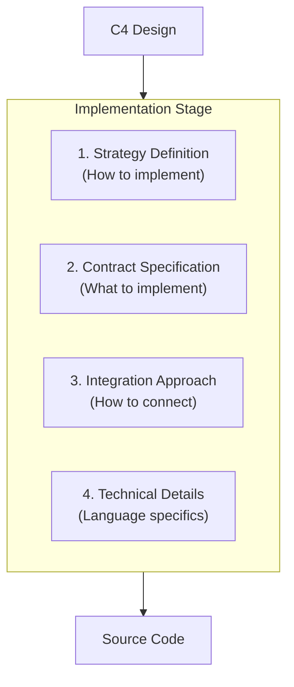

# Implementation Specification Generation Prompt

## Implementation Stage Definition

The Implementation Stage transforms C4 design models into language-specific implementation specifications:

### Core Requirements

1. **Strategy Specification**
   - How to implement each design element in the target language
   - Language-specific patterns and idioms to use
   - State management approaches in the language
   - Error handling patterns for the language

2. **Contract Definition**
   - Language-specific interface definitions
   - Data structure specifications for the language
   - Type system usage and constraints
   - Runtime behavior requirements

3. **Integration Approach**
   - How to use language-specific frameworks (e.g., qicore-v4)
   - Module interaction patterns in the language
   - Plugin/extension mechanisms for the language
   - Inter-module communication methods

4. **Technical Requirements**
   - Language-specific type system usage
   - Concurrency/async patterns in the language
   - Memory/resource management needs
   - Testing approaches for the language

### Process Flow


### Key Outputs
1. Implementation strategy for each module
2. Language-specific contracts and interfaces
3. Integration patterns and approaches
4. Technical implementation requirements

## Purpose

This prompt guides the transformation of C4 design documents into detailed implementation specifications. These specifications serve as the bridge between design and code, defining HOW the design should be implemented without writing the actual code.

## Input Requirements

### Primary Input
- **Source**: `docs/design/*.md` files
  - `context.phase.1.md`: System boundaries and interfaces
  - `container.phase.1.md`: Major system containers
  - `component.phase.1.md`: Internal components
  - `classes.phase.1.md`: Implementation classes

### Context Requirements
- **Target Language**: Specified (Python, TypeScript, etc.)
- **Framework Context**: qicore-v4 wrappers and patterns
- **Package Context**: `qicore-v4/docs/build/package/[language].md`
- **Architecture Context**: `docs/architecture/` for alignment

## Output Specification

### Implementation Structure
```
docs/impl/
└── [language]/                # Language-specific implementation specs
    │
    ├── # Interface Layer (from C4: MCPProtocolClasses)
    ├── interface/
    │   ├── cli.md           # CLI Interface Strategy
    │   └── mcp.md          # MCP Protocol Strategy
    │
    ├── # Core Plugin System (from C4: PluginSystemClasses)
    ├── plugin/
    │   ├── registry.md     # PluginRegistry Class
    │   └── orchestrator.md # CompositionEngine Class
    │
    ├── # Functional Processing (from C4: FunctionalProcessingClasses)
    ├── context/
    │   ├── engine.md       # FunctionalContextEngine Class
    │   ├── adapters.md     # ContextAdapter Interface
    │   └── models.md       # Context Class
    │
    ├── tool/
    │   ├── registry.md     # FunctionalToolRegistry Class
    │   ├── adapters.md     # ToolAdapter Interface
    │   └── models.md       # Tool Class
    │
    ├── session/
    │   ├── manager.md      # EventSourcedSession Class
    │   ├── events.md       # SessionEvent Class
    │   └── models.md       # Session Models
    │
    ├── llm/
    │   ├── interface.md    # LLMInterface Class
    │   ├── providers.md    # LLMProvider Interface
    │   └── models.md       # LLM Models
    │
    ├── # Storage Layer (from C4: StorageClasses)
    ├── storage/
    │   ├── events.md       # EventStore Class
    │   ├── context.md      # ContextCache Class
    │   └── plugins.md      # PluginStore Class
    │
    └── # Shared Infrastructure (from C4: SharedClasses)
        ├── config.md       # Configuration Classes
        └── models.md       # Shared Data Models
```

### Required Module Specifications

Each module specification must define:

1. **Core Strategy**
   - State management approach
   - Data flow patterns
   - Integration methods
   - Extension mechanisms

2. **Data Contracts**
   - Interface requirements
   - Data structure specifications
   - State invariants
   - Type constraints

3. **Integration Patterns**
   - qicore-v4 wrapper usage
   - Inter-module communication
   - Plugin extension points
   - Error handling strategy

4. **Implementation Requirements**
   - Type safety needs
   - Async/sync patterns
   - Error recovery
   - Testing approach

### Required File Structure

```markdown
# [Module Name] Implementation Strategy

> **Design Sources**:  
> - C4 Class: [Link to classes.phase.1.md section]
> - Component: [Link to component.phase.1.md section]
> - Container: [Link to container.phase.1.md section]
> - Context: [Link to context.phase.1.md section]
> **Language**: [Implementation Language]
> **qicore-v4 Integration**: [Integration Strategy]

## Core Strategy
[How the module should be implemented]
- State management approach
- Key algorithms and patterns
- Data flow design
- Extension mechanisms

## Data Contracts
[Interface and data specifications]
```python
# Key Characteristics:
- Required properties
- Method signatures
- Type constraints
- Invariants
```

## Integration Patterns
[How to integrate with other modules]
- qicore-v4 usage strategy
- Inter-module communication
- Plugin points
- Error handling

## Extension Points
[Future phase integration]
- Phase 2 extensions
- Phase 3 capabilities
- Phase 4 requirements

## Implementation Requirements
[Technical requirements]
- Type safety
- Async/sync needs
- Error handling
- Testing strategy
```

## Transformation Process

### Step 1: Design Analysis
1. Extract from design:
   - Core patterns to implement
   - Required interfaces
   - State management needs
   - Extension points

### Step 2: Strategy Definition
1. Define for each module:
   - State management approach
   - Data flow patterns
   - Integration methods
   - Extension mechanisms

### Step 3: Contract Specification
1. Specify for each module:
   - Interface requirements
   - Data structures
   - Type constraints
   - State invariants

### Step 4: Requirement Definition
1. Define technical needs:
   - Type safety requirements
   - Async/sync patterns
   - Error handling strategy
   - Testing approach

## Quality Criteria

### Strategy Completeness
- ✅ Clear state management approach
- ✅ Defined data flow patterns
- ✅ Specified integration methods
- ✅ Documented extension points

### Contract Clarity
- ✅ Complete interface specifications
- ✅ Clear data structure requirements
- ✅ Defined type constraints
- ✅ Listed state invariants

### Implementation Guidance
- ✅ Clear technical requirements
- ✅ Specified patterns to use
- ✅ Error handling strategy
- ✅ Testing approach defined

## Example Specification

**Input Design**:
```markdown
### Plugin Registry System
**Interface Contract**:
- PluginRegistry: register_plugin(plugin: Plugin) → ValidationResult
```

**Output Specification**:
```markdown
## Core Strategy

### State Management
- Use immutable data structures
- Return new state on changes
- Maintain state history
- Use structural sharing

### Plugin Lifecycle
1. Registration Process
   - Validate first
   - Generate unique ID
   - Create metadata
   - Update mappings
   - Return new state

## Data Contracts

### Plugin Interface
```python
# Key Characteristics:
- Unique identification
- Version tracking
- Interface declaration
- Validation capability
```

[... continue with other sections ...]
```

This transforms design specifications into implementation strategies and contracts, ready for code generation. 