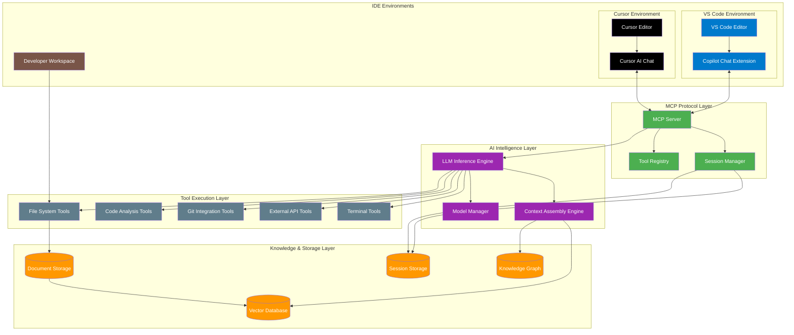
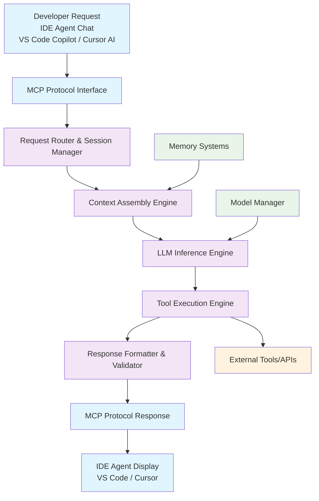
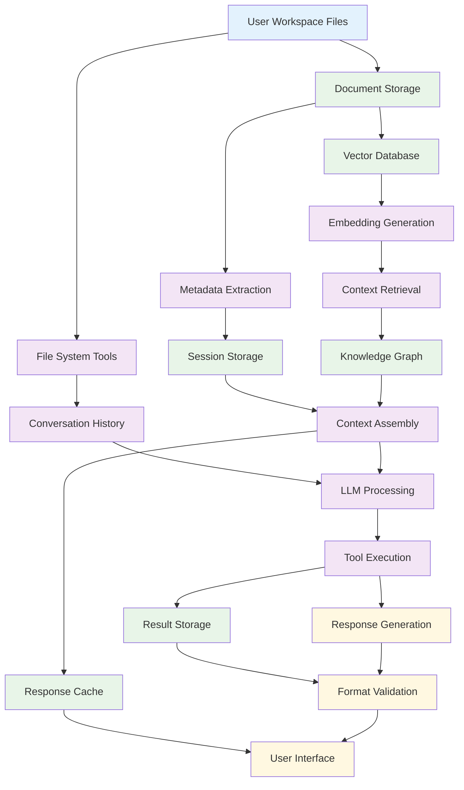
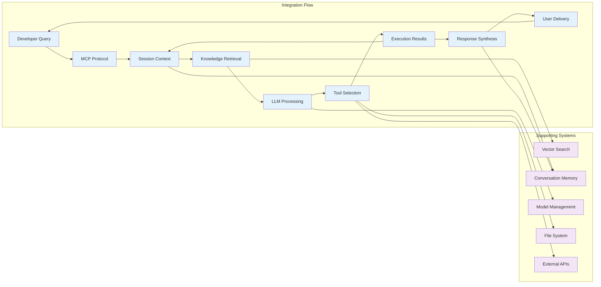
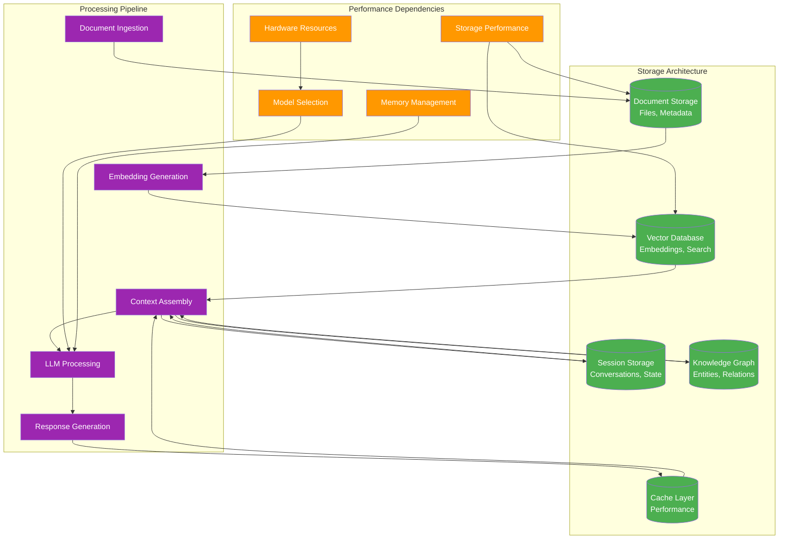

# qi/python/server - Phase 1 Objectives

> Local LLM Application with MCP-Enhanced Context Continuation  
> Version: Phase 1.1  
> Date: June 17, 2025  
> Status: Foundation Development Phase  
> Purpose: Context-aware LLM application with agent-like capabilities through tool integration

## Phase 1 Scope

**Focus**: Local LLM infrastructure with MCP integration for IDE Agent Applications (VS Code Copilot Chat & Cursor AI Chat)

**Architecture Context**: This phase implements the core components described in:
- [MCP Integration Strategy](../architecture/mcp-integration-strategy.md) - Section 2.1: Local MCP Server Foundation
- [sAgent Architecture](../architecture/sagent-architecture.md) - Section 1: Local LLM Infrastructure
- [Development Environment](../architecture/development-environment.md) - Section 3: Python Server Setup

## Fundamental Objectives

**Primary Goal**: Transform a basic local LLM into a context-aware, tool-enabled development assistant that maintains conversation continuity and exhibits agent-like behaviors without explicit agent architecture.

**Secondary Goal**: Achieve sophisticated AI assistance through MCP tool integration across multiple IDE environments (VS Code, Cursor) and local CLI applications, enabling rich developer interactions while maintaining architectural simplicity.

## Core Objectives

### Objective 1: Context-Enhanced Local LLM Application

**Purpose**: Build a local LLM application with robust context continuation through MCP-provided capabilities that maintain conversation coherence and user context across interactions.

**Behavior**:
- **Synchronous Response Generation**: Real-time LLM inference with context assembly
- **Persistent Context Management**: Cross-session conversation and workspace state retention
- **Tool-Enhanced Context**: Dynamic context enrichment through MCP tool integration
- **Memory-Aware Processing**: Historical interaction patterns inform current responses
**Required Capabilities**:

**Context Continuation Operations**:
- `assembleContext(userQuery, sessionHistory, workspaceState)` - Gather relevant context from multiple sources for LLM processing
- `persistConversation(interaction, metadata, toolUsage)` - Store interaction data for future context retrieval
- `retrieveRelevantHistory(currentQuery, sessionId, maxTokens)` - Fetch pertinent past interactions within token limits
- `manageContextWindow(assembledContext, modelLimits)` - Optimize context to fit within model constraints while preserving relevance
- `crossSessionContinuity(userId, newSessionQuery)` - Maintain user context across different conversation sessions

**Tool Integration Operations**:
- `registerMCPTools(toolDefinitions)` - Register available tools with the MCP server for LLM access
- `executeToolCall(toolName, parameters, contextMetadata)` - Execute tools requested by LLM with proper error handling
- `integrateToolResults(toolOutput, conversationContext)` - Incorporate tool results back into conversation flow
- `trackToolUsage(toolName, parameters, results, timestamp)` - Maintain history of tool usage for pattern recognition
- `coordinateToolChain(toolSequence, sharedContext)` - Enable tools to share context and build upon each other's results

**Model Management Operations**:
- `loadModel(modelIdentifier, hardwareConstraints)` - Initialize local LLM with hardware-appropriate configuration
- `switchModel(newModelId, preserveContext)` - Change active model while maintaining conversation continuity
- `monitorModelPerformance(metrics, thresholds)` - Track model performance and resource usage
- `optimizeInference(contextSize, responseRequirements)` - Adjust inference parameters for optimal performance
- `manageModelResources(memoryLimits, concurrentRequests)` - Handle resource allocation for model operations

**Input/Output Contracts**:
- **assembleContext**: Takes user query (string), session history (array), workspace state (object), returns assembled context (object)
- **persistConversation**: Takes interaction data (object), metadata (object), tool usage (array), returns success confirmation (boolean)
- **retrieveRelevantHistory**: Takes current query (string), session ID (string), token limits (number), returns relevant history (array)
- **manageContextWindow**: Takes assembled context (object), model limits (object), returns optimized context (object)
- **crossSessionContinuity**: Takes user ID (string), new query (string), returns continuation context (object)

**Error Conditions**:
- **CONTEXT_ASSEMBLY_FAILED**: Unable to gather required context from available sources
- **PERSISTENCE_ERROR**: Context storage operation failed due to storage system issues
- **RETRIEVAL_TIMEOUT**: Context retrieval exceeded maximum allowed time
- **CONTEXT_OVERFLOW**: Assembled context exceeds model token limits and cannot be optimized
- **TOOL_EXECUTION_FAILED**: MCP tool call failed during context enhancement
- **MODEL_UNAVAILABLE**: Requested LLM model cannot be loaded or accessed
- **MEMORY_EXHAUSTED**: Insufficient system resources for context management operations
- **SESSION_CORRUPTION**: Session data is corrupted and cannot be used for context continuation

**Side Effects**:
- **File System Access**: Reads workspace files for context assembly
- **Database Operations**: Stores and retrieves conversation history and user preferences
- **Model I/O**: Loads and executes local language models
- **Memory Usage**: Maintains context caches and conversation state in memory

**Performance Guarantees**:
- **Context Assembly**: < 500ms for typical workspace contexts
- **Context Retrieval**: < 200ms for session history lookup
- **Model Loading**: < 30 seconds for models up to 70B parameters
- **Tool Integration**: < 100ms overhead per tool call
- **Memory Usage**: < 2GB RAM for basic context management operations

### Objective 2: IDE Agent Applications Through Tool Ecosystem

**Purpose**: Enable agent-like behavior across multiple IDE environments without explicitly building agent architecture—leveraging MCP's tool ecosystem to give IDE-integrated LLMs expanded capabilities that simulate sophisticated agent functionality.

**Architecture Reference**: Implements the "IDE Integration" and "Tool Ecosystem" components from [MCP Integration Strategy](../architecture/mcp-integration-strategy.md) Section 3.2.

#### Sub-Objective 2A: VS Code Copilot Chat Integration

**Purpose**: Enhance GitHub Copilot Chat with MCP tool orchestration for complex development workflows.

**Required Capabilities**:
- **VS Code Integration Through MCP**
  - MCP server registration with VS Code Copilot Chat extension
  - Real-time bidirectional communication with GitHub's Copilot LLM service
  - Tool call execution and response handling
  - Error propagation and user feedback through VS Code interface
  - Configuration management through VS Code settings and workspace configuration

- **Copilot-Specific Tool Orchestration**
  - Tool recommendations that complement Copilot's code generation capabilities
  - Context enhancement for Copilot's existing code understanding
  - Workflow automation that builds upon Copilot's suggestions
  - Integration with VS Code's existing developer workflow and extensions

#### Sub-Objective 2B: Cursor AI Chat Integration  

**Purpose**: Enhance Cursor's native AI chat with MCP tool orchestration for advanced development assistance.

**Required Capabilities**:
- **Cursor Integration Through MCP**
  - MCP server registration with Cursor's AI chat system
  - Real-time bidirectional communication with Cursor's LLM service
  - Tool call execution and response handling within Cursor's interface
  - Error propagation and user feedback through Cursor's native UI
  - Configuration management through Cursor's settings and project configuration

- **Cursor-Specific Tool Orchestration**
  - Tool integration that leverages Cursor's advanced code understanding
  - Context enhancement for Cursor's multi-file editing capabilities
  - Workflow automation that complements Cursor's AI-first development approach
  - Integration with Cursor's composer and chat interfaces

#### Shared Tool Ecosystem for Agent-Like Behavior

**Common Tool Categories**:
- **File System Access and Manipulation**: Read project files, understand codebase structure, make informed suggestions based on actual code content
- **Code Analysis and Understanding**: Syntax analysis, dependency tracking, code quality insights to inform development recommendations  
- **Git Integration and Version Control**: Understand project history, track changes, suggest version control best practices
- **Terminal Command Execution**: Run development commands, check system status, perform operational tasks
- **External API Integration**: Expand LLM knowledge beyond training data with real-time information and service integration
- **Web Search and Information Retrieval**: Supplement responses with current documentation, tutorials, community knowledge

**Context-Rich Tool Integration**:
- Tools provide context back to IDE LLMs for continuation by returning not just results but metadata about operations, related files, and potential next steps
- Tool results become part of conversation history, allowing future interactions to reference previous tool usage and build upon established workflows
- Cross-tool context sharing and correlation enables IDE LLMs to use insights from one tool to inform usage of other tools
- Tool execution history and pattern recognition allows systems to learn user preferences and suggest increasingly relevant tool usage
- Workspace-aware tool behavior ensures tool operations are contextually appropriate for current project and development environment

## System Architecture and Data Flow

### System Overview
The Phase 1 system is fundamentally a local LLM application with enhanced context continuation capabilities, delivered through the Model Context Protocol (MCP). All system features—document processing, knowledge management, file operations, and external integrations—serve the primary purpose of providing rich, persistent context to the LLM for improved conversation continuity.

**Objective 1**: Build a local LLM application with robust context continuation through MCP-provided capabilities. These capabilities include:
- **Document Access Tools**: Retrieve and analyze files, codebases, and documentation to provide relevant context for current conversations
- **Knowledge Base Integration**: Search through embeddings and knowledge graphs to find related information from past interactions and stored knowledge
- **Session Memory Management**: Persist conversation history, user preferences, and interaction patterns across sessions
- **Workspace Awareness Tools**: Understand project structure, file relationships, and development context to provide contextually appropriate responses
- **External Data Integration**: Access APIs, databases, and external services to enrich responses with current and relevant information

**How These Aid Context Continuation**: Each capability feeds contextual information back into the LLM's processing, enabling responses that build upon previous conversations, understand the user's specific environment, and maintain coherent long-term interactions rather than treating each request in isolation.

**Objective 2**: Enable agent-like behavior across multiple IDE environments without explicitly building agent architecture—leveraging MCP's tool ecosystem to give IDE-integrated LLMs expanded capabilities. These capabilities include:
- **Development Tool Integration**: Access to file operations, code analysis, debugging tools, and testing frameworks through MCP tools
- **Workflow Automation Tools**: Execute multi-step development tasks by chaining tool calls within IDE LLM responses
- **Real-time Information Access**: Web search, API calls, and live data retrieval to supplement IDE LLM knowledge with current information
- **Cross-Tool Coordination**: Use results from one tool to inform the parameters and usage of other tools within the same interaction
- **Environment Manipulation**: Modify files, run commands, manage git operations, and interact with the development environment

**How These Simulate Agent Behavior**: Rather than building explicit planning and execution loops, IDE LLMs (Copilot, Cursor) use MCP tools reactively within their response generation, creating sophisticated behaviors that appear agent-like but are actually enhanced context continuation with tool access.

**MCP's Role**: MCP serves as the universal interface that allows the LLM to access tools, data, and external systems for context enhancement. Rather than building complex agent orchestration, we use MCP to provide the LLM with a rich toolkit that enables sophisticated responses through context continuation rather than multi-step planning. Specifically:
- **Tool Discovery and Registration**: MCP allows the LLM to discover available tools and understand their capabilities for context gathering
- **Standardized Tool Interface**: Consistent tool calling mechanism allows the LLM to access diverse capabilities (file system, databases, APIs, external services) through a unified protocol
- **Context Injection Pipeline**: Tool results are automatically integrated back into the LLM's context window for immediate use in response generation
- **Session State Management**: MCP handles the persistence of tool usage history and results, contributing to long-term context continuity
- **Real-time Capability Expansion**: New tools can be added to the MCP server without modifying the LLM, expanding context capabilities dynamically



### Logical Flow Architecture

```
Developer Request (VS Code Copilot Chat / Cursor AI Chat)
    ↓
[MCP Protocol Interface]
    ↓
[Request Router & Session Manager]
    ↓
[Context Assembly Engine] ← [Memory Systems]
    ↓                        ↑
[LLM Inference Engine] ← [Model Manager]
    ↓                        ↑
[Tool Execution Engine] → [External Tools/APIs]
    ↓
[Response Formatter & Validator]
    ↓
[MCP Protocol Response]
    ↓
IDE Agent Display (VS Code / Cursor)
```



**Logical Flow Explanation**:
1. **Request Ingestion**: Developer requests arrive via IDE agent chats (VS Code Copilot Chat, Cursor AI Chat) through MCP protocol
2. **Context Enhancement**: System retrieves relevant context from conversation history, workspace state, and knowledge bases
3. **LLM Processing with Rich Context**: IDE LLMs (GitHub Copilot, Cursor AI) process requests with assembled context to generate responses
4. **Tool Access for Context Continuation**: IDE LLMs use MCP tools to gather additional context or perform actions, with results feeding back into the conversation
5. **Response with Enhanced Context**: Final response incorporates all gathered context and tool results
6. **Context Persistence**: All interactions, tool usage, and results are stored for future context continuation across IDE environments

### Data Flow Architecture

```
[User Workspace Files] → [Document Storage] → [Vector Database]
         ↓                        ↓                    ↓
[File System Tools] → [Metadata Extraction] → [Embedding Generation]
         ↓                        ↓                    ↓
[Conversation History] → [Session Storage] → [Context Retrieval]
         ↓                        ↓                    ↓
[LLM Processing] ← [Context Assembly] ← [Knowledge Graph]
         ↓                        ↓                    ↓
[Tool Execution] → [Result Storage] → [Response Cache]
         ↓                        ↓                    ↓
[Response Generation] → [Format Validation] → [User Interface]
```



**Data Flow Explanation**:
1. **Context Ingestion**: Developer files, conversations, and workspace data are ingested and stored
2. **Context Enhancement**: Documents are processed, embedded, and indexed to enhance future context retrieval
3. **Context Assembly**: Relevant information is retrieved and assembled for LLM context continuation
4. **LLM Processing with Tools**: LLM processes context and uses MCP tools to gather additional information or perform actions
5. **Context Enrichment**: Tool results and interactions become part of the ongoing context
6. **Context Persistence**: All context, interactions, and results are stored for future conversation continuation

### Integration Points and Why They Work Together



**1. MCP Protocol as Universal Context Enhancement Interface**
- **Purpose**: Provides standardized tool access for IDE LLM context continuation across multiple environments
- **Integration**: Enables IDE LLMs to access rich data sources and capabilities for enhanced responses
- **Data Flow**: Tools feed context back into IDE LLM conversation history
- **Why Essential**: Transforms basic IDE LLMs into context-aware systems without complex agent architecture

**2. Local LLM + Tool Ecosystem for Agent-Like Behavior**
- **Purpose**: Achieves sophisticated behavior through tool access rather than explicit agent planning
- **Integration**: Local LLM calls tools through MCP to gather context and perform actions
- **Data Flow**: Tool results become part of conversation context for future reference
- **Why Essential**: Provides agent-like capabilities while maintaining simple LLM-centric architecture

**3. IDE Agent Integration + Tool Orchestration**
- **Purpose**: Enables sophisticated development workflows across multiple IDE environments
- **Integration**: VS Code Copilot and Cursor AI both use MCP tools for enhanced capabilities
- **Data Flow**: Tool execution results enhance IDE LLM responses and inform future interactions
- **Why Essential**: Provides consistent agent-like behavior across different development environments

**4. Context Continuation + Tool Memory**
- **Purpose**: Maintains sophisticated conversation state across interactions and IDE environments
- **Integration**: Tool usage history and results become part of persistent context shared across IDEs
- **Data Flow**: Past tool interactions inform future tool selection and usage regardless of IDE
- **Why Essential**: Enables learning and improvement of responses over time with cross-IDE continuity

**5. Knowledge Management for Context Enhancement**
- **Purpose**: Provides rich context sources for both local and IDE LLM responses
- **Integration**: Vector search and knowledge graphs feed relevant information to all LLM types
- **Data Flow**: Retrieved knowledge becomes part of LLM context window across environments
- **Why Essential**: Enables intelligent responses based on accumulated knowledge rather than just current conversation

**6. Multi-IDE Integration as Natural Interface**
- **Purpose**: Provides seamless developer experience across preferred development environments
- **Integration**: MCP makes rich capabilities available through familiar chat interfaces in both VS Code and Cursor
- **Data Flow**: Workspace context flows naturally into IDE LLM conversations regardless of environment
- **Why Essential**: Reduces friction for developers by supporting their preferred tools while providing consistent AI assistance

### Critical System Dependencies



**Dependency Chain Analysis**:
1. **Hardware → Model Selection**: GPU availability determines which models can run effectively
2. **Model Capabilities → Feature Availability**: Model size/quality limits system intelligence
3. **Storage Performance → Response Time**: Fast storage enables real-time context retrieval
4. **Memory Management → Concurrent Users**: Efficient memory use determines scalability
5. **Network Integration → External Capabilities**: API access expands system capabilities beyond local resources

**Failure Mode Considerations**:
- **LLM Failure**: System degrades to basic tool execution without intelligent reasoning
- **Storage Failure**: System loses conversation continuity but maintains basic functionality
- **MCP Failure**: System becomes inaccessible from VS Code but core engine remains functional
- **Tool Failure**: Specific capabilities become unavailable but core conversation continues

## Feature Requirements (Comprehensive)

### Text Processing & Generation
- **Document Understanding**
  - Multi-format document parsing (PDF, DOCX, TXT, MD, HTML)
  - Content extraction and structure analysis
  - Metadata extraction and indexing
  - Document similarity and comparison
  - Text summarization and key point extraction

- **Content Generation**
  - Code generation across multiple languages
  - Documentation generation and maintenance
  - Template-based content creation
  - Creative writing and brainstorming

### Knowledge Management
**Architecture Reference**: Implements "Knowledge Layer" from [sAgent Architecture](../architecture/sagent-architecture.md) Section 2.3.

- **Vector Database Integration**
  - Document embedding and storage
  - Semantic search capabilities
  - Similarity matching and ranking
  - Knowledge graph construction
  - Contextual retrieval and augmentation

- **Information Retrieval**
  - Web search and content extraction
  - API integration and data fetching
  - Database querying and data analysis
  - Real-time information access
  - Multi-source data aggregation

### Workflow Automation
- **Task Orchestration**
  - Multi-step workflow execution
  - Conditional logic and branching
  - Error handling and retry mechanisms
  - Progress tracking and reporting
  - Workflow templates and reusability

- **Data Storage & Persistence**
  - Document storage and indexing
  - Metadata management and search
  - Version control and history tracking
  - Backup and recovery capabilities
  - Multi-format file support (PDF, DOCX, images, etc.)

- **Vector Database Operations**
  - Embedding generation and storage
  - Similarity search and ranking
  - Collection management and organization
  - Index optimization and maintenance
  - Bulk operations and batch processing

- **Session & State Management**
  - User session persistence
  - Conversation history storage
  - Application state backup/restore
  - Configuration management
  - Cache management and optimization

### Data Processing
- **Structured Data Handling**
  - CSV/JSON/XML processing
  - Database operations (CRUD)
  - Data transformation and cleaning
  - Statistical analysis and reporting
  - Data visualization preparation

- **Unstructured Data Processing**
  - Image analysis and OCR
  - Audio/video content processing
  - Natural language understanding
  - Entity extraction and classification
  - Sentiment analysis and emotion detection

### Memory & Context Management
**Architecture Reference**: Implements "Memory Management" from [sAgent Architecture](../architecture/sagent-architecture.md) Section 2.4.

- **Conversation Memory**
  - Long-term conversation history
  - Context window management
  - Memory compression and summarization
  - Selective memory retrieval
  - Cross-session continuity

- **Knowledge Storage**
  - Custom knowledge base creation
  - Fact storage and retrieval
  - Knowledge graph persistence
  - User preference storage
  - Personalization data management

### Integration Capabilities
**Architecture Reference**: Implements "External Integration Layer" from [MCP Integration Strategy](../architecture/mcp-integration-strategy.md) Section 4.

- **External Services**
  - REST API integration
  - Webhook handling and triggers
  - Authentication and authorization
  - Rate limiting and quota management
  - Service discovery and monitoring

- **Development Tools**
  - IDE integration (VS Code Copilot Chat, Cursor AI Chat)
  - Version control system integration
  - CI/CD pipeline integration
  - Package manager integration
  - Testing framework integration

### Advanced Features
- **Code Understanding**
  - Static code analysis
  - Dependency graph construction
  - Code refactoring suggestions
  - Bug detection and fixing
  - Performance optimization recommendations

- **Content Analysis**
  - Plagiarism detection
  - Content quality assessment
  - Bias detection and mitigation
  - Fact checking and verification
  - Source attribution and citation

## Technical Requirements

### Data Storage Requirements
**Architecture Reference**: Implements "Data Layer" from [sAgent Architecture](../architecture/sagent-architecture.md) Section 2.2.

- **Document Storage**
  - Support for 10GB+ document collections
  - Multi-format file handling (PDF, DOCX, TXT, MD, HTML, images)
  - Efficient storage with deduplication
  - Fast retrieval and search capabilities
  - Metadata indexing and tagging

- **Vector Database**
  - Store 1M+ document embeddings
  - Sub-second similarity search
  - Multiple embedding models support
  - Collection segmentation and organization
  - Persistent storage with backup/restore

- **Session Storage**
  - Conversation history for 1000+ users
  - Application state persistence
  - Configuration and preference storage
  - Cache management (memory + disk)
  - Log storage and rotation

- **Knowledge Graph Storage**
  - Entity and relationship storage
  - Graph traversal and querying
  - Schema evolution support
  - Import/export capabilities
  - Version control for knowledge updates

### Performance Standards
**Architecture Reference**: Performance targets from [Strategic Roadmap](../architecture/strategic-roadmap.md) Section 2.

- **Response Time**: <2 seconds for typical queries
- **Throughput**: Handle 100+ concurrent requests
- **Memory Usage**: <4GB RAM for base operation
- **GPU Utilization**: >80% when GPU available
- **Uptime**: 99.9% availability during development

### Scalability Requirements
- **Model Support**: 1B to 70B parameter models
- **Concurrent Users**: Support 50+ simultaneous users
- **Data Processing**: Handle GB-scale document collections
- **Storage Operations**: <100ms for typical read/write operations
- **Vector Search**: <500ms for similarity queries across 1M+ embeddings
- **Session Management**: Maintain 1000+ active sessions
- **Resource Management**: Dynamic resource allocation

### Quality Standards
- **Accuracy**: >95% for factual queries
- **Consistency**: Reproducible results with same inputs
- **Reliability**: Graceful degradation under load
- **Data Integrity**: Zero data loss with proper backup/recovery
- **Security**: Secure handling of sensitive data and user information
- **Observability**: Comprehensive logging and monitoring

## Success Criteria

### Functional Validation
- [ ] Successfully load and serve 5+ different LLM models
- [ ] Complete MCP protocol compliance validation
- [ ] VS Code Copilot Chat integration working end-to-end
- [ ] Cursor AI Chat integration working end-to-end
- [ ] All core features demonstrable with test cases
- [ ] Performance benchmarks met under typical usage

### Integration Testing
- [ ] Real-world development workflow completion
- [ ] Multi-user concurrent usage validation
- [ ] Error handling and recovery verification
- [ ] Resource management under load testing
- [ ] Security and data privacy compliance

### User Experience
- [ ] Setup time <10 minutes from fresh installation
- [ ] Intuitive VS Code Copilot Chat integration experience
- [ ] Intuitive Cursor AI Chat integration experience
- [ ] Clear error messages and debugging information
- [ ] Comprehensive documentation and examples
- [ ] Developer satisfaction >4.5/5 in testing across both IDE environments

---

**Phase 1 Success Definition**: A developer can install the system, connect it to either VS Code Copilot Chat or Cursor AI Chat (or both), and immediately access all specified capabilities through natural language interaction, with performance meeting the defined standards across both IDE environments.

**Next Phase Preview**: Phase 2 will focus on multi-agent coordination, advanced reasoning capabilities, and enterprise-grade deployment features as outlined in [Strategic Roadmap](../architecture/strategic-roadmap.md) Section 3.
