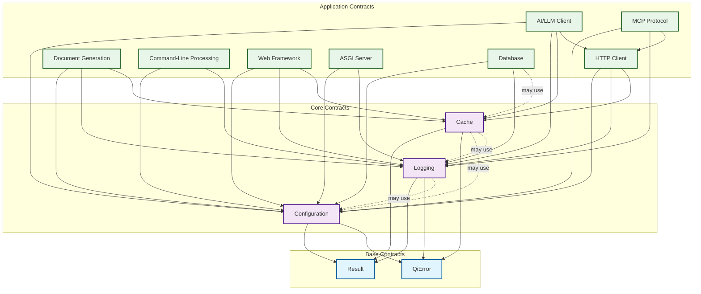

# QiCore v4.0 Class-Level Contracts

> **Stage 0: Problem Definition**  
> **Depends on**: User requirements and domain analysis  
> **Implements**: Language-agnostic behavioral contracts and specifications  
> Version: v4.0  
> Date: June 19, 2025  
> Status: Foundation Design Phase  
> Purpose: Class-level behavioral contracts for composable library functions

## Universal Interface Philosophy

This document defines **language-independent behavioral contracts** for all QiCore v4.0 library functions. These specifications are:

- **Language Agnostic**: No language-specific syntax or types
- **Behavioral Focus**: What functions do, not how they're implemented  
- **Implementation Neutral**: Can be adapted to any programming language
- **Contract Complete**: All inputs, outputs, errors, and side effects specified
- **Library-First**: Pure functions with no lifecycle management

These contracts serve as the definitive specification for implementing QiCore v4.0 in any programming language (TypeScript, Python, Haskell, etc.).

### Type Parameter Conventions

Throughout this document, the following type parameter conventions are used:
- **T**: Primary data type for success values in Result<T>
- **U**: Transformed type in mapping operations
- **unknown**: Values of indeterminate type requiring runtime validation
- **object**: Structured data with key-value properties (language-agnostic)
- **function**: Callable operation with specified signature
- **bytes**: Binary data (implementation varies by language)

## Contract Specification Format

Each interface contract includes:

- **Purpose**: What the interface accomplishes and why it exists
- **Behavior**: Synchronous/asynchronous nature, functional properties
- **Required Operations**: Function signatures and their responsibilities  
- **Input/Output Contracts**: Parameter contracts, return value specifications
- **Error Conditions**: All possible error states and their meanings
- **Side Effects**: External interactions, I/O operations
- **Performance**: Complexity guarantees, resource requirements
- **Usage Patterns**: How the interface is intended to be used
- **Examples**: Concrete usage examples demonstrating the contract

---

## Contract Relationships and Dependencies

### Dependency Hierarchy

The contracts form a layered dependency structure where higher-level contracts depend on lower-level ones:



### Base Contract Usage

**Result<T> Contract** is used by ALL other contracts:
- **Return Type**: All operations that can fail return `Result<T>`
- **Error Propagation**: Enables functional composition across all contracts
- **Consistency**: Provides uniform error handling pattern

**QiError Contract** is used by ALL other contracts:
- **Error Representation**: Standard error format for all failures
- **Context Preservation**: Maintains debugging information
- **Error Chaining**: Supports nested error causes

---

## Universal Base Contracts

### Result<T> Contract

**Purpose**: Provides a type-safe way to handle operations that can succeed or fail, eliminating exceptions in normal control flow while enabling functional composition.

**Behavior**: 
- **Synchronous**: Immutable value object representing operation outcome
- **Thread-Safe**: All properties are readonly, safe for concurrent access
- **Functional**: Supports functional composition through transformation methods
- **No Lifecycle**: Pure value objects with no resource management

**Required Properties**:
- `isSuccess: boolean` - True if operation succeeded, false if failed
- `data: T | null` - Contains result data on success, null on failure  
- `error: QiError | null` - Contains error details on failure, null on success

**Required Operations**:
- `map(transformFunction)` - Transform success value, pass through failures unchanged
- `flatMap(chainFunction)` - Chain operations that return Results
- `unwrap()` - Return data if success, throw error if failure
- `unwrapOr(defaultValue)` - Return data if success, default value if failure
- `match(onSuccess, onError)` - Pattern matching for handling both success and failure cases
- `orElse(alternativeFunction)` - Provide alternative Result if this one failed

**Input/Output Contracts**:
- **map(fn)**: Takes transformation function `(T) -> U`, returns `Result<U>`
- **flatMap(fn)**: Takes chain function `(T) -> Result<U>`, returns `Result<U>`  
- **unwrap()**: Returns `T` on success, throws `QiError` on failure
- **unwrapOr(defaultValue)**: Takes default value `T`, returns `T` (never fails)
- **match(onSuccess, onError)**: Takes two functions, returns result of called function
- **orElse(fn)**: Takes function `(QiError) -> Result<T>`, returns `Result<T>`

**Error Conditions**:
- **Invariant Violation**: Exactly one of `data` or `error` must be non-null
- **unwrap() on Failure**: Must throw the contained QiError when called on failed Result
- **Invalid Function Arguments**: map/flatMap functions must not be null

**Side Effects**: None - Results are immutable value objects

**Performance**: 
- **Complexity**: O(1) for all operations
- **Object Creation**: Language-specific targets:
  - Native compiled (Rust, C++): < 1 microsecond
  - VM-based (Go, Java): < 10 microseconds
  - Interpreted (Python, JavaScript): < 100 microseconds
  - Functional (Haskell): < 50 microseconds
- **Method Calls**: Proportionally scaled per language tier
*Note: Performance targets are implementation goals and may vary by language runtime and hardware*

**Factory Operations**:
- `success(data)` - Create successful result
- `failure(error)` - Create failed result  
- `fromTryCatch(function)` - Wrap function call in try-catch, return Result

**Examples**:

```typescript
// Creating Results
const successResult = Result.success(42);
const failureResult = Result.failure(
  new QiError("NOT_FOUND", "User not found", ErrorCategory.VALIDATION)
);

// Transforming success values
const doubled = successResult.map(x => x * 2); // Result<84>
const tripled = doubled.map(x => x * 1.5); // Result<126>

// Chaining operations
const userResult = getUserById(123) // Result<User>
  .flatMap(user => updateUser(user)) // Result<User>
  .map(user => user.email); // Result<string>

// Error recovery
const valueWithFallback = failureResult
  .orElse(error => Result.success(0)) // Provide fallback
  .unwrap(); // 0

// Pattern matching
const message = userResult.match(
  email => `User email: ${email}`,
  error => `Error: ${error.message}`
);
```

---

### QiError Contract

**Purpose**: Standardized error representation across all QiCore library functions with rich context and debugging information for cross-language compatibility.

**Behavior**:
- **Immutable**: All properties are readonly after construction
- **Serializable**: Can be converted to/from structured data for logging and transmission
- **Chainable**: Supports error cause chains for debugging complex failures
- **Language-Neutral**: No language-specific error types or stack traces

**Required Properties**:
- `code: string` - Unique error identifier (e.g., "CONFIG_NOT_FOUND", "NETWORK_TIMEOUT")
- `message: string` - Human-readable error description
- `category: ErrorCategory` - Error classification for handling ("VALIDATION", "NETWORK", etc.)
- `context: object | null` - Additional error context as key-value structure (file paths, request IDs, etc.)
- `cause: QiError | null` - Underlying error that caused this error (for error chaining)
- `timestamp: number` - When the error occurred (epoch milliseconds)

**Required Operations**:
- `toString()` - Return formatted error string for display
- `toStructuredData()` - Return serializable structure for logging/transmission
- `getCategory()` - Return error category for programmatic handling
- `withContext(additionalContext)` - Create new error with merged context
- `withCause(causeError)` - Create new error with cause chain

**Input/Output Contracts**:
- **toString()**: Returns string representation suitable for user display
- **toStructuredData()**: Returns structured object/map containing all error information
- **getCategory()**: Returns ErrorCategory enum value
- **withContext(context)**: Takes object, returns new QiError with merged context
- **withCause(error)**: Takes QiError, returns new QiError with cause chain

**Error Conditions**: 
- **Invalid Code**: Code must be non-empty string
- **Invalid Category**: Category must be valid ErrorCategory value
- **Circular Cause Chain**: Cause chain must not be circular (max depth: 10)

**Side Effects**: None - Errors are immutable value objects

**Performance**: O(1) for property access, O(n) for cause chain traversal where n is chain depth

**Error Categories**:
- `VALIDATION`: Input validation failures
- `NETWORK`: HTTP/network related errors  
- `FILESYSTEM`: File/IO operation failures
- `CONFIGURATION`: Config loading/parsing errors
- `CACHE`: Cache operation failures
- `TIMEOUT`: Operation timeout errors
- `PERMISSION`: Access/authorization failures
- `UNKNOWN`: Unclassified errors

**Examples**:

```typescript
// Creating errors with context
const error = new QiError(
  "USER_NOT_FOUND",
  "User with specified ID does not exist",
  ErrorCategory.VALIDATION,
  { userId: 123, operation: "getUser" }
);

// Chaining errors
const dbError = new QiError(
  "DB_CONNECTION_FAILED",
  "Cannot connect to database",
  ErrorCategory.NETWORK,
  { host: "db.example.com", port: 5432 }
);

const appError = error.withCause(dbError);

// Error recovery with context
function handleError(error: QiError): Result<User> {
  if (error.code === "USER_NOT_FOUND") {
    return Result.success(createGuestUser());
  }
  return Result.failure(error.withContext({ 
    recoveryAttempted: true,
    timestamp: Date.now() 
  }));
}
```

---

## Configuration Contract

**Purpose**: Comprehensive configuration management for loading, validating, and accessing application settings from multiple sources. Designed to handle complex configuration scenarios with hierarchical merging, type safety, and extensive validation capabilities.

**Key Features**:
- **Multiple Load Methods**: File-based (JSON/YAML/TOML), object-based, environment variables, and string parsing
- **Hierarchical Merging**: Combine configurations with monoid semantics (associative with identity)
- **Validation Framework**: Schema validation, required key checking, and custom validation functions
- **Format-Agnostic**: Automatic format detection and parsing for common configuration formats
- **Error Recovery**: Comprehensive error handling with detailed error categorization

**Behavior**:
- **Asynchronous File I/O**: File loading operations are async to prevent blocking
- **Immutable**: Configuration data objects are immutable after creation
- **Type-Safe**: Strong type validation for configuration values
- **Monoid Semantics**: Merge operation is associative with empty config as identity

**Required Operations**:
- `fromFile(filePath)` - Load configuration from file (async)
- `fromObject(data)` - Create configuration from object/map
- `fromString(content)` - Parse configuration from JSON/YAML/TOML string
- `fromEnvironment(prefix)` - Load configuration from environment variables
- `merge(configs)` - Merge multiple configuration objects (monoid operation)
- `validate(config, schema)` - Validate configuration against schema/rules
- `validateRequired(config, requiredKeys)` - Validate that required keys are present
- `validateType(config, typeRules)` - Validate configuration value types
- `validateCustom(config, validator)` - Apply custom validation functions

**Monoid Laws**:
```
Identity: merge([emptyConfig, config]) = config
          merge([config, emptyConfig]) = config

Associativity: merge([a, merge([b, c])]) = merge([merge([a, b]), c])
```

**Input/Output Contracts**:
- **fromFile(filePath)**: Takes string path, returns `async Result<ConfigData>`
- **fromObject(data)**: Takes object/map, returns `Result<ConfigData>`
- **fromString(content)**: Takes string content, returns `Result<ConfigData>`
- **fromEnvironment(prefix)**: Takes optional string prefix, returns `Result<ConfigData>`
- **merge(configs)**: Takes array of ConfigData, returns `Result<ConfigData>`
- **validate(config, schema)**: Takes ConfigData and validation schema, returns `Result<ConfigData>`

**Performance**:
- **fromFile()**: I/O bound, O(n) where n is file size
- **fromObject()**: O(1) shallow copy, O(n) for deep validation
- **merge()**: O(k*d) where k is number of configs, d is average depth
- **validate()**: O(s*c) where s is schema complexity, c is config size

**Examples**:

```typescript
// Loading configuration with fallbacks
async function loadAppConfig(): Promise<Result<ConfigData>> {
  // Load base configuration
  const defaultConfig = Configuration.fromObject({
    server: { port: 8080, host: "localhost" },
    logging: { level: "info" }
  });

  // Load from file (async)
  const fileConfig = await Configuration.fromFile("config.json");
  
  // Load from environment
  const envConfig = Configuration.fromEnvironment("APP_");
  
  // Merge with monoid semantics (right-biased)
  return Configuration.merge([
    defaultConfig.unwrap(),
    fileConfig.unwrapOr({}),
    envConfig.unwrapOr({})
  ]);
}

// Validation example
const schema = {
  server: {
    port: { type: "number", min: 1, max: 65535 },
    host: { type: "string", pattern: "^[a-zA-Z0-9.-]+$" }
  }
};

const validated = config
  .flatMap(c => Configuration.validateRequired(c, ["server", "logging"]))
  .flatMap(c => Configuration.validate(c, schema));
```

---

## Logging Contract

**Purpose**: High-performance structured logging system with multiple output formats and level-based filtering. Designed for both development debugging and production monitoring with minimal overhead and comprehensive context support.

**Key Features**:
- **Simple Effect Interface**: Not a free monad - just effects with levels
- **Structured Logging**: Support for both simple messages and rich context objects
- **Performance Optimized**: Sub-microsecond level checking with early exit for disabled levels
- **Multiple Formats**: JSON, plain text, and custom formatting options
- **Context-Rich**: Detailed context support for troubleshooting and monitoring

**Behavior**:
- **Asynchronous Effects**: Non-blocking logging operations
- **Level-Filtered**: Performance-optimized level checking with early exit
- **Format-Agnostic**: Support for JSON, plain text, and custom formats
- **Simple Interface**: Just log effects, no complex monad transformers

**Required Operations**:
- `create(config)` - Create logger instance with configuration
- `debug(message, context?)` - Log detailed diagnostic information
- `info(message, context?)` - Log general application flow information
- `warn(message, context?)` - Log warning conditions that should be noted  
- `error(message, error?, context?)` - Log error conditions with optional error object
- `fatal(message, error?, context?)` - Log critical errors that may cause termination
- `isLevelEnabled(level)` - Check if logging level is enabled for performance

**Input/Output Contracts**:
- **create(config)**: Takes LogConfig, returns `Result<Logger>`
- **debug/info/warn(message, context?)**: Takes string message and optional context, returns void
- **error/fatal(message, error?, context?)**: Takes string message, optional error and context, returns void
- **isLevelEnabled(level)**: Takes LogLevel enum, returns boolean (O(1) performance)

**Error Conditions**:
- **INVALID_LOG_CONFIG**: Logger configuration is invalid
- **LOG_WRITE_FAILED**: Unable to write to configured log destination
- **CONTEXT_SERIALIZATION_ERROR**: Unable to serialize structured context data

**Side Effects**: 
- **File I/O**: May write to log files if file logging configured
- **Network I/O**: May send logs to remote systems if network logging configured
- **Console Output**: May write to stdout/stderr for console logging

**Performance**: 
- **Level Check**: < 10ns per isLevelEnabled() call
- **Simple Logging**: < 10μs end-to-end for enabled levels
- **Structured Logging**: < 50μs including context serialization
- **Disabled Levels**: < 100ns early exit for disabled log levels

**Log Levels** (in priority order):
- `DEBUG`: Detailed diagnostic information for development/troubleshooting
- `INFO`: General application flow information for operational monitoring  
- `WARN`: Warning conditions that should be noted but don't affect operation
- `ERROR`: Error conditions that affect operation but allow continued execution
- `FATAL`: Critical errors that may cause application termination

**Examples**:

```typescript
// Creating and using a logger
const loggerResult = Logger.create({
  level: LogLevel.INFO,
  format: "json",
  destination: "console"
});

const logger = loggerResult.unwrap();

// Simple logging
logger.info("Application started");
logger.debug("This won't be logged if level is INFO");

// Structured logging with context
logger.info("User login", { 
  userId: 123, 
  ip: "192.168.1.1",
  timestamp: Date.now() 
});

// Error logging with error object
try {
  riskyOperation();
} catch (e) {
  logger.error("Operation failed", e, {
    operation: "riskyOperation",
    retryCount: 3
  });
}

// Performance optimization
if (logger.isLevelEnabled(LogLevel.DEBUG)) {
  // Only compute expensive debug info if needed
  const debugInfo = computeExpensiveDebugInfo();
  logger.debug("Detailed state", debugInfo);
}
```

---

## Cache Contract

**Purpose**: High-performance in-memory and persistent caching with automatic eviction policies. Designed for optimizing data access patterns and reducing database/API load with configurable storage backends and comprehensive cache management.

**Behavior**:
- **Synchronous**: All cache operations return immediately with predictable performance
- **Thread-Safe**: Concurrent read/write operations without data corruption
- **Memory-Managed**: Automatic eviction policies (LRU, TTL) to prevent memory leaks
- **Persistence-Optional**: Can optionally persist cache to disk for durability

**Required Operations**:
- `createMemoryCache(config)` - Create in-memory cache with configuration
- `createPersistentCache(filePath, config)` - Create cache with disk persistence (async)
- `get(cache, key)` - Retrieve value from cache
- `set(cache, key, value, ttl?)` - Store value in cache with optional TTL
- `has(cache, key)` - Check if key exists in cache
- `remove(cache, key)` - Remove specific key from cache
- `clear(cache)` - Remove all entries from cache
- `size(cache)` - Get number of entries in cache
- `getOrSet(cache, key, factory)` - Get value or compute and cache if missing

**Input/Output Contracts**:
- **createMemoryCache(config)**: Takes CacheConfig object, returns `Result<Cache>`
- **createPersistentCache(filePath, config)**: Takes string path and CacheConfig, returns `async Result<Cache>`
- **get(cache, key)**: Takes cache instance and string key, returns `Result<T>`
- **set(cache, key, value, ttl?)**: Takes cache, string key, value, optional number TTL, returns `Result<void>`
- **has(cache, key)**: Takes cache and string key, returns boolean
- **remove(cache, key)**: Takes cache and string key, returns boolean (true if key existed)
- **clear(cache)**: Takes cache instance, returns void
- **size(cache)**: Takes cache instance, returns number
- **getOrSet(cache, key, factory)**: Takes cache, key, and factory function, returns `Result<T>`

**Error Conditions**:
- **CACHE_CREATION_FAILED**: Unable to create cache with provided configuration
- **CACHE_LOAD_FAILED**: Cannot load persistent cache from file (file corruption, permissions)
- **KEY_NOT_FOUND**: Requested key doesn't exist in cache
- **KEY_EXPIRED**: Key exists but TTL has expired (automatically removed)
- **CACHE_WRITE_FAILED**: Unable to write to persistent cache file
- **INVALID_TTL**: TTL value is negative or invalid

**Side Effects**:
- **Memory Allocation**: May allocate memory for cache entries
- **File I/O**: Persistent caches read/write to disk
- **Background Cleanup**: May trigger eviction of expired/old entries

**Performance**:
- **get()**: < 10μs for memory cache, < 100μs for persistent cache
- **set()**: < 20μs for memory cache, < 200μs for persistent cache  
- **has()**: < 5μs for existence check
- **LRU Eviction**: < 50μs per eviction operation
- **Memory Overhead**: < 100 bytes per cache entry

**Examples**:

```typescript
// Memory cache with LRU eviction
const cacheResult = Cache.createMemoryCache({
  maxSize: 1000,
  evictionPolicy: 'LRU',
  defaultTTL: 3600000 // 1 hour
});

const cache = cacheResult.unwrap();

// Basic operations
cache.set("user:123", userData, 1800000); // 30 min TTL
const userResult = cache.get("user:123");

// Get or compute pattern
const expensiveData = cache.getOrSet("expensive:key", async () => {
  // This only runs if key not in cache
  return await computeExpensiveOperation();
});

// Persistent cache for across-restart durability
const persistentCache = await Cache.createPersistentCache("./cache.db", {
  maxSize: 10000,
  persistenceInterval: 60000 // Write to disk every minute
});
```

---

## HTTP Client Contract

**Purpose**: Asynchronous HTTP client operations with comprehensive error handling, circuit breaker pattern, and configurable request/response processing. Designed for robust API integrations with retry mechanisms, timeout controls, and detailed error categorization.

**Key Features**:
- **Async Operations**: Non-blocking HTTP requests with Promise/Future-based API
- **Circuit Breaker**: Automatic failure detection and recovery
- **Error Resilience**: Automatic retries, timeout handling, and detailed error categorization
- **Streaming Support**: Handle large responses without loading everything in memory
- **Performance Optimized**: Connection pooling and keep-alive support for high-throughput scenarios

**Behavior**:
- **Asynchronous**: All HTTP operations are non-blocking with promise/future return
- **Configurable**: Support for headers, timeouts, retries, and custom validation
- **Error-Resilient**: Comprehensive error handling with circuit breaker pattern
- **Performance-Optimized**: Connection pooling and keep-alive support

**Required Operations**:
- `get(url, options?)` - Simple GET request to URL
- `post(url, body, options?)` - Simple POST request with body
- `put(url, body, options?)` - Simple PUT request with body
- `delete(url, options?)` - Simple DELETE request
- `request(config)` - Advanced HTTP request with full configuration
- `stream(url, options?)` - Stream response for large payloads
- `withCircuitBreaker(config)` - Create client with circuit breaker

**Circuit Breaker States**:
- **CLOSED**: Normal operation, requests pass through
- **OPEN**: Failure threshold exceeded, requests fail fast
- **HALF_OPEN**: Testing if service recovered, limited requests

**Input/Output Contracts**:
- **get(url, options?)**: Takes string URL and optional options, returns `Promise<Result<HttpResponse>>`
- **post/put(url, body, options?)**: Takes URL, body, and options, returns `Promise<Result<HttpResponse>>`
- **delete(url, options?)**: Takes string URL and options, returns `Promise<Result<HttpResponse>>`
- **request(config)**: Takes HttpConfig object, returns `Promise<Result<HttpResponse>>`
- **stream(url, options?)**: Takes URL and options, returns `Promise<Result<Stream<Chunk>>>`
- **withCircuitBreaker(config)**: Takes CircuitBreakerConfig, returns configured HTTP client

**Error Conditions**:
- **INVALID_URL**: URL is malformed or empty
- **NETWORK_ERROR**: Connection failed, DNS resolution failed, or network unreachable
- **TIMEOUT_ERROR**: Request exceeded configured timeout duration
- **HTTP_ERROR**: Server returned error status code (4xx, 5xx)
- **PARSE_ERROR**: Unable to parse response body
- **SSL_ERROR**: TLS/SSL certificate or connection errors
- **CIRCUIT_OPEN**: Circuit breaker is open due to failures

**Examples**:

```typescript
// Simple requests
const response = await http.get("https://api.example.com/users");
if (response.isSuccess) {
  const users = response.unwrap().json();
}

// POST with retry configuration
const result = await http.post("https://api.example.com/users", 
  { name: "John", email: "john@example.com" },
  { 
    retries: 3,
    timeout: 5000,
    headers: { "Authorization": "Bearer token123" }
  }
);

// Circuit breaker configuration
const resilientHttp = http.withCircuitBreaker({
  failureThreshold: 5,        // Open circuit after 5 failures
  resetTimeout: 60000,        // Try again after 1 minute
  monitoringPeriod: 10000,    // Count failures in 10s windows
  halfOpenRequests: 3         // Test with 3 requests when recovering
});

// Streaming large response
const streamResult = await http.stream("https://example.com/large-file.zip");
if (streamResult.isSuccess) {
  const stream = streamResult.unwrap();
  let totalBytes = 0;
  
  for await (const chunk of stream) {
    totalBytes += chunk.length;
    await processChunk(chunk);
  }
}

// Advanced request with full configuration
const advancedResult = await http.request({
  url: "https://api.example.com/data",
  method: "POST",
  headers: {
    "Content-Type": "application/json",
    "X-API-Key": "secret"
  },
  body: JSON.stringify(payload),
  timeout: 10000,
  retries: 3,
  validateStatus: (status) => status >= 200 && status < 300,
  followRedirects: true,
  maxRedirects: 5
});
```

---

## Document Generation Contract

**Purpose**: Template-based document generation with multi-format support, streaming capabilities, and validation. Designed for creating reports, emails, contracts, and other documents from structured data with type-safe template processing and comprehensive format support.

**Key Features**:
- **Multi-Engine Support**: Mustache, Handlebars, Liquid, and custom template engines
- **Format Versatility**: Generate HTML, Markdown, PDF, JSON, XML, and plain text
- **Streaming Generation**: Handle large documents without memory constraints
- **Batch Processing**: Generate multiple documents simultaneously with parallel processing
- **Template Validation**: Schema-based validation and variable checking before generation

**Behavior**:
- **Asynchronous**: Template processing and I/O operations are non-blocking
- **Stateless**: No persistent state between document generation operations
- **Format-Agnostic**: Support for HTML, Markdown, Text, PDF, and custom formats
- **Engine-Agnostic**: Support for multiple template engines

**Required Operations**:
- `generate(template, data)` - Generate document from template and data
- `generateFromFile(templatePath, data)` - Generate document from template file
- `generateFromString(templateString, data, engine)` - Generate from template string
- `generateStream(template, data)` - Stream generation for large documents
- `generateBatch(templates, data)` - Generate multiple documents from template array
- `validateTemplate(template, schema)` - Validate template against schema rules

**Input/Output Contracts**:
- **generate(template, data)**: Takes template object and data, returns `Promise<Result<Document>>`
- **generateFromFile(templatePath, data)**: Takes path and data, returns `Promise<Result<Document>>`
- **generateStream(template, data)**: Takes template and data, returns `Promise<Result<Stream<DocumentChunk>>>`
- **generateBatch(templates, data)**: Takes template array and data, returns `Promise<Result<Array<Document>>>`
- **validateTemplate(template, schema)**: Takes template and schema, returns `Result<ValidationResult>`

**Examples**:

```typescript
// Simple document generation
const invoiceTemplate = {
  name: "invoice",
  content: "<h1>Invoice #{{number}}</h1>...",
  engine: "handlebars",
  format: "html"
};

const invoiceResult = await Document.generate(invoiceTemplate, {
  number: "INV-001",
  customer: { name: "Acme Corp", address: "..." },
  items: [{ description: "Widget", price: 99.99 }],
  total: 99.99
});

// Streaming large document
const reportTemplate = await loadTemplate("monthly-report.hbs");
const streamResult = await Document.generateStream(reportTemplate, largeDataset);

if (streamResult.isSuccess) {
  const stream = streamResult.unwrap();
  const writer = createFileWriter("report.pdf");
  
  for await (const chunk of stream) {
    await writer.write(chunk);
    // Progress tracking
    console.log(`Generated ${chunk.pageNumber} pages`);
  }
}

// Batch generation with validation
const templates = [
  { name: "email", ... },
  { name: "pdf-report", ... },
  { name: "summary", ... }
];

// Validate all templates first
const validationResults = templates.map(t => 
  Document.validateTemplate(t, templateSchema)
);

if (validationResults.every(r => r.isSuccess)) {
  const documents = await Document.generateBatch(templates, sharedData);
  // Process generated documents
}
```

---

## Command-Line Processing Contract

**Purpose**: Type-safe command-line argument parsing with hierarchical command support and automatic help generation. Designed for building CLI applications with complex command structures, comprehensive validation, and user-friendly help systems.

**Behavior**:
- **Synchronous**: Argument parsing returns immediately with predictable performance
- **Stateless**: No persistent parser state between parsing operations
- **Type-Safe**: Runtime type validation with comprehensive error reporting
- **Hierarchical**: Support for commands, subcommands, options, flags, and arguments

**Required Operations**:
- `parse(args, config)` - Parse argument array against parser configuration
- `parseString(input, config)` - Parse command string into structured arguments
- `validate(parsedArgs, config)` - Validate parsed arguments against rules
- `generateHelp(config)` - Generate formatted help text from parser configuration
- `generateUsage(config)` - Generate concise usage syntax from configuration

**Examples**:

```typescript
// Define CLI configuration
const cliConfig = {
  name: "myapp",
  version: "1.0.0",
  commands: {
    serve: {
      description: "Start the server",
      options: {
        port: { type: "number", default: 8080, alias: "p" },
        host: { type: "string", default: "localhost", alias: "h" }
      },
      flags: {
        verbose: { description: "Enable verbose logging", alias: "v" }
      }
    },
    build: {
      description: "Build the project",
      arguments: [
        { name: "target", required: true, choices: ["dev", "prod"] }
      ]
    }
  }
};

// Parse command line arguments
const parseResult = CLP.parse(process.argv.slice(2), cliConfig);

if (parseResult.isSuccess) {
  const args = parseResult.unwrap();
  
  if (args.command === "serve") {
    startServer(args.options.port, args.options.host, args.flags.verbose);
  } else if (args.command === "build") {
    buildProject(args.arguments[0]);
  }
} else {
  console.error(parseResult.error.message);
  console.log(CLP.generateHelp(cliConfig));
}
```

---

---

## Web Framework Contract

**Purpose**: Asynchronous web framework with routing, middleware, and validation. Designed for building REST APIs and web applications with Result<T> integration, automatic request/response validation, and comprehensive middleware support.

**Behavior**:
- **Asynchronous**: All request handling is non-blocking with promise/future API
- **Middleware-Based**: Composable request/response processing pipeline
- **Type-Safe**: Automatic request/response validation with schema enforcement
- **Result Integration**: All handlers return Result<T> for consistent error handling

**Required Operations**:
- `createApp(config)` - Create web application instance with configuration
- `route(method, path, handler)` - Register route handler with HTTP method and path
- `middleware(handler)` - Register middleware for request/response processing
- `start(port, host?)` - Start HTTP server on specified port and host
- `stop()` - Graceful shutdown of HTTP server
- `validateRequest(request, schema)` - Validate incoming request against schema

**Input/Output Contracts**:
- **createApp(config)**: Takes WebConfig object, returns `Result<WebApp>`
- **route(method, path, handler)**: Takes method, path pattern, and async handler function
- **middleware(handler)**: Takes middleware function with next() capability
- **start(port, host?)**: Takes port number and optional host, returns `Promise<Result<Server>>`
- **validateRequest(request, schema)**: Takes request and schema, returns `Result<ValidatedRequest>`

**Examples**:

```typescript
// Create web application
const appResult = Web.createApp({
  cors: { origin: "*" },
  requestValidation: true,
  responseValidation: true
});

const app = appResult.unwrap();

// Register middleware
app.middleware(async (req, res, next) => {
  console.log(`${req.method} ${req.path}`);
  return next();
});

// Register routes with Result<T> handlers
app.route("GET", "/users/:id", async (req) => {
  const userId = req.params.id;
  const userResult = await getUserById(userId);
  
  return userResult.map(user => ({
    status: 200,
    body: user
  }));
});

app.route("POST", "/users", async (req) => {
  const validationResult = Web.validateRequest(req, userSchema);
  
  return validationResult.flatMap(validReq => 
    createUser(validReq.body).map(user => ({
      status: 201,
      body: user
    }))
  );
});

// Start server
const serverResult = await app.start(3000, "localhost");
```

---

## ASGI Server Contract

**Purpose**: High-performance ASGI server for running web applications with configurable worker processes, connection handling, and graceful shutdown. Designed for production deployment with comprehensive configuration options.

**Behavior**:
- **Asynchronous**: Non-blocking request handling with async/await support
- **Multi-Worker**: Support for multiple worker processes for high throughput
- **Configurable**: Extensive configuration options for performance tuning
- **Graceful Shutdown**: Proper cleanup and connection draining on shutdown

**Required Operations**:
- `createServer(app, config)` - Create ASGI server instance with application and config
- `start()` - Start server with configured workers and settings
- `stop(gracefulTimeout?)` - Stop server with optional graceful shutdown timeout
- `reload()` - Hot reload application code without dropping connections
- `getStats()` - Get server statistics (connections, requests, workers)

**Input/Output Contracts**:
- **createServer(app, config)**: Takes ASGI app and ASGIConfig, returns `Result<ASGIServer>`
- **start()**: Returns `Promise<Result<void>>` when server is ready
- **stop(timeout?)**: Takes optional timeout in ms, returns `Promise<Result<void>>`
- **reload()**: Returns `Promise<Result<void>>` after reload completion
- **getStats()**: Returns `Result<ServerStats>` with current server metrics

**Examples**:

```typescript
// Create ASGI server
const serverResult = ASGI.createServer(webApp, {
  host: "0.0.0.0",
  port: 8000,
  workers: 4,
  workerClass: "uvicorn.workers.UvicornWorker",
  keepAlive: 2,
  maxConnections: 1000,
  gracefulTimeout: 30000
});

const server = serverResult.unwrap();

// Start server
const startResult = await server.start();
if (startResult.isSuccess) {
  console.log("Server started successfully");
  
  // Monitor server stats
  setInterval(() => {
    const statsResult = server.getStats();
    if (statsResult.isSuccess) {
      const stats = statsResult.unwrap();
      console.log(`Connections: ${stats.activeConnections}, Requests: ${stats.totalRequests}`);
    }
  }, 10000);
}

// Graceful shutdown on signal
process.on('SIGTERM', async () => {
  const stopResult = await server.stop(30000);
  if (stopResult.isSuccess) {
    console.log("Server shutdown gracefully");
  }
});
```

---

## AI/LLM Client Contract

**Purpose**: Unified interface for Large Language Model interactions with multiple provider support, streaming responses, and circuit breaker patterns. Designed for reliable AI integration with comprehensive error handling and provider abstraction.

**Behavior**:
- **Asynchronous**: All LLM operations are non-blocking with streaming support
- **Provider-Agnostic**: Unified interface for OpenAI, Anthropic, Ollama, and other providers
- **Circuit Breaker**: Automatic failure detection and recovery for unreliable AI services
- **Streaming**: Support for real-time response streaming with backpressure handling

**Required Operations**:
- `createClient(provider, config)` - Create LLM client for specific provider
- `chat(messages, options?)` - Send chat completion request
- `chatStream(messages, options?)` - Stream chat completion responses
- `complete(prompt, options?)` - Send completion request
- `embed(text, options?)` - Generate text embeddings
- `withCircuitBreaker(config)` - Wrap client with circuit breaker

**Input/Output Contracts**:
- **createClient(provider, config)**: Takes provider name and config, returns `Result<LLMClient>`
- **chat(messages, options?)**: Takes message array and options, returns `Promise<Result<ChatResponse>>`
- **chatStream(messages, options?)**: Takes messages and options, returns `Promise<Result<Stream<ChatChunk>>>`
- **complete(prompt, options?)**: Takes prompt string and options, returns `Promise<Result<CompletionResponse>>`
- **embed(text, options?)**: Takes text and options, returns `Promise<Result<EmbeddingResponse>>`

**Examples**:

```typescript
// Create LLM client with circuit breaker
const clientResult = LLM.createClient("ollama", {
  baseUrl: "http://localhost:11434",
  model: "llama2",
  timeout: 30000
});

const client = clientResult.unwrap()
  .withCircuitBreaker({
    failureThreshold: 5,
    recoveryTimeout: 60000,
    monitoringPeriod: 10000
  });

// Chat completion
const chatResult = await client.chat([
  { role: "system", content: "You are a helpful assistant." },
  { role: "user", content: "What is the capital of France?" }
], {
  temperature: 0.7,
  maxTokens: 150
});

if (chatResult.isSuccess) {
  const response = chatResult.unwrap();
  console.log(response.message.content);
}

// Streaming chat
const streamResult = await client.chatStream([
  { role: "user", content: "Tell me a story about dragons" }
]);

if (streamResult.isSuccess) {
  const stream = streamResult.unwrap();
  
  for await (const chunk of stream) {
    if (chunk.delta?.content) {
      process.stdout.write(chunk.delta.content);
    }
  }
}
```

---

## MCP Protocol Contract

**Purpose**: Model Context Protocol client and server implementation with Result<T> integration and circuit breaker patterns. Designed for reliable MCP communication with comprehensive error handling and protocol validation.

**Behavior**:
- **Asynchronous**: All MCP operations are non-blocking with WebSocket/HTTP support
- **Protocol-Compliant**: Full implementation of MCP specification
- **Circuit Breaker**: Resilience patterns for unreliable MCP connections
- **Type-Safe**: Schema validation for all MCP messages and responses

**Required Operations**:
- `createServer(config)` - Create MCP server instance
- `createClient(config)` - Create MCP client instance
- `registerTool(name, handler)` - Register tool handler on server
- `callTool(name, arguments)` - Call tool on server from client
- `listTools()` - List available tools
- `start()` - Start MCP server or connect client

**Input/Output Contracts**:
- **createServer/Client(config)**: Takes MCPConfig, returns `Result<MCPServer/Client>`
- **registerTool(name, handler)**: Takes tool name and async handler
- **callTool(name, args)**: Takes tool name and arguments, returns `Promise<Result<ToolResponse>>`
- **listTools()**: Returns `Promise<Result<ToolInfo[]>>`
- **start()**: Returns `Promise<Result<void>>`

**Examples**:

```typescript
// Create MCP server
const serverResult = MCP.createServer({
  transport: "websocket",
  port: 8080,
  host: "localhost"
});

const server = serverResult.unwrap();

// Register tools
server.registerTool("list_files", async (args) => {
  const pathResult = await validatePath(args.path);
  return pathResult.flatMap(validPath => 
    listDirectoryFiles(validPath).map(files => ({
      files: files.map(f => ({ name: f.name, type: f.type }))
    }))
  );
});

server.registerTool("read_file", async (args) => {
  return readFileContent(args.path).map(content => ({
    content,
    encoding: "utf-8"
  }));
});

// Start server
const startResult = await server.start();

// Create MCP client
const clientResult = MCP.createClient({
  serverUrl: "ws://localhost:8080",
  timeout: 10000
}).withCircuitBreaker({
  failureThreshold: 3,
  recoveryTimeout: 30000
});

const client = clientResult.unwrap();

// Use tools
const toolsResult = await client.listTools();
const callResult = await client.callTool("list_files", { path: "/home/user" });
```

---

## Database Contract

**Purpose**: Unified database interface supporting multiple backends (SQLite, PostgreSQL) with Result<T> integration, connection pooling, and transaction support. Designed for reliable data persistence with comprehensive error handling.

**Behavior**:
- **Asynchronous**: All database operations are non-blocking
- **Backend-Agnostic**: Unified interface for SQLite, PostgreSQL, and other databases
- **Transaction Support**: ACID transactions with rollback capabilities
- **Connection Pooling**: Efficient connection management and reuse

**Required Operations**:
- `connect(config)` - Establish database connection
- `query(sql, params?)` - Execute SQL query with optional parameters
- `execute(sql, params?)` - Execute SQL statement (INSERT, UPDATE, DELETE)
- `transaction(operations)` - Execute operations within transaction
- `close()` - Close database connection and cleanup resources

**Input/Output Contracts**:
- **connect(config)**: Takes DatabaseConfig, returns `Promise<Result<Database>>`
- **query(sql, params?)**: Takes SQL and parameters, returns `Promise<Result<QueryResult>>`
- **execute(sql, params?)**: Takes SQL and parameters, returns `Promise<Result<ExecuteResult>>`
- **transaction(operations)**: Takes async operation array, returns `Promise<Result<TransactionResult>>`
- **close()**: Returns `Promise<Result<void>>`

**Examples**:

```typescript
// Connect to database
const dbResult = await Database.connect({
  type: "sqlite",
  path: "./data.db",
  pool: { min: 1, max: 10 }
});

const db = dbResult.unwrap();

// Simple query
const usersResult = await db.query(
  "SELECT * FROM users WHERE active = ?", 
  [true]
);

// Transaction with multiple operations
const transactionResult = await db.transaction([
  { sql: "INSERT INTO users (name, email) VALUES (?, ?)", params: ["John", "john@example.com"] },
  { sql: "UPDATE accounts SET balance = balance + ? WHERE user_id = ?", params: [1000, userId] },
  { sql: "INSERT INTO audit_log (action, user_id) VALUES (?, ?)", params: ["user_created", userId] }
]);

if (transactionResult.isSuccess) {
  console.log("User created and account funded successfully");
} else {
  console.error("Transaction failed:", transactionResult.error.message);
}
```

---

## Class-Level Contracts Summary

QiCore v4.0 provides **language-agnostic behavioral contracts** for the following classes:

1. **Result<T>**: Type-safe error handling with functional composition
2. **QiError**: Structured error representation with context and chaining
3. **Configuration**: Multi-source config loading with monoid merge semantics
4. **Logging**: Simple effect interface with structured logging and level filtering
5. **Cache**: High-performance caching with TTL and persistence options
6. **HTTP Client**: Asynchronous HTTP with circuit breaker and streaming
7. **Document Generation**: Template processing with multi-format and streaming support
8. **Command-Line Processing**: Type-safe argument parsing with help generation
9. **Web Framework**: Asynchronous web framework with Result<T> integration
10. **ASGI Server**: High-performance ASGI server with multi-worker support
11. **AI/LLM Client**: Unified LLM interface with circuit breaker patterns
12. **MCP Protocol**: Model Context Protocol with resilience patterns
13. **Database**: Unified database interface with transaction support

**Total: 13 Class-Level Contracts** providing:

- **Pure Behavioral Specifications**: What functions do, not how they're implemented
- **Language Independence**: Adaptable to TypeScript, Python, Haskell, etc.
- **Performance Guarantees**: Realistic language-tier based requirements
- **Error Completeness**: All possible error conditions specified
- **Functional Composition**: Result pattern enables chaining across all operations
- **Concrete Examples**: Working code demonstrating each contract

These contracts define the complete foundation for QiCore v4.0 implementation across any programming language while maintaining behavioral consistency and performance standards.