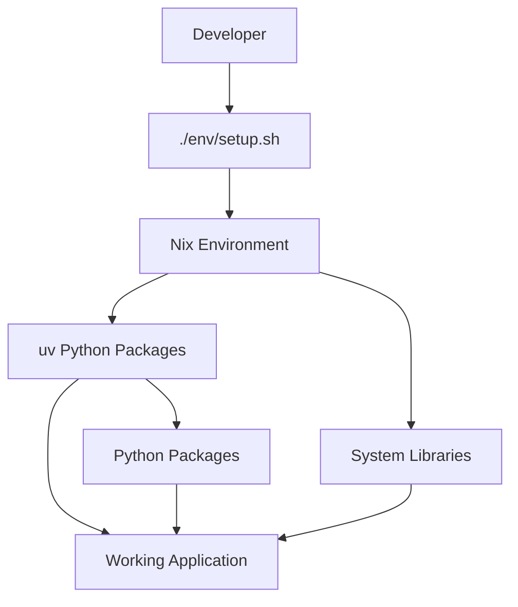

# MCP Server - Self-Contained Setup

**NEW**: Complete rewrite with self-contained, reproducible environment management!

## 🎯 Quick Start (Any User, Any Location)

```bash
# Clone repository with submodules
git clone --recursive https://github.com/zhifengzhang-sz/mcp-server.git
cd mcp-server

# If you already cloned without --recursive, initialize submodules:
# git submodule init && git submodule update

# One-command setup (detects your location automatically)
./env/setup.sh
```

That's it! The script will:
- ✅ Check prerequisites (nix, uv, curl)
- ✅ Detect your location and suggest optimal mirrors
- ✅ Configure everything for your environment
- ✅ Install dependencies and download models
- ✅ Run tests and show you what to do next

## 🌐 For Specific Locations

### China Users (Faster Downloads)
```bash
./env/setup.sh china
```

### Global Users (Standard Setup)
```bash
./env/setup.sh global
```

## 🔄 Mirror Management (After Setup)

Switch mirrors anytime during development:

```bash
# China mirrors (faster in China)
source env/mirrors.sh china

# Global mirrors (standard)
source env/mirrors.sh global

# Check current setup
source env/mirrors.sh show

# Test connectivity
source env/mirrors.sh test
```

## 🛠️ Development Workflow

After initial setup:

```bash
# 1. Enter development environment
nix develop

# 2. Optional: Set preferred mirrors
source env/mirrors.sh china  # or global

# 3. Start developing
uv run python -m mcp_server.main

# 4. Add dependencies as needed
uv add package-name
```

## ✨ Key Features

- **🚀 Self-contained**: No global configuration pollution
- **🔄 Reproducible**: Same results for every user
- **🇨🇳 China-optimized**: Fast downloads with China mirrors
- **🌐 Global-friendly**: Works everywhere
- **⚡ Fast**: uv + Nix hybrid for best performance
- **🛡️ Safe**: Session-scoped changes only

## 📁 Project Structure

```
mcp-server/
├── env/
│   ├── setup.sh      # Complete project setup
│   ├── mirrors.sh    # Mirror management
│   └── README.md     # Detailed documentation
├── mcp_server/       # Main application code
├── docs/             # Documentation
├── flake.nix         # Nix environment definition
├── pyproject.toml    # Python dependencies (managed by uv)
└── uv.lock          # Locked dependency versions
```

## 🆚 Why This Approach?

| Feature | This Solution | Global ~/.config/ | Docker Only |
|---------|--------------|------------------|-------------|
| Setup Time | 2-5 minutes | 10-30 minutes | 5-15 minutes |
| Global Pollution | ❌ None | ⚠️ Moderate | ❌ None |
| Reproducibility | ✅ Perfect | ⚠️ User-dependent | ✅ Good |
| User-Friendly | ✅ Excellent | ⚠️ Complex | ⚠️ Learning curve |
| Performance | ✅ Native | ✅ Native | ⚠️ Overhead |
| Flexibility | ✅ High | ⚠️ Moderate | ⚠️ Limited |

## 🔧 Architecture: uv + Nix Hybrid

- **Nix**: Provides system libraries (libstdc++, CUDA, etc.) and development tools
- **uv**: Manages Python packages (fast, reliable, pre-built wheels)
- **Result**: Best of both worlds - fast Python + stable system environment

### Workflow Boundaries



## 🐛 Troubleshooting

### Prerequisites Missing
```bash
# Check what's needed
./env/setup.sh --help
```

### Slow Downloads
```bash
# Switch to appropriate mirrors
source env/mirrors.sh china   # if in China
source env/mirrors.sh global  # if elsewhere
```

### Environment Issues
```bash
# Reset everything
exit  # Exit nix develop if you're in it
nix develop  # Re-enter
uv sync  # Reinstall dependencies
```

### Connectivity Problems
```bash
# Test your mirrors
source env/mirrors.sh test
```

## 📚 Additional Documentation

- **[env/README.md](env/README.md)** - Detailed environment management guide
- **[docs/](docs/)** - Architecture and development guides
- **[CHANGELOG.md](CHANGELOG.md)** - Change history

## 🎉 Success Metrics

After running `./env/setup.sh`, you should have:

- ✅ Nix development environment working
- ✅ Python dependencies installed via uv
- ✅ Ollama running with GPU support
- ✅ Basic models downloaded
- ✅ MCP server ready to run
- ✅ Session-scoped mirror configuration
- ✅ No global environment pollution

## 🚀 Getting Started Examples

### Quick Development Session
```bash
cd mcp-server
./env/setup.sh china           # Setup with China mirrors
nix develop                    # Enter development environment
uv run python -m mcp_server.main  # Start server
```

### Adding New Dependencies
```bash
nix develop                    # Enter environment
uv add langchain-anthropic     # Add new package
uv sync                        # Install
# Dependencies are now available!
```

### Switching Mirrors Mid-Development
```bash
source env/mirrors.sh global   # Switch to global mirrors
uv sync                        # Re-sync with new mirrors
```

---

**This setup eliminates the need for global ~/.config/ modifications and provides a clean, reproducible development experience for all users, regardless of location or experience level.**
